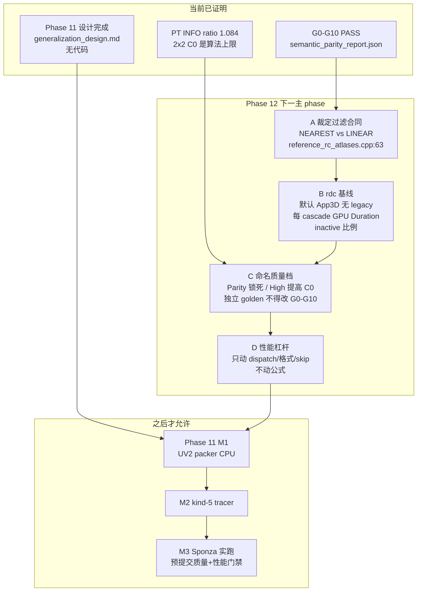

# New RC 正确性 / 质量 / 性能 调研分析

# 背景

用户问题（原文）：

> 下一个 phase 是什么 new rc 算法怎么优化性能和控制质量？我们怎么知道 new rc 是正确的？

仓库里同时存在两套「3D RC」：

1. **New RC（现行默认）**：表面附着、ShaderToy 语义内核 `res/shaders/reference_transport.comp`，由 `App3D` 默认启动（`3d/README.md:142`）。
2. **Legacy volumetric RC**：`radiance_3d.comp` + `raymarch.frag`，仅 `--runtime-shell=legacy`。Era 11/12 的 Cornell 审计、RenderDoc 数字、α-gate 争论全部属于这条路径，**不能**当作 New RC 的正确性或性能证据。

Refactor 计划 `doc/10_refactor/3d_radiance_cascades_refactor_plan.md` 的 Phase 0–10 已落地：G0–G10 在 Phase 8 一次跑通（`semantic_parity_report.json:7` `result=PASS`）。Phase 11 只写了设计决策 `doc/11_generalization/generalization_design.md`，**没有代码**。计划里下一实现步是 M1 UV2 island extractor。

这和用户问的三件事并不重合：

| 问题 | 现状 |
|---|---|
| New RC 正确吗？ | **语义正确已证明**（G0–G10）。**图像质量 ≠ 语义正确**。 |
| 怎么控制质量？ | **没有质量旋钮**。C0 角分辨率、texel scale、cascade 数全部锁死在 ShaderToy 常量。 |
| 怎么优化性能？ | **没有 New RC 的 GPU 成本基线**。现有 `rdc capture` 证据全是 volumetric 路径。 |

若直接做 Phase 11 M1（Sponza UV2），会把未测量的 dispatch 成本、未解耦的质量旋钮、未 chart 的几何一起放大——这正是 v2.x「调到截图像样」失败线（`journey.md:90`、`v25_z_mbrc_correction_failure_learnings.md`）。

**结论：下一 phase 不是 Sponza 泛化，也不是再调 volumetric。下一 phase 是 Phase 12——在锁定的 Cornell New RC 内核上建立「正确 / 质量 / 性能」三层控制面：G0–G10 继续当正确性门禁；用命名的 post-parity 质量档位（不改 parity 场景字节）控制质量；先用 `rdc-cli` 量 New RC 的 GPU 成本，再做稀疏 dispatch / 格式 / 跳过 inactive。Phase 11 M1 只能在这三层门禁绿了之后开始。**

---

# 影响 New RC 下一 phase 的因素

> 限定范围：`App3D` 默认路径 + `reference_transport.comp` + G0–G10 门禁。不含 `--runtime-shell=legacy` 的 volumetric 调参。引擎：本仓库 C++17 / OpenGL 4.3 compute。平台：Windows + `rdc-cli`。

**从正确性证据角度（关注「port 对不对」，不是「图好不好看」）：**

| 采集项 | 获取方式 | 是否已有 |
|---|---|---|
| G0–G10 一次跑通报告 | `tools/10_refactor/phase8_milestone/run_phase8_milestone.ps1` → `semantic_parity_report.json` | 已有（2026-08-04, commit `3472e80`, PASS） |
| Python golden → CPU oracle → GLSL 三层链 | `doc/10_refactor/phase0_5_learnings.md:17-23` | 已有 |
| 故意分歧清单 | `doc/10_refactor/semantic_parity_differences.md` | 已有（7 条） |
| PT 质量报告（非门禁） | 同 JSON `pt_quality`：`new_vs_pt_ratio=1.084` | 已有，**INFO 非 PASS** |
| Parity 场景 bit-identical 回归 | 任何 chart-provider / tracer 改动后重跑 G0–G10 | 已有脚本；Phase 11 约束 3 要求保持绿 |
| New RC GPU Duration（C5→C0 六次 dispatch） | `rdc capture` 默认 `App3D`（无 `--runtime-shell=legacy`） | **无**。现有 capture 全是 legacy volumetric |
| Inactive texel 比例 | atlas readback + `decodeProbe.isActive` | **无**（shader 有 early-out，但无计数） |

**从质量旋钮角度（关注「算法近似度」，不是「加 gain」）：**

| 采集项 | 获取方式 | 是否已有 |
|---|---|---|
| C0 角分辨率（`probeSize = 2^(c+1)` → C0 = 2×2） | `shader_toy/CubeA.glsl:128`，`reference_layout.h:16-27` | 已有，**锁死** |
| 图表 texel scale | parity `1/256`（`reference_layout.h:26`）；legacy Cornell `1/128`（`reference_legacy_scene.h:35`） | 已有，per-scene 常量，无运行时档位 |
| Cascade 数 | 固定 6（C0–C5），`kCascadeCount=6` | 已有，锁死 |
| 小光源 alias（bin 打中小灯当作填满立体角） | visual_report.html:75 已定性 | 已有诊断，**无控制** |
| 未 chart 几何（legacy Cornell box 侧面） | visual_report.html:74；Phase 11 范围 | 已记录，未修 |
| Atlas 过滤 vs α=距离 合同 | header 要求 nearest（`reference_rc_atlases.h:12-13`）；cpp 用 `GL_LINEAR`（`reference_rc_atlases.cpp:63-67`） | **合同破裂，需先裁定** |
| 命名质量档（Low/Parity/High） | 无 | **无** |

**从性能成本角度（关注「每帧 GPU 做了什么」）：**

| 采集项 | 获取方式 | 是否已有 |
|---|---|---|
| 每 cascade 物理分辨率 | parity 1024×512；legacy Cornell 1472×256 | 已有 |
| 每帧 dispatch | C5→C0 共 6 次 `glDispatchCompute(W/8, H/8, 1)`（`reference_pipeline.cpp:59-86`） | 已有代码 |
| 存储格式 | 6 cascade × ping-pong × `RGBA32F`（`reference_rc_atlases.cpp:67`） | 已有 |
| Inactive early-out | `reference_transport.comp:634-636` 写 sentinel 后 return | 已有，**thread 仍启动** |
| 每 texel 工作 | 1 次 `traceScene` + 可选 `feedbackB` + C0–C4 `mergeUpper`（4 候选 × 距离+4 bin） | 已有代码，无计时 |
| Volumetric 对照成本 | frame 480：C2 bake 10.64 ms（`journey.md:161`） | 已有，**另一算法** |
| New RC 绝对 GPU ms | `rdc counters --name "GPU Duration"` on default App3D | **无** |

---

# 影响链条分析

## 1. 「New RC 正确」已经被证明到哪一层

**结论：G0–G10 证明的是「port 复现了 ShaderToy 公式」，不是「等于路径追踪」，更不是「适合任意网格」。**

证据链（`phase0_5_learnings.md:17-23`）：

```text
Python golden（double，独立从 CubeA.glsl 推导）
    → CPU oracle（float32，生产镜像）
    → GLSL（float32，生产代码）
```

一层不同意上一层 = 门禁失败。CPU 自己跟自己比不算证据。

Phase 8 一次报告（`semantic_parity_report.json:8-47`）：

| Gate | 证明什么 | 不证明什么 |
|---|---|---|
| G0 | 构建 / shader hash | 任何视觉 |
| G1 | 8 张 chart 合同、world↔UV | 传输 |
| G2–G4 | 布局、方向、reach | merge / bounce |
| G5+G8 | payload + 材质/太阳局部传输 | 层级 |
| G6 | 加权 upper merge | 全层级调度（G7 补） |
| G7+G10 | 跨 chart bounce、有界、单调、确定 | 图像质量 |
| G9 | 最终消费 C0，无 stub | 等于 PT |

PT 数字是 **INFO**（`semantic_parity_report.json:49-56`）：

- New RC linear luma 39.599 vs PT 36.532，`ratio=1.084`
- visual_report 把它读成「~13%，来自参考算法自己的 2×2 C0 离散」，**不是 port bug**
- 镜面球/盒黑色是故意政策（`semantic_parity_differences.md` §1）

**因果链：** 用户若把「正确」定义成「看起来像 PT」，会把算法固有的 2×2 C0 上限当成缺陷去调——这就是 Era 7 整条 MBRC 校正线失败的机制（`journey.md:90`）。正确性门禁必须继续停在 G0–G10；PT 只做质量报告。

## 2. 质量现在不可控，因为旋钮和正确性锁在同一组常量上

**结论：当前没有「质量档」。改 `probeSize` / texel scale / cascade 数会同时破坏 G2/G3/G4 golden。**

锁定公式（`CubeA.glsl:128-151`，`reference_layout.h:16-27`）：

```text
probeSize     = 2^(cascade+1)     → C0 = 2, 即 2×2 方向
probePositions = gRes / probeSize  → 空间密度与角分辨率幂次耦合
tInterval     = probeSize * 8 * texelScale
texelScale    = 1/256（parity）或 1/128（legacy Cornell）
cascades      = 6，C5 reach = 10000
```

这不是疏忽，是参考算法的定义。G2/G3/G4 的 golden 按这些常量生成。因此：

- 在 parity 场景上把 C0 提到 4×4 = **语义回归失败**，不是质量提升。
- 在 *另一个命名模式* 上提高 C0，并单独生成 golden / 单独跑 PT 报告 = 合法的 post-parity 质量档。

已知质量缺口，全部是算法/场景合同，不是未修 bug：

1. **2×2 C0 alias**：小灯打进一个 bin 被当成填满立体角（visual_report.html:75）。提高 C0 角分辨率能压，但必须是命名档，不能改 parity 常量。
2. **未 chart 面**：legacy Cornell 箱子侧面无 GI（visual_report.html:74）。这是 chart-provider 问题，属 Phase 11，不是质量旋钮。
3. **过滤合同破裂**：`reference_rc_atlases.h:12-13` 写明 α 是距离、禁止线性过滤；`reference_rc_atlases.cpp:59-67` 却设了 `GL_LINEAR`，注释还说「对标 ShaderToy cubemap」。G5 明确禁止把距离 α 当 boolean，也禁止线性过滤距离（计划 §7.5）。**这是正确性合同，必须在任何质量档之前裁定。**

**因果链：** 没有命名档位 → 任何「提高质量」的改动都会改到 G0–G10 → 正确性证据被污染 → 无法知道变好的是算法还是门禁被拆掉。v2.x 的教训是同一条。

## 3. 性能现在不可优化，因为 New RC 的成本从未被量过

**结论：优化对象还没测量。Volumetric 的 C2=10.64 ms 不能指导表面 RC。**

现行每帧成本结构（`reference_pipeline.cpp:59-86`）：

```text
for cascade = 5 .. 0:
    bind write[C], upper[C+1], feedback C0
    Dispatch (physicalW/8, physicalH/8, 1)
    barrier
swap atlases
```

| 场景 | 物理 atlas | 6 次 dispatch 启动的 thread | 存储（6×2×RGBA32F） |
|---|---|---|---|
| Parity Cornell | 1024×512 | 6 × 65536 = 393216 | 6×2×1024×512×16 ≈ 96 MB |
| Legacy Cornell | 1472×256 | 6 × 47104 = 282624 | 6×2×1472×256×16 ≈ 72 MB |

每个 **active** texel：`traceScene`（解析 13 个 primitive）+ `feedbackB`（4 个 C0 bin）+ C0–C4 的 `mergeUpper`（4 候选 × 1 距离 fetch + 4 radiance fetch）。Inactive texel 仍被 dispatch，只在 `decodeProbe` 后 early-out（`reference_transport.comp:634-636`）。

Sponza 量级（Phase 11 开放问题 2–3：chart 数、atlas 预算）会把 `physicalW×H` 和 primitive 数同时放大。没有 Cornell 基线，M1 之后的「慢」无法归因。

**因果链：** 先 `rdc capture` 默认 App3D → 得到每 cascade GPU Duration + inactive 比例 → 才能决定是稀疏 worklist、降格式、减 cascade、还是跳过未脏 band。现在做任何一项都是猜测。

## 4. Phase 11 M1 为什么还不能开工

**结论：M1 改的是 chart-provider，会放大上面两个未知量，且计划自己要求 G0–G10 保持 bit-identical。**

`generalization_design.md:179-183` 的 M1–M3：

- M1 CPU packer（不碰 GPU）——看起来便宜
- M2 kind-5 mesh-island trace —— 改 `reference_transport.comp` 的 tracer
- M3 Sponza 实跑 —— 第一次几何关联结果

约束 3：`Cornell parity scene must remain bit-identical`。

没有质量档 + 没有 GPU 基线时：

- M2 把 primitive 从 13 个解析平面变成三角形岛，**trace 成本阶跃**，无处对照。
- M3 的「质量」没有预提交门禁（计划反复禁止用截图推进，`refactor_plan.md:890`）。
- atlas 预算（开放问题 2）会在没有 Cornell 对照的情况下被拍脑袋定掉。

M1 作为纯 CPU 工具可以并行勘察，但 **不能** 当下一主 phase。主 phase 必须先把控制面立住。

---

# 整体流程



## 关键机制 1：空间–角度幂次耦合（质量的唯一合法旋钮）

```glsl
// CubeA.glsl:128-129  ← 唯一耦合点
float probeSize = pow(2., probeCascade + 1.);
vec2 probePositions = gRes / probeSize;
```

- `probeSize` 加倍：方向数 ×4，空间探针 /4。总成本同阶，质量从「更密空间」换成「更细角度」。
- C0 `probeSize=2`：半球只有 2×2=4 个方向。这就是 13% luma 缺口和「小灯填满 bin」的根。
- **Parity 档必须保持 `probeSize=2^(c+1)`。** High 档若改 C0 到 4，必须复制 layout golden，不得覆写 `reference_layout.h` 的 parity 常量。

## 关键机制 2：每帧成本是「全 atlas dispatch」，不是「按探针」

```cpp
// reference_pipeline.cpp:84  ← 唯一 dispatch 尺寸
glDispatchCompute(kPhysicalWidth / 8, kPhysicalHeight / 8, 1);
```

- 启动的是 **物理 texel**，不是探针。C0 一个探针占 2×2 texel，C5 一个探针占 64×64 texel，但每个 texel 都跑完整 `decodeProbe + trace + merge`。
- Inactive 只在 shader 内 return，SM 仍被占用。
- 因此第一性能杠杆是：**量 inactive 比例**；若高，稀疏 worklist 或 per-chart dispatch 才值得做。若低，瓶颈在 `traceScene` / `mergeUpper`，该减 primitive 或减 cascade，而不是减 dispatch。

## 关键机制 3：α 通道是距离，不是 coverage

```text
RGB = 加权方向辐照
A >= 0  首击世界距离
A <  0  sky / 无界 miss
```

（`refactor_plan.md:242-248`，G5）

线性过滤 α 会把 sky sentinel（-1）和命中距离混成无意义值，进而污染 `mergeUpper` 的 visibility（`reference_transport.comp:411-412`：`dist < -0.5 || length(rel) < dist*cone + 0.01`）。这是 **正确性**，不是质量口味。Phase 12-A 必须先关掉这个歧义。

---

# 官方 / 替代方案对比

## 现状 vs 三个候选下一 phase

| 维度 | 方案 A：Phase 12 控制面（推荐） | 方案 B：立刻 Phase 11 M1 UV2 | 方案 C：在 Cornell 上「调到更像 PT」 |
|---|---|---|---|
| 改动面 | 过滤裁定 + rdc 基线 + 命名质量档 + 可选稀疏 dispatch | CPU packer + 后续 kind-5 tracer | 改 `probeSize` / gain / 过滤 / 未记录常量 |
| 正确性 | G0–G10 保持绿；质量档独立 golden | 计划要求 bit-identical，但无基线对照 | **拆掉 G2–G4**，正确性证据作废 |
| 质量 | 可预提交：Parity 档锁 2×2；High 档提高 C0，PT 报告独立 | 无质量门禁，Sponza 只能看图 | 把算法上限当 bug，重蹈 MBRC |
| 性能 | 先测量再动；杠杆按 inactive 比例选择 | 成本阶跃后无法归因 | 无测量 |
| 成本 | 小：1 个裁定 + 1 次 capture + 档位脚手架 | 中–大：内容管线 + tracer | 表面小，实际会再烧一条失败线 |
| 优化层次 | 根本原因：把「正确 / 质量 / 性能」拆开 | 直接原因：缺网格 chart | 假原因：13% 被当成 port 错误 |

方案 A 解决的是用户三个问题的**共同阻塞**。方案 B 是 A 之后的正确下一步。方案 C 禁止。

## 性能杠杆（仅在 B 的数字出来之后选用）

按「根本原因 vs 直接原因」排序：

| 杠杆 | 层次 | 何时选用 | 风险 |
|---|---|---|---|
| 稀疏 worklist / per-chart dispatch | 根本（不要启动 inactive thread） | inactive 比例高 | 调度复杂度；G10 确定性 |
| `RGBA16F` 生产、`RGBA32F` 仅门禁 | 直接（带宽） | 带宽 bound，且 G5 精度门过 | 距离 α 量化；sky sentinel 需保留 |
| 跳过未脏 cascade / 隔帧 C3–C5 | 直接（工作量） | 静态场景、C3–C5 Duration 占比高 | 时间滞后；G7 反馈代数 |
| High 档提高 C0、降低空间密度 | 质量换成本（耦合不变） | 小灯 alias 不可接受 | 必须独立 golden，禁止改 parity |
| 减 cascade 数 | 质量换成本 | 远场不需要 C5 | 非 parity；另档 |

禁止的「优化」：gain、irradiance floor、proxy visibility、对称 clamp、改 G0–G10 期望值。全部已在 `phase0_5_learnings.md` §5 和 `journey.md` Do-Not-Repeat 列过。

---

# 注意事项 / 风险与待确认 / 里程碑

## 注意事项

1. **不要用 volumetric 的 RenderDoc 数字指导 New RC。** frame 480 的 C2=10.64 ms 是 `radiance_3d.comp`。New RC 默认入口甚至不跑它。
2. **不要把 PT ratio 1.084 当失败。** 它是参考算法 2×2 C0 的已知代价。High 档可以打这个数；Parity 档不能。
3. **过滤合同（LINEAR vs NEAREST）是先行裁定，不是口味。** header/计划/G5 说 nearest；cpp 说 linear。二选一写进 `semantic_parity_differences.md`，并重跑 G6/G7。
4. **质量档不得改 `reference_layout.h` 的 parity 常量。** 新档用自己的 layout 头 / 自己的 golden。
5. **Phase 11 M1 可以并行做 CPU 勘察，但不能当主路径，也不能宣称 surface RC 泛化。**

## 风险与待确认

| ID | 项 | 状态 |
|---|---|---|
| Q1 | LINEAR 过滤是否被 G6 夹具依赖（合成 atlas 可能掩盖距离混合） | **已测。G6 不采样 atlas。G7/G9 两边 PASS。裁定 LINEAR，记为故意分歧 §8。** |
| Q2 | New RC 在 RTX 2080 SUPER 上的每 cascade ms | **已采集。** 全 atlas 基线 transport_sum≈28.6 ms（replay 非单调，见 `gpu_baseline.json` caveat）。拆 dispatch 后 capture transport_sum≈5.95 ms；禁止把比值当 SLA。 |
| Q3 | Parity 1024×512 的 inactive 比例 | **37.5%。** 形状是 interior padding `x>=256 && y>=256`，不是探针稀疏。 |
| Q4 | High 档 C0=4 能把 parity luma 缺口从 8% 收到多少 | 脚手架已通（`--rc-quality=high-c0`）；独立 PT 报告未跑。预提交：不得牺牲 G0–G10。 |
| Q5 | Sponza 是否已有可用 UV2 | Phase 11 开放问题 1，**本 phase 不回答** |

## 里程碑（Phase 12）

预提交门禁：下列任何一项用截图或「看起来更好」推进 = STOP。

### M12-A 过滤合同裁定（0.5d）

- 读 `reference_rc_atlases.h:12-13` vs `reference_rc_atlases.cpp:63-67`。
- A/B：NEAREST vs LINEAR，重跑 G5/G6/G7。
- 把胜出策略写入 `semantic_parity_differences.md`（若偏离计划 §7.5，记为第 8 条故意分歧）。
- **验证：** G0–G10 仍 PASS；JSON 记录过滤模式。

### M12-B New RC GPU 基线（0.5–1d）

- `rdc capture` **默认** `.\build\RadianceCascades3D.exe`（禁止 `--runtime-shell=legacy`）。
- 采集：每 cascade GPU Duration、final view Duration、atlas 尺寸、thread 数。
- shader 计数器或 readback：active vs inactive texel。
- **验证：** 一份 JSON，字段与 volumetric 报告并列但 **单独标注算法=surface-RC**。没有这份 JSON 不得谈优化。

### M12-C 命名质量档脚手架（1–2d）

- 至少两档：`Parity`（当前锁死常量，G0–G10 唯一可过档）和 `HighC0`（C0 `probeSize=4`，独立 golden，PT 报告 INFO）。
- CLI：`--rc-quality=parity|high-c0`。默认 `parity`。
- **验证：** `parity` 档 G0–G10 bit-identical；`high-c0` 档不得跑 parity golden；两边都写 JSON。

### M12-D 性能杠杆（仅 12-B 之后，1d）

- 按 12-B 的 inactive 比例 / 瓶颈 pass 选 **一个** 杠杆（稀疏 dispatch 或 RGBA16F 生产路径或隔帧远 cascade）。
- **验证：** 同场景 GPU Duration 下降有数字；G0–G10 在 `parity` 档仍 PASS；不得引入 gain/floor。

### 退出 Phase 12 → 才允许 Phase 11 M1

- [x] 过滤合同已记录（`semantic_parity_differences.md` §8，LINEAR）
- [x] New RC GPU 基线 JSON 已入库（`tools/14_new_rc_quality_perf/phase12_b/gpu_baseline.json`）
- [x] `parity` 档 G5/G6/G7/G9 绿（LINEAR 与 NEAREST；拆 dispatch 后 G9 仍 PASS，max_pixel_error 与 LINEAR 基线相同）
- [x] 至少一个非 parity 质量档能跑，且不污染 parity golden（`--rc-quality=high-c0` 渲染通过；validation 对 high-c0 拒绝 exit 2）
- [x] 性能改动附前后 Duration（拆 interior padding dispatch；线程 −37.5%；G9 bit-identical）

然后才执行 `generalization_design.md` M1（CPU UV2 packer），M2/M3 带着 **预提交** 的 Sponza 质量门（HDR EXR，禁止 PNG）和性能预算（相对 12-B 的倍数）。

---

## 怎么知道 New RC 是正确的（操作定义）

三层，禁止混用：

```text
L1 语义正确  = G0–G10 PASS on locked parity scene
               （公式、布局、merge、feedback、payload）
L2 算法质量  = 命名档的 PT EXR 报告（ratio / dim% / bright%）
               Parity 档允许 ~2×2 C0 缺口；High 档单独记账
L3 产品性能  = rdc GPU Duration + 内存，相对 12-B 基线
```

- L1 红 → 算法坏了，停。不允许用 L2/L3 的「更好看/更快」覆盖。
- L2 差 + L1 绿 → 算法在工作，近似度不够。只允许换 **命名档**，不允许改 parity 常量。
- L3 差 + L1 绿 → 实现贵。只允许动 dispatch/格式/skip，不允许动公式。

这就是「我们怎么知道 new RC 是正确的」的唯一合格回答。

**Phase 12 现状（2026-08-22，工作树未提交）：L1 仍绿；L2 有命名档脚手架（`--rc-quality=high-c0`），独立 PT EXR 未跑（Q4）；L3 有 New RC GPU JSON 与拆 dispatch（线程 −37.5%，G9 `max_pixel_error` 与 LINEAR 基线相同）。**

**Phase 11 M1 现状（2026-08-23）：CPU UV2 extractor + atlas packer 已落地（`--validate-chart-provider`）。R4/R5/R6 由合成夹具证明。Sponza OBJ 无唯一 UV2（tiled albedo `vt`），fail-closed，不宣称 surface RC。下一实现步是 M2 kind-5 tracer，且必须带着 HDR EXR 质量门 + 相对 12-D 的 GPU Duration 预算。**
