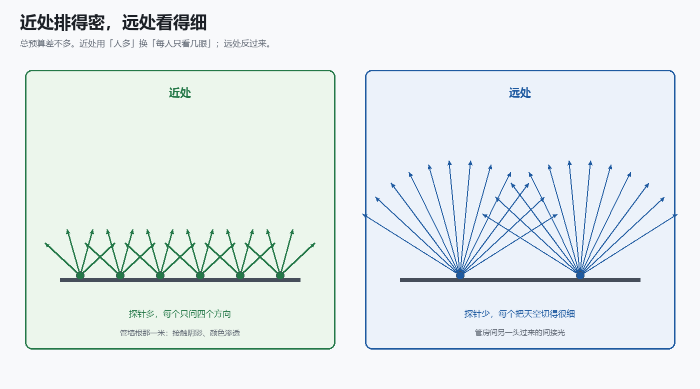
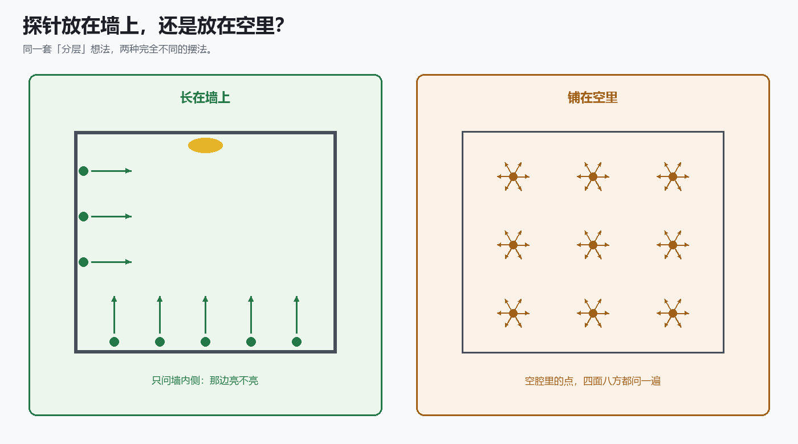
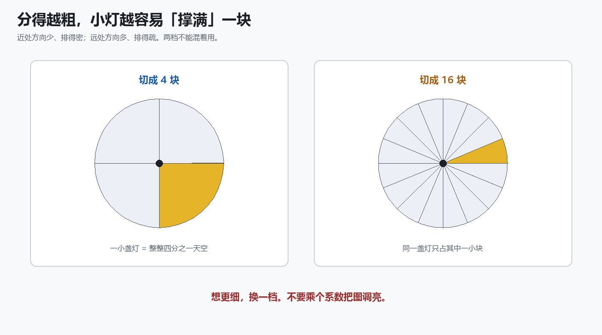
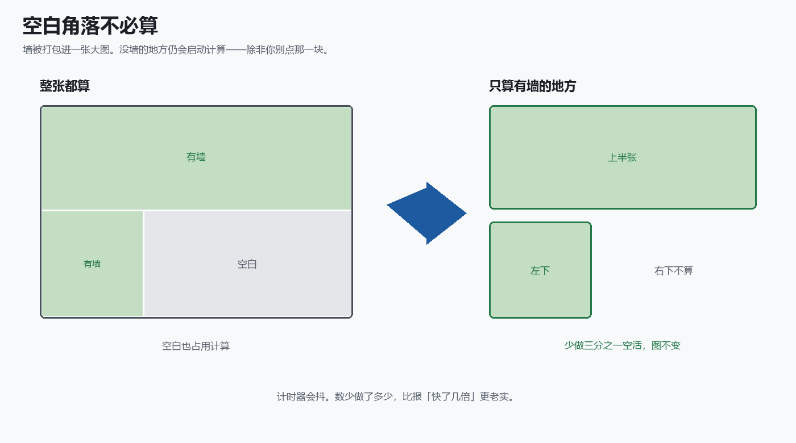
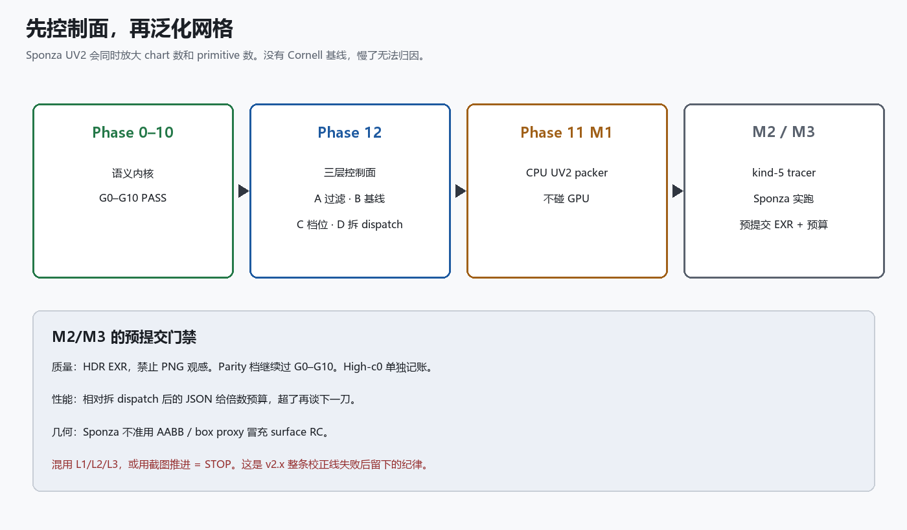

# 辐射度级联长在墙上：近处密、远处细，最近一层只有四块

**TL;DR**

- 辐射度级联还是探针全局光照，但近处和远处不花同样的钱：近处人多、每人只看几眼；远处人少、把天空切细。
- 三维默认跑的是长在墙上的那种，只问内侧。铺在空里、四面八方都问的，是另一套算法。
- 最近一层常常只把半球切成四块。比路径追踪亮一成，多半是小灯撑满了其中一块，不是实现写错。
- 想更细，把四块换成十六块，验收另做。不要乘一个系数把图拧亮。
- 墙上的数据打进一张大图，大约三分之一是空白。空白不必算。

路径追踪沿着光线弹，把渲染方程积出来。它是地面真值，也贵。实时里常见的折中，是在场景里放一些点，每个点朝一组方向问：「那边亮不亮？」再把答案插值到着色点上。这些点叫探针。

辐射度级联（Radiance Cascades）还是探针。它和普通探针网格的差别只有一句：

**近处和远处不花同样的钱。**

近处管墙根那一米，探针排得密，每个只看很少几个方向。远处管房间另一头渗过来的间接光，探针排得疏，每个把天空切得很细。总光线数可以远小于「每个像素打几百条」。

我们把一套公开的三维做法做成了默认可跑的内核。下面只讲这套算法本身：它在算什么、探针长在哪、为什么会亮一成、质量旋钮在哪、空活长什么样。

---

## 近处密，远处细

想法很像阴影级联，或者一张图越缩越糊的那几级：近处买空间分辨率，远处买角分辨率。

近处用「人多」换「每人只看几眼」。接触阴影、颜色往墙上爬，靠这一层。

远处反过来。房间另一头一块亮墙渗过来的光，靠这一层把方向切细，才不至于糊成一片。

相邻两层要并起来。近的一层已经问过的那段距离，远的一层不再重复问；看得见的部分，按命中距离加权，把更远那一层的亮度接上来。着色的时候，只消费最近那一层——更远的几层已经并进它里面了。

这套分层有一个硬上限：**最近那一层看几个方向，就是算法能细到什么程度。** 参考做法里，最近一层常常只把半球切成四块。

---

## 探针长在墙上，不是铺在空里

「级联」只说了分层，没说探针放在哪。三维里至少有两种完全不同的摆法。

一种铺在空的体积里，每个点向整球采样，再在三维格子里插值。它更像传统探针体。封闭房间里，空腔中的点经常「看不见」地板上那块被小灯打亮的地方——命中是碰运气。

另一种长在墙、地板、天花板上，只沿法线朝里打半球，合并发生在表面自己的二维参数里。亮斑在哪块墙上，那块墙上的探针按构造就能接到。点光源、封闭盒子，这一派更对症。

我们跑的默认路径是后者。仓库里还留着前者。两边都叫辐射度级联，测量结果不能互相当成绩单。后面说的数字，都是墙上这一条。

---

## 四块天空：亮一成从哪来

参考做法里，最近一层的半球往往只有 2×2 个方向。小灯一旦打进其中一块，这块会把它当成「填满了整整四分之一天空」。图会偏亮。

这不是滤波没开。这是离散本身。

同一只实验室盒子、同一台相机，墙上这条大约比路径追踪亮一成。那一成主要来自这四个方向，不是移植抄错了公式。

路径追踪在这里只当报告：告诉你这套近似细到哪一档。它不当通行证。非要咬到几个百分点，人就会去改公式，或者乘个系数把图拧亮。系数拧的是观感，不是天空被切成了几块。

---

## 质量旋钮在「密」和「细」的绑法上

参考做法把空间密度和角分辨率锁在同一个幂次上。探针格子边长翻一倍，方向大约乘四，单位面积上的探针除四。总成本几乎不变，只是把钱从「人多」换成「眼尖」。

所以：用来对公式的那个盒子上，默认必须锁在四块。那是这套算法的定义。把四块改成十六块，不是「提高质量」，是换了一套分法。验收要另做一份。

更细的那一档，小灯更不容易撑满一块；同时近处探针变稀，墙根的接触阴影会换一种错。两档分开看。不要把十六块的图，塞回四块的验收里。

乘个系数、加一个最低亮度、拿调过色的截图当证据——这些都像在调辐射度级联。其实是在躲开它的上限。

---

## 公式对不对，和图亮不亮，是两件事

要知道「我们是不是还在跑辐射度级联」，问的是：探针怎么从二维图里解出来、方向怎么在半球上排、相邻层怎么按命中距离并、这一帧怎么去读上一帧墙上的间接光。

这些必须能被独立证伪。一份从参考着色器推出来的结果，一份用同一套逻辑在 CPU 上复算，一份真正跑在 GPU 上。上一份不同意，就还不是那套级联。CPU 自己跟自己比不算。

过了，只说明实现的是辐射度级联，不是随便一种探针。它不说明图像等于路径追踪，也不说明换一张有柱子的大厅还自动成立。

图好看了，不等于这一问过了。亮一成，也不等于这一问没过。

---

## 空白角落不必算

墙上的数据要塞进一张大图，很像光照贴图：不同的墙占不同的矩形，每一层再占一条带。GPU 通常按整张图的宽高开工。没墙的角落，线程照样来，算完发现没活，写个空值回去。

默认那个盒子里，大约三分之一的线程落在右下角一整块空白上。形状是矩形，不是「很多探针随机没醒」。

第一刀很土：有墙的地方算，空白别点。线程少三分之一，图像对得上。

计时器会抖。回放同一帧，时间常常抖两三倍。两次测量相除，不能写成「快了四点八倍」。能写进报告的是：少做了多少，图有没有变。

空里那条老路径的毫秒数，描述的是另一套求交和另一张三维表。不要拿来指导墙上这条。还想再快，必须先有这套算法自己的新数字。

---

## 先在盒子上把级联跑对，再换大厅

实验室场景通常是几块直角墙。下一步很诱人：换成有柱子、有缝的大厅，让级联长在真三角形上。

代价是两件事一起跳。墙变多，大图变大，开工的线程变多；求交从「和十几块平面算距离」变成「和一堆三角形求交」。盒子上如果还分不清「公式跑偏了」还是「四块本来就会亮」，慢了你归因不上。

顺序是：先确认还在跑近密远疏、最近一层四块的那套；质量要更细就换档，不乘系数；空白真的少算了，再去切大厅的墙。

用盒子去贴大厅，可以出一张好看的图。那不叫辐射度级联已经支持复杂场景。那是另一套假几何。

---

## 收获和结论

能抄走的是这套算法的切法，不是某个仓库里的文件名。

**收获**

1. **辐射度级联是近密远疏的探针。** 近处人多、看得粗；远处人少、看得细。不是每个像素打几百条。
2. **默认跑在墙上。** 只问内侧。不是铺在空里的那套，两边的数字不能混。
3. **最近一层四块，是定义，也是上限。** 小灯会撑满其中一块，所以会亮一成。不是移植写错。
4. **想更细，换档。** 「密」和「细」绑在同一个幂次上。不是乘系数。
5. **公式对不对，和图亮不亮，分开问。** 对得上参考做法，才是辐射度级联。不是截图好看。
6. **空白不必算。** 图集里大约三分之一没墙。不是报「快了几倍」。
7. **大厅是下一件事，不是现在这件事。** 盒子上的分层、四块、空白还没立住，换网格只会把三种问题搅在一起。

**结论**

三维辐射度级联不是「一种看起来像路径追踪的全局光照」。它是探针 GI 里一种具体的花钱方式：近处买密度，远处买方向，最近一层往往只有四块天空。实现要对上的是这套分层；质量要动的是切几块；性能要砍的是图集上没墙的角落。能抄走的是这三刀，不是把图调亮。

**PS.** 只带走一句的话：最近一层只有四块。亮一成，先怀疑这件事，再怀疑实现。

**PPS.** 这和「探针体 / 动态漫反射那一套铺在空里的网格」不是一回事。都叫级联，探针长在哪、往哪边问，完全不同。

**PPPS.** 盒子、档位、线程数都会过时。如果你把自己的辐射度级联拿去对路径追踪拧系数，或者拿空里那套的毫秒数指导墙上这套——换场景时，仍会在同一处裂开。
