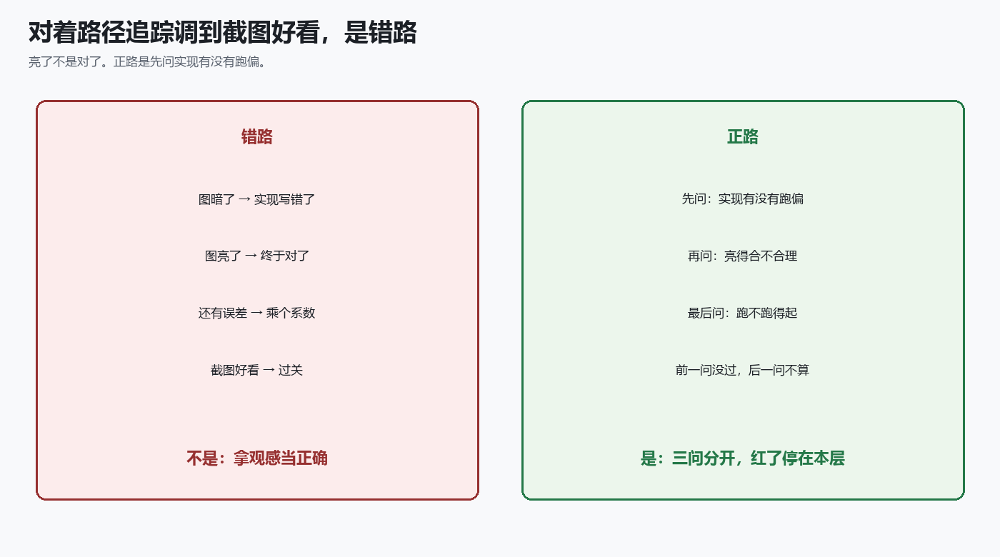
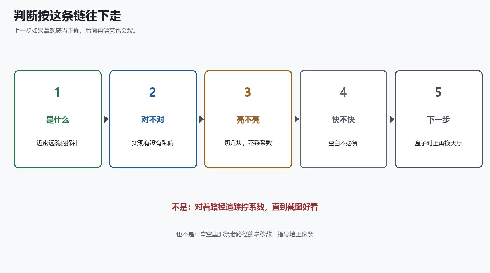
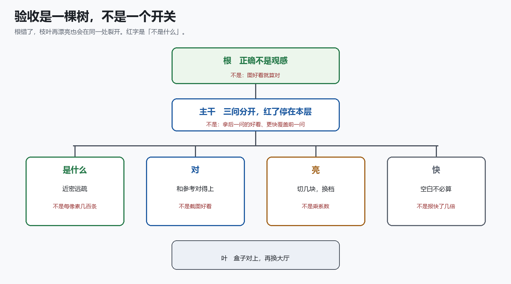
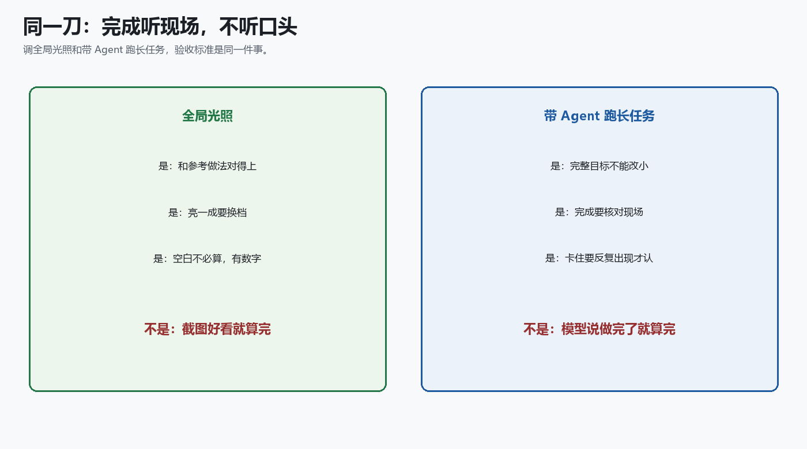

# 不要拿「看起来像路径追踪」当全局光照正确

**TL;DR**

- 正确不是观感。图好看，不等于实现没跑偏。
- 比路径追踪亮一成，是最近一层只切了四块。想更细，换档，不要乘系数。
- 图集里大约三分之一是空白。少做这些空活，图不变。
- 墙上的和空里的不是同一套。数字必须写明来自哪一条。
- 换大厅之前，对 / 亮 / 快 必须先立住。

给实时全局光照做验收，第一反应通常是三件事：图暗了就说实现写错，图亮了就说终于对了，一对路径追踪还有误差，就乘一个系数。截图好看，就算过关。

这三条都快，也都会在同一处裂开：你分不清自己是实现跑偏了，还是算法本来就只能细到这一档，还是把另一套算法的耗时拿来当了成绩单。

贯穿始终的一句话是：

**正确不是观感。**

人话就是：先问还在不在跑原来那套算法；亮不亮、快不快，是后面的事。下面按这个顺序讲。

---

## 第一反应是错路

别拿截图当验收。截图是给人看的；验收要回答的是：实现有没有跑偏。

是：先问实现，再问近似，最后问成本。前一问没过，后一问的好看、更快都不算。

不是：图亮了就算对，也不是截图好看就算过关。

---

## 脉络：三问分开，红了停在本层

判断按这条链往下走。上一步如果走了「不是什么」，后面再漂亮也会裂。

| 步 | 是什么 | 不是什么 |
|---|---|---|
| 是什么 | 近处密、远处细的探针 | 每个像素打几百条 |
| 对 | 实现和参考做法对得上 | 图好看 |
| 亮 | 天空切成几块 | 乘一个系数把图拧亮 |
| 快 | 空白角落不必算 | 拿另一套算法的毫秒数当基线 |
| 下一步 | 盒子对上，再换大厅 | 用盒子冒充已经支持复杂场景 |

---

## 树：验收不是一个开关

这不是「开一个正确性开关」。它是从「正确不是观感」长出来的一棵树。红字是「不是什么」。每根枝只回答自己那一问，不替别的枝过关。

根错了——比如拿截图当正确——枝叶写得再漂亮，换场景时仍会在同一处裂开。

---

## 是什么：近处密，远处细

路径追踪沿着光线弹，把渲染方程积出来。它是地面真值，也贵：每个像素、每一跳都要采样。

实时里常见的折中，是在场景里放一些点，每个点朝一组方向问：「那边亮不亮？」再把答案插值到着色点上。这些点叫探针。

辐射度级联还是探针，但近处和远处不花同样的钱。想法很像阴影级联：近处管细节，远处管大范围。

近处用「人多」换「每人只看几眼」，管墙根那一米：接触阴影、颜色往墙上爬。远处反过来，管房间另一头渗过来的间接光。总光线数可以远小于「每个像素打几百条」。

有一个容易忽略的后果：最近那一层看几个方向，就是这套算法能细到的上限。参考做法里，最近一层常常只把半球切成四块。小灯一旦打进其中一块，这块会把它当成「填满了整整四分之一天空」。图会偏亮。这不是滤波没开，是分得太粗。

探针还可以铺在空里，四面八方都问。我们跑的是长在墙上的那种，只问内侧。空里那条是另一套算法。它的耗时和误差，不要拿来指导墙上这条。

---

## 对：实现有没有跑偏

第一问最容易被跳过。图好看了，人就觉得实现也对了。

这一问只问一件事：我们是不是还在跑上面那套「近密远疏、最近一层四块」的算法。要对的是探针怎么排、方向怎么切、相邻两层怎么并、这一帧怎么去读上一帧墙上的间接光。

我们用三份互相看不见的计算去对：一份从参考着色器推出来，一份在 CPU 上复算，一份真正跑在 GPU 上。上一份不同意，这一问就失败。CPU 自己跟自己比不算——那只是同一套公式抄了两遍。

过了，只说明你实现的是那套级联，不是随便一种探针。它不说明图像等于路径追踪，也不说明换一张网格还自动成立。

---

## 亮：想更细，换一档

路径追踪放在这里，只当报告，不当通行证。实验室里那只标准盒子、同一台相机，大约比路径追踪亮一成。那一成主要来自最近一层只有四个方向。

非要咬到几个百分点，人就会去改上一问的答案，或者乘个系数把图拧亮。系数拧的是观感，不是天空被切成了几块。

参考做法把「排得密」和「看得细」绑在一起。探针格子边长翻一倍，方向大约乘四，单位面积上的探针除四。总成本几乎不变，只是把钱从「人多」换成「眼尖」。

所以默认档锁在四块上，专门回答上一问：我们是不是还在跑原来那套。想更细，换成十六块，验收另做一份。那不是「提高质量」，是换了一套分法。

更细的那一档，小灯更不容易撑满一块；同时近处探针变稀，墙根的接触阴影会换一种错。两档分开看。不要把细档的图塞回粗档的验收里。

乘个系数、加一个最低亮度、拿调过色的截图当证据——这些都像在调质量。其实是在拆第一问。亮了不是对了。

---

## 快：空白角落不必算

墙上的数据要塞进一张大图，很像光照贴图：不同的墙占不同的矩形。GPU 通常按整张图的宽高开工。没墙的角落，线程照样来，算完发现没活，写个空值回去。

默认那个盒子里，大约三分之一的线程落在右下角一整块空白上。形状是矩形，不是「很多探针随机没醒」。

第一刀很土：有墙的地方算，空白别点。线程少三分之一，图像对得上。

计时器会抖。用调试器回放同一帧，时间常常抖两三倍。两次测量相除，不能写成「快了四点八倍」。能写进报告的是：少做了多少，图有没有变。

没有这一套算法自己的耗时，不许谈优化。空里那条老路径的毫秒数，描述的是另一套求交。还想再快，必须先有新数字。乘个系数让图又快又亮，两件事都没做。

---

## 叶：盒子对上，再换大厅

实验室场景通常是几块直角墙。下一步很诱人：换成有柱子、有缝的大厅，让级联长在真三角形上。

代价是两件事一起跳。墙变多，大图变大，开工的线程变多；求交从「和十几块平面算距离」变成「和一堆三角形求交」。盒子上的三问没立住，慢了你分不清是打包浪费、求交变贵，还是验收被悄悄拆了。

是：先证明实现没跑偏，再把三问分开，然后只把墙切开摆好，最后才接到真网格上。

不是：继续调盒子上的亮度。也不是用盒子去贴大厅，出一张好看的图，就叫做「已经支持复杂场景」。

比亮度用没调过色的线性图。调过色的截图会把亮部和暗部一起压扁，误差看起来像「差不多」。耗时先写一个预算，超过了再谈优化。

---

## 为什么要这么验收

这篇不是为了再发一节图形学课。实验室盒子、三问、空白角落，是一件更长的事里的现场：让一套 Agent 工具在跨很多轮的任务里，别把目标改小，也别自己宣布做完。

要验的不是「模型会不会写 shader」。要验的是三件事，和上面的三问是同一刀。

**完整目标不能改小。** 题目是：怎么知道新算法正确、怎么控制质量、怎么优化性能。中途很容易改成「先把图画亮」「先写一篇像那么回事的专栏」。那叫改题，不叫推进。

**完成听现场，不听口头。** 实现对得上、亮一成有原因、空白真的少算了——这些要有数字、有对照。模型说「已经过关了」，不算完。这和「截图好看就算对」是同一句错话。

**卡住要反复出现，才允许认输。** 一轮量不准、一张图术语太多，不是停工理由。同一块石头连续绊几次，才许标成卡住。

是：用图形学现场，去压 Agent 会不会改题、会不会提前收工。

不是：把专栏写成一篇「我们的 Agent 框架介绍」。主线仍然是全局光照的三问。工具好不好使，看它在这些问题上有没有改题。

---

## 收获和结论

能抄走的是切割，不是文件名。

**收获**

1. **正确不是观感。** 实现没跑偏，是和参考做法对得上。不是图好看。
2. **亮一成不是 bug。** 最近一层只切四块，小灯会撑满其中一块。不是实现写错。
3. **想更细，换档。** 「排得密」和「看得细」绑在一起。不是乘一个系数。
4. **空白不必算。** 少做三分之一空活，图不变。不是报「快了几倍」。
5. **墙上的和空里的不是同一套。** 数字必须写明来自哪一条。
6. **换大厅之前，三问先立住。** 对、亮、快不混用。不是用盒子冒充大厅。
7. **完成听现场，不听口头。** 调光照和带 Agent 跑长任务是同一刀。不是模型说做完了就算完，也不是截图好看就算对。

**结论**

给实时全局光照做验收，不是把它调到「看起来像路径追踪」，而是先有一本对得上的账：实现有没有跑偏、近似细到哪一档、空活长什么样。顺手也在验另一件事：跨很多轮的任务里，完整目标能不能保住、完成能不能核对现场。能抄走的是这套切割，不是某个仓库里的文件名。

**PS.** 只带走一句的话：正确不是观感。图好看了，不等于还在跑原来那套算法。模型说做完了，也不等于做完了。

**PPS.** 这和「把图调得更像路径追踪」不是一回事，也和「把模型训得更听话」不是一回事。路径追踪是第二问的报告。提示词只能提醒别改题；现场对不上，就不算完。

**PPPS.** 盒子、档位、线程数都会过时。如果你在自己的系统里拿截图当正确、拿增益当质量、拿另一套算法的毫秒数当基线——或者让 Agent 把长任务改成短任务、自己宣布收工——换场景时，仍会在同一处裂开。那才是这篇要拦的事。
