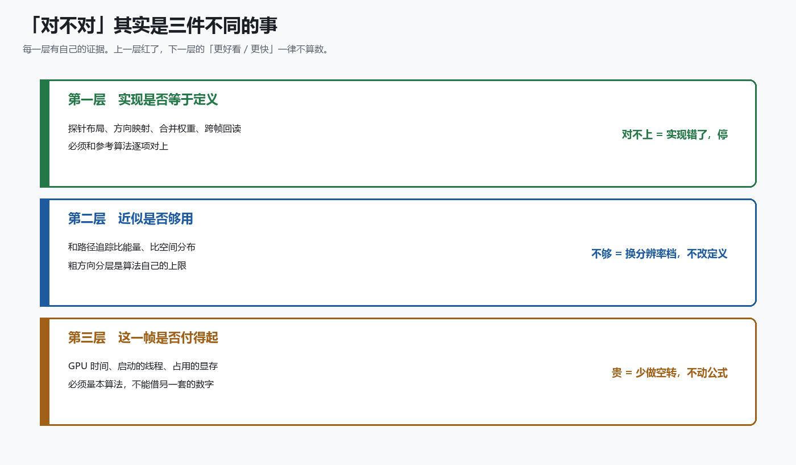

# 不要拿「看起来像路径追踪」当全局光照正确

如果你做过探针类的全局光照，一定遇到过这种争论：图暗了，有人说实现错了；图亮了，有人说终于对了；一对比路径追踪，误差还在，于是开始乘一个系数。

这三件事被揉成了同一句：「算法对不对？」

它们其实不是一回事。

图像亮暗、墙红不红，是观感。每个探针打多少个方向、小灯会不会撑满一个立体角，是这种算法自己的近似度。一帧 GPU 启动了多少线程，是实现成本。

把它们拧在同一个旋钮上，人会去做一件很自然、也很糟的事：对着路径追踪调参数，直到截图好看。我们为此付过一次学费——三十多个提交之后，整条线被判死刑。不是某行着色器写错，是验收标准本身错了。

后来我们把一套公开的三维辐射度级联做成默认可运行内核。实现验收过了，并不等于近似度够用，更不等于这一帧付得起。下面把那次翻车拆开。可以搬走的是判断，不是我们仓库里的文件名。

---

## 辐射度级联在算什么

路径追踪沿光线弹射，把渲染方程积出来。它是地面真值，也贵：每个像素、每一跳都要采样。

实时里常见的折中，是**探针**：在场景里放一些点，每个点沿一组方向问「那边有多亮」，再把结果插值到着色点上。光照探针、辐照度体、动态漫反射全局光照，都是这个家族。

辐射度级联（Radiance Cascades）还是探针，但把预算切成好几层，很像阴影级联或 MIP 那套想法：

- 近处：探针排得密，每个探针方向很少，负责接触面、接触阴影、颜色渗透的第一米。
- 远处：探针排得疏，每个探针方向很多，负责大范围的间接光。

近处用空间分辨率换角分辨率，远处反过来。总光线数可以远小于「每个像素打几百条」。

这套想法有一个容易忽略的后果：**最细那一层的方向数，就是算法的角分辨率上限。** 参考实现里，最近一层的半球往往只有 2×2 个方向——四个立体角块。小面积光源一旦打进其中一块，这块会把它当成「填满了整个立体角」。图会偏亮。这不是滤波没开，是离散本身。

研究生听过「立体角采样不足」；这里只是把它写进了层级结构里。

---

## 探针放在空里，还是放在墙上

「级联」只说了层级，没说探针长在哪儿。三维里至少有两种完全不同的拓扑。

一种是**体空间网格**：探针铺在空的体积里，每个点向整球采样，靠距离场或硬件光线追踪找命中，再在三维格子里插值。它更像传统探针体。代价也很像：封闭房间里，空腔中的探针经常「看不见」那块被点光源打亮的地板——命中是概率事件。

另一种是**表面附着**：探针长在墙、地板、天花板上，只沿法线一侧打半球，合并发生在表面自己的参数空间里。亮斑在哪块表面上，那块表面上的探针按构造就能接到。点光源、封闭 Cornell 盒，这一派更对症。

我们现在跑的默认路径是后者。仓库里还留着前者，作为对照。两边都叫级联，测量结果不能互相当成绩单。拿体网格的烘焙耗时，去指导表面路径的优化，等于拿邻班的期中成绩改自己的复习计划。

后面所有数字，默认都指表面这一条。

---

## 「对不对」要拆成三层

实现是否等于定义、近似是否够用、这一帧是否付得起，证据链不一样。失败时该停的位置也不一样。

**第一层：实现是否等于定义。**

参考算法规定了：探针怎么从二维图里解码出来、方向怎么在半球上排、相邻层如何按命中距离做加权合并、这一帧如何回读上一帧表面上的间接光。这些必须能被独立的测试证伪。

我们用三份互相看不见的计算去对：一份从参考着色器推出来的双精度结果，一份用生产代码在 CPU 上复算的镜像，一份真正跑在 GPU 上的着色器。上一份不同意，这一层就失败。CPU 自己跟自己比，不算证据——那只是同一套公式抄了两遍。

这一层过了，只说明你实现的是那套级联，而不是「随便一种探针 GI」。它不说明图像等于路径追踪，也不说明换一张网格还成立。

**第二层：近似是否够用。**

路径追踪对比放在这里，而且只当报告，不当通行证。同一 Cornell 盒、同一相机，我们测过：表面级联的线性亮度大约是路径追踪的 1.08 倍。那一成左右，主要来自最近一层只有四个方向。把路径追踪当「必须咬到几个百分点」，人就会去拆第一层的期望值，或者乘一个增益把亮度拧过来。增益拧的是观感，不是立体角。

**第三层：这一帧是否付得起。**

没有**这一套算法**的 GPU 基线，不许谈优化。体网格那条路径的毫秒数，描述的是另一套求交和另一张三维表。

纪律可以压成三句：

- 第一层红了，实现错了，停。更好看、更快，都不能覆盖。
- 第一层绿、第二层差，只许换一档角分辨率，不许改参考定义。
- 第一层绿、第三层贵，只许少做空转、改存储、改调度。不许乘增益。

「看起来更像路径追踪」一旦被当成第一层，验收就会被参数淹没。那正是上一轮失败的机制。

---

## 质量旋钮在幂次耦合上，不在增益上

参考实现把空间密度和角分辨率锁在同一个幂次上。探针格子边长每翻一倍，方向数大约乘四，单位面积上的探针数除四。总成本几乎不变，只是把预算从「排得密」换成「看得细」。

这不是疏忽，是这种级联的定义。阴影级联用距离换分辨率，这里用层级换「空间 vs 角度」。

所以：在用来验收移植的那个场景上，把最近一层从 2×2 改成 4×4，不是「提高质量」，是「换了一套定义」。验收必须跟着换一份，路径追踪报告必须另记一笔。默认档继续锁在参考定义上，专门用来回答「我们是不是还在跑原来那套算法」。

更细的那一档，立体角更小，小灯更不容易撑满一个方向块；同时近处探针变稀，接触阴影会换一种错。两档要分开看，不能把细档的图塞回粗档的验收里。

下面这些东西看起来像质量旋钮，其实会把第一层拆掉：乘增益、加一个亮度地板、用代理几何冒充可见性、在邻域里把能量往中间夹、改验收的期望值、拿色调映射后的截图当证据。每一项都曾让人觉得「亮了就是对了」。每一项后来都被测量打回。

纹理过滤也不是口味问题。这套算法把「沿这个方向第一次碰到表面有多远」写在颜色的 alpha 里，天空用一个负数当哨兵。线性过滤会把「没碰到」和「碰到了某米」搅成一个没有物理意义的中间值，上层合并里「看不看得见」就会跟着错。我们比较过最近邻和双线性：实现验收两边都过，能量差在千分之一量级。生产路径跟参考实现的立方体贴图采样保持一致，并把这件事写成一条**故意的分歧**，而不是悄悄改定义。

---

## 空转是打包留下的矩形，不是探针变稀疏

表面级联要把许多块墙的数据塞进一张二维图，很像光照贴图图集：不同墙占不同矩形，级联的每一层再占一行带。GPU 计算着色器通常按整张图的宽高启动线程。图上没有墙的角落，线程照样来——只是算完发现没活，写一个空值回去。

我们数过：默认实验场景里，大约 37.5% 的线程落在右下角一整块留白上。形状是矩形，不是「很多探针随机没激活」。

所以第一刀不该是复杂的稀疏队列。第一刀是：有数据的区域启动，留白的区域别启动。线程少 37.5%，实现验收的像素误差与原来相同。

GPU 计时还有一个坑。用调试器回放同一帧，时间常常抖两三倍，级联之间甚至会不单调。两次测量相除，不能写成「加速了四点八倍」。能写进报告的是线程数和验收误差。当前基线是拆完调度之后的测量，不是拆之前那次抖动很大的回放。

还想再快，必须先有新数字：带宽不够再降低存储精度；远场那几层贵再考虑隔帧更新。没有新基线，就没有下一刀。乘一个增益让图又快又亮，两件事都没做。

---

## 换真实网格之前，先带着预算出门

实验室场景通常是几块正交的墙。下一步很诱人：Sponza 那样的网格，按第二套 UV 切开表面，让级联长在真三角形上。

代价是两件事一起跳。表面块变多，图集变大，启动的线程变多；求交从「和十几块平面算距离」变成「和一堆三角形求交」。没有实验室场景上的三层基线，慢了你分不清是打包浪费、求交变贵，还是验收被悄悄拆了。

顺序应该是：先证明实现等于定义，再把三层证据分开，然后只在 CPU 上把表面切开摆好，最后才接到真网格上。

接到网格之前，三句话最好先写下来：

能量对比用线性的高动态范围图像，不用经过显示映射的 PNG 截图——后者会把亮部和暗部一起压扁，误差看起来像「差不多」。

耗时相对当前基线给一个倍数。超过了再谈优化，而不是先优化再找理由。

用盒子或包围盒平面去贴网格，可以出一张好看的图，不能叫做「表面级联已经支持网格」。那是另一套代理，验收会再次失真。

---

## 可以搬走的四句

1. **先锁对象。** 表面附着和体网格不是同一个算法。数字必须写明来自哪一条。
2. **正确不是观感。** 实现是否等于定义、近似是否够用、这一帧是否付得起，是三层证据。红了停在本层。
3. **质量换档，不改定义。** 空间密度和角分辨率的幂次耦合是这种级联的定义。增益、地板、代理可见性不是。
4. **性能先看空转的形状，再下手。** 计时器会抖，线程数和验收误差不会。

叶子会改名、搬家、重写。这四句如果对了，换一套级联实现也还是同一套判断。如果错了——拿观感当正确、拿另一套算法的毫秒数当基线、拿增益当质量——下一轮调参仍会在同一处裂开。
