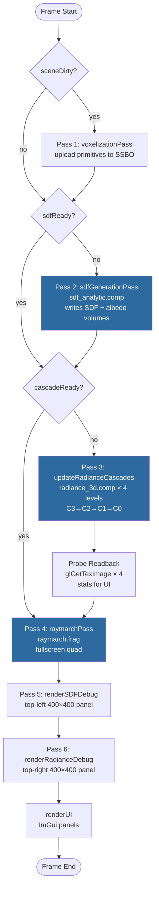
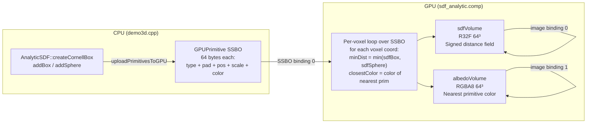
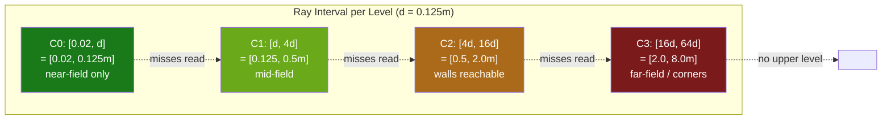
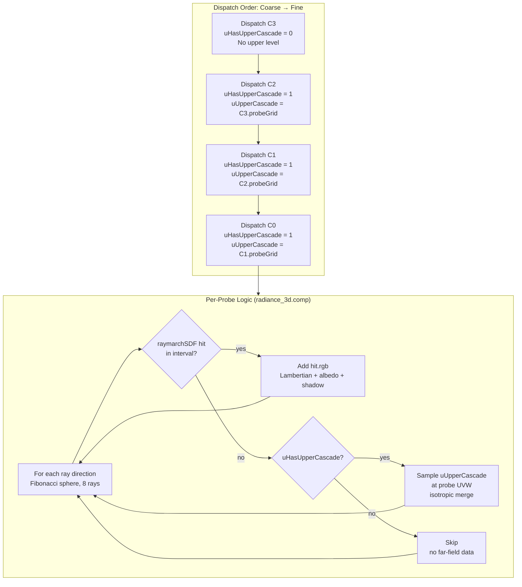
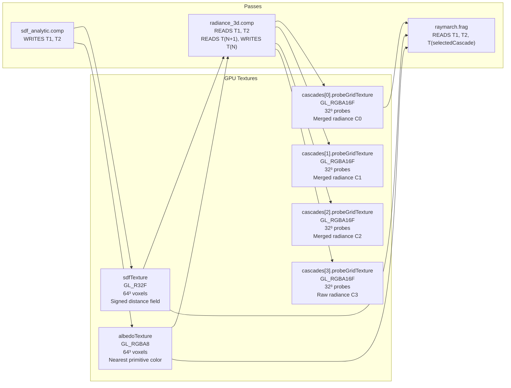
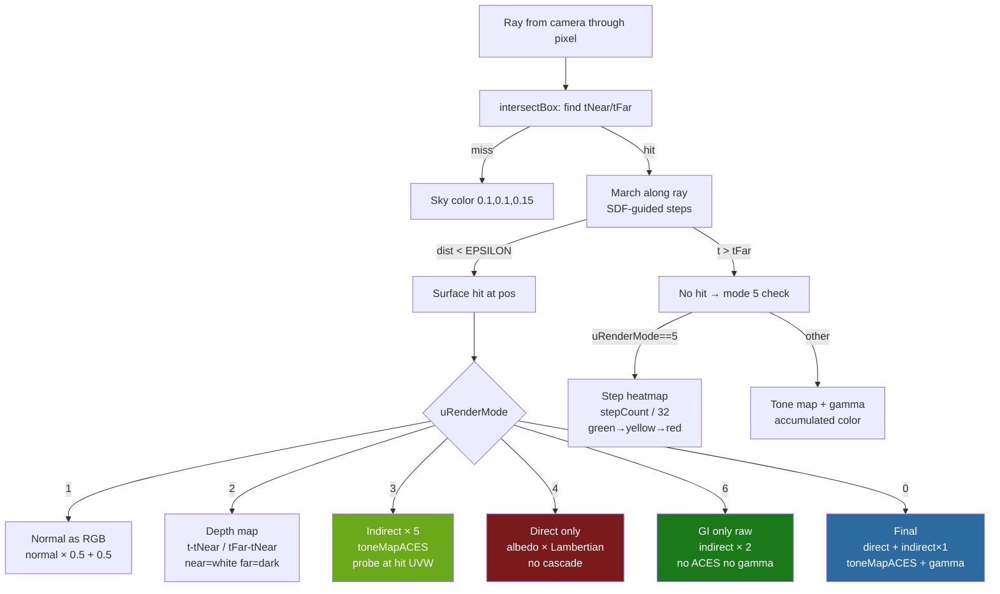
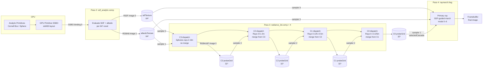

# 3D Radiance Cascades — Architecture Overview

**Date:** 2026-04-22  
**Branch:** 3d  
**Covers:** Phase 1 (SDF + analytic primitives), Phase 2 (probe grid, debug modes),
Phase 2.5 (albedo volume, probe shadow), Phase 3 (multi-level cascade, merge).

---

## 1. System Pipeline (Per-Frame Render Loop)



**Invalidation chain:**
- `sceneDirty` → clears `sdfReady` → clears `cascadeReady`
- `disableCascadeMerging` toggle → clears `cascadeReady` (via `lastMergeFlag` sentinel)
- Passes 2 and 3 only run when their respective dirty flags are set — effectively once per scene change for static scenes.

---

## 2. Scene Representation — Analytic SDF Primitives



**Primitive layout (std430):**
```
struct Primitive {
    int  type;           // 0=box, 1=sphere
    float pad0,pad1,pad2;// 12 bytes padding → position at offset 16
    vec4 position;       // world center
    vec4 scale;          // box: half-extents; sphere: radius in .x
    vec4 color;          // albedo RGB
};  // total: 64 bytes
```

**Cornell Box composition:** 7 boxes (floor, ceiling, back wall, left wall RED, right wall GREEN, box1, box2) + optional sphere.

---

## 3. Cascade Hierarchy — Interval Structure

Each of the 4 cascade levels covers a distinct **distance shell** from each probe.
All levels share the same 32³ probe grid at identical world positions.



**Interval formula in shader:**
```glsl
float d = uBaseInterval;  // 0.125 for all levels
float tMin = (uCascadeIndex == 0) ? 0.02
           : pow(4.0, float(uCascadeIndex - 1)) * d;
float tMax = pow(4.0, float(uCascadeIndex)) * d;
```

**Cornell Box reachability:**
- Center probe (0,0,0) is 2.0m from every wall
- C0: walls unreachable (0.125m max) → almost always misses
- C1: walls unreachable (0.5m max) → misses for center probes
- C2: walls reachable (2.0m max) → hits for center probes ✓
- C3: overshoots for center (starts at 2.0m, walls are at 2.0m) → mostly empty

---

## 4. Cascade Update + Merge Pass



**Sampler bindings during cascade update:**

| Slot | Texture | Uniform |
|------|---------|---------|
| Sampler 0 | `sdfTexture` (R32F 64³) | `uSDF` |
| Sampler 1 | `albedoTexture` (RGBA8 64³) | `uAlbedo` |
| Sampler 2 | `cascades[N+1].probeGridTexture` | `uUpperCascade` |
| Image 0 | `cascades[N].probeGridTexture` (RGBA16F 32³) | `oRadiance` WRITE |

**Shadow ray (inShadow):** 32-step sphere-march from hit point toward light. Returns true if SDF < 0.002 at any step. Makes probe values respect occlusion — shadow regions stay dark in the cascade.

---

## 5. Texture Inventory



---

## 6. Raymarch Pass — Render Modes



**Mode quick-reference:**

| Mode | Name | Tone Map | Gamma | GI checkbox matters? |
|------|------|----------|-------|----------------------|
| 0 | Final | ACES | yes | yes — adds `indirect × 1.0` |
| 1 | Normals | no | no | no |
| 2 | Depth | no | no | no |
| 3 | Indirect × 5 | ACES | no | no — always samples uRadiance |
| 4 | Direct only | ACES | yes | no — bypasses cascade |
| 5 | Step heatmap | no | no | no |
| 6 | GI only | **no** | **no** | no — raw linear, always samples |

**Cascade selector:** `selectedCascadeForRender` (C0–C3 radio) controls which `probeGridTexture` is bound to `uRadiance` in the raymarch pass. Modes 3, 6, and 0+GI all read from this binding.

---

## 7. Full Data Flow



---

## 8. Key Design Decisions and Tradeoffs

### Fixed 32³ probe resolution across all levels

All 4 cascade levels use identical 32³ grids at the same world positions.
The cascade INDEX determines the ray distance shell, not the probe density.

| What this buys | What it costs |
|---|---|
| Simple implementation (same texture format and size) | Over-sampling: C0 has 32³ probes for a 0.125m shell |
| Same UVW mapping — upper cascade lookup at `uvwProbe` is exact | 4× memory vs. halving resolution per level |
| Easy cascade selector in UI | Phase 4 should halve resolution per level for efficiency |

### Isotropic probe merge (no per-direction storage)

On ray miss, the upper cascade contributes its **average** radiance at the probe position, not the directional radiance along the missed ray.

```
Correct: totalRadiance += uUpperCascade_in_direction_of_missed_ray
Current: totalRadiance += texture(uUpperCascade, uvwProbe).rgb   // average
```

Effect: indirect lighting has no directionality. Color bleed is averaged across all 8 ray samples, diluting red/green wall contribution. Directional merging requires SH2 (9 coefficients per probe per channel) — Phase 4.

### Single `cascadeReady` flag for all levels

All 4 levels recompute together on any invalidation. This is correct for a static scene. For dynamic scenes, per-level dirty tracking and partial updates would be needed.

### Shadow ray in probe computation

The `inShadow()` function adds 32 additional march steps per surface hit in the cascade dispatch. This makes probes dark in shadowed regions, producing physically better indirect lighting but reducing overall probe brightness. At 8 rays × 32 shadow steps × 128 march steps = ~12k steps per probe, this is the dominant compute cost.

---

## 9. Debug Infrastructure Summary

| Tool | Location | What it shows |
|------|----------|--------------|
| Mode 1: Normals | raymarch.frag | SDF gradient at surface hit |
| Mode 2: Depth | raymarch.frag | Ray travel distance, near=white |
| Mode 3: Indirect×5 | raymarch.frag | Probe radiance at hit, magnified |
| Mode 4: Direct only | raymarch.frag | Lambertian + albedo, no cascade |
| Mode 5: Step heatmap | raymarch.frag | Ray march cost, normalized to 32 steps |
| Mode 6: GI only | raymarch.frag | Raw linear probe value ×2, no tonemapping |
| SDF debug panel | top-left 400×400 | SDF slice / max-proj / surface normals |
| Radiance debug panel | top-right 400×400 | Probe grid slice / projection |
| Cascade selector C0–C3 | Cascades panel | Which level drives modes 3, 6, 0+GI |
| Disable Merge toggle | Cascades panel | Recomputes all levels with/without upper cascade |
| Per-cascade probe stats | Cascades panel | Non-zero%, maxLum, meanLum per level |

---

## 10. File Map

| File | Role |
|------|------|
| `src/demo3d.h` | Demo3D class, RadianceCascade3D struct, all member declarations |
| `src/demo3d.cpp` | Render loop, all passes, UI, scene setup |
| `src/analytic_sdf.h/.cpp` | CPU-side primitive list, Cornell Box builder |
| `res/shaders/sdf_analytic.comp` | GPU: writes sdfVolume + albedoVolume from SSBO primitives |
| `res/shaders/radiance_3d.comp` | GPU: probe injection with per-cascade intervals + merge |
| `res/shaders/raymarch.frag` | GPU: primary ray, all 7 render modes |
| `res/shaders/sdf_debug.frag` | SDF slice visualization (top-left panel) |
| `res/shaders/radiance_debug.frag` | Probe grid slice visualization (top-right panel) |
