# ShaderToy Reference Gap Analysis

**Date:** 2026-04-23  
**Branch:** 3d  
**Reference:** `shader_toy/Common.glsl`, `CubeA.glsl`, `Image.glsl`  
**Purpose:** Document the delta between our Phase 1-3 implementation and the ShaderToy reference, and define the roadmap to close it.

---

## 1. Fundamental Architectural Difference

The most important divergence is **probe placement strategy**. This shapes everything downstream.

| Dimension | ShaderToy Reference | Our Implementation |
|---|---|---|
| Probe type | Surface-attached 2D hemispheres — probes live ON each wall/floor/ceiling | Volumetric 3D grid — 32³ probes fill the entire volume |
| Ray coverage | Hemispherical only (outward from surface normal) | Full sphere (wastes half the rays firing into walls) |
| Bounce lookup | On hit, reads radiance FROM the hit surface's own probe atlas | Reads from volumetric probe at hit point's UVW position |
| Geometry RT | Analytic intersection — exact, fast | SDF raymarching — approximate, slower per probe |

The surface-attached architecture is more efficient for closed rooms (probes only where surfaces exist), but our volumetric grid is more general (works for arbitrary geometry). Both are valid — the key gap is not the architecture itself but the features that follow from it.

---

## 2. Feature Gap Table

| Feature | Reference | Ours | Severity |
|---|---|---|---|
| Rays per probe | Scales per level: C0=4, C1=16, C2=64, C3=256, C4=1024, C5=4096 | Fixed 8 all levels | **High** |
| Merge strategy | Directional bilinear across 4 upper-cascade neighbors + visibility weighting | Isotropic average (single texture sample) | **High** |
| Merge blend | Continuous lerp by `rayHit.t` vs interval | Binary hit/miss | **Medium** |
| BRDF weighting | Solid angle normalization + `cos(θ)` Lambertian per ray | Uniform Fibonacci sphere, no per-ray weight | **Medium** |
| Cascade levels | 6 (C0–C5) | 4 (C0–C3) | **Medium** |
| Reflective materials | Mirror sphere + mirror box (c.x < −1.5 sentinel) | Not supported | **Low** |
| Scene representation | Analytic ray/quad/sphere/box intersections | SDF raymarching | **Medium** |

---

## 3. Deep Dives on High-Severity Gaps

### 3a. Scaled Rays Per Level

Reference formula: `probeSize = pow(2., cascade + 1.)`

Upper cascades cover larger distance shells so they need higher angular resolution to avoid aliasing at merge boundaries. The probe texture atlas encodes direction as a 2D UV unwrapping of the hemisphere: each probe occupies a `probeSize × probeSize` texel block, so ray count = probeSize².

**Why this matters:** With only 8 fixed rays at all levels, C3 covering [2.0, 8.0m] has the same angular resolution as C0 covering [0.02, 0.125m]. A wall at 6m is sampled by 8 rays total; a wall at 0.1m also gets 8 rays. The C3 result is noisy and the merge propagates that noise down.

### 3b. Directional Merge with Visibility Weighting

Reference `WeightedSample()` logic:
1. Given a probe in the current cascade, find the 4 nearest probes in the upper cascade (bilinear footprint).
2. For each candidate upper probe: look up the ray stored in that upper probe that points **toward the current probe**. Check if the upper probe's ray distance to that direction is shorter than the actual distance to the current probe — if so, the upper probe is occluded from the current probe.
3. Only accumulate radiance from upper probes that can actually see the current probe.
4. Normalize by total weight.

**Why this matters:** Our isotropic merge takes a single texel from the upper cascade (the average over all directions at that probe position). This means:
- A probe in shadow from the light still receives averaged irradiance from upper cascades that have direct light in OTHER directions
- No directional color bleeding (red wall contribution is diluted across all 8 rays regardless of surface normal)
- No soft GI shadows (blocked probes contribute equally to unblocked ones)

### 3c. Continuous Distance-Based Blend

Reference blend factor:
```glsl
float interpMinDist = (1./256.) * probeSize * 1.5;   // near-field threshold
float interpMaxInterval = interpMinDist;               // blend width
if (probeCascade < 0.5) { interpMinDist = 0.; interpMaxInterval *= 2.; }
float l = 1.0 - clamp((rayHit.t - interpMinDist) / interpMaxInterval, 0.0, 1.0);
Output.xyz = localResult * l + upperCascadeResult * (1.0 - l);
```

When `rayHit.t` is near the interval start → `l ≈ 1` → use local result entirely.  
When `rayHit.t` approaches interval end (or misses) → `l → 0` → blend fully into upper cascade.

**Why this matters:** Our binary switch (hit → local, miss → upper) creates a hard boundary at the interval edge. Surfaces near the edge of an interval get no smooth transition — probes alternate between full-local and full-upper depending on which side of `tMax` they land. This produces banding in GI brightness at cascade boundaries.

### 3d. BRDF-Weighted Hemisphere Sampling

Reference per-ray weight:
```glsl
// Solid angle of this ray's angular bin
Output.xyz *= (cos(θ - π/probeSize) - cos(θ + π/probeSize)) / (4 + 8*floor(θi));
// Lambertian diffuse: weight by cos(θ) relative to surface normal
Output.xyz *= cos(probeTheta);
```

Our Fibonacci sphere samples uniformly over the full sphere. Consequences:
- Rays near the grazing angle contribute equally to rays near the zenith (wrong for Lambertian)
- No solid angle normalization — total accumulated energy is not physically conserved
- The `* 1.0` scale factor in the final indirect blend compensates empirically but is not physically correct

---

## 4. What We Have That Is Correct

- Multi-level cascade concept with geometric interval scaling ✓  
- Coarse→fine dispatch order (C3 → C2 → C1 → C0) ✓  
- Direct + indirect combination in the final raymarch ✓  
- Cascade miss path propagating far-field energy down to C0 ✓  
- Cornell Box scene with colored walls and albedo volume ✓  
- Shadow ray in probe computation for occluded probe darkening ✓  

---

## 5. Roadmap to Close the Gap

```mermaid
flowchart TD
    NOW([Current State\nPhase 3 complete\nIsotropic merge\n8 rays all levels])

    subgraph P4 ["Phase 4 — Directional Probe Storage"]
        direction TB
        P4A["4a: Cosine-weighted hemisphere sampling\nReplace Fibonacci sphere with\nhemispherical stratified + cos weight\nPer-ray solid angle normalization"]
        P4B["4b: Scaled rays per level\nprobeSize = 2^(cascade+1)\nProbe atlas: probeSize² texels per probe\nRe-layout probe grid texture"]
        P4C["4c: Continuous distance-blend merge\nReplace binary hit/miss with\nl = 1-clamp((t-tMin)/tInterval, 0,1)\nSmooths GI banding at interval edges"]
        P4A --> P4B --> P4C
    end

    subgraph P5 ["Phase 5 — Directional Merge + Visibility"]
        direction TB
        P5A["5a: Per-direction probe storage\nStore radiance per ray direction\nin probe atlas (probeSize×probeSize texels)"]
        P5B["5b: Bilinear directional merge\nFor each ray, sample 4 upper-cascade\nneighbor probes in the SAME direction\n(not isotropic average)"]
        P5C["5c: Probe visibility weighting\nWeightedSample: check upper probe's\nstored ray distance toward current probe\nOccluded upper probes contribute 0"]
        P5A --> P5B --> P5C
    end

    subgraph P6 ["Phase 6 — Scene & Materials"]
        direction TB
        P6A["6a: Analytic ray intersection\nReplace SDF march in probe pass\nwith analytic quad/sphere/box RT\nFaster, exact for Cornell Box"]
        P6B["6b: Reflective materials\nMirror sphere + mirror box\nReflect ray on hit, continue tracing"]
        P6C["6c: Sky + emissive lights\nSky light as upper-bound fallback\nEmissive geometry as light sources"]
        P6A --> P6B --> P6C
    end

    subgraph P7 ["Phase 7 — Performance"]
        direction TB
        P7A["7a: Temporal accumulation\nRe-use probe values across frames\nJittered partial update per frame"]
        P7B["7b: Adaptive probe resolution\nHalve probe count per upper level\nC0=32³, C1=16³, C2=8³, C3=4³"]
        P7C["7c: Async probe readback\nPBO-based glGetTexImage\nNo GPU stall on stats readback"]
        P7A --> P7B --> P7C
    end

    NOW --> P4
    P4 --> P5
    P5 --> P6
    P6 --> P7

    style NOW fill:#555,color:#fff
    style P4A fill:#2d6a9f,color:#fff
    style P4B fill:#2d6a9f,color:#fff
    style P4C fill:#2d6a9f,color:#fff
    style P5A fill:#6aaa1a,color:#fff
    style P5B fill:#6aaa1a,color:#fff
    style P5C fill:#6aaa1a,color:#fff
    style P6A fill:#aa6a1a,color:#fff
    style P6B fill:#aa6a1a,color:#fff
    style P6C fill:#aa6a1a,color:#fff
    style P7A fill:#7a1a1a,color:#fff
    style P7B fill:#7a1a1a,color:#fff
    style P7C fill:#7a1a1a,color:#fff
```



---

## 6. Phase Priority Justification

### Phase 4 first (sampling quality)
Cosine weighting and scaled rays are prerequisites for directional merge — you need proper directional storage before bilinear merge across directions makes sense. Continuous blend removes the most visible artifact (banding at cascade boundaries) with minimal code change.

### Phase 5 second (merge quality)
Directional bilinear merge is the single biggest remaining visual quality gap. It requires the probe atlas layout from Phase 4b. The visibility weighting (`WeightedSample`) removes GI light leaking through walls, which is currently visible when merge is ON.

### Phase 6 (scene fidelity)
Analytic RT in the probe pass removes the SDF approximation error (SDF normals are slightly wrong at thin features; analytic normals are exact). Reflective materials and emissives make the demo more visually interesting.

### Phase 7 (production readiness)
Temporal accumulation and adaptive resolution are needed for real-time dynamic scenes. Not blocking for a static Cornell Box demo.

---

## 7. Estimated Visual Impact Per Phase

| Phase | GI quality gain | Performance gain | Complexity |
|---|---|---|---|
| 4a: Cosine weighting | Medium — correct energy, less bias | Neutral | Low |
| 4b: Scaled rays | High — upper cascades less noisy | Slightly slower (more rays at C3+) | Medium |
| 4c: Distance blend | Medium — removes interval boundary banding | Neutral | Low |
| 5a–5b: Directional merge | **Very High** — proper color bleed, directional GI | Neutral | High |
| 5c: Visibility weighting | High — no GI light leaking through walls | Neutral | High |
| 6a: Analytic RT | Medium — correct surface normals | Faster probe pass | Medium |
| 7a: Temporal | High — eliminates frame-to-frame noise | Large (amortized) | High |
