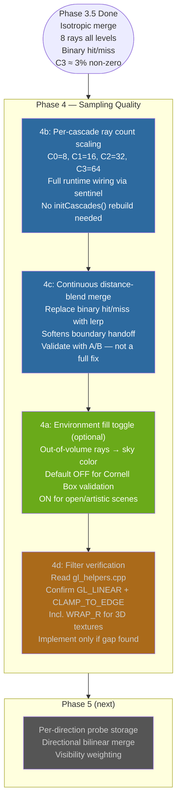
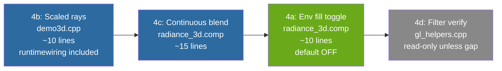

# Phase 4 Plan — Sampling Quality (Revised)

**Date:** 2026-04-23 (revised after Codex critique)  
**Branch:** 3d  
**Depends on:** Phase 3.5 complete (committed `3f1db3d`)  
**Goal:** Improve GI sampling quality and reduce noise within the existing isotropic probe architecture. Four tasks; three are implementation, one is verification.

---

## What Changed from the Original Plan

| Item | Original | Revised |
|---|---|---|
| 4a framing | "Energy-correctness fix for C3" | Optional environment fill toggle, **default OFF** — changes scene semantics, not transport |
| 4b wiring | Slider + dirty flag only | Slider must also directly update `cascades[i].raysPerProbe` at runtime |
| 4c claim | "Visually imperceptible transition" | "May reduce banding" — validate with A/B, directional mismatch persists |
| 4d status | Planned fix | Demoted to verification step — `gl::createTexture3D` likely already correct |
| Order | 4a→4b→4c→4d | **4b→4c→4a(optional)→4d(verify)** |

---

## Overview



---

## 4b — Per-Cascade Ray Count Scaling *(do first)*

### Problem

All 4 cascade levels use 8 rays. C3 covers [2.0, 8.0m] — a 6m shell. With 8 rays, angular resolution is ~1 sample per 0.5 steradians. Noise in C3 propagates directly down the merge chain into C2 → C1 → C0.

Upper cascades cover larger solid angle per distance unit and need proportionally more ray samples to reduce that noise.

### Fix — `src/demo3d.cpp`

**`initCascades()`** — set initial scaled rays:

```cpp
const int baseRays = 8;
for (int i = 0; i < cascadeCount; ++i) {
    int rays = baseRays * (1 << i);  // C0=8, C1=16, C2=32, C3=64
    cascades[i].initialize(probeRes, cellSz, volumeOrigin, rays);
}
```

**`render()`** — runtime sentinel that updates `raysPerProbe` directly (no initCascades rebuild):

```cpp
static int lastBaseRays = -1;
if (baseRaysPerProbe != lastBaseRays) {
    lastBaseRays = baseRaysPerProbe;
    for (int i = 0; i < cascadeCount; ++i)
        cascades[i].raysPerProbe = baseRaysPerProbe * (1 << i);
    cascadeReady = false;
}
```

No shader changes needed — `uRaysPerProbe` is already a uniform sourced from `c.raysPerProbe` each dispatch.

**`renderCascadePanel()`** — expose slider:

```cpp
if (ImGui::SliderInt("Base rays/probe", &baseRaysPerProbe, 4, 32))
    ; // sentinel in render() handles invalidation
ImGui::SameLine();
ImGui::TextDisabled("C0=%d C1=%d C2=%d C3=%d",
    baseRaysPerProbe, baseRaysPerProbe*2,
    baseRaysPerProbe*4, baseRaysPerProbe*8);
```

**`demo3d.h`** — new member:
```cpp
int baseRaysPerProbe;  // default 8
```

**`demo3d.cpp` constructor** — initialize:
```cpp
, baseRaysPerProbe(8)
```

### Performance Note

Total rays: C0=8, C1=16, C2=32, C3=64 → 120 total vs 32 previously (3.75×). Shadow ray cost (`inShadow()`) dominates over ray count. Acceptable for a static scene that bakes once.

### Expected Visual Change

- C3 probe values smoother / less noisy (64 rays vs 8)
- Cleaner merge data flowing C3→C2→C1→C0
- Color bleed from red/green walls more consistent across probes

---

## 4c — Continuous Distance-Blend Merge *(do second)*

### Problem

Current merge is binary: a ray hitting at `t = tMax - ε` uses only local data; a ray missing at `t = tMax + ε` uses only upper cascade. The hard switch at `tMax` can produce visible GI brightness bands at cascade interval boundaries when surfaces sit near those boundaries.

### What This Fixes (and What It Does Not)

**Fixes:** The hard binary handoff at `tMax`. Surfaces near an interval edge get a smooth blend of local and upper-cascade data.

**Does not fix:** The isotropic merge mismatch — the upper cascade still contributes its directional average, not the radiance along the specific missed ray direction. Phase 5 fixes that. If the banding is mostly caused by directional mismatch rather than the binary switch, `4c` will have minimal visual effect — measure with A/B before claiming success.

### Fix — `res/shaders/radiance_3d.comp`

**`raymarchSDF()`** — return `t` in `.a` instead of hardcoded sentinel `1.0`:

```glsl
// Hit: vec4(color, t)       — t > 0, carries actual hit distance
// Miss in-volume: vec4(0)   — a == 0
// Sky exit: vec4(sky, -1)   — a < 0  (added in 4a; keep 0 here until 4a lands)
return vec4(color, t);
```

**`main()`** — continuous blend on hit:

```glsl
float tInterval  = tMax - tMin;
float blendWidth = tInterval * uBlendFraction;  // default 0.5

for (int i = 0; i < uRaysPerProbe; ++i) {
    vec3 rayDir = getRayDirection(i);
    vec4 hit    = raymarchSDF(worldPos, rayDir, tMin, tMax);

    vec3 upperSample = (uHasUpperCascade != 0)
                       ? texture(uUpperCascade, uvwProbe).rgb
                       : vec3(0.0);

    if (hit.a < 0.0) {
        // Sky exit (4a path — no-op until 4a lands, a is never < 0 without it)
        totalRadiance += hit.rgb;
    } else if (hit.a > 0.0) {
        // Surface hit — blend toward upper cascade as t approaches tMax
        float blendStart = tMax - blendWidth;
        float l = 1.0 - clamp((hit.a - blendStart) / blendWidth, 0.0, 1.0);
        totalRadiance += hit.rgb * l + upperSample * (1.0 - l);
    } else {
        // In-volume miss — full upper cascade
        totalRadiance += upperSample;
    }
}
```

**Uniform to add:**
```glsl
uniform float uBlendFraction;  // 0.0 = binary (Phase 3 behavior), 0.5 = default
```

CPU side in `updateSingleCascade()`:
```cpp
glUniform1f(glGetUniformLocation(prog, "uBlendFraction"), blendFraction);
```

**`renderCascadePanel()`** — expose slider:
```cpp
ImGui::SliderFloat("Blend fraction", &blendFraction, 0.0f, 1.0f);
```

**`demo3d.h`** — new member:
```cpp
float blendFraction;  // default 0.5
```

**Sentinel in `render()`:**
```cpp
static float lastBlendFrac = -1.0f;
if (blendFraction != lastBlendFrac) {
    lastBlendFrac = blendFraction;
    cascadeReady  = false;
}
```

### Validation

Set `blendFraction = 0.0` (binary, Phase 3 behavior) and `blendFraction = 0.5` — compare mode 0 or mode 6 at surfaces near cascade interval boundaries. If no visible difference, the banding is driven by directional mismatch and 4c is confirmed as a no-op for this scene. That is an acceptable outcome — document the result either way.

---

## 4a — Environment Fill Toggle *(optional, default OFF)*

### Reframing from Original Plan

The original plan described this as an "energy-correctness fix" because C3 non-zero% is only ~3%. That framing was wrong.

`sampleSDF() → INF` means "outside the simulation volume" — it does **not** prove the ray escaped through a real scene opening and reached a sky. For a Cornell Box, the front is open but the SDF volume boundary is not a sky visibility test. Making C3 non-zero% jump to ~100% by injecting ambient is a **metric win by construction** — it improves the statistic while changing the lighting model, not the transport.

### Correct Framing

`4a` is an **environment fallback** — a stylistic/scene-setup choice:
- **Default OFF** — Cornell Box validation; out-of-volume rays return `vec3(0.0)`; C3 ~3% non-zero remains the honest transport health metric
- **Toggle ON** — open scenes, outdoor environments, or artistic fill; out-of-volume rays pick up a configurable sky color

### Fix — `res/shaders/radiance_3d.comp`

In `sampleSDF()`, the volume-exit path returns `INF`. Detect this in `raymarchSDF()` and return sky sentinel when `4a` is enabled:

```glsl
uniform int  uUseEnvFill;   // 0 = off, 1 = on
uniform vec3 uSkyColor;     // e.g. (0.02, 0.03, 0.05) — very dim

vec4 raymarchSDF(vec3 origin, vec3 direction, float tMin, float tMax) {
    float t = tMin;
    for (int i = 0; i < MAX_STEPS && t < tMax; ++i) {
        vec3 pos  = origin + direction * t;
        float dist = sampleSDF(pos);

        if (dist >= INF * 0.5) {
            // Exited simulation volume
            if (uUseEnvFill != 0)
                return vec4(uSkyColor, -1.0);  // sky sentinel
            else
                return vec4(0.0);              // honest miss
        }
        if (dist < 0.002) { /* ... hit ... */ }
        t += max(dist * 0.9, 0.01);
    }
    return vec4(0.0);  // in-volume miss
}
```

CPU in `updateSingleCascade()`:
```cpp
glUniform1i(glGetUniformLocation(prog, "uUseEnvFill"), useEnvFill ? 1 : 0);
glUniform3fv(glGetUniformLocation(prog, "uSkyColor"), 1, glm::value_ptr(skyColor));
```

**`demo3d.h`** — new members:
```cpp
bool      useEnvFill;  // default false
glm::vec3 skyColor;    // default (0.02, 0.03, 0.05)
```

**`renderCascadePanel()`:**
```cpp
ImGui::Checkbox("Env fill (out-of-volume)", &useEnvFill);
if (useEnvFill) {
    ImGui::SameLine();
    ImGui::ColorEdit3("Sky color", &skyColor[0]);
}
```

**Sentinel in `render()`:**
```cpp
static bool      lastEnvFill = false;
static glm::vec3 lastSkyColor(-1.0f);
if (useEnvFill != lastEnvFill || skyColor != lastSkyColor) {
    lastEnvFill  = useEnvFill;
    lastSkyColor = skyColor;
    cascadeReady = false;
}
```

### Acceptance Criteria (with correct framing)

| Test | Expected |
|---|---|
| `useEnvFill = false` | C3 non-zero% ~3% — baseline unchanged, transport honest |
| `useEnvFill = true` | C3 non-zero% ~100% — expected by construction |
| Mode 6 with env fill ON | Visibly brighter indirect fill in dark areas |
| Mode 0, `disableMerge = true`, env fill ON | Indirect still present — ambient reaches C0 without merge |

The C3 non-zero% stat with `useEnvFill = false` remains the **valid transport health metric**. The stat with `useEnvFill = true` reflects policy, not coverage.

---

## 4d — Filter Verification *(verify only)*

### Status

The Codex critic identified that `gl::createTexture3D()` already calls `setTexture3DParameters()` with `GL_LINEAR` filtering and `GL_CLAMP_TO_EDGE`. If true, 4d is not implementation work.

### Verification Steps

1. Read `src/gl_helpers.cpp` → confirm `setTexture3DParameters()` sets:
   - `GL_TEXTURE_MIN_FILTER = GL_LINEAR` ✓ ?
   - `GL_TEXTURE_MAG_FILTER = GL_LINEAR` ✓ ?
   - `GL_TEXTURE_WRAP_S = GL_CLAMP_TO_EDGE` ✓ ?
   - `GL_TEXTURE_WRAP_T = GL_CLAMP_TO_EDGE` ✓ ?
   - `GL_TEXTURE_WRAP_R = GL_CLAMP_TO_EDGE` ✓ ? ← **3D-specific, commonly missed**

2. Confirm `RadianceCascade3D::initialize()` goes through `gl::createTexture3D()` (not a bypass path).

3. **If all confirmed:** Document as verified. No code change. Remove from milestone.

4. **If WRAP_R is missing:** Add it to `setTexture3DParameters()`. Missing WRAP_R causes boundary probes to wrap in the probe-grid Z axis — visible as light bleeding from one side of the probe grid to the other at room edges.

5. **If filters are wrong:** Fix them in `gl_helpers.cpp` and document the regression.

---

## Implementation Order and Dependencies



**4b first** — cleaner probe data benefits everything downstream.  
**4c second** — uses the `.a = t` return value; 4b makes the improvement more visible.  
**4a third** — optional, adds sky sentinel used by 4c's `hit.a < 0` branch.  
**4d last** — verification, not blocked by anything.

---

## New Members in `demo3d.h`

```cpp
int       baseRaysPerProbe;  // default 8  — scales per level
float     blendFraction;     // default 0.5 — 4c blend zone width
bool      useEnvFill;        // default false — 4a sky toggle
glm::vec3 skyColor;          // default (0.02, 0.03, 0.05) — 4a sky color
```

## Sentinels in `render()`

```cpp
static int       lastBaseRays  = -1;
static float     lastBlendFrac = -1.0f;
static bool      lastEnvFill   = false;
static glm::vec3 lastSkyColor(-1.0f);

if (baseRaysPerProbe != lastBaseRays) {
    lastBaseRays = baseRaysPerProbe;
    for (int i = 0; i < cascadeCount; ++i)
        cascades[i].raysPerProbe = baseRaysPerProbe * (1 << i);
    cascadeReady = false;
}
if (blendFraction != lastBlendFrac) {
    lastBlendFrac = blendFraction;
    cascadeReady  = false;
}
if (useEnvFill != lastEnvFill || skyColor != lastSkyColor) {
    lastEnvFill  = useEnvFill;
    lastSkyColor = skyColor;
    cascadeReady = false;
}
```

---

## Acceptance Criteria

| Test | Expected | Notes |
|---|---|---|
| C3 non-zero% baseline (env fill OFF) | ~3% — unchanged | Transport health metric |
| C3 probe noise with 64 rays vs 8 | Visibly smoother | 4b |
| Mode 6 GI with 64-ray C3 | Less speckle in indirect | 4b |
| Blend fraction 0.0 vs 0.5 — A/B at boundary surfaces | Some smoothing, or no difference | 4c — document result honestly |
| Env fill OFF → ON toggle | C3 jumps to ~100%, indirect brighter | 4a — policy change, not transport |
| Env fill ON, merge disabled | Indirect still present from sky ambient | 4a propagation check |
| gl_helpers WRAP_R confirmed | No light bleeding at probe grid edges | 4d |

---

## Files Touched

| File | Change |
|---|---|
| `res/shaders/radiance_3d.comp` | Return `t` in `.a` (4c), sky sentinel (4a), `uBlendFraction`/`uSkyColor`/`uUseEnvFill` uniforms |
| `src/demo3d.cpp` | initCascades() ray scaling, sentinel block, updateSingleCascade() uniforms, renderCascadePanel() UI |
| `src/demo3d.h` | `baseRaysPerProbe`, `blendFraction`, `useEnvFill`, `skyColor` |
| `src/gl_helpers.cpp` | Verify `WRAP_R`; fix only if gap found |

---

## Relation to Phase 5

Phase 4 intentionally leaves isotropic probe storage intact. All four tasks operate within the single-RGBA16F-per-probe model. Phase 5 breaks this by introducing per-direction storage:

- The `raysPerProbe` set in 4b becomes the per-direction count that Phase 5 stores individually rather than averaging
- The sky sentinel (`.a < 0`) established in 4a is reused unchanged in Phase 5's merge path
- Phase 5's directional bilinear merge makes 4c's continuous blend more effective — the upper cascade will then carry directionally correct data, not just an isotropic average
