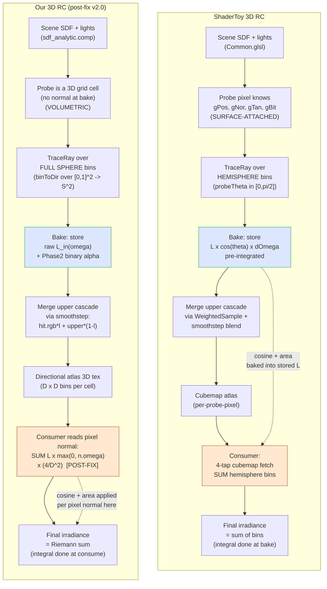
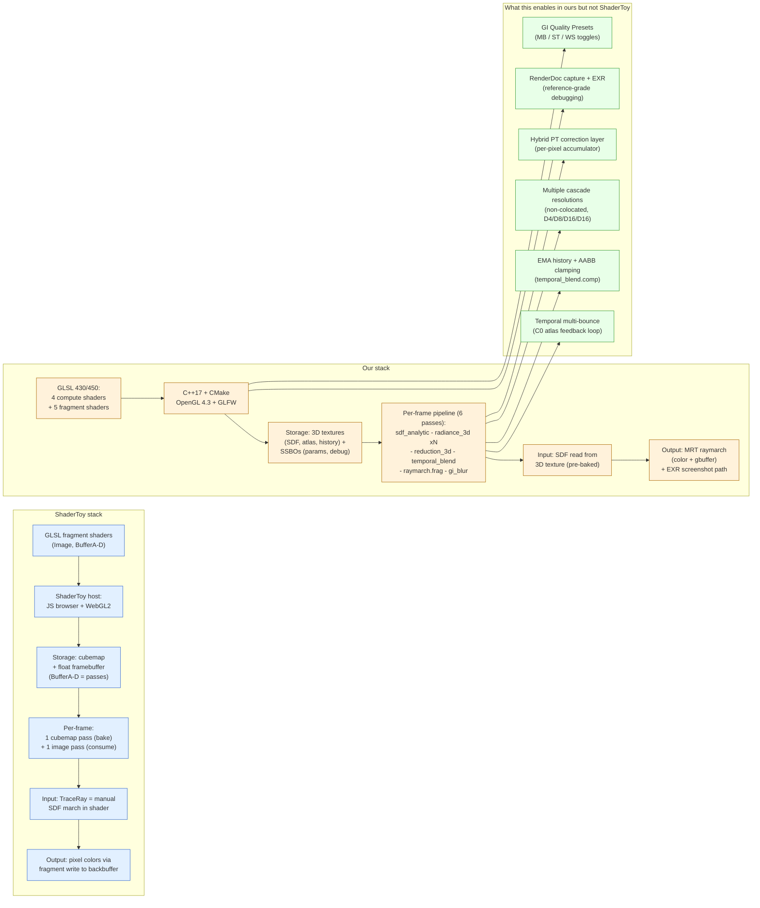
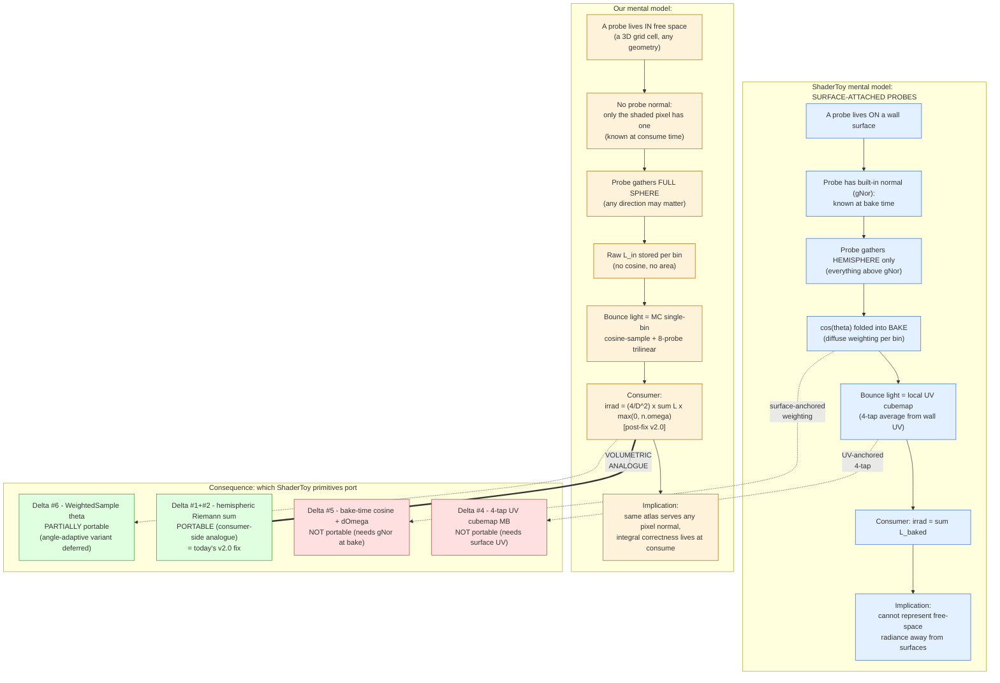

# v2.0 — ShaderToy vs ours: visual comparison diagrams

**Date:** 2026-05-25.
**Companion to:** [v20_shadertoy_diff_impl.md](v20_shadertoy_diff_impl.md)
(text-form deltas + theoretical fix).

Three side-by-side diagrams: (1) bake→consume workflow, (2) tech stack
implementation, (3) conceptual / mental model. All numbers and line refs
match the diff doc unless noted.

---

## 1. Workflow — bake & consume

How a frame's GI gets computed end-to-end. Where the cosine/area weighting
lives is the key visual difference.

**Key visual takeaway:** ShaderToy folds the `cos x dOmega` weighting into
the BAKE (yellow→orange transition at `ST_bake`); ours leaves it for the
CONSUMER (yellow→orange at `OUR_consume`). Both produce correct Lambertian
irradiance; ours requires the consumer to know the surface normal of the
shaded pixel, which is fine because the consumer is the raymarch fragment
shader that has that normal anyway.

---

## 2. Implementation tech stack

What kind of GPU passes, languages, and data structures each implementation
uses. The architectural shape is set by the host platform first, by RC
correctness second.

**Key visual takeaway:** ShaderToy is a 2-pass GLSL demo (one bake pass +
one consume pass). Ours is a 6-pass C++/OpenGL pipeline with first-class
temporal accumulation, multi-bounce feedback, multi-resolution cascades,
and a hybrid PT-correction overlay. The extra machinery is what lets us
measure GI quality against PT and ship a hybrid retirement path — none of
which is possible inside ShaderToy.

---

## 3. Conceptual / mental model

What each implementation thinks a "probe" is, and how that single mental
model decision cascades down into every primitive.

**Key visual takeaway:** Every algorithmic delta between the two impls is
downstream of ONE upstream choice: surface-attached vs volumetric probes.
ShaderToy folds direction-dependent weighting into the bake because it
knows the normal there. We can't, so the same weighting must live in the
consumer. The post-fix v2.0 (`irrad = (4/D^2) x Σ L cos⁺`) is the
volumetric analogue of ShaderToy's bake-time `L x cos(theta) x dOmega` —
same physics, different placement.

---

## 4. Where to point this diagram set

These diagrams complement (not replace) the prose diff. Use them to:

- **Brief a new contributor**: §3 in 60 seconds — what's a probe in each impl.
- **Justify the v2.0 fix**: §1 shows where the missing integral lived;
  §3 shows it was structurally forced by the volumetric mental model.
- **Pre-empt "why don't you just port ShaderToy?"**: §3 right-hand
  "not portable" boxes make the architectural constraint explicit.
- **Scope future work**: §2 right-hand "extra in ours" box is the set of
  features that don't even have a ShaderToy analog to crib from —
  multi-bounce equilibrium, hybrid retirement, GI presets all live here.

## Cross-reference

- Text-form deltas + theoretical fix: [v20_shadertoy_diff_impl.md](v20_shadertoy_diff_impl.md)
- Post-fix CV1 result: [v20_postfix_cv1_impl.md](v20_postfix_cv1_impl.md)
- ShaderToy in-tree: [3d/shader_toy/](../../shader_toy/)
- Our cascade bake: [res/shaders/radiance_3d.comp](../../res/shaders/radiance_3d.comp)
- Our cascade consumer: [res/shaders/raymarch.frag](../../res/shaders/raymarch.frag)
- GI Quality Presets: [doc/7/gi_presets.md](gi_presets.md)
