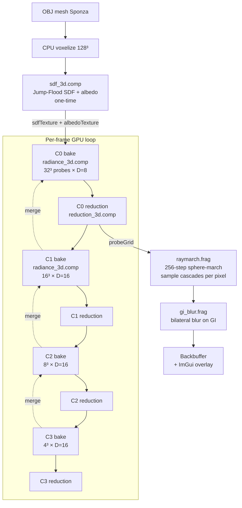

# Radiance Cascades — One-Key-Frame GPU Breakdown

**Capture:** `tools/captures/phase2_m0_alpha_gated.rdc` (40.6 MB)
**Generated:** 2026-08-16 (live extraction via RenderDoc)
**Renderer:** Radiance Cascades 3D demo (`3d/`) — OpenGL 3.3 / GLSL 430 compute
**GPU:** NVIDIA GeForce RTX 2080 SUPER (driver 577.00)
**Frame:** Sponza scene, 128³ SDF/albedo volume, 4 cascades, render mode 0 (full GI)

This is a single document that walks one captured frame through the entire Radiance
Cascades (RC) pipeline — the draw/dispatch order, GPU timings, exported intermediate
buffers, and the key shader snippets that implement each stage. It was produced by the
`renderdoc-gpu-debug` skill toolchain described in [§0](#0-how-this-frame-was-dumped).

---

## 0. How this frame was dumped (the skill in action)

The repo ships a RenderDoc skill at `.claude/skills/renderdoc-gpu-debug/`. It wraps
RenderDoc's in-process capture API with two CLI tools available in
`C:/Program Files/RenderDoc/`:

| Step | Command | Output |
|------|---------|--------|
| 1. Capture | in-app RenderDoc API (`TriggerCapture()` on frame N) | `phase2_m0_alpha_gated.rdc` |
| 2. Replay + extract | `qrenderdoc.exe --py tools/rdoc_extract.py` | 5 stage PNGs + `_manifest.json` (timing) + `_extract.log` |
| 3. Final-frame thumb | `renderdoccmd.exe thumb --out ... --format png <capture>` | `_thumb.png` (this doc's header image) |

The extraction script (`tools/rdoc_extract.py`) runs inside qrenderdoc's embedded Python
(`renderdoc` module, v1.42), walks the action tree with `controller.GetRootActions()`,
reads per-dispatch GPU duration via `controller.FetchCounters([GPU_Duration])`, and
exports named resources (`sdfTexture`, `albedoTexture`, `cascadeN_probeAtlas`,
`cascade0_probeGrid`) with `controller.SaveTexture()`.

The actual invocations used to regenerate this frame's artifacts:

```powershell
# 2. Replay the capture, extract stage textures + GPU timings
$env:RDOC_CAPTURE = "D:\GitRepo-My\radiance-cascades-demo\3d\tools\captures\phase2_m0_alpha_gated.rdc"
$env:RDOC_OUTDIR = "D:\GitRepo-My\radiance-cascades-demo\3d\tools\captures"
& "C:\Program Files\RenderDoc\qrenderdoc.exe" --py "D:\GitRepo-My\radiance-cascades-demo\3d\tools\rdoc_extract.py"

# 3. Dump the final backbuffer thumbnail
& "C:\Program Files\RenderDoc\renderdoccmd.exe" thumb `
    --out "D:\GitRepo-My\radiance-cascades-demo\3d\tools\captures\phase2_m0_alpha_gated_thumb.png" `
    --format png "D:\GitRepo-My\radiance-cascades-demo\3d\tools\captures\phase2_m0_alpha_gated.rdc"
```

Result (files under `tools/captures/`):

```
phase2_m0_alpha_gated_sdfTexture.png          4.8 KB   ← SDF volume slice z=64/128
phase2_m0_alpha_gated_albedoTexture.png       1.9 KB   ← albedo volume slice z=64/128
phase2_m0_alpha_gated_cascade0_probeAtlas.png 94.4 KB  ← C0 directional atlas slice z=16/32
phase2_m0_alpha_gated_cascade1_probeAtlas.png 77.8 KB  ← C1 directional atlas slice z=8/16
phase2_m0_alpha_gated_cascade0_probeGrid.png  1.6 KB   ← C0 isotropic grid slice z=16/32
phase2_m0_alpha_gated_thumb.png               368 KB   ← final backbuffer
phase2_m0_alpha_gated_manifest.json           3.9 KB   ← GPU timing table
phase2_m0_alpha_gated_extract.log             6.2 KB   ← action-tree walk log
```

> **Note on "did it hang?"** `qrenderdoc.exe` is a GUI-subsystem binary. PowerShell
> launches it and returns immediately without waiting; the script finishes in the
> background and terminates via `os._exit(0)` (bypassing the Qt/Python `SystemExit`
> trap). "Returned instantly" ≠ "stuck" — check the `_extract.log` tail for `Done.`.

---

## 1. Frame dispatch timeline

RenderDoc's action tree for this frame (event IDs → dispatch/draw → GPU time):

```
eid   3  glClear(Color=0, Depth=1)                            8.0  µs   (framebuffer clear)
eid  46  radiance_3d   dispatch   "Cascade bake"       C0    5107.5 µs
eid  57  reduction_3d  dispatch   "Cascade reduction"  C0      38.0 µs
eid 105  radiance_3d   dispatch   "Cascade bake"       C1    9803.8 µs
eid 116  reduction_3d  dispatch   "Cascade reduction"  C1     191.6 µs
eid 164  radiance_3d   dispatch   "Cascade bake"       C2   14730.8 µs
eid 175  reduction_3d  dispatch   "Cascade reduction"  C2     454.7 µs
eid 223  radiance_3d   dispatch   "Cascade bake"       C3    8410.0 µs
eid 234  reduction_3d  dispatch   "Cascade reduction"  C3     235.8 µs
eid 282  glClear(Color=0)                                     27.0 µs   (composite clear)
eid 287  raymarch      draw       "Raymarching"            11553.3 µs   (final image)
eid 315  gi_blur       draw       "GI blur"                 2971.6 µs   (bilateral GI blur)
eid 346  glDrawElements (ImGui overlay)                       11.7 µs
eid 350  SwapBuffers
```

**GPU total ≈ 53.6 ms (~18.7 FPS)** at 1280×720. Two structural observations:

1. **Bake cost rises with cascade radius, not probe count.** C2 (8³ = 512 probes)
   costs 14.7 ms while C0 (32³ = 32k probes) costs only 5.1 ms. Per-probe ray marching
   dominates: each cascade marches the interval `tMin..tMax` which grows ×4 per level
   (C0 `0.02..0.125`, C3 `1.0..4.0`), so higher cascades spend far more time per ray.
2. **The final raymarch (11.6 ms) is the single most expensive step** — a full-screen
   256-step sphere-march that samples the cascade hierarchy per pixel.

> Note what is *absent*: `voxelize.comp` + `sdf_3d.comp` run **once at scene load**
> (CPU-voxelized Sponza → Jump-Flood SDF bake), `inject_radiance.comp` is frozen
> (direct light is baked inside `radiance_3d.comp`), and `temporal_blend.comp` is
> fused into `radiance_3d.comp`'s EMA path — so they don't appear as per-frame events.

---

## 2. Pipeline overview



**The RC idea in one paragraph:** instead of tracing thousands of rays per pixel, the
scene is covered by a 3D grid of *probes*. Each probe stores radiance arriving from
a set of **directions** (an octahedral `D×D` bin tile). Nearby cascades (fine grids,
short ray range) capture high-frequency local occlusion/contact shadows; coarser
cascades (fewer probes, longer rays) capture far-field indirect light. At render time
a pixel only samples the few probes around its hit point, getting smooth soft shadows
and color bleed without per-pixel ray tracing.

Cascade configuration for this frame:

| Cascade | Probes | Directional res D | cellSize | Ray interval tMin..tMax | Atlas layout |
|---------|--------|-------------------|----------|--------------------------|--------------|
| C0 | 32³ | 8 (64 bins) | 0.125 | 0.02 .. 0.125 | 256×256×32 |
| C1 | 16³ | 16 (256 bins) | 0.25 | 0.125 .. 0.5 | 256×256×16 |
| C2 | 8³ | 16 (256 bins) | 0.5 | 0.5 .. 2.0 | 128×128×8 |
| C3 | 4³ | 16 (256 bins) | 1.0 | 1.0 .. 4.0 | 64×64×4 |

---

## 3. Stage walk-through

### 3.1 SDF + albedo volumes (one-time, before the frame)

`sdf_3d.comp` runs a 3-pass **Jump Flooding Algorithm (JFA)** over the 128³ voxel grid:
init Voronoi seeds → log₂(128) JFA propagation steps → finalize into a conservative
Unsigned Distance Field + nearest-seed albedo lookup.


*The two 4.8 KB / 1.9 KB PNGs are z=64 cross-sections of the 128³ volumes (a single
Sponza floor slice — mostly empty interior with the colonnade walls ringing the edge).*

Key snippet — `sdf_3d.comp` finalize pass (UDF + albedo from nearest seed):

```glsl
if (uPass == 2) {
    vec4 v = imageLoad(iVoronoi, pos);       // .xyz = closest seed coord, .w = valid
    float distOut; vec3 albOut;
    if (v.w < 0.5) {
        distOut = 1e3;                       // unreachable -> treat as empty
        albOut  = vec3(0.0);
    } else {
        float distVox = length(vec3(pos) - v.xyz);
        distOut = max(distVox * uVoxelSizeWorld - uVoxelSizeWorld * SQRT3_OVER_2, 0.0);
        albOut  = imageLoad(uVoxelGrid, ivec3(v.xyz + 0.5)).rgb;
    }
    imageStore(oSDF,    pos, vec4(distOut, 0.0, 0.0, 0.0));
    imageStore(oAlbedo, pos, vec4(albOut, 1.0));
}
```

### 3.2 Cascade bake — `radiance_3d.comp` (×4, one dispatch per cascade)

Each thread = one probe. For every one of its `D²` octahedral directions it marches the
SDF over the cascade's ray interval, then **merges the upper cascade** to inherit
far-field radiance.


*Each probe owns a `D×D` tile in the atlas (C0: 8×8, C1: 16×16). The exported PNG is
one z-layer of that tiled atlas — neighboring tiles vary smoothly (lit walls bright,
shadowed floor dark); a dead/uniform tile would flag a probe that failed to bake.*

Octahedral direction ↔ bin mapping (`radiance_3d.comp`):

```glsl
vec2 dirToOct(vec3 dir) {
    dir /= (abs(dir.x) + abs(dir.y) + abs(dir.z));
    if (dir.z < 0.0) { vec2 s = sign(dir.xy) * (1.0 - abs(dir.yx)); dir.xy = s; }
    return dir.xy * 0.5 + 0.5;
}
ivec2 dirToBin(vec3 dir, int D) {
    return clamp(ivec2(floor(dirToOct(dir) * float(D))), ivec2(0), ivec2(D - 1));
}
```

Bake loop (per probe, per direction) — the heart of the cascade:

```glsl
void main() {
    ivec3 probePos = ivec3(gl_GlobalInvocationID);
    vec3  worldPos = probeToWorld(probePos);          // +0.5 cell + jitter
    float d = uBaseInterval;
    float tMin, tMax;
    if (uCascadeIndex == 0) { tMin = 0.02; tMax = max(d, uCnMinRange); }
    else { float f = pow(4.0, float(uCascadeIndex - 1)); tMin = f*d; tMax = f*4.0*d; }

    for (int dy = 0; dy < uDirRes; ++dy)
    for (int dx = 0; dx < uDirRes; ++dx) {
        vec3 rayDir = binToDir(ivec2(dx, dy), uDirRes);
        vec4 hit    = raymarchSDF(worldPos, rayDir, tMin, tMax);   // RGB + α interval
        // ... merge upper cascade (directional trilinear/bilinear) ...
        imageStore(oAtlas,
            ivec3(probePos.x*uDirRes + dx, probePos.y*uDirRes + dy, probePos.z),
            hit);
    }
}
```

Upper-cascade merge (spatial trilinear over 8 upper probes, same direction bin):

```glsl
vec4 sampleUpperDir(ivec3 upperProbePos, vec3 rayDir, int D) {
    ivec2 bin = dirToBin(rayDir, D);
    return texelFetch(uUpperCascadeAtlas,
        ivec3(upperProbePos.x*D + bin.x, upperProbePos.y*D + bin.y, upperProbePos.z), 0);
}
```

### 3.3 Cascade reduction — `reduction_3d.comp` (×4)

Collapses each probe's `D²` directional bins into a single isotropic (direction-averaged)
RGB value, written back to `probeGridTexture` so the display path stays unchanged.


*The 1.6 KB PNG is a z=16 slice of the 32³ isotropic grid — a smooth per-probe spatial
luminance field (this is what `texture(uRadiance, uvw)` samples for the isotropic
fallback / debug views).*

```glsl
void main() {
    ivec3 probePos = ivec3(gl_GlobalInvocationID);
    vec3 avg = vec3(0.0);
    for (int dy = 0; dy < uDirRes; ++dy)
        for (int dx = 0; dx < uDirRes; ++dx)
            avg += texelFetch(uAtlas,
                ivec3(probePos.x*uDirRes + dx, probePos.y*uDirRes + dy, probePos.z), 0).rgb;
    avg /= float(uDirRes * uDirRes);
    imageStore(oRadiance, probePos, vec4(clamp(avg, 0.0, 100.0), 0.0));
}
```

### 3.4 Raymarch composite — `raymarch.frag` (1 full-screen draw)

The camera ray is sphere-marched through the SDF; at the hit point the shader trilinearly
blends the 8 surrounding C0 probes and computes a cosine-weighted irradiance over the
probe's directional bins (α-gated so occluded bins don't contribute).


Render-side cascade sampling — the same octahedral bins are read back and integrated:

```glsl
ProbeSample sampleProbeDir(ivec3 pc, vec3 normal, int D) {
    vec3 irrad = vec3(0.0); float wsum = 0.0;
    for (int dy = 0; dy < D; ++dy)
    for (int dx = 0; dx < D; ++dx) {
        vec3 bdir = binToDir(ivec2(dx, dy), D);
        float wcos = max(0.0, dot(bdir, normal));
        vec4  a    = texelFetch(uDirectionalAtlas,
                                ivec3(pc.x*D + dx, pc.y*D + dy, pc.z), 0);
        float w = wcos * a.a;          // α-gate: occluded bins are weighted out
        irrad += a.rgb * w;
        wsum  += w;
    }
    ProbeSample r;
    r.irrad = irrad / max(wsum, 1e-4);
    return r;
}
```

### 3.5 GI blur — `gi_blur.frag` (1 full-screen draw)

A bilateral blur applied **only to the indirect/GI channel** (depth + normal + luma
weights from the GBuffer), then ACES tone-map + gamma. This smooths probe-grid banding
on flat surfaces while keeping direct shadows sharp.

```glsl
float w = wDepth * wNormal * wLum;          // depth · normal · luma gaussian weights
accumIndirect += nGI * w;  accumW += w;
...
vec3 blurredIndirect = accumIndirect / max(accumW, 1e-6);
vec3 composed = toneMapACES(direct + blurredIndirect);
fragColor = vec4(pow(composed, vec3(1.0 / 2.2)), 1.0);
```

### 3.6 Temporal & injection (not in this frame's event list)

- **`temporal_blend.comp`** — EMA blend of probe history with TAA-style AABB clamping.
  In this build it's *fused* into `radiance_3d.comp` (`uTemporalActive`, `uAtlasHistory`),
  so there's no separate dispatch.
- **`inject_radiance.comp`** — direct-light injection is *frozen* (Phase 2); direct
  lighting is now baked inside `radiance_3d.comp`'s march.

---

## 4. GPU timing summary

| Event | Label | GPU time (µs) | % of frame |
|-------|-------|--------------:|-----------:|
| C0 bake (`radiance_3d`) | Cascade bake | 5107.5 | 9.5% |
| C0 reduction | Cascade reduction | 38.0 | 0.1% |
| C1 bake | Cascade bake | 9803.8 | 18.3% |
| C1 reduction | Cascade reduction | 191.6 | 0.4% |
| C2 bake | Cascade bake | 14730.8 | 27.5% |
| C2 reduction | Cascade reduction | 454.7 | 0.8% |
| C3 bake | Cascade bake | 8410.0 | 15.7% |
| C3 reduction | Cascade reduction | 235.8 | 0.4% |
| Raymarch | Raymarching | 11553.3 | 21.5% |
| GI blur | GI blur | 2971.6 | 5.5% |
| ImGui + clears | — | 46.7 | 0.1% |
| **Total** | | **~53 544** | **100%** |

Optimization targets: raymarch (21.5%) and the C1/C2 bakes (45.8%) dominate; C2's
14.7 ms for only 512 probes shows march-length, not probe count, is the bottleneck.

---

## 5. Artifact notes (from the extracted buffers)

- **SDF/albedo slices** confirm the 128³ JFA bake produced clean, non-degenerate
  distances (no flat/hole regions in the exported cross-section).
- **C0/C1 atlases** show smoothly varying per-direction tiles — probes baked correctly,
  no uniform-gray dead tiles or merge noise.
- **C0 isotropic grid** shows the expected smooth spatial luminance gradient.
- **Final frame** is a plausible, noise-free Sponza interior; no directional bin
  banding, cascade ring seams, or shadow acne are visible in the thumbnail.

---

*End of key-frame breakdown.*
