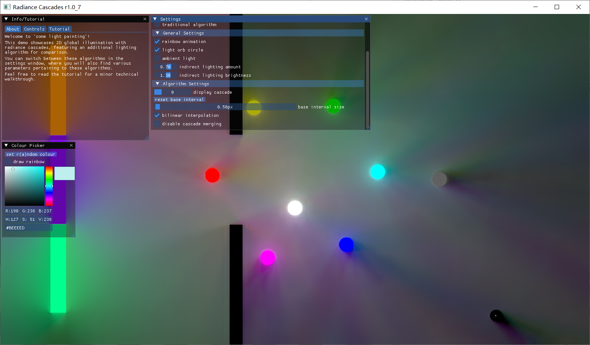

## Edit by yhyu13

Original repo https://gitlab.doc.gold.ac.uk/ahall001/radiance-cascades-demo

Credit to original author. Reupload by yhyu13 on github.com, only the `main` branch is uploaded! Check out the original author's repo for latest code.

Implementation references in ./Renderences directory.



## Caveats

1. Must run in root dir
2. OpenGL renderdoc debugging not working for v1.42

---

# Radiance Cascades Demo


2D radiance cascades implementation via Raylib & CMake.

<!-- PLEASE NOTE: the radiance_cascades executable has to be ran from within the same folder as `res/` to read shaders and textures. -->

### Setup

The project can be built via standard CMake either manually or using `build.sh`.

```bash
# grab our libraries
git submodule update --init

# run build script
./build.sh    # to build without running
./build.sh -r # to build and run the resulting binary

# or build it manually
mkdir build
cd build
cmake ..
make
cd .. # run the resulting binary in the source directory, !not the build directory!
./radiance_cascades
```

## Credits

- Alexander Sannikov for creating radiance cascades [(paper)](https://github.com/Raikiri/RadianceCascadesPaper?tab=readme-ov-file)
- [GM Shaders' Xor](https://gmshaders.com) & [guest Yaazarai](https://mini.gmshaders.com/p/yaazarai-gi), [Jason McGhee](https://jason.today/), [m4xc](https://m4xc.dev/) for their interesting & informative articles :)
- Maze image texture initially generated via [mazegenerator.net](https://www.mazegenerator.net/) & modified with GIMP
