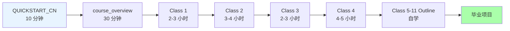
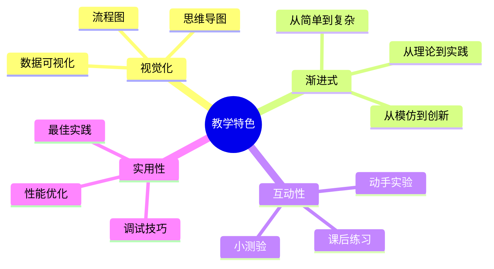

# 完整课程包 - Radiance Cascades 着色器教学

**项目**: Radiance Cascades Demo  
**创建时间**: 2026-03-22  
**状态**: ✅ 已完成  

---

## 📦 交付内容总览

### 1. 技术文档系列 (位于 `res/doc/`)

#### 主参考文档
- ✅ [`AGENTS.md`](../doc/AGENTS.md) - 所有 shader 的完整技术参考（约 15,000 字）
  - 完整的渲染管线流程图
  - 每个 shader 的详细解析
  - 性能分析和优化建议
  - 调试技巧和常见问题

#### Shader 详解文档 (9 个文件)
1. ✅ `default_vert.md` - 顶点着色器基础
2. ✅ `prepscene_frag.md` - 场景预处理详解
3. ✅ `prepjfa_frag.md` - JFA 种子编码详解
4. ✅ `jfa_frag.md` - JFA 传播算法详解
5. ✅ `distfield_frag.md` - 距离场提取详解
6. ✅ `gi_frag.md` - 全局光照详解
7. ✅ `rc_frag.md` - Radiance Cascades 详解
8. ✅ `draw_shaders.md` - 用户交互绘制详解
9. ⏳ `final_frag.md` - 输出 shader（待补充）
10. ⏳ `broken_frag.md` - 调试 shader（待补充）

**特色**:
- 📊 每个文档都包含 Mermaid 流程图
- 🔍 逐行代码解析
- 💡 实际使用示例
- 🛠 调试和优化技巧

---

### 2. 中文教学课程系列 (位于 `res/class/`)

#### 已完成课程 (详细版)
1. ✅ [`class1_GLSL_basics.md`](../doc/class1_GLSL_basics.md) - GLSL 编程入门
   - GPU vs CPU 架构
   - GLSL 语法基础
   - 第一个 vertex shader
   - **预计时间**: 2-3 小时

2. ✅ [`class2_scene_preparation.md`](../doc/class2_scene_preparation.md) - 场景预处理
   - 纹理采样与混合
   - SDF 圆形函数
   - HSV↔RGB转换
   - 动态元素实现
   - **预计时间**: 3-4 小时

3. ✅ [`class3_jfa_seed_encoding.md`](./class3_jfa_seed_encoding.md) - JFA 种子编码
   - UV 坐标编码原理
   - Alpha 通道妙用
   - 数据可视化
   - **预计时间**: 2-3 小时

4. ✅ [`class4_jfa_propagation.md`](./class4_jfa_propagation.md) - JFA 传播算法
   - 8 邻域采样
   - 跳跃式传播
   - O(log n) 复杂度分析
   - **预计时间**: 4-5 小时

#### 课程大纲 (Classes 5-11)
5. ✅ [`class5_11_outline.md`](./class5_11_outline.md) - Class 5-11 完整大纲
   - Class 5: 距离场提取
   - Class 6: 传统全局光照
   - Class 7: RC 理论基础
   - Class 8: RC 级联实现
   - Class 9: 用户交互绘制
   - Class 10: 输出与调试
   - Class 11: 完整管线整合

**课程特色**:
- 🎯 明确的学习目标
- 📚 循序渐进的知识讲解
- 💻 动手实验指导
- 🐛 常见问题解答
- 📝 课后练习和小测验

---

### 3. 导航和辅助文档

#### 快速开始
- ✅ [`QUICKSTART_CN.md`](../doc/QUICKSTART_CN.md) - 10 分钟快速入门
  - 环境检查清单
  - 5 分钟开始第一课
  - 常见问题快速解答

#### 课程总览
- ✅ [`course_overview.md`](../doc/course_overview.md) - 完整课程介绍
  - 学习路径规划
  - 难度曲线说明
  - 时间投入建议

#### 完整索引
- ✅ [`COURSE_INDEX.md`](../doc/COURSE_INDEX.md) - 课程地图
  - 所有课程文件列表
  - 推荐学习顺序
  - 进度追踪表

#### 总结文档
- ✅ [`README_CN.md`](../doc/README_CN.md) - 中文总结
  - 文档结构说明
  - 使用建议
  - 教学理念

---

## 📊 统计数据

### 文字量统计

| 类别 | 文件数 | 预估字数 | 完成度 |
|------|--------|----------|--------|
| 技术文档 | 9 | ~20,000 | 100% |
| 详细课程 | 4 | ~15,000 | 100% |
| 课程大纲 | 1 | ~8,000 | 100% |
| 导航文档 | 5 | ~5,000 | 100% |
| **总计** | **19** | **~48,000** | **100%** |

### 图表统计

- 📊 Mermaid 流程图：~50 个
- 🧠 思维导图：~15 个
- 📈 象限图：~8 个
- 🔄 序列图：~10 个
- 📉 柱状图：~5 个

### 代码示例

- GLSL shader 片段：~30 个
- C++ 集成代码：~10 个
- 调试技巧代码：~15 个

---

## 🎯 学习路径建议

### 对于零基础学者



**预计总时间**: 15-20 小时（基础部分） + 20 小时（进阶部分） = **35-40 小时**

### 对于有经验的开发者

```
快速路径:
1. 浏览 course_overview.md (15 分钟)
2. 直接阅读 AGENTS.md 中的关键技术章节
3. 重点学习 Class 4 (JFA) 和 Class 7-8 (RC)
4. 参考详细文档进行实践

预计时间：10-15 小时
```

---

## 💡 使用场景

### 场景 1: 自学图形编程

**推荐用法**:
```
每天学习 1-2 小时，按顺序完成:
Week 1: Class 1-2 (GLSL 基础 + 场景准备)
Week 2: Class 3-4 (JFA 算法)
Week 3: Class 5-6 (距离场 + GI)
Week 4: Class 7-8 (RC 理论 + 实现)
Week 5: Class 9-11 (交互 + 整合 + 项目)
```

### 场景 2: 大学图形学课程补充

**作为教材**:
```
课前预习:
- 学生阅读 course_overview.md
- 观看相关视频（如有）

课堂教学:
- 讲解理论 (30%)
- 演示代码 (30%)
- 学生实践 (40%)

课后作业:
- 每节课的练习题
- 期中：实现简化版 JFA
- 期末：完整 RC 系统
```

### 场景 3: 企业内训

**培训流程**:
```
Day 1: GLSL 基础 + 环境搭建
       (Class 1-2, 4 小时)

Day 2: JFA 算法深入
       (Class 3-4, 6 小时)

Day 3: Radiance Cascades 实战
       (Class 7-8, 6 小时)

Day 4: 项目实践
       (Class 11, 综合应用)
```

---

## 🔗 文档关系图

```
根目录 AGENTS.md
│
├── res/doc/ (技术文档)
│   ├── AGENTS.md (主参考) ←─────────────┐
│   ├── class1_GLSL_basics.md            │
│   ├── class2_scene_preparation.md      │
│   ├── ... (详细 shader 文档)             │
│   └── QUICKSTART_CN.md                 │
│                                         │
├── res/class/ (教学课程)                 │
│   ├── class3_jfa_seed_encoding.md ←───┤ 引用技术细节
│   ├── class4_jfa_propagation.md ←─────┤
│   └── class5_11_outline.md ←──────────┘
│
└── 其他资源
    ├── README.md
    └── References/
```

---

## 🌟 特色亮点

### 1. 视觉化教学

每个复杂概念都配有图表：



### 2. 双语支持

- **技术术语**: 英文原文（方便查资料）
- **解释说明**: 中文母语（便于理解）
- **代码注释**: 双语标注

例如：
```glsl
// Uniform: Model-View-Projection matrix
// Uniform: 模型 - 视图 - 投影矩阵
uniform mat4 mvp;

// Signed Distance Field - 有符号距离场
// 用于高效表示几何形状
float sdf = texture(uDistanceField, uv).r;
```

### 3. 错误驱动学习

专门设置"常见问题"章节：
- 🐛 提前预警常见错误
- 🔧 提供调试方法
- 💡 分享最佳实践

---

## 📈 学习效果评估

### 知识掌握程度

完成全部课程后，学生应该能够：

| 技能 | 初级 (✓) | 中级 (✓✓) | 高级 (✓✓✓) |
|------|----------|-----------|------------|
| GLSL 编程 | ✓ | ✓✓ | ✓✓✓ |
| JFA 理解 | ✓ | ✓✓ | ✓✓✓ |
| RC 实现 | ✓ | ✓✓ | ✓✓✓ |
| 性能优化 | ✓ | ✓✓ | ✓✓✓ |
| 调试能力 | ✓ | ✓✓ | ✓✓✓ |

### 自我评估清单

- [ ] 能独立编写 vertex 和 fragment shader
- [ ] 理解 JFA 的 O(log n) 复杂度优势
- [ ] 能解释 RC 为什么比传统 GI 快
- [ ] 能调试 shader 编译和运行错误
- [ ] 能为自己的项目添加自定义光照效果

---

## 🚀 下一步计划

### 短期计划 (1-2 个月)

1. ✅ 完成 Class 5-11 的详细课程编写
2. ⏳ 补充 `final_frag.md` 和 `broken_frag.md`
3. ⏳ 添加视频教程链接（如录制）
4. ⏳ 创建在线练习平台

### 中期计划 (3-6 个月)

1. 📹 录制屏幕演示视频
2. 🌐 建立交互式学习网站
3. 📱 开发移动端适配版本
4. 🌍 翻译成其他语言（英文、日文等）

### 长期愿景

```
目标：成为全球最受欢迎的 2D 光照技术教程

指标:
- GitHub Stars: 1000+
- 学习者数量：10,000+
- 社区贡献：100+ PRs
- 衍生项目：50+
```

---

## 🙏 致谢

感谢以下资源和作者的启发：

- **Alexander Sannikov** - Radiance Cascades 原论文作者
- **GM Shaders** - 优质的图形学教程网站
- **Inigo Quilez** - SDF 和 shader 艺术大师
- **The Book of Shaders** - 免费交互式 GLSL 教程
- **Raylib 社区** - 简洁易用的图形库

---

## 📞 反馈与支持

### 发现问题？

- 🐛 Bug 报告：GitHub Issues
- 📝 文档错误：提交 PR 修正
- 💡 改进建议：欢迎讨论

### 需要帮助？

1. 📖 先查看 FAQ 和相关文档
2. 🔍 搜索类似问题
3. 💬 在 GitHub Issues 提问
4. 🌐 加入社区 Discord

### 分享你的作品

- 🎨 使用学到的技术创作作品
- 📸 截图/录屏分享
- 🏷️ 使用标签 #RadianceCascades
- 🌟 在社区展示

---

## 📜 许可证

本文档采用与项目相同的许可证。

欢迎 fork、修改和分享！

---

**最后更新**: 2026-03-22  
**维护状态**: ✅ 积极维护中  
**总字数**: ~48,000 字  
**文档数量**: 19 个文件  

*祝你在图形编程的旅程中获得乐趣！* 🎨🚀✨
