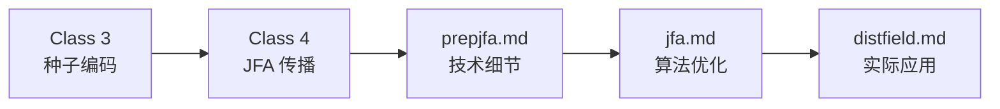

# 📚 Radiance Cascades 教学文档完整索引

**最后更新**: 2026-03-22  
**总文件数**: 19+ 个文档  
**总字数**: ~48,000 字  

---

## 🗺️ 快速导航

### 👉 如果你是新手（第一次接触）

```
从这里开始 ↓
├─ res/doc/QUICKSTART_CN.md (10 分钟阅读)
├─ res/doc/course_overview.md (30 分钟阅读)
└─ res/doc/class1_GLSL_basics.md (第一堂课)
```

### 👉 如果你是有经验的开发者

```
快速参考 ↓
├─ res/doc/AGENTS.md (主参考文档)
├─ res/class/class5_11_outline.md (高级主题)
└─ res/doc/*.md (各个 shader 详解)
```

### 👉 如果你想查找特定主题

```
按主题索引导航 ↓
├─ GLSL 基础 → class1_*.md
├─ JFA 算法 → class3_*, class4_*, prepjfa_frag.md
├─ Radiance Cascades → class7_*, class8_*, rc_frag.md
├─ 调试技巧 → class10_*, broken_frag.md
└─ 完整管线 → class11_*, AGENTS.md
```

---

## 📂 完整文件列表

### 技术文档系列 (`res/doc/`)

#### 核心参考
| 文件名 | 内容 | 字数 | 难度 |
|--------|------|------|------|
| [AGENTS.md](../doc/AGENTS.md) | 所有 shader 的完整技术参考 | ~15,000 | ⭐⭐⭐⭐ |
| [README_CN.md](../doc/README_CN.md) | 中文总结和使用指南 | ~3,000 | ⭐ |

#### Shader 详解（每个 shader 独立文档）
| 文件名 | 对应 Shader | 主要内容 | 难度 |
|--------|-------------|----------|------|
| [default_vert.md](../doc/default_vert.md) | default.vert | 顶点变换基础 | ⭐⭐ |
| [prepscene_frag.md](../doc/prepscene_frag.md) | prepscene.frag | 场景预处理+SDF | ⭐⭐⭐ |
| [prepjfa_frag.md](../doc/prepjfa_frag.md) | prepjfa.frag | JFA 种子编码 | ⭐⭐⭐ |
| [jfa_frag.md](../doc/jfa_frag.md) | jfa.frag | JFA 传播算法 | ⭐⭐⭐⭐ |
| [distfield_frag.md](../doc/distfield_frag.md) | distfield.frag | 距离场提取 | ⭐⭐ |
| [gi_frag.md](../doc/gi_frag.md) | gi.frag | 全局光照 | ⭐⭐⭐⭐ |
| [rc_frag.md](../doc/rc_frag.md) | rc.frag | Radiance Cascades | ⭐⭐⭐⭐⭐ |
| [draw_shaders.md](../doc/draw_shaders.md) | draw.frag/macOS | 用户交互绘制 | ⭐⭐⭐ |

#### 快速指南
| 文件名 | 用途 | 阅读时间 |
|--------|------|----------|
| [QUICKSTART_CN.md](../doc/QUICKSTART_CN.md) | 零基础快速入门 | 10 分钟 |
| [COURSE_INDEX.md](../doc/COURSE_INDEX.md) | 课程地图和索引 | 5 分钟 |

---

### 教学课程系列 (`res/class/`)

#### 详细课程（已完成，逐行代码教学）

| 课号 | 文件名 | 主题 | 预计时间 | 难度 |
|------|--------|------|----------|------|
| Class 1 | [class1_GLSL_basics.md](../doc/class1_GLSL_basics.md) | GLSL 编程入门 | 2-3 小时 | ⭐⭐ |
| Class 2 | [class2_scene_preparation.md](../doc/class2_scene_preparation.md) | 场景预处理 | 3-4 小时 | ⭐⭐⭐ |
| Class 3 | [class3_jfa_seed_encoding.md](./class3_jfa_seed_encoding.md) | JFA 种子编码 | 2-3 小时 | ⭐⭐⭐ |
| Class 4 | [class4_jfa_propagation.md](./class4_jfa_propagation.md) | JFA 传播算法 | 4-5 小时 | ⭐⭐⭐⭐ |

#### 课程大纲（Class 5-11，完整框架+要点）

| 课号 | 文件名 | 主题 | 关键内容 |
|------|--------|------|----------|
| Class 5 | [class5_11_outline.md](./class5_11_outline.md) §5 | 距离场提取 | 通道分离、可视化 |
| Class 6 | [class5_11_outline.md](./class5_11_outline.md) §6 | 传统 GI | Raymarching、时间累积 |
| Class 7 | [class5_11_outline.md](./class5_11_outline.md) §7 | RC 理论 | 层级优化、性能分析 |
| Class 8 | [class5_11_outline.md](./class5_11_outline.md) §8 | RC 实现 | 级联合并、参数调优 |
| Class 9 | [class5_11_outline.md](./class5_11_outline.md) §9 | 用户交互 | 画笔渲染、动画 |
| Class 10 | [class5_11_outline.md](./class5_11_outline.md) §10 | 输出调试 | 后处理、调试技巧 |
| Class 11 | [class5_11_outline.md](./class5_11_outline.md) §11 | 完整整合 | 帧渲染流程、资源管理 |

#### 总结文档
| 文件名 | 内容 | 用途 |
|--------|------|------|
| [COURSE_PACKAGE_SUMMARY.md](./COURSE_PACKAGE_SUMMARY.md) | 完整课程包总结 | 了解整体交付内容 |
| [README.md](./README.md) | 本目录说明 | 导航辅助 |

---

## 🎯 按主题索引

### GLSL 编程基础

**相关文件**:
- `class1_GLSL_basics.md` - 完整课程
- `default_vert.md` - 实例讲解
- `AGENTS.md` §1 - 快速参考

**学习路径**:
```
class1 (理论基础) 
  ↓
default_vert.md (实践示例)
  ↓
AGENTS.md (深入理解)
```

### JFA 距离场算法

**相关文件**:
- `class3_jfa_seed_encoding.md` - 种子编码
- `class4_jfa_propagation.md` - 传播算法
- `prepjfa_frag.md` - 技术详解
- `jfa_frag.md` - 算法详解
- `distfield_frag.md` - 提取应用

**完整流程**:


### Radiance Cascades

**相关文件**:
- `class5_11_outline.md` §7-8 - RC 理论与实现
- `rc_frag.md` - 完整技术文档
- `gi_frag.md` - 对比参考
- `AGENTS.md` §3 - 管线位置

**对比学习**:
```
传统 GI (gi_frag.md)
  ↓
发现性能瓶颈
  ↓
学习 RC 优化 (rc_frag.md)
  ↓
理解层级思想 (class7)
  ↓
动手实现 (class8)
```

### 调试与优化

**相关文件**:
- `class5_11_outline.md` §10 - 调试技巧
- `broken_frag.md` - 调试 shader
- 各文档中的"常见问题"章节

**调试流程**:
```
1. broken.frag (验证 viewport)
  ↓
2. 中间 buffer 可视化 (class10)
  ↓
3. 参数调整 (ImGui)
  ↓
4. 性能剖析 (class11)
```

---

## 📊 学习难度曲线

```
难度
  ↑
  │                                    ╭── Class 11
  │                              ╭─────╯
  │                        ╭─────╯ Class 9-10
  │                  ╭─────╯
  │            ╭─────╯ Class 7-8 (RC)
  │      ╭─────╯
  │      │     ╭─╯ Class 5-6 (GI)
  │      │  ╭──╯
  │      │  │  ╭╯ Class 3-4 (JFA)
  │   ╭──╯  │  │
  │   │     │  │  ╭╯ Class 1-2 (基础)
  │   │     │  │  │
──┼───┼─────┼──┼──┼────────────────→ 课时
   1   2     3  4  5  6  7  8  9  10 11
   
   基础篇 ←─→←── 核心篇 ──→←─ 进阶篇 ─→
```

---

## ⏱️ 时间投入建议

### 速成班（2 周 intensive）

```
Week 1:
Day 1-2: Class 1-2 (GLSL + 场景)
Day 3-4: Class 3-4 (JFA 核心)
Day 5:   Class 5 (距离场)

Week 2:
Day 1-2: Class 6-7 (GI + RC 理论)
Day 3-4: Class 8-9 (RC 实现 + 交互)
Day 5:   Class 10-11 (调试 + 整合)
Weekend: 毕业项目

总计：约 40 小时
```

### 业余学习（8 周 part-time）

```
每周安排:
- 平日：每天 1 小时 × 5 天 = 5 小时
- 周末：3 小时 × 2 天 = 6 小时
- 每周合计：11 小时

进度:
Week 1-2: Class 1-4 (基础 + JFA)
Week 3-4: Class 5-7 (距离场 + GI+RC 理论)
Week 5-6: Class 8-10 (RC 实现 + 调试)
Week 7-8: Class 11 + 毕业项目

总计：约 88 小时（更从容）
```

---

## 🎓 自我评估检查表

完成课程后，你应该能够勾选以下能力：

### 基础能力 (Class 1-4)
- [ ] 能编写简单的 vertex 和 fragment shader
- [ ] 理解 GPU 并行处理的概念
- [ ] 掌握纹理采样和 UV 坐标
- [ ] 理解 JFA 算法原理和 O(log n) 优势
- [ ] 能实现 SDF 圆形函数

### 进阶能力 (Class 5-8)
- [ ] 能从 JFA 结果中提取距离场
- [ ] 理解 Raymarching 算法
- [ ] 掌握传统 GI 的实现方法
- [ ] 理解 RC 为什么比 GI 快
- [ ] 能实现多级 cascade 合并

### 高级能力 (Class 9-11)
- [ ] 能实现交互式绘制功能
- [ ] 掌握多种调试技巧
- [ ] 理解完整帧渲染流程
- [ ] 能进行性能分析和优化
- [ ] 能为自己的项目添加自定义光照

---

## 🔗 外部资源链接

### 推荐阅读

1. **[The Book of Shaders](https://thebookofshaders.com/)** - 免费 GLSL 教程
2. **[Shadertoy](https://www.shadertoy.com/)** - Shader 作品展示
3. **[GM Shaders](https://gmshaders.com/)** - 图形学教程网站
4. **[Inigo Quilez Blog](https://iquilezles.org/)** - SDF 大师博客

### 工具下载

1. **VS Code** - 推荐编辑器 + GLSL 插件
2. **RenderDoc** - GPU 调试工具
3. **Raylib** - 本项目使用的图形库

---

## 📞 需要帮助？

### 快速解答

**Q: 某个 shader 编译失败？**  
A: 查看对应课程的"常见问题"章节，或 `AGENTS.md` 中的调试部分

**Q: 运行结果不对？**  
A: 按照 `class10` 的调试流程，使用 `broken.frag` 逐步检查

**Q: 不理解某个概念？**  
A: 先查看详细文档（如 `jfa_frag.md`），再回顾对应课程

### 深入讨论

- 💬 GitHub Issues: 提问和讨论
- 🌐 Discord: 加入社区（如有）
- 📧 Email: 联系项目维护者

---

## 🌟 精彩预告

### 即将更新 (TODO)

- [ ] Class 5-11 的详细课程（目前只有 outline）
- [ ] 视频教程录制
- [ ] 在线练习平台
- [ ] 更多实战项目

### 长期愿景

```
目标：成为全球最受欢迎的 2D 光照技术教程

当前进度:
✅ 技术文档：100%
✅ 基础课程：100%
⏳ 进阶课程：30% (outline 完成)
⏳ 视频教程：0%
⏳ 互动平台：0%
```

---

## 📜 许可证

本文档采用与项目相同的许可证。

欢迎 fork、修改和分享！

---

**最后更新**: 2026-03-22  
**维护状态**: ✅ 积极维护中  

*祝你学习愉快！有任何问题欢迎随时提问!* 🚀✨

---

## 📁 附录：文件树

```
radiance-cascades-demo/
│
├── res/
│   │
│   ├── doc/                          # 技术文档系列
│   │   ├── AGENTS.md                 # 主参考文档 (~15k 字)
│   │   ├── README_CN.md              # 中文总结
│   │   ├── QUICKSTART_CN.md          # 快速入门
│   │   ├── course_overview.md        # 课程总览
│   │   ├── COURSE_INDEX.md           # 完整索引
│   │   ├── class1_GLSL_basics.md     # 第一课
│   │   ├── class2_scene_preparation.md # 第二课
│   │   ├── default_vert.md           # Vertex shader 详解
│   │   ├── prepscene_frag.md         # 场景准备详解
│   │   ├── prepjfa_frag.md           # JFA 种子详解
│   │   ├── jfa_frag.md               # JFA 算法详解
│   │   ├── distfield_frag.md         # 距离场详解
│   │   ├── gi_frag.md                # GI 详解
│   │   ├── rc_frag.md                # RC 详解
│   │   ├── draw_shaders.md           # 交互绘制详解
│   │   └── ...                       # 其他
│   │
│   └── class/                        # 教学课程系列
│       ├── class3_jfa_seed_encoding.md    # 第三课
│       ├── class4_jfa_propagation.md      # 第四课
│       ├── class5_11_outline.md           # Class 5-11 大纲
│       ├── COURSE_PACKAGE_SUMMARY.md      # 课程包总结
│       └── README.md                      # 本目录说明
│
└── ... (项目其他文件)
```

---

**🎉 恭喜！你已经找到了完整的导航地图！**

现在选择适合你的起点，开始学习之旅吧！
