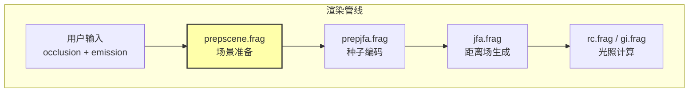
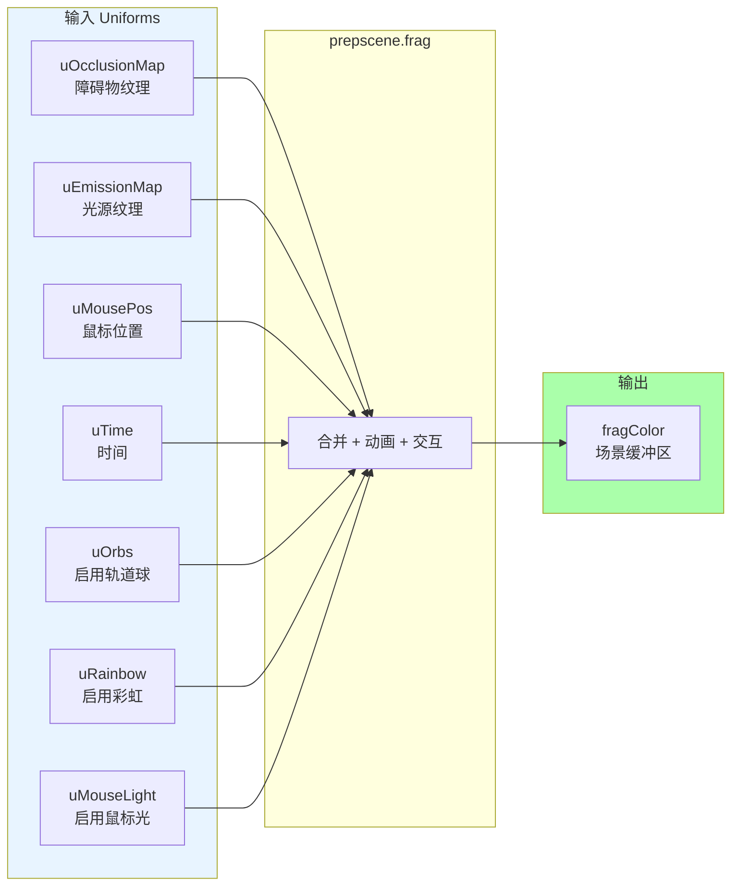
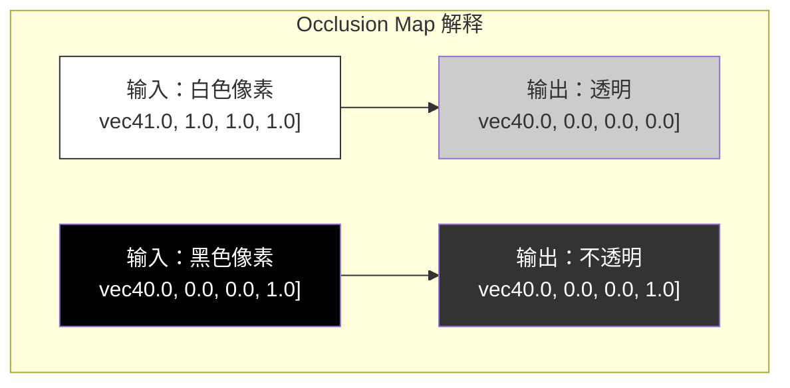
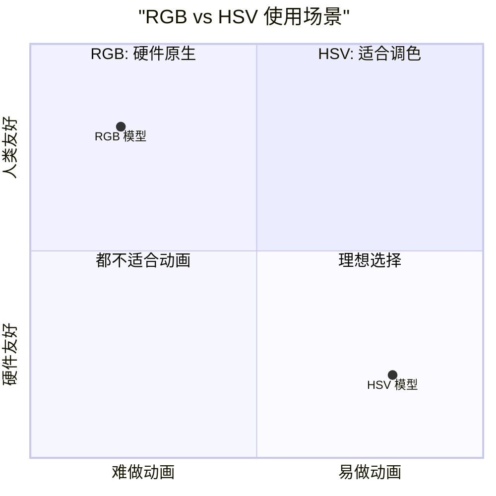
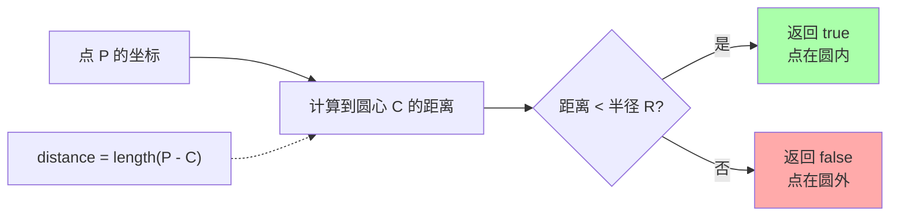
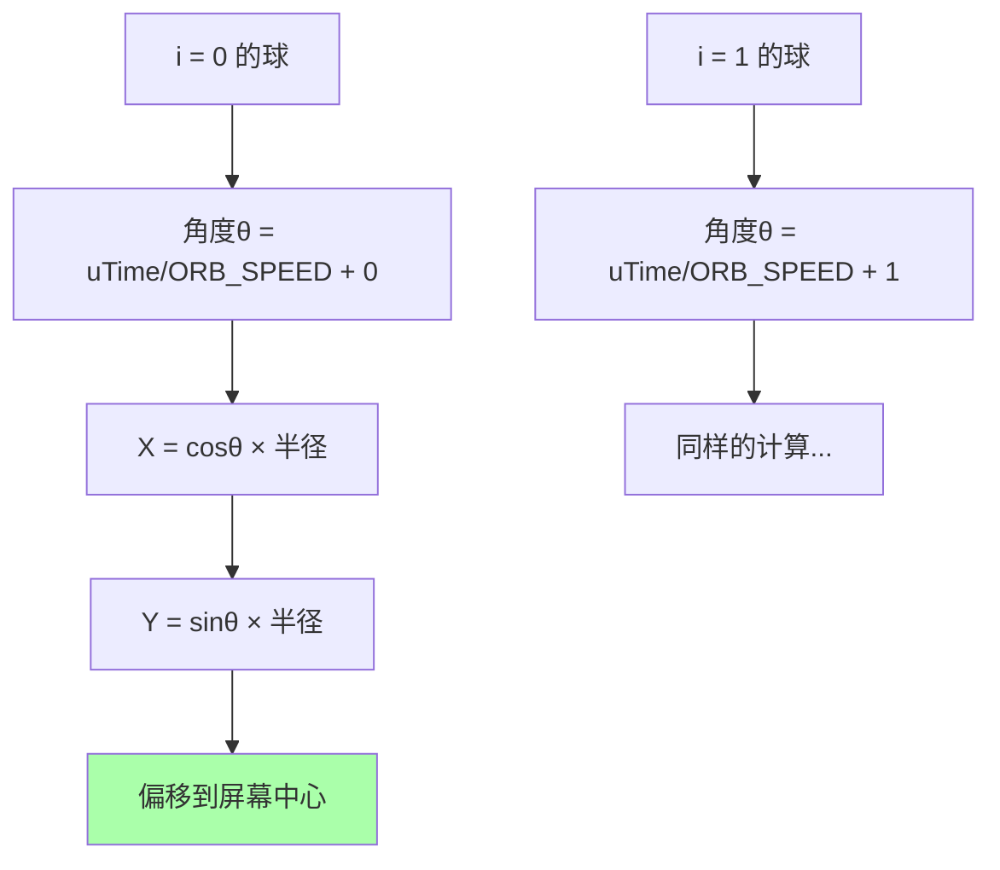
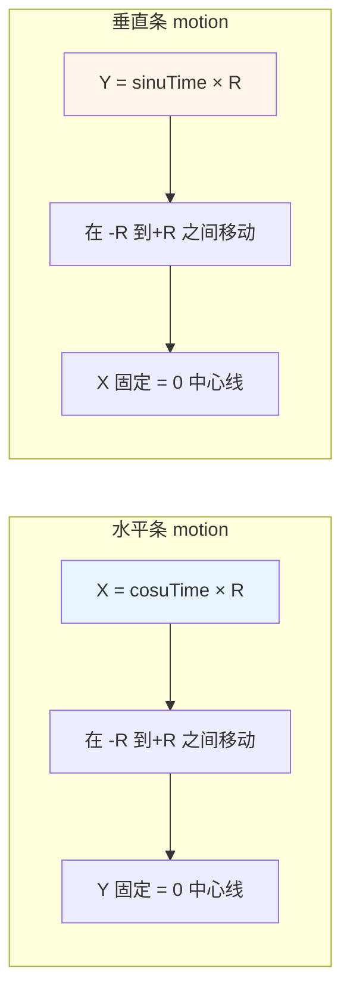
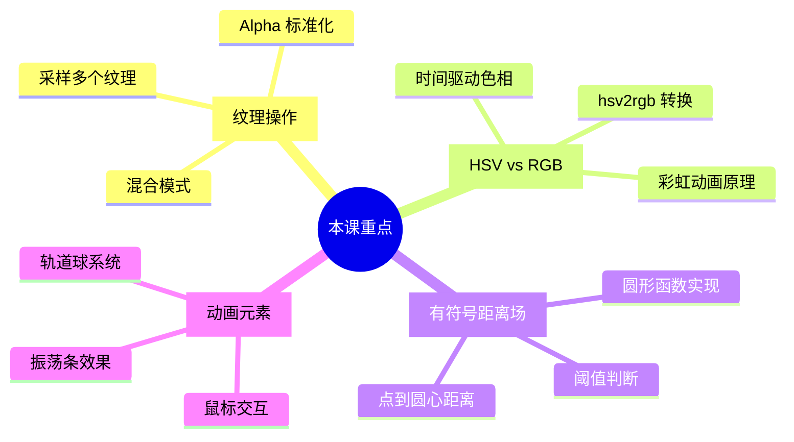

# Class 2: 场景预处理——prepscene.frag

**课时**: 第 2 课 / 共 11 课  
**预计时间**: 3-4 小时  
**难度**: ⭐⭐⭐☆☆ (初级进阶)  

---

## 🎯 本课目标

学完本课程后，你将能够：
- ✅ 理解场景预处理的完整流程
- ✅ 掌握纹理采样和混合技术
- ✅ 实现 SDF 圆形函数绘制
- ✅ 创建 HSV 颜色空间的动画效果
- ✅ 添加交互式鼠标光效

---

## 📚 第一部分：prepscene.frag 概览（20 分钟）

### 1.1 Shader 在整个管线中的位置



**prepscene.frag 的作用**:
```
这是整个管线的"舞台搭建者"：
1. 合并 occlusion（障碍物）和 emission（光源）
2. 添加动态元素（移动的球体、鼠标交互）
3. 应用颜色动画（彩虹效果）
4. 输出完整的场景描述给后续处理
```

### 1.2 输入输出总览



---

## 💻 第二部分：核心算法详解（90 分钟）

### 2.1 纹理采样与 Alpha 标准化

#### 代码解析

```glsl
void main() {
  vec2 resolution = textureSize(uOcclusionMap, 0);
  vec2 fragCoord = gl_FragCoord.xy / resolution;
  
  // 采样两个输入纹理
  vec4 o = texture(uOcclusionMap, fragCoord);  // 障碍物
  vec4 e = texture(uEmissionMap, fragCoord);   // 光源
  
  // Alpha 标准化：重新解释像素含义
  if (o == vec4(1.0))
    o = vec4(0.0);           // 白色 → 完全透明（无遮挡）
  else
    o = vec4(0.0, 0.0, 0.0, 1.0);  // 其他 → 完全不透明（有遮挡）
  
  // ... 继续处理
}
```

#### 可视化理解



**为什么要这样做？**
```
原始图像：
- 白色 (1,1,1,1) = 空区域
- 黑色 (0,0,0,1) = 障碍物

转换后：
- Alpha = 0 = 空区域（可穿透）
- Alpha = 1 = 障碍物（实心）

这样设计是为了后续 JFA 算法的处理方便！
```

### 2.2 HSV↔RGB 颜色空间转换

#### 为什么需要转换？



**直观对比**:
```
RGB 思维："我要让红色更鲜艳一点"
→ 增加 R 分量，减少 G 和 B？
→ 不直观！

HSV 思维："我要让红色更鲜艳一点"
→ 增加 Saturation（饱和度）！
→ 直观！

HSV 思维："我要做彩虹动画"
→ Hue（色相）从 0 变到 1！
→ 简单！
```

#### 转换函数详解

```glsl
// RGB 转 HSV
vec3 rgb2hsv(vec3 c) {
    vec4 K = vec4(0.0, -1.0 / 3.0, 2.0 / 3.0, -1.0);
    vec4 p = mix(vec4(c.bg, K.wz), vec4(c.gb, K.xy), 
                 step(c.b, c.g));
    vec4 q = mix(vec4(p.xyw, c.r), vec4(c.r, p.yzx), 
                 step(p.x, c.r));
    
    float d = q.x - min(q.w, q.y);
    float e = 1.0e-10;
    return vec3(abs(q.z + (q.w - q.y) / (6.0 * d + e)), 
                d / (q.x + e), q.x);
}

// HSV 转 RGB（更常用）
vec3 hsv2rgb(vec3 c) {
    vec4 K = vec4(1.0, 2.0 / 3.0, 1.0 / 3.0, 3.0);
    vec3 p = abs(fract(c.xxx + K.xyz) * 6.0 - K.www);
    return c.z * mix(K.xxx, clamp(p - K.xxx, 0.0, 1.0), c.y);
}
```

#### 彩虹动画实现

```glsl
// 在 prepscene.frag 中
vec3 ehsv = rgb2hsv(e.rgb);  // 先转到 HSV

if (uRainbow == 1 && e != vec4(0.0)) {
  // 关键：在 H 通道加上时间
  float animatedHue = ehsv.r + uTime / 8.0;
  e.rgb = hsv2rgb(vec3(animatedHue, 1.0, 1.0));
}
```

**效果演示**:
```
时间 t=0.0:  红色 (H=0.0)
       ↓
时间 t=2.0:  黄色 (H=0.25)
       ↓
时间 t=4.0:  绿色 (H=0.5)
       ↓
时间 t=6.0:  蓝色 (H=0.75)
       ↓
时间 t=8.0:  回到红色 (H=1.0 ≡ 0.0)
```

### 2.3 SDF 圆形函数

#### Signed Distance Field 原理



#### 代码实现

```glsl
bool sdfCircle(vec2 center, float radius) {
  // 计算当前片段到圆心的欧几里得距离
  float distance = length(gl_FragCoord.xy - center);
  
  // 判断是否在圆内
  return distance < radius;
}

// 简化写法（数学等价）
bool sdfCircle(vec2 pos, float r) {
  return distance(gl_FragCoord.xy, pos) < r;
}
```

#### 几何意义

```
假设：
- 圆心在 (100, 100)
- 半径 = 20
- 当前片段在 (110, 105)

计算：
distance = √[(110-100)² + (105-100)²]
         = √[100 + 25]
         = √125 ≈ 11.18

因为 11.18 < 20，所以这个点在圆内！
```

### 2.4 鼠标光效实现

```glsl
// 在 main 函数中添加
if (uMouseLight == 1) {
  // 以鼠标位置为圆心画一个圆
  if (sdfCircle(uMousePos, uBrushSize * 64)) {
    fragColor = uBrushColor;  // 设置画笔颜色
  }
}
```

**参数说明**:
```
uMousePos:    鼠标在屏幕上的像素坐标
uBrushSize:   归一化的大小 (0.0 - 1.0)
乘以 64:      转换为实际像素半径

例如：
- uBrushSize = 0.5 → 半径 = 32 像素
- uBrushSize = 0.25 → 半径 = 16 像素
```

---

## 🎨 第三部分：动态元素（60 分钟）

### 3.1 轨道球系统

#### 6 个彩球的运动轨迹

```glsl
if (uOrbs == 1) {
  for (int i = 0; i < 6; i++) {
    // 计算第 i 个球的位置
    vec2 p = (vec2(cos(uTime/ORB_SPEED + i), 
                   sin(uTime/ORB_SPEED + i)) 
              * resolution.y/2 + 1) / 2 + CENTRE;
    
    // 画圆
    if (sdfCircle(p, resolution.x/80))
      fragColor = vec4(hsv2rgb(vec3(i/6.0, 1.0, 1.0)), 1.0);
  }
}
```

#### 运动分解图解



**数学原理**:
```
标准圆周运动公式:
x(t) = R × cos(ωt + φ)
y(t) = R × sin(ωt + φ)

其中:
- R = 半径 (resolution.y/2)
- ω = 角速度 (1/ORB_SPEED)
- φ = 初始相位 (i, 每个球不同)
- t = 时间 (uTime)

结果：6 个球均匀分布在圆周上！
```

#### 完整示例：单个球的运动

```
时刻 t=0:
球 0: angle = 0 + 0 = 0 rad      → 位置：(R, 0)     → 最右边
球 1: angle = 0 + 1 = 1 rad      → 位置：(R×cos1, R×sin1)

时刻 t=π/2 (约 1.57 秒后):
球 0: angle = π/2 + 0 = π/2      → 位置：(0, R)     → 最上边
球 1: angle = π/2 + 1            → 新位置...

每个球都在圆周上匀速运动，但起始位置不同！
```

### 3.2 振荡条效果

#### 水平振荡条

```glsl
vec2 p = vec2(cos(uTime/ORB_SPEED*4) * resolution.x/4, 0) + CENTRE;
if (sdfCircle(p, ORB_SIZE))
  fragColor = vec4(vec3(sin(uTime) + 1 / 2), 1.0);
```

#### 垂直振荡条

```glsl
p = vec2(0, sin(uTime/ORB_SPEED*4) * resolution.x/4) + CENTRE;
if (sdfCircle(p, ORB_SIZE))
  fragColor = vec4(vec3(cos(uTime) + 1 / 2), 1.0);
```

#### 运动可视化



**视觉效果**:
```
帧 1 (t=0):
     ─────●─────  水平条在中间
     │          │
     ●          │  垂直条在底部
     │          │

帧 2 (t=π/4):
       ────●────  水平条向右上移
     │    │     │
     │    ●     │  垂直条向上移
     │          │

帧 3 (t=π/2):
     ─────●─────  水平条到最右
     │          │
     │          │
     │          │
     └────●─────┘  垂直条到顶部
```

---

## 🔧 第四部分：动手实验（45 分钟）

### 实验 1: 修改彩虹速度

**目标**: 让彩虹动画更快或更慢

```glsl
// 原始代码（慢速）
e = vec4(hsv2rgb(vec3(ehsv.r + uTime/8, 1.0, 1.0)), 1.0);

// 尝试改为快速（变化快 4 倍）
e = vec4(hsv2rgb(vec3(ehsv.r + uTime/2, 1.0, 1.0)), 1.0);

// 或者超慢速（变化慢 2 倍）
e = vec4(hsv2rgb(vec3(ehsv.r + uTime/16, 1.0, 1.0)), 1.0);
```

**观察要点**:
- 除以的数字越小，变化越快
- 除以的数字越大，变化越慢

### 实验 2: 添加更多轨道球

**挑战**: 将 6 个球增加到 12 个球

提示：
```glsl
// 修改循环次数
for (int i = 0; i < 12; i++) {  // 原来是 6
  // 调整颜色映射
  float hue = i / 12.0;  // 原来是 i/6.0
  fragColor = vec4(hsv2rgb(vec3(hue, 1.0, 1.0)), 1.0);
}
```

### 实验 3: 改变球的运动方向

**挑战**: 让球逆时针旋转

提示：
```glsl
// 原始（顺时针）
vec2(cos(uTime/ORB_SPEED + i), sin(uTime/ORB_SPEED + i))

// 修改为逆时针
vec2(cos(-uTime/ORB_SPEED + i), sin(-uTime/ORB_SPEED + i))
// 或者
vec2(cos(uTime/ORB_SPEED - i), -sin(uTime/ORB_SPEED - i))
```

---

## 🐛 第五部分：常见问题与调试（30 分钟）

### 问题 1: 纹理采样不对怎么办？

**症状**: 图像上下颠倒或左右翻转

**解决**:
```glsl
// Raylib 的纹理坐标可能需要翻转
vec2 fragCoord = gl_FragCoord.xy / textureSize(uSceneMap, 0);
fragCoord.y = 1.0 - fragCoord.y;  // 翻转 Y 轴
```

### 问题 2: 圆形显示不完整？

**检查清单**:
1. ✅ 确认 `uBrushSize` 值合理（0.1-0.5 之间）
2. ✅ 确认乘法因子（64）是否正确
3. ✅ 检查 SDF 函数的 `distance` 计算

**调试技巧**:
```glsl
// 临时输出距离值来可视化
float dist = distance(gl_FragCoord.xy, uMousePos);
fragColor = vec4(vec3(dist / 100.0), 1.0);  // 灰度显示距离
```

### 问题 3: 彩虹动画不流畅？

**可能原因**:
- `uTime` 更新频率不够
- HSV→RGB 转换有 bug

**调试方法**:
```glsl
// 直接输出 HSV 值查看
vec3 hsv = vec3(fmod(uTime/8, 1.0), 1.0, 1.0);
fragColor = vec4(hsv, 1.0);  // 应该看到 RGB 渐变
```

---

## 📝 课后练习

### 练习 1: 基础题

修改 prepscene.frag，实现以下功能：

1. **改变画笔颜色**: 不使用 uniform，而是固定为青色 (0, 1, 1)
2. **增大轨道球半径**: 让球的运动范围更大
3. **加速彩虹动画**: 让颜色变化快 2 倍

参考答案:
```glsl
// 1. 固定青色
if (uMouseLight == 1 && sdfCircle(uMousePos, uBrushSize*64))
  fragColor = vec4(0.0, 1.0, 1.0, 1.0);  // 青色

// 2. 增大半径
* resolution.y/1.5  // 原来是 /2

// 3. 加速彩虹
ehsv.r + uTime/4  // 原来是 /8
```

### 练习 2: 创意题

**任务**: 添加一个新的动态元素——脉动的中心圆

要求:
- 在屏幕中心画一个大圆
- 圆的半径随时间脉动（使用 sin 函数）
- 颜色使用渐变的彩虹色

提示:
```glsl
float pulseRadius = 50.0 + 20.0 * sin(uTime * 3.0);
vec2 centerPos = resolution / 2.0;
if (sdfCircle(centerPos, pulseRadius)) {
  vec3 rainbow = hsv2rgb(vec3(fmod(uTime/4, 1.0), 1.0, 1.0));
  fragColor = vec4(rainbow, 1.0);
}
```

---

## 🎓 知识检查

### 小测验

1. **Alpha 标准化的目的是什么？**
   - 为了压缩纹理内存
   - 为了统一数据表示，方便后续处理 ✓
   - 为了提高渲染速度
   - 为了美观

2. **HSV 中哪个分量控制颜色种类？**
   - Saturation（饱和度）
   - Value（明度）
   - Hue（色相）✓
   - Alpha（透明度）

3. **SDF 圆形函数中，如果距离等于半径，返回什么？**
   - true
   - false ✓ (因为是 `<` 而不是 `<=`)
   - 取决于实现
   - 抛出异常

---

## 📚 延伸阅读

### 推荐资源

1. **[Inigo Quilez 的 SDF 文章](https://iquilezles.org/articles/distfunctions/)** - 各种形状的 SDF 函数
2. **[Understanding Color Models](https://www.smashingmagazine.com/2010/02/color-theory-for-designers-part-1-the-meaning-of-color/)** - 深入理解 HSV/RGB
3. **参考文档**: `./res/doc/prepscene_frag.md` - 详细的流程图和技术细节

### 下节课预告

**Class 3: 距离场种子编码——prepjfa.frag**

你将学习:
- 🎯 如何将 UV 坐标编码到 RG 通道
- 📊 理解种子点的标记策略
- 🔄 为 JFA 算法做准备
- 🔍 Alpha 通道的巧妙用法

---

## 💡 关键要点总结



---

**太棒了！你已经完成了第二课！** 🎨

你现在已经掌握了实时图形学中最重要的几个概念：纹理处理、颜色空间和 SDF。这些都是现代游戏和特效的基础！

**下一步**: 准备好了吗？打开 [`class3_jfa_seed_encoding.md`](./class3_jfa_seed_encoding.md) 开始第三课，学习如何为 JFA 算法准备数据！
