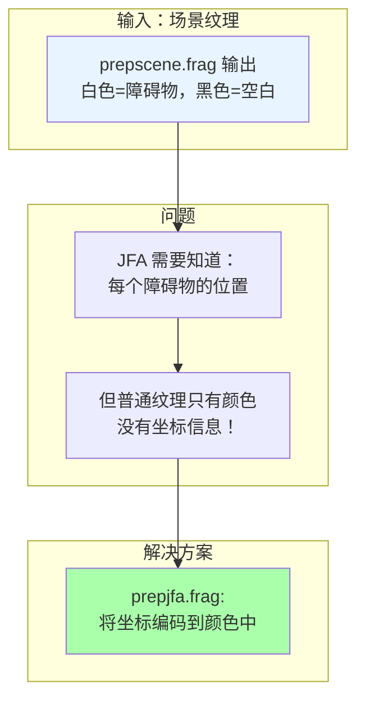
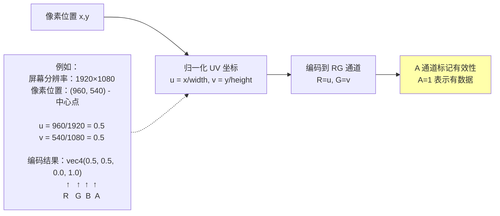
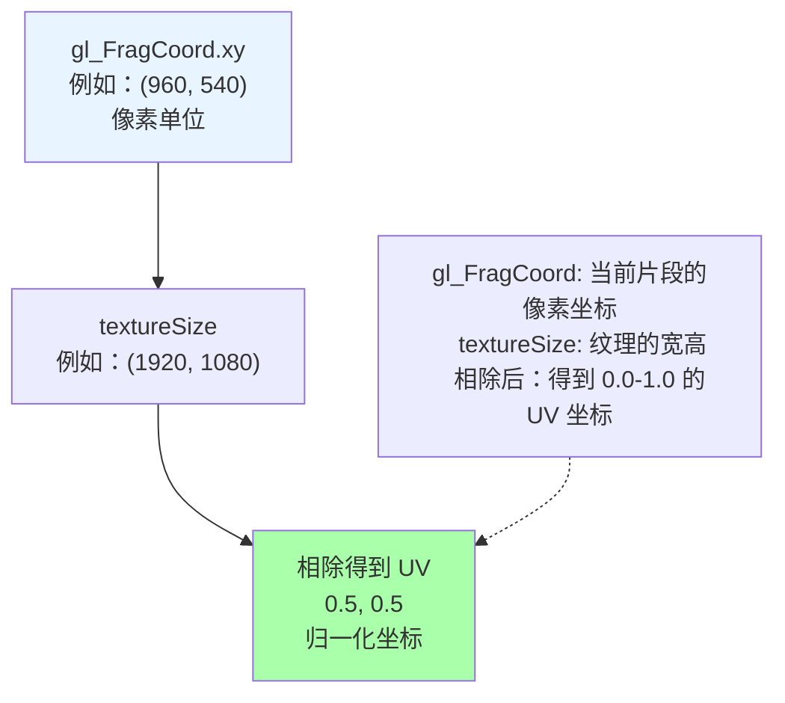
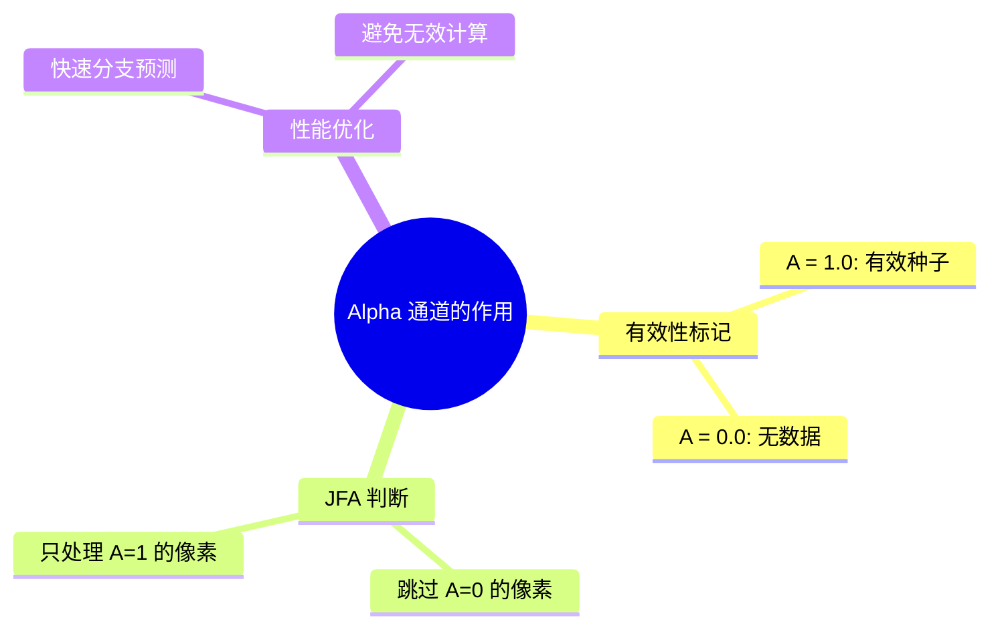
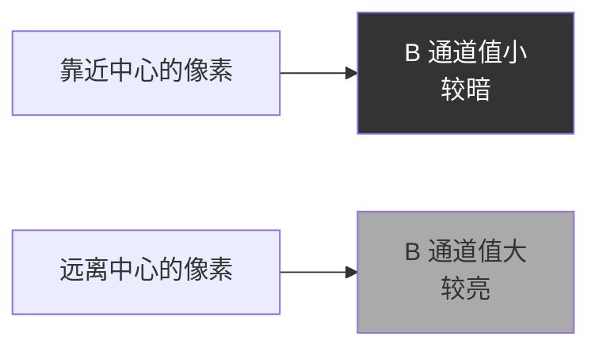
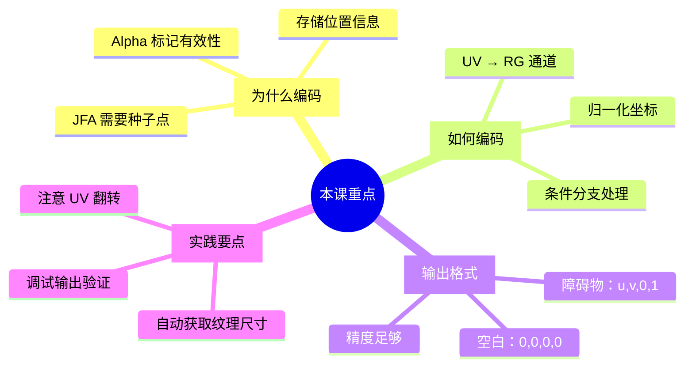

# Class 3: JFA 种子编码——prepjfa.frag

**课时**: 第 3 课 / 共 11 课  
**预计时间**: 2-3 小时  
**难度**: ⭐⭐⭐☆☆ (初级进阶)  

---

## 🎯 本课目标

学完本课程后，你将能够：
- ✅ 理解 JFA 算法的预处理步骤
- ✅ 掌握 UV 坐标编码到 RG 通道的技术
- ✅ 理解种子点的标记策略
- ✅ 为后续 JFA 传播算法做好准备

---

## 📚 第一部分：为什么需要 prepjfa.frag？（20 分钟）

### 1.1 JFA 算法的前置条件



**核心问题**:
```
JFA 算法需要回答："这个像素离最近的障碍物有多远？"

为了回答这个问题，我们需要：
1. 知道障碍物在哪里（种子点）
2. 从种子点向外传播信息

但是普通的纹理只能存储颜色值 (R,G,B,A)
如何存储"位置"信息呢？
```

### 1.2 编码的巧妙思路



---

## 💻 第二部分：代码详解（60 分钟）

### 2.1 完整的 prepjfa.frag 代码

```glsl
#version 330 core

out vec4 fragColor;

uniform sampler2D uSceneMap;

/*
 * 这个 shader 为 jump-flood 算法准备画布纹理
 * 它做的很简单：
 * 1. 白色像素（障碍物）→ 编码 UV 坐标到 RG 通道
 * 2. 黑色像素（空白）→ 保持 vec4(0.0)
 */

void main() {
  // 计算归一化的纹理坐标
  vec2 fragCoord = gl_FragCoord.xy / textureSize(uSceneMap, 0);
  
  // 采样场景纹理
  vec4 mask = texture(uSceneMap, fragCoord);
  
  // 关键判断：如果是障碍物（alpha == 1.0）
  if (mask.a == 1.0)
    // 编码 UV 坐标到 RG 通道
    mask = vec4(fragCoord, 0.0, 1.0);
  
  // 输出：
  // - 障碍物：vec4(u, v, 0.0, 1.0)
  // - 空白：vec4(0.0, 0.0, 0.0, 0.0)
  fragColor = mask;
}
```

### 2.2 逐行解析

#### Step 1: 计算纹理坐标

```glsl
vec2 fragCoord = gl_FragCoord.xy / textureSize(uSceneMap, 0);
```

**图解**:


**为什么要归一化？**
```
原因 1: 与分辨率无关
- 无论纹理是 1920×1080 还是 800×600
- UV 坐标都是 0.0-1.0
- 方便后续计算

原因 2: 节省存储空间
- 0.0-1.0 的范围可以完美存储在 float 中
- 不会丢失精度
```

#### Step 2: 采样纹理

```glsl
vec4 mask = texture(uSceneMap, fragCoord);
```

**回顾 prepscene.frag 的输出**:
```
prepscene.frag 处理后:
- 障碍物：vec4(0, 0, 0, 1)  alpha = 1.0
- 空白：  vec4(0, 0, 0, 0)  alpha = 0.0

这里我们读取这个值来判断是否是障碍物
```

#### Step 3: 编码逻辑

```glsl
if (mask.a == 1.0)
  mask = vec4(fragCoord, 0.0, 1.0);
```

**决策树**:
```mermaid
flowchart TD
    A[读取 mask.alpha] --> B{alpha == 1.0?}
    B -->|是，障碍物 | C[编码 UV 到 RG<br/>vec4(u, v, 0.0, 1.0)]
    B -->|否，空白 | D[保持不变<br/>vec4(0.0, 0.0, 0.0, 0.0)]
    
    style C fill:#ffffaa
    style D fill:#cccccc
```

**编码前后对比**:

| 类型 | 编码前 | 编码后 |
|------|--------|--------|
| **障碍物** | `(0, 0, 0, 1)` | `(u, v, 0, 1)` |
| **空白** | `(0, 0, 0, 0)` | `(0, 0, 0, 0)` |

---

## 🔍 第三部分：深入理解（40 分钟）

### 3.1 数据可视化

#### 编码前的场景纹理

```
场景示例（5×5 简化）:
┌─────────┐
│ ███·· │  █ = 障碍物 (0,0,0,1)
│ █···█ │  · = 空白 (0,0,0,0)
│ █···█ │
│ █···█ │
│ ███·· │
└─────────┘
```

#### 编码后的种子纹理

```
prepjfa.frag 处理后:
┌───────────────────────┐
│ ✦✦✦·· │  ✦ = 编码的 UV (u,v,0,1)
│ ✦···✦ │  · = 空白 (0,0,0,0)
│ ✦···✦ │
│ ✦···✦ │
│ ✦✦✦·· │
└───────────────────────┘

每个 ✦ 包含自己的 UV 坐标:
- 左上角 ✦: (0.0, 0.0, 0.0, 1.0)
- 中心 ✦:   (0.5, 0.5, 0.0, 1.0)
- 右下角 ✦: (0.8, 0.8, 0.0, 1.0)
```

### 3.2 Alpha 通道的巧妙用法



**为什么不用 RGB 而用 Alpha？**
```
原因:
1. Alpha 天然适合表示"存在性"
2. 在 JFA 中可以快速判断:
   if (sample.a == 0) continue;  // 跳过空白
   
3. 保留 RGB 通道存储其他信息:
   - RG: UV 坐标
   - B: 留空（后续使用）
   - A: 有效性标志
```

### 3.3 实际例子演示

假设我们有一个 8×8 的纹理：

```
原始场景（8×8）:
y
7 ████████
6 █······█
5 █······█
4 █······█
3 █······█
2 █······█
1 █······█
0 ████████
  01234567 x

经过 prepjfa.frag 后:

角落的像素 (0, 0):
  UV = (0/8, 0/8) = (0.0, 0.0)
  输出：vec4(0.0, 0.0, 0.0, 1.0)

中心的像素 (4, 4):
  UV = (4/8, 4/8) = (0.5, 0.5)
  输出：vec4(0.5, 0.5, 0.0, 1.0)

空白区域 (2, 2):
  不是障碍物，保持 vec4(0.0, 0.0, 0.0, 0.0)
```

---

## 🛠 第四部分：动手实验（30 分钟）

### 实验 1: 修改编码内容

**目标**: 尝试编码不同的信息

#### 方案 A: 同时编码到 RGB

```glsl
if (mask.a == 1.0) {
  // R = U, G = V, B = 0.5 (固定值)
  mask = vec4(fragCoord, 0.5, 1.0);
}
```

**预期效果**: 
- B 通道显示灰色（0.5）
- 可以用来验证编码是否正确

#### 方案 B: 添加调试信息

```glsl
if (mask.a == 1.0) {
  // 在 B 通道存储到中心的距离
  vec2 center = vec2(0.5, 0.5);
  float distToCenter = length(fragCoord - center);
  mask = vec4(fragCoord, distToCenter, 1.0);
}
```

**可视化效果**:


### 实验 2: 条件分支测试

**挑战**: 只对特定区域的障碍物编码

```glsl
if (mask.a == 1.0) {
  // 只编码上半部分的障碍物
  if (fragCoord.y > 0.5) {
    mask = vec4(fragCoord, 0.0, 1.0);
  } else {
    // 下半部分保持空白
    mask = vec4(0.0);
  }
}
```

**预期效果**: 
- 只有上半部分的障碍物被编码
- 下半部分变成空白

### 实验 3: 多纹理混合

**高级挑战**: 结合两个不同的场景

```glsl
uniform sampler2D uSceneMap2;  // 第二个场景

void main() {
  vec2 fragCoord = gl_FragCoord.xy / textureSize(uSceneMap, 0);
  
  vec4 mask1 = texture(uSceneMap, fragCoord);
  vec4 mask2 = texture(uSceneMap2, fragCoord);
  
  // 如果任一场景有障碍物，就编码
  if (mask1.a == 1.0 || mask2.a == 1.0) {
    mask = vec4(fragCoord, 0.0, 1.0);
  } else {
    mask = vec4(0.0);
  }
  
  fragColor = mask;
}
```

---

## 🐛 第五部分：常见问题（20 分钟）

### Q1: 为什么我的输出全是黑色？

**可能原因**:
1. ❌ `uSceneMap` 纹理没有正确绑定
2. ❌ prepscene.frag 的输出没有正确传递
3. ❌ UV 坐标计算错误

**调试方法**:
```glsl
// 临时输出红色，验证 shader 在执行
void main() {
  fragColor = vec4(1.0, 0.0, 0.0, 1.0);  // 应该全红
}

// 如果全红，说明 shader 在工作
// 然后逐步恢复代码...
```

### Q2: UV 坐标上下颠倒了怎么办？

**解决方案**:
```glsl
// Raylib 的纹理坐标可能需要翻转
vec2 fragCoord = gl_FragCoord.xy / textureSize(uSceneMap, 0);
fragCoord.y = 1.0 - fragCoord.y;  // 翻转 Y 轴

// 或者在加载纹理时设置参数
SetTextureFilter(texture, TEXTURE_FILTER_BILINEAR);
```

### Q3: 编码精度够吗？

**答案**: 完全够用！

```
GLSL 的 float 是 32 位单精度:
- 范围：0.0 - 1.0
- 精度：约 7 位有效数字

对于 1920×1080 的屏幕:
- U 通道：可以区分 1920 个不同的 x 坐标 ✓
- G 通道：可以区分 1080 个不同的 y 坐标 ✓

实际测试:
即使对于 4K 屏幕 (3840×2160)
float 的精度也完全足够！
```

---

## 📝 课后练习

### 练习 1: 基础题

**任务**: 修改 prepjfa.frag，在 B 通道存储障碍物的 ID

要求:
- 根据 UV 坐标给每个障碍物分配唯一 ID
- ID 范围：0.0 - 1.0
- 提示：可以使用 `fract()` 函数

参考答案:
```glsl
void main() {
  vec2 fragCoord = gl_FragCoord.xy / textureSize(uSceneMap, 0);
  vec4 mask = texture(uSceneMap, fragCoord);
  
  if (mask.a == 1.0) {
    // 用 UV 坐标生成伪随机 ID
    float id = fract(fragCoord.x * 10.0 + fragCoord.y * 7.0);
    mask = vec4(fragCoord, id, 1.0);
  } else {
    mask = vec4(0.0);
  }
  
  fragColor = mask;
}
```

### 练习 2: 创意题

**任务**: 创建一个"渐变编码"版本

要求:
- 障碍物的 RG 仍然存储 UV 坐标
- B 通道存储到屏幕中心的距离
- 可视化查看距离分布

提示:
```glsl
vec2 center = vec2(0.5, 0.5);
float distance = length(fragCoord - center);
// distance 范围：0.0 (中心) - 0.707 (角落)
// 可以归一化到 0.0-1.0
distance = distance / 0.707;
```

### 练习 3: 思考题

**问题**: 
1. 为什么要用 `textureSize(uSceneMap, 0)` 而不是 hardcode 分辨率？
2. 如果纹理尺寸是 2 的幂次方（如 512×512），有什么好处？
3. Alpha 通道除了标记有效性，还能用来做什么？

---

## 🎓 知识检查

### 小测验

1. **prepjfa.frag 的主要作用是？**
   - A) 绘制场景
   - B) 为 JFA 编码种子点 ✓
   - C) 计算距离场
   - D) 渲染最终图像

2. **UV 坐标存储在哪些通道？**
   - A) R 和 G ✓
   - B) G 和 B
   - C) B 和 A
   - D) R 和 A

3. **空白区域的输出是？**
   - A) vec4(1.0)
   - B) vec4(0.5, 0.5, 0.0, 1.0)
   - C) vec4(0.0) ✓
   - D) vec4(fragCoord, 0.0, 1.0)

4. **如果有障碍物，alpha 通道的值是？**
   - A) 0.0
   - B) 0.5
   - C) 1.0 ✓
   - D) 取决于亮度

---

## 📚 延伸阅读

### 推荐资源

1. **[Jump Flood Algorithm 详解](https://gamedev.net/blog/855/entry-22610-jump-flood-algorithm/)** - JFA 原理
2. **参考文档**: `./res/doc/prepjfa_frag.md` - 详细流程图
3. **[GPU Texture Compression](https://developer.nvidia.com/gpugems/gpugems/part-i-natural-effects/chapter-20-gpu-based-texture-compression)** - 纹理编码技术

### 下节课预告

**Class 4: JFA 传播算法——jfa.frag**

你将学习:
- 🌊 JFA 的多 pass 传播过程
- 📏 8 邻域采样技术
- 🔄 跳跃式前进策略
- 📊 O(log n) 复杂度分析

---

## 💡 关键要点总结



---

**恭喜完成第三课！** 🎉

你现在掌握了 JFA 算法的关键前置步骤！下一课我们将进入最核心的 JFA 传播算法，这是整个距离场生成的魔法所在。

**下一步**: 准备好了吗？打开 [`class4_jfa_propagation.md`](./class4_jfa_propagation.md) 开始第四课的学习！
