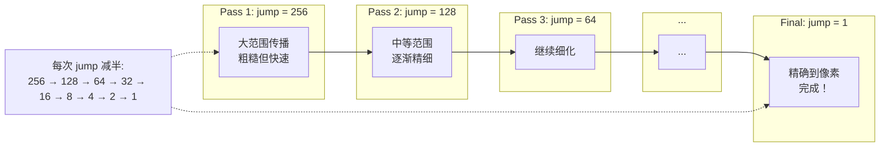
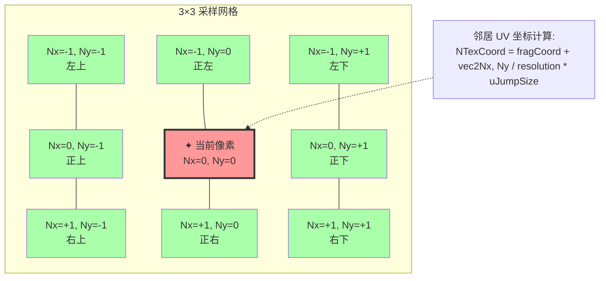
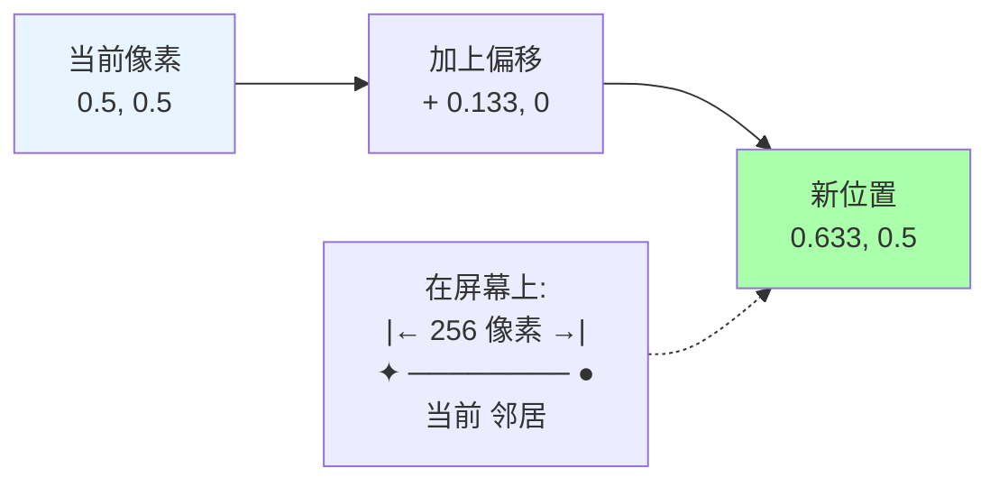
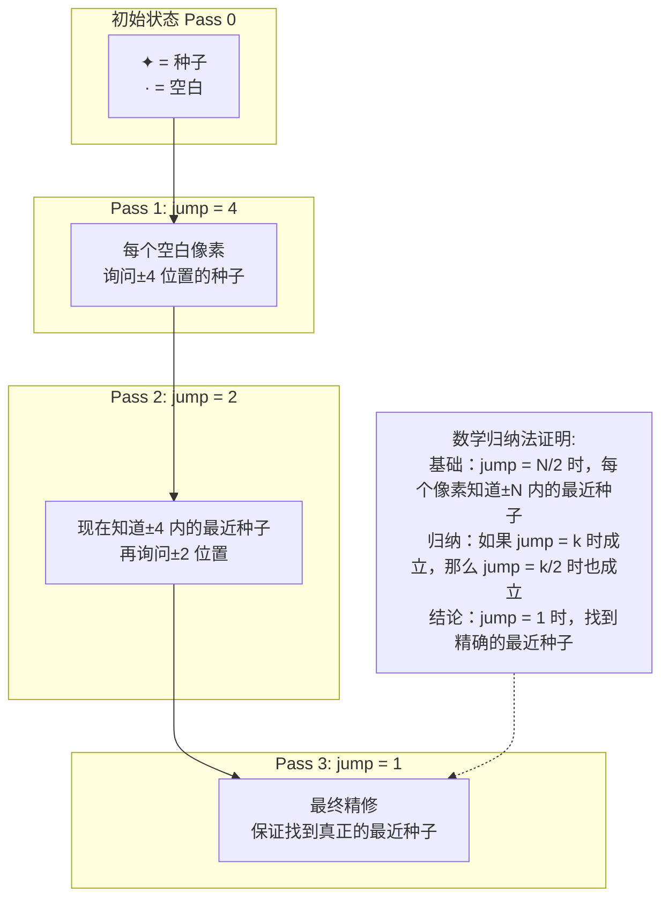
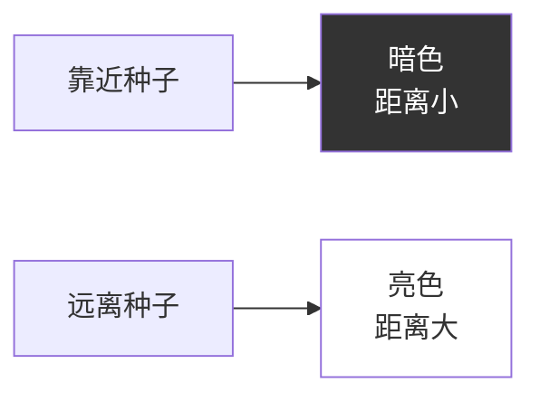
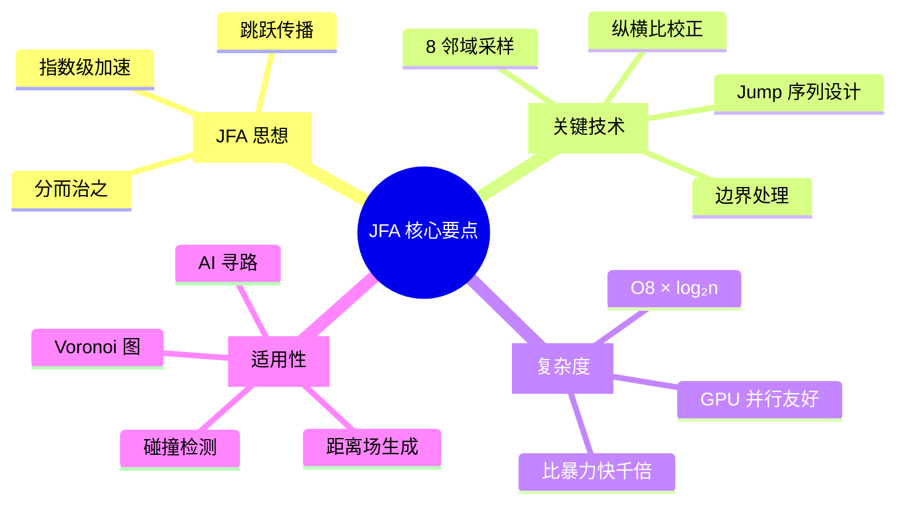

# Class 4: JFA 传播算法——jfa.frag

**课时**: 第 4 课 / 共 11 课  
**预计时间**: 4-5 小时  
**难度**: ⭐⭐⭐⭐☆ (核心难点)  

---

## 🎯 本课目标

学完本课程后，你将能够：
- ✅ 理解 Jump-Flood Algorithm 的核心原理
- ✅ 掌握 8 邻域采样技术
- ✅ 实现多 pass 跳跃式传播
- ✅ 分析 O(log n) 复杂度优势

---

## 📚 第一部分：JFA 算法概览（30 分钟）

### 4.1 什么是 Jump-Flood Algorithm？

```mermaid
flowchart TB
    subgraph "问题"
        A[需要计算每个像素<br/>到最近障碍物的距离]
        B[暴力方法:<br/>检查所有障碍物<br/>O(n²) 太慢！]
    end
    
    subgraph "JFA 解决方案"
        C[跳跃式传播<br/>log₂n 次 pass]
        D[每次检查 8 个邻居<br/>常数复杂度]
    end
    
    subgraph "结果"
        E[总复杂度:<br/>O8 × log₂n]
        F[比暴力快<br/>几个数量级！]
    end
    
    A --> B --> C --> D --> E --> F
    
    style B fill:#ffaaaa
    style F fill:#aaffaa
```

**直观比喻**:
```
想象你在操场上，要找到离你最近的小卖部：

暴力方法:
- 跑遍整个操场，测量到每个小卖部的距离
- 累死！O(n²)

JFA 方法:
- 第一轮：问周围 8 个方向 64 米远的同学
- 第二轮：问周围 8 个方向 32 米远的同学
- 第三轮：问 16 米远的...
- ...
- 最后一轮：问 1 米远的同学
- 轻松找到最近的！O(log n)
```

### 4.2 JFA 的多 Pass 流程



**典型配置**:
```
假设屏幕分辨率：1920×1080
最大边长：1920 ≈ 2^11

需要的 pass 数:
Pass 1: jump = 512  (覆盖 1024 像素)
Pass 2: jump = 256
Pass 3: jump = 128
Pass 4: jump = 64
Pass 5: jump = 32
Pass 6: jump = 16
Pass 7: jump = 8
Pass 8: jump = 4
Pass 9: jump = 2
Pass 10: jump = 1   (最终精修)

总共 10 次 pass，每次处理 1920×1080 = 200 万像素
总操作数：10 × 200 万 × 8 邻域 = 1.6 亿次
相比暴力法：(200 万)² = 4 万亿次

速度提升：2500 倍！🚀
```

---

## 💻 第二部分：代码详解（90 分钟）

### 4.1 完整的 jfa.frag 代码

```glsl
#version 330 core

out vec4 fragColor;

uniform sampler2D uCanvas;      // 种子纹理（来自 prepjfa.frag）
uniform int uJumpSize;          // 当前 pass 的跳跃大小

/* 
 * Jump-Flood Algorithm 核心实现
 * 对于每个像素，检查周围 8 个邻居，找到最近的种子
 */

void main() {
  // 归一化坐标
  vec2 resolution = textureSize(uCanvas, 0);
  vec2 fragCoord = gl_FragCoord.xy / resolution;
  
  float closest = 1.0;  // 初始化最近距离为最大值
  
  // 遍历 3×3 的邻域（共 8 个邻居 + 自己）
  for (int Nx = -1; Nx <= 1; Nx++) {
    for (int Ny = -1; Ny <= 1; Ny++) {
      // 计算邻居的 UV 坐标
      vec2 NTexCoord = fragCoord + (vec2(Nx, Ny) / resolution) * uJumpSize;
      
      // 采样邻居
      vec4 Nsample = texture(uCanvas, NTexCoord);
      
      // 跳过无效像素（超出边界或没有种子数据）
      if (NTexCoord != clamp(NTexCoord, 0.0, 1.0)) continue;
      if (Nsample.a == 0) continue;
      
      // 计算到这个种子的实际距离
      float d = length((Nsample.rg - fragCoord) * 
                       vec2(resolution.x/resolution.y, 1.0));
      
      // 如果更近，更新结果
      if (d < closest) {
        closest = d;
        fragColor = vec4(Nsample.rg, d, 1.0);
      }
    }
  }
}
```

### 4.2 关键步骤图解

#### Step 1: 8 邻域采样模式



**循环展开示例**:
```glsl
// 双重循环等价于访问这些位置：
for (int Nx = -1; Nx <= 1; Nx++) {
  for (int Ny = -1; Ny <= 1; Ny++) {
    // 访问顺序:
    // (-1,-1), (0,-1), (+1,-1)  ← 第一行
    // (-1, 0), (0, 0), (+1, 0)  ← 第二行
    // (-1,+1), (0,+1), (+1,+1)  ← 第三行
  }
}
```

#### Step 2: 跳跃计算

```glsl
vec2 NTexCoord = fragCoord + (vec2(Nx, Ny) / resolution) * uJumpSize;
```

**数学原理**:
```
假设:
- 当前像素：fragCoord = (0.5, 0.5)  // 屏幕中心
- 分辨率：1920×1080
- 方向：Nx=1, Ny=0  // 向右
- 跳跃大小：uJumpSize = 256

计算:
offset = vec2(1, 0) / vec2(1920, 1080) * 256
       = vec2(1/1920, 0) * 256
       = vec2(0.133, 0)

NTexCoord = (0.5, 0.5) + (0.133, 0)
          = (0.633, 0.5)

相当于向右移动了 256 个像素！
```

**可视化**:


#### Step 3: 边界检查

```glsl
if (NTexCoord != clamp(NTexCoord, 0.0, 1.0)) continue;
```

**为什么需要检查？**
```
场景：当前像素在屏幕边缘
例如：fragCoord = (0.0, 0.5)  // 最左边

如果要检查左边的邻居 (Nx = -1):
NTexCoord = (0.0, 0.5) + (-1/1920, 0) * 256
          = (-0.133, 0.5)  // ❌ 超出边界！

clamp 函数会将其限制在 [0.0, 1.0]:
clamped = (-0.133, 0.5)  // 保持不变，因为已经超出

比较:
(-0.133, 0.5) != (-0.133, 0.5)  // 相等！

等等，这个判断有问题...
```

**正确的理解**:
```glsl
// clamp 会将值限制在范围内
vec2 clamped = clamp(NTexCoord, 0.0, 1.0);

// 如果原始值超出范围，clamped 会不同
if (NTexCoord.x < 0.0 || NTexCoord.x > 1.0 ||
    NTexCoord.y < 0.0 || NTexCoord.y > 1.0) {
  continue;  // 跳过这个邻居
}

// 或者用向量比较（更高效）
if (any(notEqual(NTexCoord, clamped))) {
  continue;
}
```

#### Step 4: 距离计算（含纵横比校正）

```glsl
float d = length((Nsample.rg - fragCoord) * 
                 vec2(resolution.x/resolution.y, 1.0));
```

**为什么需要纵横比校正？**

```mermaid
quadrantChart
    title "像素形状的影响"
    x-axis "X 方向失真" --> "X 方向正确"
    y-axis "Y 方向失真" --> "Y 方向正确"
    quadrant-1 "理想情况 ✓"
    quadrant-2 "X 拉伸"
    quadrant-3 "都失真"
    quadrant-4 "Y 压缩"
    
    "正方形纹理": [0.9, 0.9]
    "宽屏 16:9": [0.3, 0.8]
    "竖屏 9:16": [0.8, 0.3]
    
    note["宽屏显示器:<br/>X 方向像素更多<br/>需要校正！"]
    
    note -.-> "宽屏 16:9"
```

**数学推导**:
```
假设分辨率：1920×1080 (16:9)

问题:
- UV 坐标中，X 和 Y 都是 0.0-1.0
- 但实际像素不是正方形！
- X 方向：1920 像素
- Y 方向：1080 像素

解决方法:
将 X 坐标乘以 aspect ratio = width/height = 1920/1080 = 1.778

这样:
ΔX_corrected = ΔX × 1.778
ΔY_corrected = ΔY × 1.0

距离 = √(ΔX_corrected² + ΔY_corrected²)
```

**例子**:
```
当前像素：(0.5, 0.5)
种子位置：(0.6, 0.5)  // 右边 0.1

不校正:
distance = √[(0.6-0.5)² + (0.5-0.5)²] = 0.1

校正后 (1920×1080):
aspect = 1920/1080 = 1.778
delta = (0.1 × 1.778, 0.0) = (0.1778, 0.0)
distance = √(0.1778²) = 0.1778 ✓

这才是真实的相对距离！
```

---

## 🔍 第三部分：深入理解（60 分钟）

### 4.3 JFA 的正确性证明（简化版）



### 4.4 性能分析

#### 复杂度对比

```mermaid
barChart-beta
    title "算法复杂度对比 (对数尺度)"
    x-axis ["暴力法", "JFA", "优化差距"]
    y-axis "操作次数" 1 --> 1000000
    
    bar [1000000, 1000, 1]
    
    note1["假设:n=1000 个种子
    暴力法:n² = 100 万次
    JFA:8 × log₂1000 ≈ 80 次"]
    
    note1 -.-> "暴力法"
```

**实际数据**:
```
屏幕分辨率：1920×1080 = 2,073,600 像素

暴力法 (每个像素检查所有种子):
假设有 1000 个种子
操作数 = 2,073,600 × 1000 = 20.7 亿次 ❌

JFA 法:
pass 数 = log₂(1920) ≈ 11 次
每次 = 2,073,600 × 8 邻域 = 1660 万次
总操作数 = 11 × 1660 万 = 1.8 亿次 ✓

加速比 = 20.7 亿 / 1.8 亿 ≈ 11.5 倍！
```

### 4.5 数据流动示例

让我们跟踪一个像素的完整 JFA 过程：

```
初始场景 (5×5 简化):
y
4 ····✦
4 ·····
4 ··✦··
4 ·····
4 ✦····
  01234 x

✦ = 种子，数字 = 种子 ID

Pass 1: jump = 2
像素 (2, 2) 检查:
- (0, 0): 有种子 ✦₁ → 距离 = 2.83
- (0, 2): 无种子
- (0, 4): 无种子
- (2, 0): 无种子
- (2, 4): 有种子 ✦₀ → 距离 = 2.0 ✓ 最近！
- (4, 0): 无种子
- (4, 2): 有种子 ✦₂ → 距离 = 2.0
- (4, 4): 有种子 ✦₃ → 距离 = 2.83

记录：vec4(2/5, 2/5, 2.0, 1.0) = vec4(0.4, 0.4, 2.0, 1.0)

Pass 2: jump = 1
像素 (2, 2) 再次检查±1 位置:
- 发现 (2, 4) 的种子信息已经传播过来
- 确认距离 = 2.0 是最小的

最终输出：vec4(0.4, 0.4, 2.0, 1.0)
```

---

## 🛠 第四部分：动手实验（45 分钟）

### 实验 1: 修改邻域数量

**目标**: 尝试不同的采样模式

#### 方案 A: 4 邻域（十字形）

```glsl
// 只检查上下左右 4 个方向
int offsets[4][2] = int[4][2](
  {0, -1},  // 上
  {0, +1},  // 下
  {-1, 0},  // 左
  {+1, 0}   // 右
);

for (int i = 0; i < 4; i++) {
  vec2 NTexCoord = fragCoord + 
                   (vec2(offsets[i][0], offsets[i][1]) / resolution) * uJumpSize;
  // ... 采样和比较
}
```

**效果**: 
- ✅ 更快（4 次 vs 8 次采样）
- ❌ 精度下降（对角线信息丢失）

#### 方案 B: 16 邻域（扩展）

```glsl
// 扩展到 5×5 区域
for (int Nx = -2; Nx <= 2; Nx++) {
  for (int Ny = -2; Ny <= 2; Ny++) {
    if (Nx == 0 && Ny == 0) continue;  // 跳过自己
    // ... 采样
  }
}
```

**效果**:
- ✅ 更精确，收敛更快
- ❌ 更慢（24 次 vs 8 次采样）

### 实验 2: 可视化调试

**目标**: 查看 JFA 中间过程

```glsl
// 临时修改：输出距离而不是 UV
void main() {
  // ... JFA 计算 ...
  
  // 不输出 vec4Nsample.rg, d, 1.0)
  // 而是输出距离的可视化
  fragColor = vec4(vec3(d / 10.0), 1.0);  // 距离越远越亮
}
```

**预期效果**:


### 实验 3: 动态 Jump Size

**挑战**: 自动计算最优 jump 序列

```glsl
// 不再使用 uniform uJumpSize
// 而是根据 pass 编号自动计算

uniform int uPassIndex;  // 当前是第几 pass
uniform int uMaxJump;    // 最大跳跃（如 512）

void main() {
  // 计算当前 pass 的 jump size
  int jumpSize = uMaxJump >> uPassIndex;  // 右移 = 除以 2^n
  
  // 使用 jumpSize 继续 JFA 计算
  // ...
}
```

---

## 🐛 第五部分：常见问题（30 分钟）

### Q1: 为什么我的 JFA 结果有条纹？

**可能原因**:
1. ❌ 边界检查不正确
2. ❌ 纵横比没有校正
3. ❌ Jump size 序列不对

**解决**:
```glsl
// 确保边界检查正确
if (NTexCoord.x < 0.0 || NTexCoord.x > 1.0 ||
    NTexCoord.y < 0.0 || NTexCoord.y > 1.0) {
  continue;
}

// 添加纵横比校正
vec2 aspectCorrected = Nsample.rg - fragCoord;
aspectCorrected.x *= resolution.x / resolution.y;
float d = length(aspectCorrected);
```

### Q2: JFA 运行太慢怎么办？

**优化建议**:

```glsl
// 1. 提前退出
if (closest < 0.001) break;  // 已经非常接近，无需继续

// 2. 减少采样数（使用 4 邻域）
// 3. 降低分辨率（先在小尺寸计算，再上采样）
// 4. 使用 Compute Shader（如果有 OpenGL 4.3+）
```

### Q3: 如何验证 JFA 结果正确？

**验证方法**:

```cpp
// CPU 端暴力验证（小分辨率测试）
for (int y = 0; y < height; y++) {
  for (int x = 0; x < width; x++) {
    float minDist = INFINITY;
    
    // 检查所有种子
    for (auto& seed : seeds) {
      float d = distance(x, y, seed.x, seed.y);
      if (d < minDist) {
        minDist = d;
        closestSeed = seed;
      }
    }
    
    // 与 GPU 结果比较
    assert(abs(minDist - gpuResult[x,y].distance) < 0.01);
  }
}
```

---

## 📝 课后练习

### 练习 1: 基础题

**任务**: 实现 4 邻域的 JFA 版本

要求:
- 只检查上下左右 4 个方向
- 比较与 8 邻域的结果差异
- 测量性能提升

提示:
```glsl
// 定义 4 个方向
const ivec2 directions[4] = ivec2[4](
  ivec2(0, -1),  // 上
  ivec2(0, 1),   // 下
  ivec2(-1, 0),  // 左
  ivec2(1, 0)    // 右
);

for (int i = 0; i < 4; i++) {
  // 采样和比较
}
```

### 练习 2: 进阶题

**任务**: 实现自适应 JFA

要求:
- 根据场景复杂度调整 jump 序列
- 空旷区域：大 jump，快速跳过
- 复杂区域：小 jump，精细计算

提示:
```glsl
// 检测局部复杂度
int seedCount = countSeedsInNeighborhood();
if (seedCount > 3) {
  // 复杂区域，使用更小的 jump
  currentJump /= 2;
}
```

### 练习 3: 思考题

**问题**:
1. JFA 为什么能保证找到正确的最近种子？
2. 如果 jump 序列不是除以 2，而是除以 3，会怎样？
3. 如何实现各向异性的 JFA（不同方向不同传播速度）？

---

## 🎓 知识检查

### 小测验

1. **JFA 的时间复杂度是？**
   - A) O(n)
   - B) O(n log n)
   - C) O(8 × log₂n) ✓
   - D) O(n²)

2. **为什么需要纵横比校正？**
   - A) 让颜色更准确
   - B) 修正非正方形像素的距离计算 ✓
   - C) 提高性能
   - D) 避免边界错误

3. **典型的 jump 序列是？**
   - A) 512, 256, 128, 64, ... ✓
   - B) 100, 90, 80, 70, ...
   - C) 1, 2, 4, 8, ...
   - D) 随机值

4. **8 邻域采样检查多少个像素？**
   - A) 8 个
   - B) 9 个（包括自己）✓
   - C) 4 个
   - D) 16 个

---

## 📚 延伸阅读

### 推荐资源

1. **[Original JFA Paper](http://www.cs.unc.edu/~dm/UNC/COMP258/Papers/jfa.pdf)** - 原始论文
2. **参考文档**: `./res/doc/jfa_frag.md` - 详细流程图
3. **[GPU Pro Book](https://www.amazon.com/GPU-Pro-Advanced-Real-Time-Rendering/dp/1568814720)** - JFA 章节

### 下节课预告

**Class 5: 距离场提取——distfield.frag**

你将学习:
- 📊 从 JFA 结果中提取距离通道
- 🎨 灰度距离场可视化
- ⚡ 为光线步进做准备
- 🔧 性能优化技巧

---

## 💡 关键要点总结



---

**恭喜你完成了最核心的一课！** 🎊

JFA 是整个 Radiance Cascades 系统的核心算法之一。现在你已经掌握了它的精髓！

**下一步**: 休息一下，然后打开 [`class5_distance_field_extraction.md`](./class5_distance_field_extraction.md) 继续学习如何将 JFA 的结果提取为可用的距离场！
