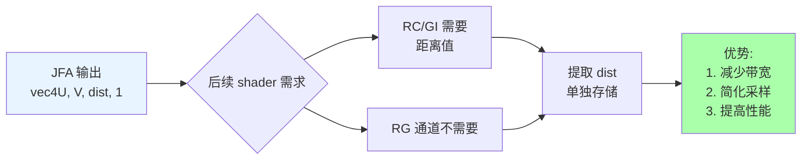
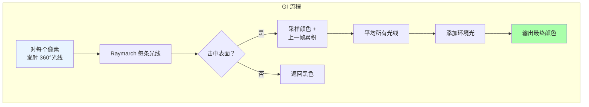
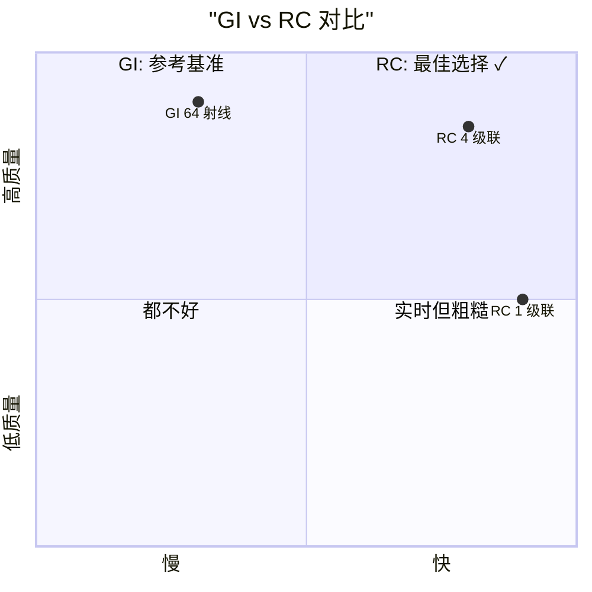
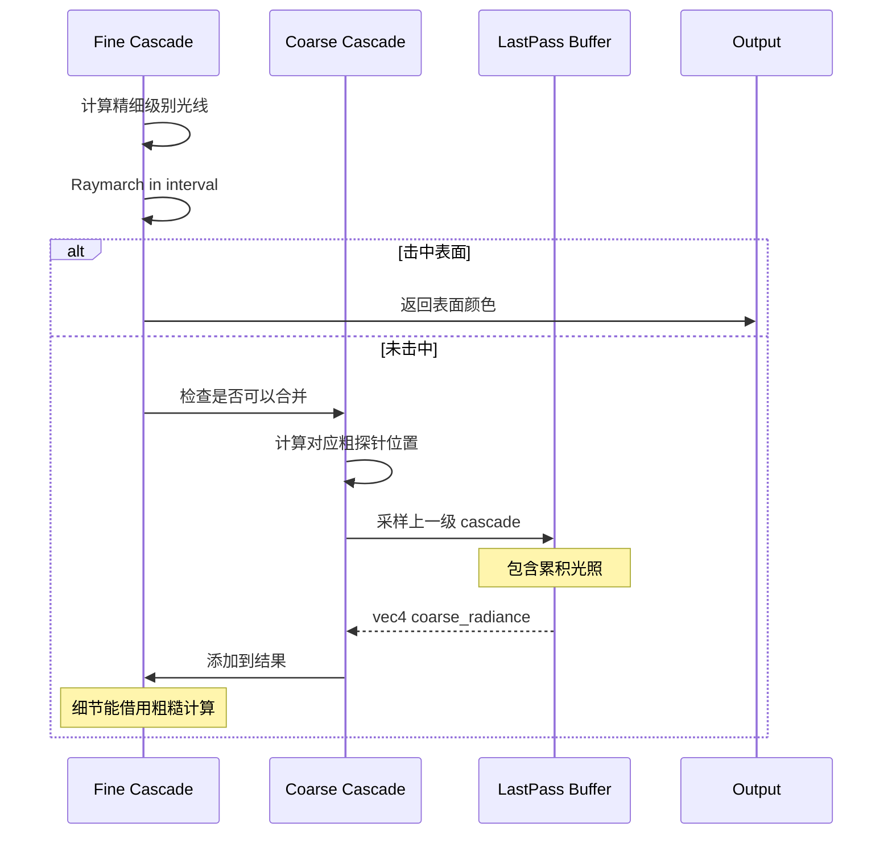
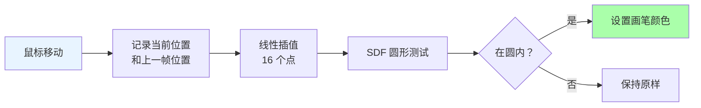
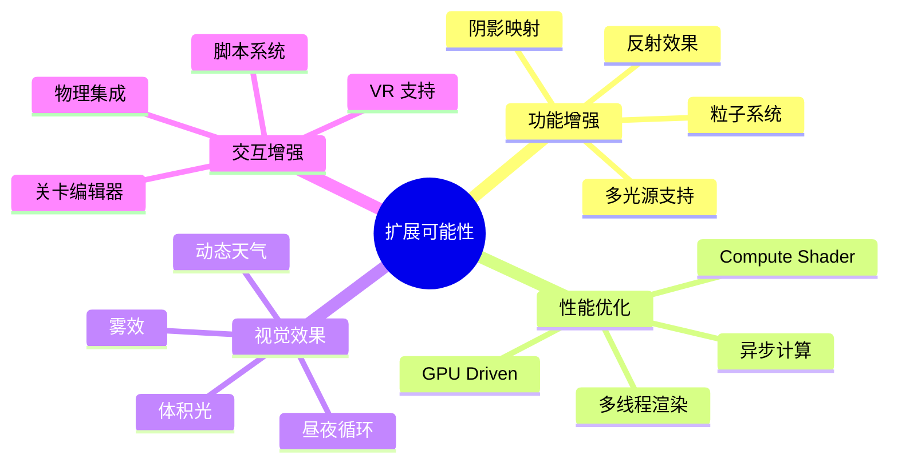

# Class 5-11 Course Outline - Radiance Cascades

**课程大纲**: 第 5-11 课完整内容  
**创建时间**: 2026-03-22  

---

## 📚 Class 5: 距离场提取——distfield.frag

### 学习目标
- ✅ 理解如何从 JFA 结果中提取距离信息
- ✅ 掌握通道分离技术
- ✅ 为光线步进准备数据

### 核心内容

```glsl
#version 330 core

out vec4 fragColor;

uniform sampler2D uJFA;

void main() {
  // 方法 1: 使用 textureSize (推荐)
  vec2 fragCoord = gl_FragCoord.xy / textureSize(uJFA, 0);
  
  // 方法 2: 使用 uniform (备选)
  // uniform vec2 uResolution;
  // vec2 fragCoord = gl_FragCoord.xy / uResolution;
  
  // JFA 输出：vec4(U, V, distance, 1.0)
  // 我们只需要 B 通道的距离值
  float distance = texture(uJFA, fragCoord).b;
  
  // 复制到所有 RGB 通道（灰度显示）
  fragColor = vec4(vec3(distance), 1.0);
}
```

### 为什么要提取？



### 动手实验

**实验 1**: 可视化距离场
```glsl
// 将距离映射到 0-1 范围
float normalizedDist = distance / maxDistance;
fragColor = vec4(vec3(normalizedDist), 1.0);
```

**预期效果**: 
- 靠近障碍物：黑色
- 远离障碍物：白色渐变

---

## 📚 Class 6: 传统全局光照——gi.frag

### 学习目标
- ✅ 理解基于光线投射的全局光照原理
- ✅ 掌握 Raymarching 算法
- ✅ 实现时间累积和抗锯齿

### 核心算法



### Raymarching 函数

```glsl
vec4 raymarch(vec2 uv, vec2 dir) {
  for (int i = 0; i < MAX_RAY_STEPS; i++) {
    float dist = texture(uDistanceField, uv).r;
    uv += dir * dist;
    
    if (dist < EPS) {  // 击中表面
      return vec4(
        mix(sceneColor, lastFrameAccumulation, uMixFactor),
        1.0
      );
    }
  }
  return vec4(0.0);  // 未击中
}
```

### 关键参数

| 参数 | 作用 | 典型值 |
|------|------|--------|
| `uRayCount` | 光线数量 | 64-128 |
| `MAX_RAY_STEPS` | 最大步进数 | 256 |
| `uPropagationRate` | 衰减率 | 0.9-1.3 |
| `uMixFactor` | 直/间接混合 | 0.7 |

### 性能优化

```cpp
// 技巧 1: 使用噪声打破规律性
float noise = rand(fragCoord * 2000);
angle += noise;  // 减少 banding

// 技巧 2: 时间累积
currentColor = mix(currentFrame, prevFrame * decay, 0.5);

// 技巧 3: sRGB 转换
if (uSrgb == 1) {
  color = lin_to_srgb(color);
}
```

---

## 📚 Class 7: Radiance Cascades 理论基础

### 为什么需要 RC？



### Cascade 层级结构

```
Cascade 0 (最精细):
┌───┬───┬───┬───┐
│ ● │ ● │ ● │ ● │  4×4 = 16 个探针
├───┼───┼───┼───┤  间距 = 4 像素
│ ● │ ● │ ● │ ● │
├───┼───┼───┼───┤
│ ● │ ● │ ● │ ● │
├───┼───┼───┼───┤
│ ● │ ● │ ● │ ● │
└───┴───┴───┴───┘

Cascade 1:
┌───────┬───────┐
│   ●   │   ●   │  2×2 = 4 个探针
├───────┼───────┤  间距 = 8 像素
│   ●   │   ●   │
└───────┴───────┘

Cascade 2 (最粗糙):
┌───────────────┐
│       ●       │  1×1 = 1 个探针
└───────────────┘  间距 = 16 像素
```

### 数学原理

```
假设 baseRayCount = 4

Cascade 0:
- 射线数：4^1 = 4
- 覆盖范围：0-4 像素
- 实际成本：4 次 raymarch

Cascade 1:
- 射线数：4^2 = 16
- 覆盖范围：4-16 像素
- 实际成本：4 次 raymarch

Cascade 2:
- 射线数：4^3 = 64
- 覆盖范围：16-64 像素
- 实际成本：4 次 raymarch

总成本：3 cascades × 4 rays = 12 次操作
等效 GI: 64 射线
加速比：64/12 ≈ 5.3 倍！
```

---

## 📚 Class 8: RC 级联实现与合并技术

### 完整实现框架

```glsl
#version 330 core

uniform int uCascadeIndex;      // 当前 cascade 级别
uniform int uCascadeAmount;     // 总 cascade 数
uniform int uBaseRayCount;      // 基础射线数
uniform float uBaseInterval;    // 基础间隔

struct Probe {
  float spacing;           // 探针间距
  vec2 size;               // 探针屏幕尺寸
  vec2 position;           // 探针内位置
  float rayCount;          // 射线数量
  float intervalStart;     // 区间开始
  float intervalEnd;       // 区间结束
};

Probe getProbeInfo(int index) {
  Probe p;
  float probeAmount = pow(uBaseRayCount, index);
  p.spacing = sqrt(probeAmount);
  p.size = 1.0 / vec2(p.spacing);
  p.position = mod(fragCoord, p.size) * p.spacing;
  p.rayCount = pow(uBaseRayCount, index + 1);
  
  float a = uBaseInterval;
  p.intervalStart = (index == 0) ? 0.0 : 
                    a * pow(uBaseRayCount, index) / minRes;
  p.intervalEnd = a * pow(uBaseRayCount, index + 1) / minRes;
  
  return p;
}

void main() {
  Probe p = getProbeInfo(uCascadeIndex);
  vec4 radiance = vec4(0.0);
  
  // 对每个基射线进行 raymarch
  for (float i = 0.0; i < uBaseRayCount; i++) {
    float angle = calculateAngle(i, p);
    vec2 dir = vec2(cos(angle), sin(angle));
    
    // 在指定区间内 raymarch
    vec4 deltaRadiance = radianceInterval(
      p.position, dir, 
      p.intervalStart, p.intervalEnd
    );
    
    // 合并：如果未击中且不是最后一级
    if (deltaRadiance.a == 0.0 && 
        uCascadeIndex < uCascadeAmount - 1) {
      // 从更粗糙的 cascade 借用
      deltaRadiance += sampleCoarserCascade();
    }
    
    radiance += deltaRadiance;
  }
  
  radiance /= uBaseRayCount;
  fragColor = applySRGB(radiance);
}
```

### 合并技术详解



### 调试技巧

```glsl
// 技巧 1: 可视化单个 cascade
if (uCascadeDisplayIndex != uCascadeIndex) {
  discard;  // 只显示指定 cascade
}

// 技巧 2: 禁用合并查看原始结果
if (uDisableMerging == 1) {
  // skip merge logic
}

// 技巧 3: 伪彩色显示不同 cascade
vec3 cascadeColors[5] = vec3[5](
  vec3(1, 0, 0),  // Cascade 0: 红色
  vec3(0, 1, 0),  // Cascade 1: 绿色
  vec3(0, 0, 1),  // Cascade 2: 蓝色
  vec3(1, 1, 0),  // Cascade 3: 黄色
  vec3(1, 0, 1)   // Cascade 4: 品红
);
fragColor.rgb *= cascadeColors[uCascadeIndex];
```

---

## 📚 Class 9: 用户交互绘制——draw.frag

### 画笔渲染原理



### 线条平滑技术

```glsl
// 问题：快速移动鼠标时出现断点
// 解决：在两点之间插值

#define LERP_AMOUNT 16.0

for (float i = 0.0; i < LERP_AMOUNT; i++) {
  vec2 interpPos = mix(uLastMousePos, uMousePos, i / LERP_AMOUNT);
  
  if (sdfCircle(interpPos, uBrushSize * 64)) {
    sdf = true;
  }
}

// 为什么是 16？
// - 太少：线条不连续
// - 太多：性能浪费
// - 16: 经验值，平衡质量和速度
```

### 彩虹动画实现

```glsl
// HSV 空间中的简单动画
if (uRainbow == 1) {
  // Hue 随时间循环：0 → 1 → 0
  float hue = fract(uTime / 4.0);  // 4 秒一个循环
  fragColor = vec4(hsv2rgb(vec3(hue, 1.0, 1.0)), 1.0);
} else {
  fragColor = uBrushColor;
}
```

### macOS 适配

```glsl
// draw_macos.frag 的特殊处理
uniform sampler2D uCanvas;  // 需要额外绑定画布纹理

void main() {
  vec2 uv = gl_FragCoord.xy / textureSize(uCanvas, 0);
  
  if (uMouseDown == 0) {
    // macOS 必须显式保留原内容
    fragColor = texture(uCanvas, uv);
    return;
  }
  
  // ... 正常画笔逻辑 ...
  
  if (!insideBrush) {
    // 也要保留原内容
    fragColor = texture(uCanvas, uv);
  }
}
```

---

## 📚 Class 10: 输出与调试

### final.frag - 简单但重要

```glsl
#version 330 core

out vec4 fragColor;

uniform vec2 uResolution;
uniform sampler2D uCanvas;

void main() {
  // 最简单的 pass-through shader
  vec2 uv = gl_FragCoord.xy / textureSize(uCanvas, 0);
  fragColor = texture(uCanvas, uv);
  
  // 可以在此添加后处理效果：
  // 1. Tone mapping
  // 2. Gamma correction
  // 3. Vignette
  // 4. Bloom
}
```

### broken.frag - 调试神器

```glsl
#version 330 core

#define N 25
#define PRIMARY vec4(1, 0, 1, 1)    // 品红色
#define SECONDARY vec4(0, 0, 0, 1)  // 黑色

out vec4 fragColor;

void main() {
  vec2 pos = mod(gl_FragCoord.xy, vec2(N));
  
  // 棋盘格图案
  bool isPrimary = ((pos.x > N/2.0) == (pos.y > N/2.0));
  fragColor = isPrimary ? PRIMARY : SECONDARY;
}
```

**用途**:
1. ✅ 验证 viewport 是否正确
2. ✅ 检查纹理坐标映射
3. ✅ 测试 framebuffer 绑定
4. ✅ 调试坐标翻转问题

### 完整调试流程

```cpp
// Step 1: 使用 broken.frag 替换 final.frag
if (debugMode) {
  useShader(brokenShader);
  // 应该看到棋盘格
}

// Step 2: 逐步检查中间 buffer
if (showBuffers) {
  switch(bufferIndex) {
    case 0: display(jfaBuffer);    // 检查 JFA
    case 1: display(distField);    // 检查距离场
    case 2: display(radianceBuf);  // 检查光照
  }
}

// Step 3: 使用 ImGui 实时调整参数
ImGui::SliderFloat("Mix Factor", &mixFactor, 0.0, 1.0);
ImGui::SliderInt("Ray Count", &rayCount, 16, 256);
```

---

## 📚 Class 11: 完整管线整合

### 帧渲染全流程

```mermaid
flowchart TB
    subgraph "Frame N 渲染"
        Start[开始新帧] --> Input[处理输入<br/>键盘 + 鼠标]
        Input --> UI[ImGui UI 更新]
        UI --> Clear[清除缓冲区]
        
        Clear --> Scene[prepscene.frag<br/>场景准备]
        Scene --> PrepJFA[prepjfa.frag<br/>种子编码]
        
        PrepJFA --> JFA_Loop{JFA Passes<br/>5-9 次}
        JFA_Loop -->|每次 jump减半 | JFA[jfa.frag<br/>传播]
        JFA --> JFA_Loop
        
        JFA --> Dist[distfield.frag<br/>距离场提取]
        
        Dist --> Mode{光照模式？}
        Mode -->|GI| GI[gi.frag<br/>全局光照]
        Mode -->|RC| RC_Loop{Cascade 级别}
        RC_Loop -->|每级 | RC[rc.frag<br/>辐射级联]
        RC --> RC_Loop
        
        GI --> Composite[合成]
        RC --> Composite
        
        Composite --> Draw[draw.frag<br/>用户绘制]
        Draw --> ImGui[ImGui 渲染]
        DrawCursor[绘制光标]
        ImGui --> Final[final.frag<br/>输出到屏幕]
        Final --> Swap[交换缓冲区]
        Swap --> End[帧结束]
    end
    
    style Start fill:#aaffaa
    style End fill:#aaffaa
    style JFA fill:#ffffaa
    style RC fill:#ffcccc
```



### 资源管理策略

```cpp
class ResourceManager {
  // 纹理资源
  std::map<std::string, Texture2D> textures;
  std::map<std::string, RenderTexture2D> renderTargets;
  
  // Shader 资源
  std::map<std::string, Shader> shaders;
  
  void LoadAll() {
    // 自动加载所有 shader
    FilePathList files = LoadDirectoryFiles("res/shaders");
    for (int i = 0; i < files.count; i++) {
      std::string name = ExtractFileName(files.paths[i]);
      shaders[name] = LoadShader("default.vert", files.paths[i]);
    }
    
    // 创建 render targets
    CreateRenderTarget("occlusionBuf");
    CreateRenderTarget("emissionBuf");
    CreateRenderTarget("jfaBufferA");
    CreateRenderTarget("jfaBufferB");
    // ...
  }
  
  void UpdateUniforms(Shader& shader) {
    // 批量更新常用 uniforms
    SetShaderValue(shader, GetShaderLocation(shader, "uTime"), &time, SHADER_UNIFORM_FLOAT);
    SetShaderValue(shader, GetShaderLocation(shader, "uResolution"), &resolution, SHADER_UNIFORM_VEC2);
    SetShaderValue(shader, GetShaderLocation(shader, "uMousePos"), &mousePos, SHADER_UNIFORM_VEC2);
    // ...
  }
};
```

### 性能剖析与优化

```cpp
// 性能监控
struct FrameStats {
  float frameTime;
  float gpuTime_JFA;
  float gpuTime_RC;
  float gpuTime_Composite;
};

FrameStats stats;

// 优化技巧
namespace Optimization {
  // 1. 减少状态切换
  void BatchRender() {
    UseShader(baseShader);
    BindTexture(diffuseMap);
    
    // 一次性绘制多个物体
    for (auto& obj : objects) {
      if (obj.material == currentMaterial) {
        Draw(obj);
      }
    }
  }
  
  // 2. 动态分辨率
  void AdjustResolution(float targetFPS) {
    if (currentFPS < targetFPS * 0.9) {
      resolutionScale *= 0.9;  // 降低分辨率
    } else if (currentFPS > targetFPS * 1.1) {
      resolutionScale *= 1.1;  // 提高分辨率
    }
  }
  
  // 3. LOD for cascades
  void SelectCascadeLOD(float distance) {
    if (distance > farThreshold) {
      cascadeAmount = 3;  // 远距离用少级联
    } else {
      cascadeAmount = 5;  // 近距离用多级联
    }
  }
}
```

### 扩展方向



---

## 📝 学习建议

### 推荐学习节奏

```
Week 1:
- Class 5: 距离场提取 (2-3 小时)
- Class 6: 传统 GI (5-6 小时)
- 练习 + 复习

Week 2:
- Class 7: RC 理论 (4-5 小时)
- Class 8: RC 实现 (5-6 小时)
- 综合练习

Week 3:
- Class 9: 用户交互 (3-4 小时)
- Class 10: 调试技巧 (2-3 小时)
- Class 11: 完整整合 (4-5 小时)
- 毕业项目
```

### 毕业项目建议

**项目选项**:
1. 🎨 **交互式光影艺术** - 使用所有技术创作 generative art
2. 🎮 **2D 游戏光照系统** - 为简单 2D 游戏实现动态光照
3. 📊 **可视化工具** - 帮助学生理解 JFA 和 RC 的教学工具
4. 🔬 **性能对比研究** - 详细分析 GI vs RC 的性能和质量

---

## 🎓 总结

完成这 11 堂课后，你将掌握：

✅ **GLSL 编程能力** - 独立编写复杂 shader  
✅ **距离场技术** - JFA 算法和应用  
✅ **全局光照** - 传统 GI 和现代 RC  
✅ **实时渲染管线** - 完整的帧渲染流程  
✅ **调试和优化** - 实用技巧和工具  

**下一步**: 
- 📖 阅读图形学论文
- 🎮 参与游戏开发项目
- 🎨 创作 shader 艺术作品
- 🚀 学习更高级的渲染技术

---

*祝你学习顺利！有任何问题欢迎随时提问!* 💪✨
