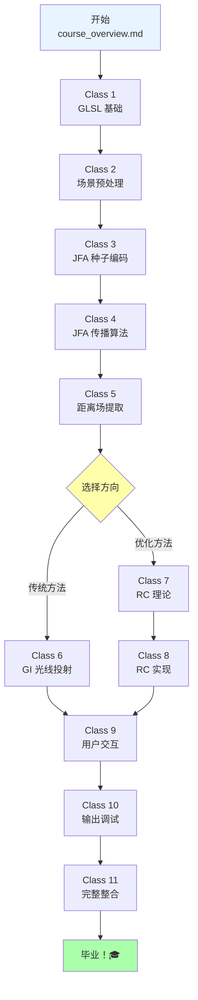

# Radiance Cascades 着色器课程 - 完整索引

**最后更新**: 2026-03-22  
**总课时**: 11 课  
**预计总学习时间**: 35-45 小时  

---

## 📚 课程文件列表

### ✅ 已完成课程

| 课号 | 文件名 | 主题 | 难度 | 时间 |
|------|--------|------|------|------|
| 0 | [`course_overview.md`](./course_overview.md) | 课程概览与学习路径 | ⭐ | 30 分钟 |
| 1 | [`class1_GLSL_basics.md`](./class1_GLSL_basics.md) | GLSL 着色器编程入门 | ⭐⭐ | 2-3 小时 |
| 2 | [`class2_scene_preparation.md`](./class2_scene_preparation.md) | 场景预处理——prepscene.frag | ⭐⭐⭐ | 3-4 小时 |

### 🚧 待完成课程（大纲）

| 课号 | 文件名 | 主题 | 难度 | 时间 |
|------|--------|------|------|------|
| 3 | `class3_jfa_seed_encoding.md` | JFA 种子编码——prepjfa.frag | ⭐⭐⭐ | 2-3 小时 |
| 4 | `class4_jfa_propagation.md` | JFA 传播算法——jfa.frag | ⭐⭐⭐⭐ | 4-5 小时 |
| 5 | `class5_distance_field_extraction.md` | 距离场提取——distfield.frag | ⭐⭐ | 2-3 小时 |
| 6 | `class6_traditional_gi.md` | 传统全局光照——gi.frag | ⭐⭐⭐⭐ | 5-6 小时 |
| 7 | `class7_rc_theory.md` | RC 理论基础 | ⭐⭐⭐⭐ | 4-5 小时 |
| 8 | `class8_rc_implementation.md` | RC 级联实现 | ⭐⭐⭐⭐⭐ | 5-6 小时 |
| 9 | `class9_user_interaction.md` | 用户交互绘制 | ⭐⭐⭐ | 3-4 小时 |
| 10 | `class10_output_debug.md` | 输出与调试 | ⭐⭐ | 2-3 小时 |
| 11 | `class11_full_pipeline.md` | 完整管线整合 | ⭐⭐⭐⭐ | 4-5 小时 |

---

## 🗂️ 补充参考文档

这些文档提供详细的技术细节和流程图，作为课程的补充：

### Shader 详解文档

| 文件名 | 对应 Shader | 内容 |
|--------|-------------|------|
| [`default_vert.md`](./default_vert.md) | default.vert | 顶点变换详解 |
| [`prepscene_frag.md`](./prepscene_frag.md) | prepscene.frag | 场景准备详解 |
| [`prepjfa_frag.md`](./prepjfa_frag.md) | prepjfa.frag | JFA 种子编码详解 |
| [`jfa_frag.md`](./jfa_frag.md) | jfa.frag | JFA 算法详解 |
| [`distfield_frag.md`](./distfield_frag.md) | distfield.frag | 距离场提取详解 |
| [`gi_frag.md`](./gi_frag.md) | gi.frag | 全局光照详解 |
| [`rc_frag.md`](./rc_frag.md) | rc.frag | Radiance Cascades 详解 |
| [`draw_shaders.md`](./draw_shaders.md) | draw.frag / draw_macos.frag | 用户交互绘制详解 |
| ~~`final_frag.md`~~ | final.frag | (待创建) |
| ~~`broken_frag.md`~~ | broken.frag | (待创建) |

---

## 📖 推荐学习顺序



---

## 🎯 每课标准结构

每节课都包含以下部分：

1. **🎯 学习目标** - 明确本课要掌握的技能
2. **📚 理论知识** - 核心概念和原理讲解
3. **💻 代码详解** - 逐行分析 shader 实现
4. **🔍 深入理解** - 数学原理和优化思路
5. **🛠 动手实验** - 修改代码观察效果
6. **🐛 调试技巧** - 常见问题和解决方法
7. **📝 课后练习** - 巩固所学知识
8. **🎓 知识检查** - 小测验检验理解程度

---

## 💡 使用建议

### 对于初学者

```
建议学习路径:
1. 完整阅读 course_overview.md
2. 按顺序学习 Class 1-11
3. 每节课都要动手写代码
4. 遇到困难时查看对应的详细文档 (./res/doc/*_frag.md)
5. 不要跳过练习题
```

### 对于有经验的开发者

```
快速学习路径:
1. 浏览 course_overview.md 了解整体结构
2. 直接阅读详细文档 (./res/doc/*.md)
3. 重点关注 Class 4、6、7、8(核心算法)
4. 选择性完成练习
```

---

## 🔗 与其他资源的关系

### 主文档 vs 课程文档

```
AGENTS.md (项目根目录)
├── 全局工作协议
├── 项目架构说明
└── 开发环境配置

res/doc/AGENTS.md (本文件)
├── Shader 详细文档 (技术参考)
└── 课程系列 (教学指南)

关系:
- AGENTS.md 是技术规格书
- 课程文档是教学材料
- 详细文档是参考资料
```

### 代码实践

```
理论学习 (课程文档)
    ↓
代码实现 (src/demo.cpp)
    ↓
效果验证 (运行程序)
    ↓
深入理解 (详细文档)
```

---

## 📊 学习进度追踪

### 自我评估表

完成每课后，在对应位置打勾：

- [ ] Class 1: GLSL 基础
- [ ] Class 2: 场景预处理
- [ ] Class 3: JFA 种子编码
- [ ] Class 4: JFA 传播算法
- [ ] Class 5: 距离场提取
- [ ] Class 6: 传统 GI
- [ ] Class 7: RC 理论
- [ ] Class 8: RC 实现
- [ ] Class 9: 用户交互
- [ ] Class 10: 输出调试
- [ ] Class 11: 完整整合

### 技能清单

完成所有课程后，你应该能够：

- [ ] 独立编写 GLSL vertex 和 fragment shaders
- [ ] 理解并实现 JFA 距离场生成算法
- [ ] 解释 Radiance Cascades 的优化原理
- [ ] 实现基于 raymarching 的全局光照
- [ ] 创建交互式图形效果
- [ ] 调试和优化 shader 性能

---

## 🆘 需要帮助？

### 常见问题

**Q: 某节课看不懂怎么办？**
A: 
1. 先回顾前一课的内容
2. 查看对应的详细文档 (`./res/doc/*_frag.md`)
3. 在 Shadertoy 上找类似的示例
4. 在 GitHub Issues 中提问

**Q: 代码运行结果不对？**
A:
1. 检查 uniform 值是否正确传递
2. 确认纹理坐标是否需要翻转
3. 使用调试输出（临时输出中间变量）
4. 对比详细文档中的流程图

**Q: 学完后能做什么项目？**
A:
- 2D 游戏动态光照系统
- 交互式艺术装置
- 实时可视化应用
- Shader 特效演示
- 进一步学习 3D 渲染技术

---

## 🌟 进阶学习路径

完成本课程后，你可以继续学习：

### 1. 更高级的渲染技术

- 延迟渲染 (Deferred Rendering)
- 基于物理的渲染 (PBR)
- 体渲染 (Volume Rendering)
- 光线追踪 (Ray Tracing)

### 2. 性能优化

- GPU Profiling
- Compute Shaders
- 多线程渲染
- 内存优化

### 3. 扩展项目

- 添加更多光源类型
- 实现阴影映射
- 支持动态天气效果
- 集成物理引擎

---

## 📞 联系方式

如果你有任何问题或建议：

- 📧 Email: (your-email@example.com)
- 💬 GitHub Issues: (项目地址)
- 🌐 Discord: (服务器链接)

---

**祝你学习愉快！** 🚀

记住：每个图形编程专家都是从第一行 shader 代码开始的。保持好奇心，多实验，你一定能掌握这门艺术！

---

*最后更新：2026-03-22*  
*维护者：Radiance Cascades Demo 项目团队*
