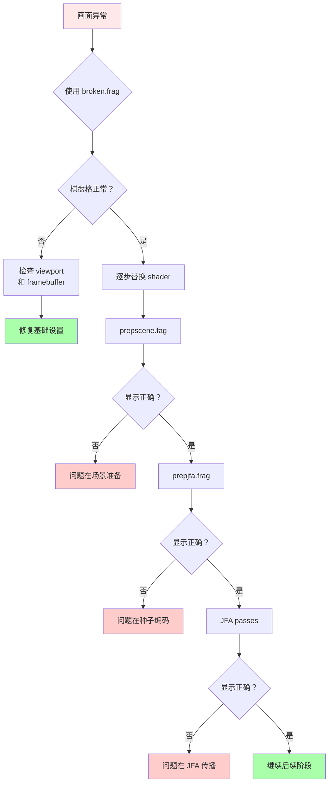

# Class 10: 输出与调试

**创建时间**: 2026-03-22  
**难度**: ⭐⭐☆  
**预计时间**: 2-3 小时  

---

## 🎯 学习目标

完成本课程后，你将能够：

- ✅ 理解最终合成 shader 的作用
- ✅ 掌握调试 shader 的使用技巧
- ✅ 快速定位渲染管线问题
- ✅ 应用基础的后处理效果

---

## 📖 核心概念

### 为什么需要专门的输出和调试 shader？

```
渲染管线复杂 → 多个中间 buffer → 容易出错
↓
需要工具来：
1. 验证最终输出是否正确
2. 检查中间结果
3. 快速定位问题阶段
```

[WIP_NEED_PIC: 渲染管线中各个 buffer 的流程图]

---

## 💻 final.frag - 简单但重要

### 完整代码

```glsl
#version 330 core

out vec4 fragColor;

uniform vec2 uResolution;
uniform sampler2D uCanvas;

void main() {
  // 计算 UV 坐标
  vec2 uv = gl_FragCoord.xy / textureSize(uCanvas, 0);
  
  // 简单的 pass-through：直接采样并输出
  fragColor = texture(uCanvas, uv);
  
  // 可以在此添加后处理效果：
  // 1. Tone mapping
  // 2. Gamma correction
  // 3. Vignette
  // 4. Bloom
}
```

### 作用解析

**主要功能**：
1. **Pass-through** - 将最后一个 render target 输出到屏幕
2. **格式转换** - 可能涉及 HDR→LDR 的转换
3. **后处理挂载点** - 可以方便地添加特效

[WIP_NEED_PIC: final.frag 在管线中的位置示意图]

### 可扩展的后处理效果

#### 1. Gamma 校正

```glsl
// 在输出前应用 gamma 校正
fragColor.rgb = pow(fragColor.rgb, vec3(1.0 / 2.2));
```

**效果**：修正显示器非线性响应

#### 2. 色调映射（Tone Mapping）

```glsl
// 简单的 Reinhard tone mapping
vec3 tonemap(vec3 color) {
  return color / (color + vec3(1.0));
}

void main() {
  vec2 uv = gl_FragCoord.xy / textureSize(uCanvas, 0);
  vec3 hdrColor = texture(uCanvas, uv).rgb;
  
  fragColor = vec4(tonemap(hdrColor), 1.0);
}
```

**效果**：将 HDR 颜色压缩到 LDR 范围

#### 3. 暗角效果（Vignette）

```glsl
void main() {
  vec2 uv = gl_FragCoord.xy / textureSize(uCanvas, 0);
  vec3 color = texture(uCanvas, uv).rgb;
  
  // 计算到中心的距离
  float dist = distance(uv, vec2(0.5));
  
  // 边缘变暗
  float vignette = 1.0 - smoothstep(0.3, 0.8, dist);
  color *= vignette;
  
  fragColor = vec4(color, 1.0);
}
```

[WIP_NEED_PIC: 有/无暗角效果的对比]

---

## 🔧 broken.frag - 调试神器

### 完整代码

```glsl
#version 330 core

#define N 25
#define PRIMARY vec4(1, 0, 1, 1)    // 品红色
#define SECONDARY vec4(0, 0, 0, 1)  // 黑色

out vec4 fragColor;

void main() {
  // 获取当前片元在棋盘格中的位置
  vec2 pos = mod(gl_FragCoord.xy, vec2(N));
  
  // 生成棋盘格图案
  bool isPrimary = ((pos.x > N/2.0) == (pos.y > N/2.0));
  fragColor = isPrimary ? PRIMARY : SECONDARY;
}
```

### 生成的图案

```
┌─────────────────────────────┐
│ ████    ████    ████        │
│ ████    ████    ████        │
│         ████████    ████    │
│         ████████    ████    │
│ ████            ████        │
│ ████            ████        │
│         ████            ████│
│         ████            ████│
└─────────────────────────────┘
```

[WIP_NEED_PIC: broken.frag 实际运行的截图]

### 调试用途详解

#### 用途 1: 验证 viewport 是否正确

```cpp
// C++ 代码
if (debugMode) {
  useShader(brokenShader);
  // 应该看到完整的棋盘格
  // 如果有扭曲 → viewport 设置错误
}
```

**预期**：规则的 25x25 像素方格

**异常**：
- 方格拉伸 → aspect ratio 错误
- 方格模糊 → 分辨率不匹配
- 方格缺失 → scissor test 问题

#### 用途 2: 检查纹理坐标映射

```glsl
// 修改 broken.frag
uniform sampler2D uTestTexture;

void main() {
  vec2 uv = gl_FragCoord.xy / textureSize(uTestTexture, 0);
  vec2 pos = mod(gl_FragCoord.xy, vec2(N));
  
  bool isPrimary = ((pos.x > N/2.0) == (pos.y > N/2.0));
  vec4 checkerboard = isPrimary ? PRIMARY : SECONDARY;
  
  // 混合纹理和棋盘格
  vec4 texColor = texture(uTestTexture, uv);
  fragColor = mix(texColor, checkerboard, 0.5);
}
```

**效果**：同时看到纹理和坐标网格

#### 用途 3: 测试 framebuffer 绑定

```cpp
// 逐步检查每个 framebuffer
BindFramebuffer(jfaBuffer);
useShader(brokenShader);
DrawQuad();
// 应该看到棋盘格 → JFA buffer 正确绑定

BindFramebuffer(distField);
// ...
```

**逻辑**：如果看不到棋盘格 → framebuffer 未正确绑定

#### 用途 4: 调试坐标翻转

**问题**：OpenGL 的纹理坐标和屏幕坐标可能不一致

**症状**：
- 图像上下颠倒
- 图像左右镜像

**解决**：
```glsl
// 尝试翻转 UV
vec2 uv = gl_FragCoord.xy / textureSize(uCanvas, 0);
uv.y = 1.0 - uv.y;  // 翻转 Y 轴
fragColor = texture(uCanvas, uv);
```

---

## 🎨 完整调试流程

### Step-by-step 调试指南



### 实际操作示例

```cpp
// 调试模式开关
bool debugMode = true;
int debugStage = 0;  // 0=scene, 1=jfa, 2=dist, 3=gi/rc

if (debugMode) {
  switch(debugStage) {
    case 0:
      // 检查场景准备
      useShader(brokenShader);
      bindTexture(sceneTexture);
      drawQuad();
      break;
      
    case 1:
      // 检查 JFA 种子
      useShader(brokenShader);
      bindTexture(prepJFATexture);
      drawQuad();
      break;
      
    case 2:
      // 检查距离场
      useShader(brokenShader);
      bindTexture(distFieldTexture);
      drawQuad();
      break;
      
    case 3:
      // 检查最终光照
      useShader(brokenShader);
      bindTexture(giTexture);
      drawQuad();
      break;
  }
  
  // ImGui 控制调试阶段
  ImGui::SliderInt("Debug Stage", &debugStage, 0, 3);
}
```

[WIP_NEED_PIC: 各阶段调试视图的拼图]

---

## 🛠️ 高级调试技巧

### 技巧 1: 伪彩色可视化

```glsl
// 将标量值映射为颜色
vec3 heatmap(float t) {
  // t 应该在 0-1 范围
  return vec3(
    sin(t * 3.14159),           // R: 正弦波
    sin(t * 3.14159 + 2.0),     // G: 相移
    sin(t * 3.14159 + 4.0)      // B: 再相移
  );
}

void main() {
  vec2 uv = gl_FragCoord.xy / textureSize(uInput, 0);
  float value = texture(uInput, uv).r;
  
  fragColor = vec4(heatmap(value), 1.0);
}
```

**用途**：可视化距离场、深度图等单通道数据

### 技巧 2: 边缘检测

```glsl
void main() {
  vec2 uv = gl_FragCoord.xy / textureSize(uInput, 0);
  vec2 texel = 1.0 / textureSize(uInput, 0);
  
  // Sobel 算子简化版
  float center = texture(uInput, uv).r;
  float left = texture(uInput, uv - vec2(texel.x, 0)).r;
  float right = texture(uInput, uv + vec2(texel.x, 0)).r;
  float top = texture(uInput, uv - vec2(0, texel.y)).r;
  float bottom = texture(uInput, uv + vec2(0, texel.y)).r;
  
  float edge = abs(center - left) + abs(center - right) + 
               abs(center - top) + abs(center - bottom);
  
  fragColor = vec4(vec3(edge), 1.0);
}
```

**用途**：检测几何边界、帮助调试 SDF

### 技巧 3: 数值范围检查

```glsl
uniform float uMinValue;
uniform float uMaxValue;

void main() {
  vec2 uv = gl_FragCoord.xy / textureSize(uInput, 0);
  float value = texture(uInput, uv).r;
  
  if (value < uMinValue || value > uMaxValue) {
    fragColor = vec4(1, 0, 0, 1);  // 超出范围显示红色
  } else {
    fragColor = vec4(0, 1, 0, 1);  // 正常显示绿色
  }
}
```

**用途**：快速发现 NaN、Inf 或异常值

---

## 🐛 常见问题排查清单

### 问题 1: 全黑画面

**排查步骤**：

1. 使用 `broken.frag` 检查 viewport ✓
2. 检查所有 texture 绑定 ✓
3. 验证 uniform 值是否正确 ✓
4. 检查 clear color ✓

**常见原因**：
- Texture 未绑定到正确的 unit
- Shader 编译失败但未报错
- Render target 尺寸不匹配

### 问题 2: 画面撕裂或闪烁

**排查**：
```cpp
// 确保双缓冲
glfwSwapInterval(1);  // 开启 vsync

// 或在 Raylib 中
SetTargetFPS(60);
```

### 问题 3: 性能突然下降

**诊断工具**：
```cpp
// 简单帧率计时
static float lastTime = 0;
float currentTime = GetTime();
float frameTime = currentTime - lastTime;
lastTime = currentTime;

printf("Frame time: %.2f ms (%.1f FPS)\n", 
       frameTime * 1000, 1.0 / frameTime);
```

### 问题 4: 内存泄漏

**检查清单**：
- [ ] 所有 `LoadShader()` 都有对应的 `UnloadShader()`
- [ ] RenderTexture 正确释放
- [ ] Texture 正确卸载

---

## 🧠 知识检查

### 小测验

1. **broken.frag 的主要作用是？**
   - A) 让画面更好看
   - B) 调试 viewport 和纹理映射 ✓
   - C) 提高性能
   - D) 添加特效

2. **棋盘格的边长是多少像素？**
   - A) 20
   - B) 25 ✓
   - C) 30
   - D) 50

3. **如何快速检查 texture 是否正确绑定？**
   - A) 打印日志
   - B) 使用 broken.frag ✓
   - C) 重新编译
   - D) 重启程序

---

## 🔗 与其他课程的联系

### 前置知识
- Class 2: 纹理采样基础
- Class 5: 距离场可视化

### 后续应用
- Class 11: 完整管线调试

---

## 📚 扩展阅读

- [RenderDoc 图形调试器](https://renderdoc.org/)
- [Nsight Graphics GPU 调试](https://developer.nvidia.com/nsight-graphics)
- [Shader 调试最佳实践](https://developer.nvidia.com/gpugems/gpugems/part-vi-gpu-computation/chapter-39-gpu-based-interpolation)

---

## ✅ 总结

本节课你学到了：

✅ final.frag 的 pass-through 原理  
✅ broken.frag 的多种调试用途  
✅ 系统化的调试流程和方法  
✅ 常见问题的排查技巧  

**下一步**：Class 11 将所有组件整合成完整系统！

---

*记住：优秀的调试能力比编写新代码更重要。善用 broken.frag 这把"瑞士军刀"！* 🔧
