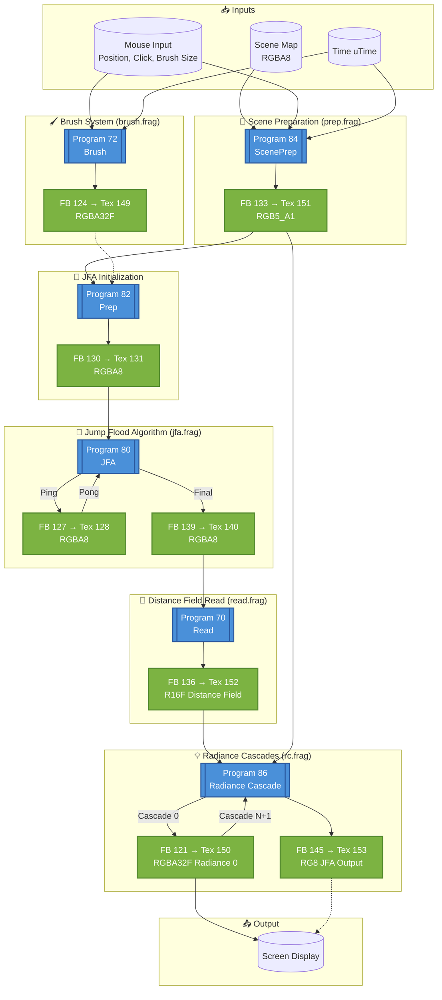
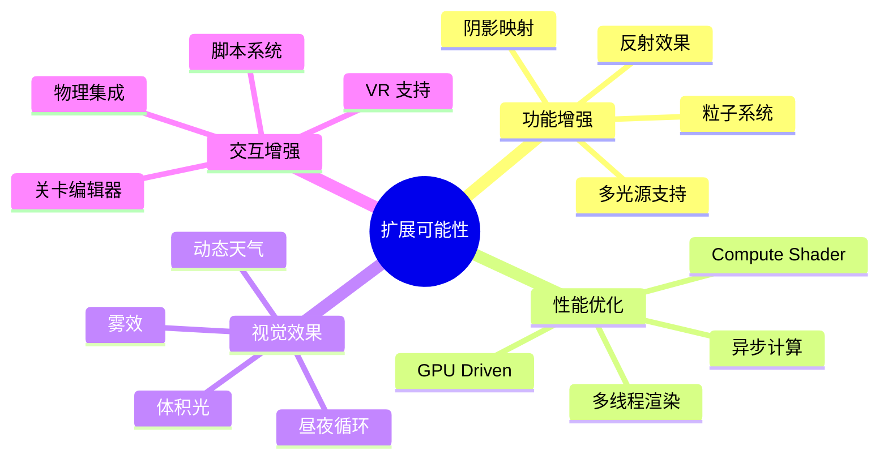

# Class 11: 完整管线整合

**创建时间**: 2026-03-22  
**难度**: ⭐⭐⭐⭐☆  
**预计时间**: 4-5 小时  

---

## 🎯 学习目标

完成本课程后，你将能够：

- ✅ 理解完整的帧渲染流程
- ✅ 掌握资源管理和组织策略
- ✅ 实现性能监控和优化
- ✅ 扩展系统添加新功能

---

## 📖 帧渲染全流程

### 完整渲染管线

```mermaid
flowchart TB
    subgraph "Frame N 渲染"
        Start[开始新帧] --> Input[处理输入<br/>键盘 + 鼠标]
        Input --> UI[ImGui UI 更新]
        UI --> Clear[清除缓冲区]
        
        Clear --> Scene[prepscene.frag<br/>场景准备]
        Scene --> PrepJFA[prepjfa.frag<br/>种子编码]
        
        PrepJFA --> JFA_Loop{JFA Passes<br/>5-9 次}
        JFA_Loop -->|每次 jump 减半 | JFA[jfa.frag<br/>传播]
        JFA --> JFA_Loop
        
        JFA --> Dist[distfield.frag<br/>距离场提取]
        
        Dist --> Mode{光照模式？}
        Mode -->|GI| GI[gi.frag<br/>全局光照]
        Mode -->|RC| RC_Loop{Cascade 级别}
        RC_Loop -->|每级 | RC[rc.frag<br/>辐射级联]
        RC --> RC_Loop
        
        GI --> Composite[合成]
        RC --> Composite
        
        Composite --> Draw[draw.frag<br/>用户绘制]
        Draw --> ImGui[ImGui 渲染]
        DrawCursor[绘制光标]
        ImGui --> Final[final.frag<br/>输出到屏幕]
        Final --> Swap[交换缓冲区]
        Swap --> End[帧结束]
    end
    
    style Start fill:#aaffaa
    style End fill:#aaffaa
    style JFA fill:#ffffaa
    style RC fill:#ffcccc
```



[WIP_NEED_PIC: 完整渲染管线的流程图]



### C++ 实现框架

```cpp
class RadianceCascadesDemo {
private:
  // 窗口和上下文
  RenderWindow window;
  
  // Shader 资源
  std::map<std::string, Shader> shaders;
  
  // 纹理资源
  std::map<std::string, Texture2D> textures;
  std::map<std::string, RenderTexture2D> renderTargets;
  
  // 状态
  float currentTime = 0;
  Vector2 mousePos = {0, 0};
  bool mouseDown = false;
  
  // 参数
  int cascadeAmount = 4;
  int baseRayCount = 4;
  bool useRC = true;
  
public:
  void Initialize() {
    // 1. 加载所有 shader
    LoadShaders();
    
    // 2. 创建 render targets
    CreateRenderTargets();
    
    // 3. 初始化状态
    InitState();
  }
  
  void Run() {
    while (!WindowShouldClose()) {
      Update();
      Render();
    }
  }
  
  void Update() {
    // 处理输入
    HandleInput();
    
    // 更新 ImGui
    UpdateImGui();
    
    // 更新时间
    currentTime = GetTime();
  }
  
  void Render() {
    // === 阶段 1: 场景准备 ===
    BeginTextureMode(renderTargets["scene"]);
      ClearBackground(BLACK);
      UseShader(shaders["prepscene"]);
      SetSceneUniforms();
      DrawQuad();
    EndTextureMode();
    
    // === 阶段 2: JFA 种子编码 ===
    BeginTextureMode(renderTargets["prepJFA"]);
      ClearBackground(BLACK);
      UseShader(shaders["prepjfa"]);
      SetPrepJFAUniforms();
      DrawQuad();
    EndTextureMode();
    
    // === 阶段 3: JFA 传播（多 pass）===
    int jfaPasses = 5;
    for (int i = 0; i < jfaPasses; i++) {
      RenderTexture2D& src = (i % 2 == 0) ? 
                             renderTargets["jFA"] : 
                             renderTargets["jFATemp"];
      RenderTexture2D& dst = (i % 2 == 0) ? 
                             renderTargets["jFATemp"] : 
                             renderTargets["jFA"];
      
      BeginTextureMode(dst);
        ClearBackground(BLACK);
        UseShader(shaders["jfa"]);
        SetJFAUniforms(i, jfaPasses);
        BindTexture(src.texture, 0);
        DrawQuad();
      EndTextureMode();
    }
    
    // === 阶段 4: 距离场提取 ===
    BeginTextureMode(renderTargets["distField"]);
      ClearBackground(BLACK);
      UseShader(shaders["distfield"]);
      SetDistFieldUniforms();
      BindTexture(renderTargets["jFA"].texture, 0);
      DrawQuad();
    EndTextureMode();
    
    // === 阶段 5: 全局光照 ===
    if (useRC) {
      // Radiance Cascades 方式
      RenderRadianceCascades();
    } else {
      // 传统 GI 方式
      BeginTextureMode(renderTargets["gi"]);
        ClearBackground(BLACK);
        UseShader(shaders["gi"]);
        SetGIUniforms();
        DrawQuad();
      EndTextureMode();
    }
    
    // === 阶段 6: 用户绘制 ===
    BeginTextureMode(renderTargets["canvas"]);
      ClearBackground(BLANK);
      UseShader(shaders["draw"]);
      SetDrawUniforms();
      BindTexture(renderTargets["canvas"].texture, 0);
      DrawQuad();
    EndTextureMode();
    
    // === 阶段 7: ImGui 叠加 ===
    BeginDrawing();
      // 渲染最终结果
      DrawTexture(renderTargets["canvas"].texture, 0, 0, WHITE);
      
      // 绘制 ImGui
      DrawImGui();
      
      // 绘制光标
      DrawCursor();
    EndDrawing();
  }
  
  void RenderRadianceCascades() {
    // 对每个 cascade 级别进行渲染
    for (int i = 0; i < cascadeAmount; i++) {
      BeginTextureMode(renderTargets["rc" + std::to_string(i)]);
        ClearBackground(BLACK);
        UseShader(shaders["rc"]);
        SetRCUniforms(i, cascadeAmount);
        
        // 绑定上一级 cascade（如果有）
        if (i > 0) {
          BindTexture(renderTargets["rc" + std::to_string(i-1)].texture, 1);
        }
        
        DrawQuad();
      EndTextureMode();
    }
    
    // 合并最后一级到 gi buffer
    BeginTextureMode(renderTargets["gi"]);
      ClearBackground(BLACK);
      UseShader(shaders["rc_composite"]);
      SetCompositeUniforms();
      DrawQuad();
    EndTextureMode();
  }
};
```

---

## 🗂️ 资源管理策略

### 目录结构

```
res/
├── shaders/
│   ├── default.vert      # 通用顶点着色器
│   ├── prepscene.frag
│   ├── prepjfa.frag
│   ├── jfa.frag
│   ├── distfield.frag
│   ├── gi.frag
│   ├── rc.frag
│   ├── draw.frag
│   ├── draw_macos.frag
│   ├── final.frag
│   └── broken.frag       # 调试用
├── textures/
│   └── (可选的外部纹理)
└── fonts/
    └── (ImGui 字体)
```

### 自动加载系统

```cpp
class ResourceManager {
private:
  std::vector<std::string> shaderNames = {
    "prepscene", "prepjfa", "jfa", "distfield",
    "gi", "rc", "draw", "final", "broken"
  };
  
  std::vector<std::string> renderTargetNames = {
    "scene", "prepJFA", "jFA", "jFATemp",
    "distField", "gi", "rc0", "rc1", "rc2", "rc3",
    "canvas"
  };
  
public:
  void LoadAll() {
    // 自动加载所有 shader
    for (const auto& name : shaderNames) {
      std::string fragPath = "res/shaders/" + name + ".frag";
      shaders[name] = LoadShader("res/shaders/default.vert", fragPath.c_str());
      
      if (shaders[name].id == 0) {
        TraceLog(LOG_ERROR, "Failed to load shader: %s", name.c_str());
      }
    }
    
    // 创建所有 render targets
    int width = screenWidth;
    int height = screenHeight;
    
    for (const auto& name : renderTargetNames) {
      renderTargets[name] = LoadRenderTexture(width, height);
      
      if (renderTargets[name].id == 0) {
        TraceLog(LOG_ERROR, "Failed to create render target: %s", name.c_str());
      }
    }
  }
  
  void UnloadAll() {
    for (auto& pair : shaders) {
      UnloadShader(pair.second);
    }
    
    for (auto& pair : renderTargets) {
      UnloadRenderTexture(pair.second);
    }
  }
  
  Shader& GetShader(const std::string& name) {
    return shaders[name];
  }
  
  RenderTexture2D& GetRenderTarget(const std::string& name) {
    return renderTargets[name];
  }
};
```

### Uniform 批量更新

```cpp
void SetShaderUniforms(Shader& shader, FrameData& data) {
  // 时间相关
  SetShaderValue(shader, GetShaderLocation(shader, "uTime"), 
                 &data.time, SHADER_UNIFORM_FLOAT);
  
  // 分辨率
  SetShaderValue(shader, GetShaderLocation(shader, "uResolution"), 
                 &data.resolution, SHADER_UNIFORM_VEC2);
  
  // 鼠标
  SetShaderValue(shader, GetShaderLocation(shader, "uMousePos"), 
                 &data.mousePos, SHADER_UNIFORM_VEC2);
  SetShaderValue(shader, GetShaderLocation(shader, "uMouseDown"), 
                 &data.mouseDown, SHADER_UNIFORM_INT);
  
  // 画笔
  SetShaderValue(shader, GetShaderLocation(shader, "uBrushColor"), 
                 &data.brushColor, SHADER_UNIFORM_VEC4);
  SetShaderValue(shader, GetShaderLocation(shader, "uBrushSize"), 
                 &data.brushSize, SHADER_UNIFORM_FLOAT);
  
  // RC 参数
  SetShaderValue(shader, GetShaderLocation(shader, "uCascadeIndex"), 
                 &data.cascadeIndex, SHADER_UNIFORM_INT);
  SetShaderValue(shader, GetShaderLocation(shader, "uCascadeAmount"), 
                 &data.cascadeAmount, SHADER_UNIFORM_INT);
  SetShaderValue(shader, GetShaderLocation(shader, "uBaseRayCount"), 
                 &data.baseRayCount, SHADER_UNIFORM_INT);
  SetShaderValue(shader, GetShaderLocation(shader, "uBaseInterval"), 
                 &data.baseInterval, SHADER_UNIFORM_FLOAT);
}
```

---

## ⚡ 性能剖析与优化

### 性能监控工具

```cpp
struct FrameStats {
  float frameTime;
  float fps;
  float gpuTime_JFA;
  float gpuTime_RC;
  float gpuTime_Composite;
  int activeCascades;
  int totalRays;
};

FrameStats stats = {};

void UpdateStats() {
  stats.frameTime = GetFrameTime();
  stats.fps = GetFPS();
  
  // 估算 GPU 时间（需要 GPU timer 查询）
  // ...
}

void DrawStatsOverlay() {
  ImGui::Begin("Performance Stats");
  
  ImGui::Text("FPS: %.1f", stats.fps);
  ImGui::Text("Frame Time: %.2f ms", stats.frameTime * 1000);
  ImGui::Separator();
  
  ImGui::Text("JFA Time: %.2f ms", stats.gpuTime_JFA);
  ImGui::Text("RC Time: %.2f ms", stats.gpuTime_RC);
  ImGui::Text("Composite Time: %.2f ms", stats.gpuTime_Composite);
  ImGui::Separator();
  
  ImGui::Text("Active Cascades: %d", stats.activeCascades);
  ImGui::Text("Total Rays: %d", stats.totalRays);
  
  ImGui::End();
}
```

### 优化技巧汇总

#### 1. 减少状态切换

```cpp
// ❌ 低效：频繁切换 shader
for (auto& obj : objects) {
  UseShader(obj.shader);
  BindTexture(obj.texture);
  Draw(obj);
}

// ✅ 高效：按材质批处理
std::map<MaterialID, std::vector<Object*>> batches;
for (auto& obj : objects) {
  batches[obj.materialID].push_back(&obj);
}

for (auto& batch : batches) {
  UseShader(batch.first.shader);
  BindTexture(batch.first.texture);
  for (auto obj : batch.second) {
    Draw(*obj);
  }
}
```

#### 2. 动态分辨率缩放

```cpp
void AdjustResolution(float targetFPS) {
  static float resolutionScale = 1.0;
  
  if (currentFPS < targetFPS * 0.9) {
    resolutionScale *= 0.9;  // 降低分辨率
    if (resolutionScale < 0.5) resolutionScale = 0.5;
  } else if (currentFPS > targetFPS * 1.1) {
    resolutionScale *= 1.1;  // 提高分辨率
    if (resolutionScale > 1.0) resolutionScale = 1.0;
  }
  
  // 重新创建 render targets
  int newWidth = screenWidth * resolutionScale;
  int newHeight = screenHeight * resolutionScale;
  RecreateRenderTargets(newWidth, newHeight);
}
```

#### 3. LOD for Cascades

```cpp
int SelectCascadeLOD(float distanceToCamera) {
  if (distanceToCamera > farThreshold) {
    return 3;  // 远距离用少级联
  } else if (distanceToCamera > midThreshold) {
    return 4;  // 中距离
  } else {
    return 5;  // 近距离用多级联
  }
}
```

---

## 🎨 扩展方向

### 功能增强可能性



### 扩展示例：多光源支持

```glsl
// 修改 prepscene.frag 支持多个光源
#define MAX_LIGHTS 8

uniform int uLightCount;
uniform vec3 uLightPositions[MAX_LIGHTS];
uniform vec3 uLightColors[MAX_LIGHTS];
uniform float uLightRadii[MAX_LIGHTS];

void main() {
  vec3 totalEmission = vec3(0.0);
  
  for (int i = 0; i < uLightCount; i++) {
    float dist = distance(uv, uLightPositions[i].xy);
    if (dist < uLightRadii[i]) {
      float intensity = 1.0 - smoothstep(0.0, uLightRadii[i], dist);
      totalEmission += uLightColors[i] * intensity;
    }
  }
  
  fragColor = vec4(totalEmission, 1.0);
}
```

### 扩展示例：Compute Shader 加速

```cpp
// 使用 OpenGL Compute Shader 替代 Fragment Shader
GLuint computeProgram = LoadComputeShader("jfa_compute.glsl");

glUseProgram(computeProgram);
glBindImageTexture(0, jfaTexture, 0, GL_FALSE, 0, 
                   GL_READ_WRITE, GL_RGBA32F);

glDispatchCompute(width / 16, height / 16, 1);
glMemoryBarrier(GL_SHADER_IMAGE_ACCESS_BARRIER_BIT);
```

**优势**：
- 更灵活的数据并行
- 避免光栅化开销
- 更好的缓存利用

---

## 🐛 调试检查清单

### 启动时检查

```cpp
bool ValidateResources() {
  bool allGood = true;
  
  // 检查所有 shader
  for (auto& pair : shaders) {
    if (pair.second.id == 0) {
      TraceLog(LOG_ERROR, "Missing shader: %s", pair.first.c_str());
      allGood = false;
    }
  }
  
  // 检查所有 render targets
  for (auto& pair : renderTargets) {
    if (pair.second.id == 0) {
      TraceLog(LOG_ERROR, "Missing render target: %s", pair.first.c_str());
      allGood = false;
    }
  }
  
  // 检查纹理绑定
  if (!IsTextureReady(sceneTexture)) {
    TraceLog(LOG_ERROR, "Scene texture not ready");
    allGood = false;
  }
  
  return allGood;
}
```

### 运行时检查

```cpp
void DebugFrame() {
  // 验证 UV 坐标范围
  if (uv.x < 0.0 || uv.x > 1.0 || uv.y < 0.0 || uv.y > 1.0) {
    TraceLog(LOG_WARNING, "UV out of bounds: (%f, %f)", uv.x, uv.y);
  }
  
  // 检查 NaN
  if (isnan(color.r) || isnan(color.g) || isnan(color.b)) {
    TraceLog(LOG_ERROR, "NaN detected in color!");
  }
  
  // 检查 Inf
  if (isinf(depth)) {
    TraceLog(LOG_ERROR, "Infinite depth!");
  }
}
```

---

## 🧠 知识检查

### 小测验

1. **JFA 为什么要多次 pass？**
   - A) 为了更好看
   - B) 每次跳跃距离减半 ✓
   - C) shader 限制
   - D) 内存不足

2. **Radiance Cascades 的主要优势是？**
   - A) 代码更简单
   - B) 大幅加速 ✓
   - C) 更容易调试
   - D) 占用更多内存

3. **为什么需要 swap buffers？**
   - A) 节省内存
   - B) 避免画面撕裂 ✓
   - C) 提高颜色精度
   - D) 支持 HDR

---

## 🔗 课程回顾

### 完整知识体系

```
Class 1: GLSL 基础
         ↓
Class 2: 场景准备
         ↓
Class 3: JFA 种子
         ↓
Class 4: JFA 传播
         ↓
Class 5: 距离场提取
         ↓
Class 6: 传统 GI
         ↓
Class 7: RC 理论
         ↓
Class 8: RC 实现
         ↓
Class 9: 用户交互
         ↓
Class 10: 调试技巧
         ↓
Class 11: 完整整合 ✓
```

---

## 📚 扩展阅读

- [OpenGL 超级圣经](https://www.amazon.com/OpenGL-Super-Bible-Comprehensive-Reference/dp/0672337479)
- [Real-Time Rendering 4th Edition](https://www.realtimerendering.com/)
- [GPU Gems 系列](https://developer.nvidia.com/gpugems/gpugems/contributors)
- [Radiance Cascades 原论文](https://github.com/Raikiri/RadianceCascadesPaper)

---

## ✅ 总结

恭喜你完成了全部 11 堂课！现在你已经掌握了：

✅ GLSL 着色器编程能力  
✅ 距离场生成算法（JFA）  
✅ 实时全局光照原理  
✅ Radiance Cascades 优化技术  
✅ 完整的渲染管线实现  
✅ 调试和性能优化技巧  

**下一步建议**：

1. 🎨 **创作作品** - 用这个系统创作 generative art
2. 🎮 **游戏开发** - 为 2D 游戏实现动态光照
3. 📊 **深入研究** - 阅读相关图形学论文
4. 🚀 **学习新技术** - 探索光线追踪、路径追踪等

---

*记住：这只是开始。图形学的世界无限广阔，继续探索吧！* 🌟✨
