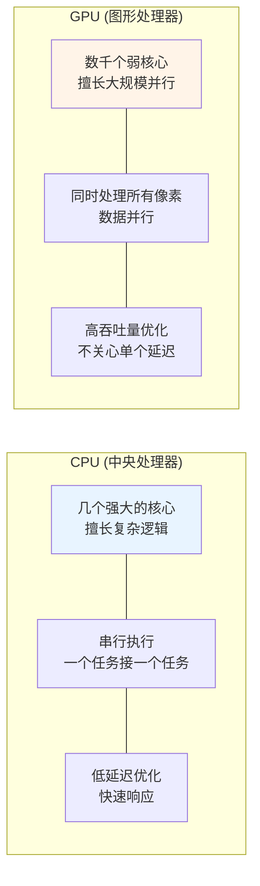
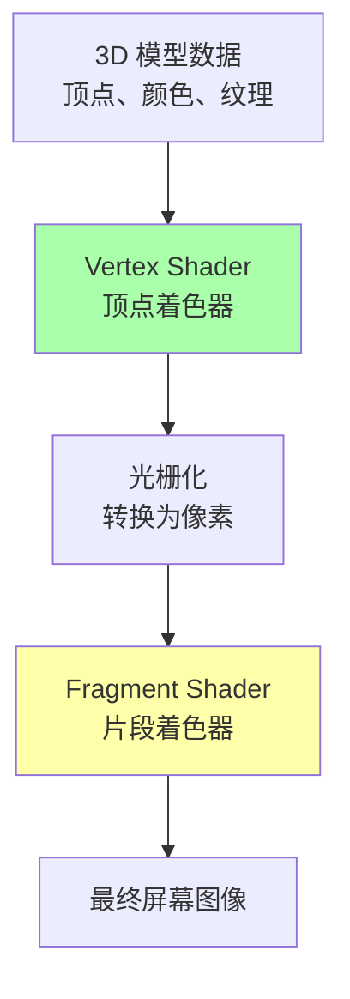
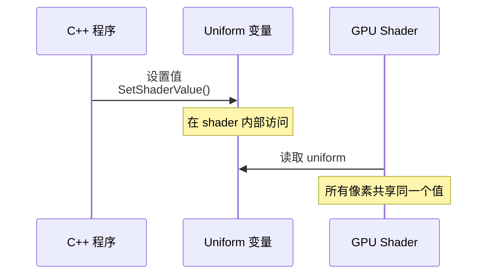

# Class 1: GLSL 着色器编程入门

**课时**: 第 1 课 / 共 11 课  
**预计时间**: 2-3 小时  
**难度**: ⭐⭐☆☆☆ (入门)  

---

## 🎯 本课目标

学完本课程后，你将能够：
- ✅ 理解 GPU 与 CPU 的架构差异
- ✅ 掌握 GLSL 的基本语法结构
- ✅ 编写并运行第一个顶点着色器
- ✅ 理解 `default.vert` 的工作原理

---

## 📚 第一部分：GPU 编程基础（30 分钟）

### 1.1 CPU vs GPU —— 完全不同的思维模式



**关键理解**:
```
CPU 思考方式:
"我要如何快速完成这个任务？"
→ 优化单线程性能

GPU 思考方式:
"我要如何同时处理百万个像素？"
→ 优化并行吞吐量
```

### 1.2 Shader（着色器）是什么？

[WIP_NEED_PIC: GPU 渲染管线流程图，显示 vertex shader 和 fragment shader 的位置]



**简单比喻**:
```
想象你在画一幅画：

Vertex Shader = 打草稿
- 确定物体的位置和形状
- 把 3D 坐标转换到 2D 屏幕

Fragment Shader = 上色
- 决定每个像素的颜色
- 添加光影效果
- 我们今天主要学习这个！
```

---

## 💻 第二部分：GLSL 语法速成（45 分钟）

### 2.1 Shader 的基本结构

每个 GLSL shader 都包含三个部分：

```glsl
// 1. 版本声明 (必须第一行)
#version 330 core

// 2. Uniforms - 从 CPU 传来的数据
uniform mat4 mvp;  // 变换矩阵

// 3. Inputs - 顶点属性
in vec3 vertexPosition;  // 顶点位置

// 4. Outputs - 输出给下一阶段
out vec4 fragColor;  // 片段着色器的输出颜色

// 5. main 函数 - 程序的入口点
void main() {
  // 你的代码写在这里
  gl_Position = mvp * vec4(vertexPosition, 1.0);
}
```

### 2.2 关键概念解析

#### Uniforms —— CPU 与 GPU 的对话窗口



**示例**:
```glsl
// 在 shader 中声明
uniform vec2 uResolution;  // 屏幕分辨率
uniform float uTime;       // 时间
uniform vec4 uBrushColor;  // 画笔颜色

// 在 C++ 中设置
SetShaderValue(shader, GetShaderLocation(shader, "uTime"), 
               &timeSeconds, SHADER_UNIFORM_FLOAT);
```

#### Inputs & Outputs —— 数据流动

```glsl
// Vertex Shader
in vec3 vertexPosition;   // 输入：顶点位置
out vec2 texCoord;        // 输出：传递给 fragment shader

void main() {
  gl_Position = mvp * vec4(vertexPosition, 1.0);
  texCoord = vertexPosition.xy;  // 传递给下一步
}

// Fragment Shader
in vec2 texCoord;         // 输入：从 vertex shader 来
out vec4 fragColor;       // 输出：最终颜色

void main() {
  fragColor = vec4(texCoord, 0.0, 1.0);  // 使用输入计算输出
}
```

### 2.3 GLSL 数据类型速查

```glsl
// 标量 (单个值)
bool    flag = true;      // 布尔值
int     count = 10;       // 整数
float   pi = 3.14159;     // 浮点数

// 向量 (2-4 个分量)
vec2 position = vec2(1.0, 2.0);    // 2D 坐标
vec3 color = vec3(1.0, 0.0, 0.0);  // RGB 颜色
vec4 rgba = vec4(1.0, 0.0, 0.0, 1.0); // RGBA

// 访问向量分量
vec3 col = vec3(1.0, 0.5, 0.2);
float r = col.r;  // 或 col.x
float g = col.g;  // 或 col.y
float b = col.b;  // 或 col.z

// 矩阵
mat4 transform = mat4(1.0);  // 单位矩阵

// 采样器 (纹理)
uniform sampler2D uTexture;  // 2D 纹理
```

---

## 🎨 第三部分：实战 default.vert（60 分钟）

### 3.1 完整的顶点着色器代码

``glsl
#version 330 core

// 输入：顶点位置（来自 CPU）
in vec3 vertexPosition;

// Uniform: 模型 - 视图 - 投影矩阵
uniform mat4 mvp;

void main() {
  // 将 3D 顶点位置转换到 2D 屏幕空间
  gl_Position = mvp * vec4(vertexPosition, 1.0);
}
```

### 3.2 逐行解析

[WIP_NEED_PIC: 顶点变换过程的可视化示意图，从本地坐标到屏幕坐标]

``mermaid
flowchart TD
    A[vertexPosition<br/>vec3 类型<br/>例如：1.0, 0.5, 0.0] --> B[扩展为 vec4<br/>vec4vertexPosition, 1.0]
    B --> C[乘以 MVP 矩阵<br/>mvp × vec4]
    C --> D[gl_Position<br/>齐次裁剪空间坐标<br/>例如：0.5, -0.3, 0.8, 1.0]
    
    style A fill:#e8f4ff
    style D fill:#aaffaa
```

**数学原理（简化版）**:
```
原始 3D 坐标：(x, y, z)
       ↓ 扩展为齐次坐标
齐次坐标：(x, y, z, 1)
       ↓ 乘以 MVP 矩阵
裁剪空间：(x', y', z', w')
       ↓ GPU 自动进行透视除法
屏幕空间：(x'/w', y'/w', z'/w')
```

### 3.3 动手实验：修改顶点位置

让我们尝试修改 shader，看看会发生什么：

#### 实验 1: 放大物体

``glsl
void main() {
  // 方法 1: 直接缩放顶点
  vec3 scaledPosition = vertexPosition * 2.0;
  gl_Position = mvp * vec4(scaledPosition, 1.0);
  
  // 或者方法 2: 在变换后缩放
  // gl_Position = mvp * vec4(vertexPosition, 1.0) * 2.0;
}
```

**预期效果**: 物体会变大 2 倍

#### 实验 2: 翻转图像

``glsl
void main() {
  vec3 flippedPosition = vertexPosition;
  flippedPosition.x = -flippedPosition.x;  // 左右翻转
  
  gl_Position = mvp * vec4(flippedPosition, 1.0);
}
```

**预期效果**: 图像会水平翻转

#### 实验 3: 添加动画

``glsl
uniform float uTime;  // 从 CPU 传入的时间

void main() {
  vec3 animatedPosition = vertexPosition;
  
  // 让物体上下浮动
  animatedPosition.y += sin(uTime * 2.0) * 0.1;
  
  gl_Position = mvp * vec4(animatedPosition, 1.0);
}
```

**预期效果**: 物体会上下浮动

---

## 🔍 第四部分：深入理解（30 分钟）

### 4.1 为什么需要 MVP 矩阵？

[WIP_NEED_PIC: MVP 矩阵变换的可视化示意图，展示从模型空间到屏幕空间的完整过程]

``mermaid
flowchart LR
    subgraph "变换流水线"
        M[Model Matrix<br/>物体空间→世界空间]
        V[View Matrix<br/>世界空间→相机空间]
        P[Projection Matrix<br/>相机空间→裁剪空间]
    end
    
    A[本地坐标<br/>例如：立方体的顶点] --> M
    M --> V
    V --> P
    P --> B[屏幕坐标<br/>最终显示的像素]
    
    MVP["MVP = P × V × M<br/>(注意顺序！从右到左应用)"]
    
    MVP -.-> M
    MVP -.-> V
    MVP -.-> P
    
    style MVP fill:#ffffaa
```

**直观理解**:
```
1. Model 变换：物体在哪里？
   "我的角色站在世界坐标 (10, 0, 5)"

2. View 变换：相机在哪里？
   "相机在 (15, 5, 10)，看着角色"

3. Projection 变换：如何投影到 2D？
   "使用透视投影，近大远小"
```

### 4.2 常见问题 FAQ

**Q1: 为什么我的 shader 编译失败？**

检查这些常见错误：
```glsl
// ❌ 错误：缺少版本声明
#version 330 core  // 必须在第一行！

// ❌ 错误：分号缺失
uniform float value  // 缺少分号

// ❌ 错误：类型不匹配
uniform vec3 color;
color = vec4(1.0, 0.0, 0.0, 1.0);  // vec3 ≠ vec4

// ✅ 正确写法
#version 330 core
uniform vec3 color;
color = vec3(1.0, 0.0, 0.0);
```

**Q2: uniform 的值没有生效？**

检查清单：
1. ✅ 在 shader 中正确声明 uniform
2. ✅ 在 C++ 中使用相同的名称获取 location
3. ✅ 在绘制调用之前设置 uniform 的值
4. ✅ 确保数据类型匹配（float vs vec3 vs mat4）

**Q3: gl_Position 的 W 分量有什么用？**

```glsl
// 透视除法会自动执行
vec4 clipSpace = vec4(1.0, 1.0, 0.5, 2.0);
// GPU 会自动计算:
// screenX = clipSpace.x / clipSpace.w = 1.0 / 2.0 = 0.5
// screenY = clipSpace.y / clipSpace.w = 1.0 / 2.0 = 0.5
```

---

## 📝 第五部分：课后练习（30 分钟）

### 练习 1: 基础题

修改 `default.vert`，实现以下效果：

1. **缩小物体**: 将所有顶点坐标缩小到原来的 50%
2. **向上移动**: 将所有顶点在 Y 轴方向上移 0.2 个单位
3. **旋转**: 绕 Z 轴旋转 45 度（提示：使用旋转矩阵）

参考答案：
```glsl
uniform float uTime;

void main() {
  vec3 pos = vertexPosition;
  
  // 1. 缩小 50%
  pos *= 0.5;
  
  // 2. 向上移动
  pos.y += 0.2;
  
  // 3. 绕 Z 轴旋转 45 度
  float angle = 3.14159 / 4.0;  // 45 度
  float c = cos(angle);
  float s = sin(angle);
  
  vec2 rotated = vec2(
    pos.x * c - pos.y * s,
    pos.x * s + pos.y * c
  );
  pos.xy = rotated;
  
  gl_Position = mvp * vec4(pos, 1.0);
}
```

### 练习 2: 进阶题

创建一个简单的动画 shader：

要求：
- 使用 `uTime` uniform
- 让物体做圆周运动
- 同时改变颜色（需要在 fragment shader 中配合）

提示：
```glsl
// Vertex Shader
uniform float uTime;
void main() {
  vec3 pos = vertexPosition;
  
  // 圆周运动
  float radius = 0.5;
  pos.x += cos(uTime) * radius;
  pos.y += sin(uTime) * radius;
  
  gl_Position = mvp * vec4(pos, 1.0);
}
```

---

## 🎓 知识检查

完成下面的小测验，检验你的理解：

### 测验 1: 选择题

1. **GLSL shader 的第一行必须是什么？**
   - A) `void main() {}`
   - B) `#version 330 core` ✓
   - C) `uniform mat4 mvp;`
   - D) `precision highp float;`

2. **Uniform 变量的作用是？**
   - A) 存储顶点数据
   - B) 在 shader 阶段之间传递数据
   - C) 从 CPU 向 GPU 传递常量数据 ✓
   - D) 输出最终颜色

3. **`gl_Position` 是什么类型的变量？**
   - A) `vec3`
   - B) `vec4` ✓
   - C) `mat4`
   - D) `float`

### 测验 2: 理解题

解释以下代码的作用：
``glsl
gl_Position = mvp * vec4(vertexPosition, 1.0);
```

参考答案：
```
这行代码将 3D 顶点位置转换到裁剪空间：
1. vertexPosition 是 vec3 类型 (x, y, z)
2. vec4(vertexPosition, 1.0) 将其扩展为齐次坐标 (x, y, z, 1)
3. mvp 是 4×4 变换矩阵
4. 矩阵×向量 = 变换后的新位置
5. 结果存储在 gl_Position 中，供 GPU 后续处理
```

---

## 📚 延伸阅读

### 推荐阅读资源

1. **[The Book of Shaders](https://thebookofshaders.com/)** - 免费的 GLSL 入门书籍
2. **[GLSL 官方文档](https://www.khronos.org/opengl/wiki/Core_Language_(GLSL))** - 权威参考
3. **[Shadertoy](https://www.shadertoy.com/)** - 查看其他人的 shader 作品

### 下节课预告

**Class 2: 场景预处理——prepscene.frag**

你将学习：
- 🎨 如何采样纹理并混合颜色
- 🌈 HSV 颜色空间和彩虹动画
- ⭕ SDF 圆形函数的神奇应用
- 🖱️ 实现鼠标交互效果

---

## 💡 关键要点总结

``mermaid
mindmap
  root((本课重点))
    GPU 架构[GPU 思维]
      大规模并行
      数据驱动
      吞吐量优先
    
    GLSL 基础[语法要点]
      #version 声明
      uniform 传参
      in/out 数据流
      main 函数
    
    Vertex Shader[顶点着色器]
      处理顶点位置
      输出 gl_Position
      MVP 变换
    
    实践技巧[调试方法]
      从小改动开始
      观察效果变化
      理解每行作用
```

---

**恭喜你完成了第一课！** 🎉

记住：每个图形编程大师都是从第一个 shader 开始的。不要害怕犯错，多尝试、多实验！

**下一步**: 准备好继续了吗？打开 [`class2_scene_preparation.md`](./class2_scene_preparation.md) 开始第二课的学习！
