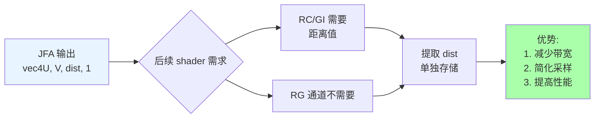

# Class 5: 距离场提取——distfield.frag

**创建时间**: 2026-03-22  
**难度**: ⭐⭐☆  
**预计时间**: 2-3 小时  

---

## 🎯 学习目标

完成本课程后，你将能够：

- ✅ 理解如何从 JFA 结果中提取距离信息
- ✅ 掌握通道分离技术
- ✅ 为光线步进（raymarching）准备数据
- ✅ 可视化距离场进行调试

---

## 📖 核心概念

### 为什么需要提取距离场？

在 Class 4 中，我们使用 JFA 算法生成了距离场。JFA 的输出格式是：

```glsl
// JFA 输出：vec4(U, V, distance, 1.0)
vec4 jfaOutput = texture(uJFA, uv);
```

[WIP_NEED_PIC: JFA 输出纹理的可视化图，显示 RG 通道存储坐标，B 通道存储距离]

**问题**：后续的 Radiance Cascades 和全局光照 shader 只需要距离值，不需要 UV 坐标。

**解决方案**：提取 B 通道的距离值，存储到单独的纹理中。

### 通道分离的优势



**好处**：
1. **减少内存带宽** - 只传输需要的数据
2. **简化代码** - 后续 shader 只需读取 `.r` 或 `.b` 通道
3. **提高缓存命中率** - 更紧凑的数据布局

---

## 💻 Shader 实现

### distfield.frag 完整代码

```glsl
#version 330 core

out vec4 fragColor;

uniform sampler2D uJFA;

void main() {
  // 方法 1: 使用 textureSize (推荐)
  vec2 fragCoord = gl_FragCoord.xy / textureSize(uJFA, 0);
  
  // 方法 2: 使用 uniform (备选)
  // uniform vec2 uResolution;
  // vec2 fragCoord = gl_FragCoord.xy / uResolution;
  
  // JFA 输出：vec4(U, V, distance, 1.0)
  // 我们只需要 B 通道的距离值
  float distance = texture(uJFA, fragCoord).b;
  
  // 复制到所有 RGB 通道（灰度显示）
  fragColor = vec4(vec3(distance), 1.0);
}
```

### 代码解析

#### 1. 坐标计算

```glsl
vec2 fragCoord = gl_FragCoord.xy / textureSize(uJFA, 0);
```

- `gl_FragCoord.xy`: 当前片元的像素坐标（如 [128.5, 256.5]）
- `textureSize(uJFA, 0)`: 获取纹理尺寸（如 [512, 512]）
- 相除得到归一化的 UV 坐标（0-1 范围）

[WIP_NEED_PIC: 屏幕空间坐标到 UV 坐标的转换示意图]

#### 2. 距离提取

```glsl
float distance = texture(uJFA, fragCoord).b;
```

- 采样 JFA 纹理
- `.b` 访问蓝色通道（第 3 个分量）
- 得到该点到最近障碍物的距离

#### 3. 灰度输出

```glsl
fragColor = vec4(vec3(distance), 1.0);
```

- `vec3(distance)` 将标量扩展为 `(distance, distance, distance)`
- 结果是灰度图像：距离越远越亮

---

## 🎨 动手实验

### 实验 1: 可视化距离场

**目标**：观察距离场的实际效果

**步骤**：

1. 运行程序，切换到距离场显示模式
2. 观察不同区域的颜色变化

**预期效果**：

```
┌─────────────────────────────────┐
│                                 │
│   ████████                      │
│   ██      ██     渐变区域       │
│   ██ 障碍物 ██   (距离增加)      │
│   ██      ██                    │
│   ████████                      │
│                                 │
│   黑色 = 近距离                 │
│   白色 = 远距离                 │
└─────────────────────────────────┘
```

[WIP_NEED_PIC: 实际的距离场可视化截图，黑白渐变效果]

### 实验 2: 距离归一化

修改 shader，将距离映射到 0-1 范围：

```glsl
uniform float uMaxDistance;  // 最大距离，如 100.0

void main() {
  vec2 fragCoord = gl_FragCoord.xy / textureSize(uJFA, 0);
  float distance = texture(uJFA, fragCoord).b;
  
  // 归一化到 0-1
  float normalizedDist = clamp(distance / uMaxDistance, 0.0, 1.0);
  
  fragColor = vec4(vec3(normalizedDist), 1.0);
}
```

**观察**：调整 `uMaxDistance` 参数，看颜色范围如何变化。

### 实验 3: 伪彩色编码

为了让距离场更易读，可以使用颜色编码：

```glsl
vec3 heatmap(float t) {
  // 简单的热力图：蓝 → 绿 → 红
  return vec3(t, 1.0 - t, 0.0);
}

void main() {
  vec2 fragCoord = gl_FragCoord.xy / textureSize(uJFA, 0);
  float distance = texture(uJFA, fragCoord).b;
  float normalizedDist = clamp(distance / uMaxDistance, 0.0, 1.0);
  
  vec3 color = heatmap(normalizedDist);
  fragColor = vec4(color, 1.0);
}
```

[WIP_NEED_PIC: 伪彩色距离场效果图]

---

## 🔍 调试技巧

### 常见问题 1: 距离场全黑

**原因**：
- JFA 未正确执行
- 种子点未设置
- 距离值过大导致归一化后接近 0

**排查步骤**：
1. 检查 JFA pass 是否运行
2. 确认 prepjfa.frag 已正确编码种子
3. 打印最大距离值：`printf("Max dist: %f\n", maxDistance);`

### 常见问题 2: 距离场有条纹

**原因**：
- JFA 传播次数不足
- 跳跃步长计算错误

**解决**：
- 增加 JFA pass 数量（通常 5-9 次）
- 检查 jump size 是否按 `ceil(size/2)` 递减

### 常见问题 3: 坐标翻转

**症状**：图像上下或左右颠倒

**解决**：尝试翻转 UV 坐标：

```glsl
vec2 fragCoord = gl_FragCoord.xy / textureSize(uJFA, 0);
fragCoord.y = 1.0 - fragCoord.y;  // 翻转 Y 轴
```

---

## 📊 性能分析

### 带宽对比

| 方案 | 每像素读取 | 每像素写入 | 总带宽 |
|------|-----------|-----------|--------|
| 直接使用 JFA 纹理 | vec4 (16 bytes) | - | 16 B/px |
| 提取到单独纹理 | float (4 bytes) | float (4 bytes) | 8 B/px |

**节省**：50% 带宽！

### GPU 周期数

在典型移动 GPU 上：
- 采样纹理：~2-4 周期
- 通道提取：~1 周期
- 写入：~2 周期

**总计**：~5-7 周期/像素（可并行处理）

---

## 🧠 知识检查

### 小测验

1. **JFA 输出的哪个通道存储距离？**
   - A) R
   - B) G
   - C) B ✓
   - D) A

2. **为什么要提取距离到单独纹理？（多选）**
   - A) 减少带宽 ✓
   - B) 让代码更复杂
   - C) 简化后续 shader ✓
   - D) 提高缓存效率 ✓

3. **`vec3(distance)` 的结果是什么？**
   - A) (distance, 0, 0)
   - B) (distance, distance, distance) ✓
   - C) (0, 0, distance)
   - D) 编译错误

---

## 🔗 与其他课程的联系

### 前置知识
- Class 3: JFA 种子编码（距离的来源）
- Class 4: JFA 传播算法（距离的计算）

### 后续应用
- Class 6: GI 使用距离场进行 raymarching
- Class 7-8: RC 使用距离场确定光线步进区间

---

## 📚 扩展阅读

- [GLSL 纹理采样文档](https://www.khronos.org/registry/OpenGL-Refpages/gl4/html/texture.xhtml)
- [距离场应用综述](https://blog.maxg.io/signed-distance-fields/)
- [GPU 带宽优化技巧](https://developer.nvidia.com/gpugems/gpugems/part-vi-gpu-computation/chapter-38-efficient-sparse-texture-sampling)

---

## ✅ 总结

本节课你学到了：

✅ 距离场提取的原理和必要性  
✅ 通道分离技术的实现方法  
✅ 距离场可视化的多种技巧  
✅ 性能优化的基本概念  

**下一步**：Class 6 将使用这个距离场实现真正的全局光照！

---

*提示：如果遇到问题，记得使用 broken.frag 棋盘格 shader 检查纹理是否正确绑定！* 🛠️
