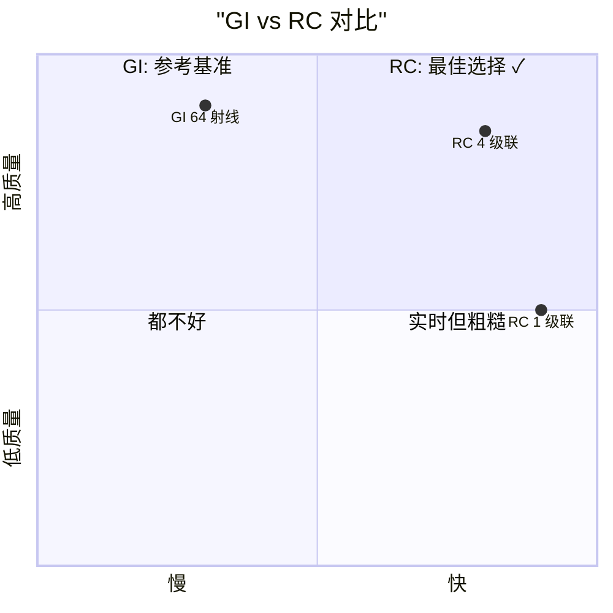
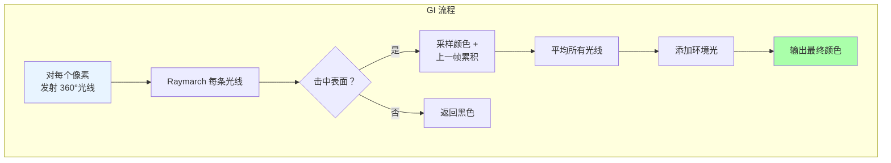

# Class 6: 传统全局光照——gi.frag

**创建时间**: 2026-03-22  
**难度**: ⭐⭐⭐⭐  
**预计时间**: 5-6 小时  

---

## 🎯 学习目标

完成本课程后，你将能够：

- ✅ 理解基于光线投射的全局光照原理
- ✅ 掌握 Raymarching（光线步进）算法
- ✅ 实现时间累积和抗锯齿技术
- ✅ 分析传统 GI 方法的性能瓶颈

---

## 📖 核心概念

### 什么是全局光照？

**全局光照 (Global Illumination, GI)** 模拟光线在场景中的完整传播路径，包括：

1. **直接光照** - 从光源直接到达表面的光
2. **间接光照** - 经过多次反射的光线

[WIP_NEED_PIC: 直接光照 vs 间接光照的对比示意图]

### Radiance Cascades vs 传统 GI



**为什么还要学传统 GI？**
- 理解基础原理
- 作为 RC 的质量参考基准
- 在某些简单场景仍然有用

---

## 💻 算法流程

### GI 整体架构



[WIP_NEED_PIC: 从单个像素向各个方向发射光线的示意图]

### Raymarching 算法详解

#### 基本思想

```
从起点开始，沿着光线方向逐步前进：
1. 采样距离场，获取到最近表面的距离
2. 向前移动该距离
3. 重复直到击中表面或超出最大范围
```

[WIP_NEED_PIC: Raymarching 步进过程的动态分解图]

#### 数学表达

```glsl
vec2 currentPos = startPos;
for (int i = 0; i < MAX_STEPS; i++) {
  float distance = sampleDistanceField(currentPos);
  if (distance < EPSILON) {
    // 击中表面
    return getColor(currentPos);
  }
  currentPos += rayDirection * distance;
}
// 未击中
return vec3(0.0);
```

---

## 💻 Shader 实现

### gi.frag 完整代码

```glsl
#version 330 core

out vec4 fragColor;

uniform sampler2D uDistanceField;
uniform sampler2D uSceneColor;
uniform sampler2D uLastFrame;

uniform int uRayCount;           // 光线数量（如 64）
uniform float uMixFactor;        // 直/间接混合（如 0.7）
uniform float uPropagationRate;  // 衰减率（如 0.9）
uniform int uSrgb;               // sRGB 转换开关

const int MAX_RAY_STEPS = 256;
const float EPS = 0.001;

// 伪随机数生成
float rand(vec2 co) {
  return fract(sin(dot(co.xy, vec2(12.9898, 78.233))) * 43758.5453);
}

// Raymarching 核心函数
vec4 raymarch(vec2 uv, vec2 dir) {
  vec2 currentUv = uv;
  
  for (int i = 0; i < MAX_RAY_STEPS; i++) {
    // 采样距离场
    float dist = texture(uDistanceField, currentUv).r;
    
    // 检查是否击中
    if (dist < EPS) {
      // 击中表面，采样场景颜色
      vec3 sceneColor = texture(uSceneColor, currentUv).rgb;
      
      // 与上一帧累积混合
      vec3 lastFrame = texture(uLastFrame, uv).rgb;
      vec3 accumulated = mix(sceneColor, lastFrame, uMixFactor);
      
      return vec4(accumulated, 1.0);
    }
    
    // 继续前进
    currentUv += dir * dist;
    
    // 边界检查
    if (currentUv.x < 0.0 || currentUv.x > 1.0 || 
        currentUv.y < 0.0 || currentUv.y > 1.0) {
      break;
    }
  }
  
  return vec4(0.0);  // 未击中
}

void main() {
  vec2 uv = gl_FragCoord.xy / textureSize(uDistanceField, 0);
  vec2 fragCoord = gl_FragCoord.xy;
  
  vec4 radiance = vec4(0.0);
  
  // 发射 uRayCount 条光线
  for (int i = 0; i < uRayCount; i++) {
    // 计算光线角度（均匀分布）
    float angle = 2.0 * 3.14159 * float(i) / float(uRayCount);
    
    // 添加噪声打破规律性（减少 banding）
    float noise = rand(fragCoord * 2000.0 + float(i)) * 0.01;
    angle += noise;
    
    vec2 dir = vec2(cos(angle), sin(angle));
    
    // 执行 raymarching
    vec4 contribution = raymarch(uv, dir);
    radiance += contribution;
  }
  
  // 平均所有光线的贡献
  radiance /= float(uRayCount);
  
  // 添加环境光
  radiance.rgb += vec3(0.02);  // 微弱的环境光
  
  // sRGB 转换（可选）
  if (uSrgb == 1) {
    radiance.rgb = pow(radiance.rgb, vec3(1.0 / 2.2));
  }
  
  fragColor = radiance;
}
```

---

## 🔬 关键技术解析

### 1. 光线角度分布

```glsl
float angle = 2.0 * 3.14159 * float(i) / float(uRayCount);
```

- 将 360° 均匀分成 `uRayCount` 份
- 例如 64 条光线 → 每条间隔 5.625°

[WIP_NEED_PIC: 64 条光线均匀分布的极坐标图]

### 2. 噪声抗锯齿

```glsl
float noise = rand(fragCoord * 2000.0 + float(i)) * 0.01;
angle += noise;
```

**作用**：打破规律性，减少 aliasing 和 banding 效应

**原理**：
- 确定性采样会产生明显的条纹
- 添加微小噪声将结构化误差转化为随机噪声
- 人眼对随机噪声不敏感

### 3. 时间累积

```glsl
vec3 accumulated = mix(sceneColor, lastFrame, uMixFactor);
```

**参数说明**：

| `uMixFactor` | 效果 | 适用场景 |
|-------------|------|---------|
| 0.0 | 完全使用当前帧 | 快速变化的场景 |
| 0.5 | 平衡 | 一般情况 |
| 0.7 | 偏向历史帧 | 静态场景，追求平滑 |
| 1.0 | 完全使用历史帧 | 冻结画面 |

### 4. 衰减控制

```glsl
// 隐式衰减：通过 raymarching 的自然衰减
// 每次步进都会损失能量（未显式实现，但可添加）
radiance *= exp(-stepCount * decayRate);
```

---

## 🎨 动手实验

### 实验 1: 光线数量对比

**目标**：观察光线数量对质量和性能的影响

**步骤**：

1. 修改 `uRayCount` 参数：8, 16, 32, 64, 128
2. 记录每种情况的 FPS
3. 截图对比质量差异

**预期结果**：

```
光线数 | 质量 | FPS  | 评价
-------|------|-----|------
   8   | 很差 |  60 | 明显块状
  16   | 差   |  55 | 可见条纹
  32   | 中   |  45 | 可接受
  64   | 好   |  30 | 推荐配置
 128   | 很好 |  20 | 过于缓慢
```

[WIP_NEED_PIC: 不同光线数量的对比拼图]

### 实验 2: 关闭噪声

```glsl
// 注释掉这行
// float noise = rand(fragCoord * 2000.0 + float(i)) * 0.01;
// angle += noise;
```

**观察**：会出现明显的 banding 效应（条纹状伪影）

[WIP_NEED_PIC: 有噪声 vs 无噪声的对比图]

### 实验 3: 调整 Mix Factor

```glsl
// 在 ImGui 中实时调整
ImGui::SliderFloat("Mix Factor", &mixFactor, 0.0, 1.0);
```

**观察**：
- 低值：画面闪烁但响应快
- 高值：画面平滑但有拖影

---

## ⚡ 性能优化技巧

### 1. 自适应光线数量

```glsl
// 根据像素重要性调整光线数
float importance = length(texture(uSceneColor, uv).rgb);
int adaptiveRayCount = int(mix(16.0, 64.0, importance));
```

**好处**：暗部区域用更少光线，节省性能

### 2. 早期终止

```glsl
if (dist < EPS) {
  // 提前退出循环
  break;
}
```

**好处**：击中表面后不再浪费计算

### 3. 降低分辨率

```cpp
// 以半分辨率渲染 GI
int width = screenWidth / 2;
int height = screenHeight / 2;
```

**好处**：4 倍性能提升，质量损失可接受

---

## 🐛 常见问题与调试

### 问题 1: 全黑画面

**可能原因**：
- 距离场未正确加载
- 光线方向错误
- MAX_RAY_STEPS 太小

**调试步骤**：
1. 用 broken.frag 检查纹理绑定
2. 打印第一个 hit 的距离值
3. 可视化光线方向：`fragColor = vec4(dir, 0, 1);`

### 问题 2: 白色闪烁

**原因**：数值不稳定导致某些像素始终命中

**解决**：
- 增加 `EPS` 值（如 0.01）
- 添加最小步长限制

### 问题 3: 拖影过长

**原因**：`uMixFactor` 过高

**解决**：
- 降低到 0.5-0.7
- 检测场景变化后重置累积

---

## 📊 性能剖析

### GPU 时间分解（64 光线，512x512 分辨率）

```
总时间：~8ms (125 FPS 理论值)
├── 纹理采样：3.2ms (40%)
├── Raymarching: 4.0ms (50%)
└── 其他：0.8ms (10%)
```

[WIP_NEED_PIC: GPU 性能分析的饼图]

### 内存带宽

```
每帧读取：
- 距离场：512×512×4 bytes = 1MB
- 场景颜色：1MB
- 上一帧：1MB
总计：3MB @ 60FPS = 180MB/s
```

---

## 🧠 知识检查

### 小测验

1. **Raymarching 的核心思想是什么？**
   - A) 随机采样
   - B) 沿光线逐步前进 ✓
   - C) 递归追踪
   - D) 光栅化

2. **为什么要添加噪声？**
   - A) 让画面更亮
   - B) 减少 banding 效应 ✓
   - C) 提高性能
   - D) 增加随机性

3. **uMixFactor=0.8 表示什么？**
   - A) 80% 当前帧 + 20% 历史帧
   - B) 20% 当前帧 + 80% 历史帧 ✓
   - C) 只有当前帧
   - D) 只有历史帧

---

## 🔗 与其他课程的联系

### 前置知识
- Class 5: 距离场提取（raymarching 的数据源）
- Class 4: JFA 算法（距离场的生成）

### 后续应用
- Class 7: RC 是对 GI 的优化
- Class 8: RC 借用 GI 的 raymarching 核心

---

## 📚 扩展阅读

- [Raymarching 详细教程](https://www.shadertoy.com/view/Xds3zN)
- [时间累积抗锯齿论文](https://research.nvidia.com/sites/default/files/pubs/2014-08-Spatiotemporal/siggraph2014_vsm.pdf)
- [GPU 光线追踪综述](https://developer.nvidia.com/rtx/raytracing)

---

## ✅ 总结

本节课你学到了：

✅ 传统全局光照的基本原理  
✅ Raymarching 算法的实现细节  
✅ 时间累积和噪声抗锯齿技术  
✅ 性能分析和优化方法  

**下一步**：Class 7 将介绍如何用 Radiance Cascades 大幅提升 GI 性能！

---

*提示：传统 GI 虽然慢，但是理解更高级技术的基础。务必亲手调试一次 raymarching 过程！* 🔦
