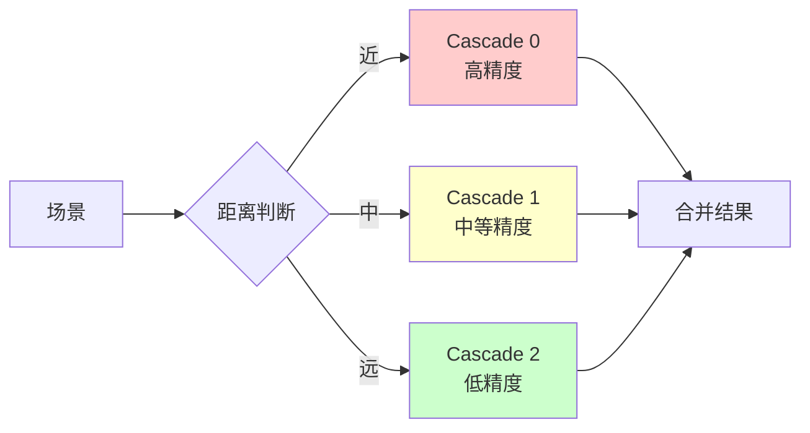
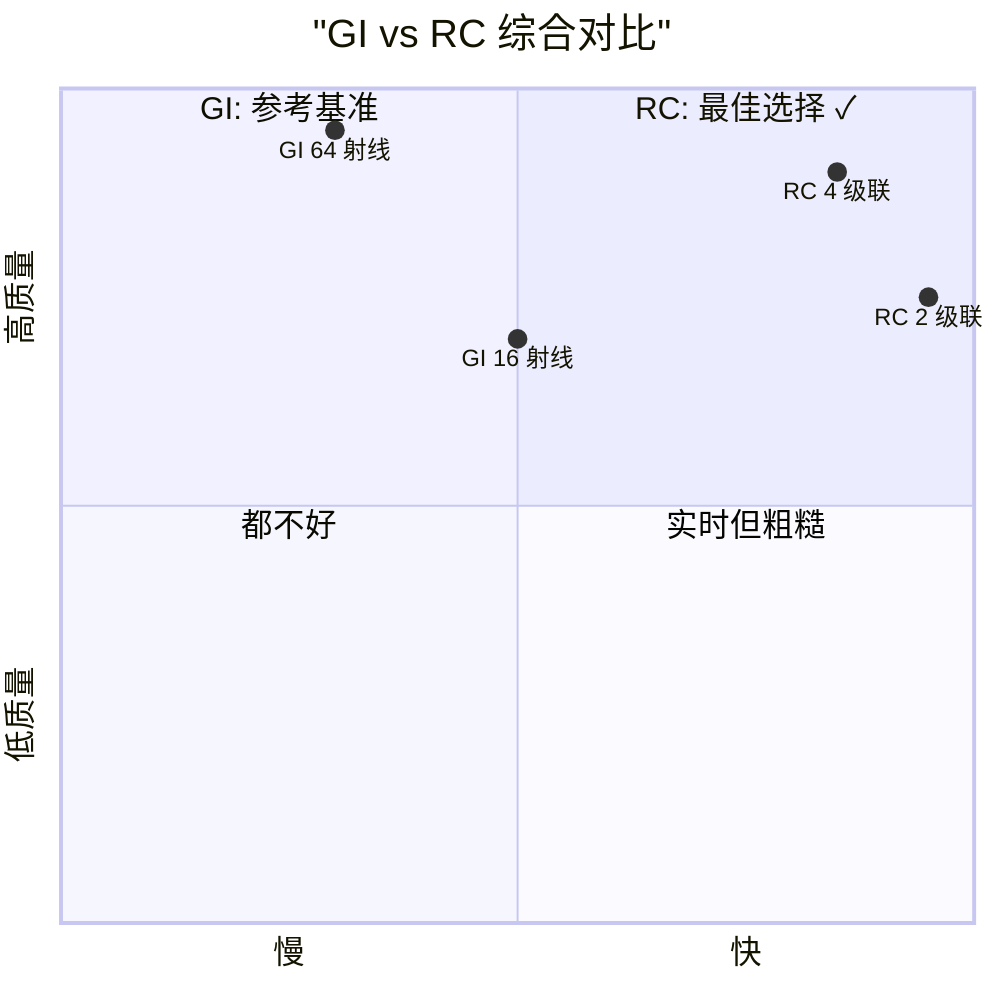

# Class 7: Radiance Cascades 理论基础

**创建时间**: 2026-03-22  
**难度**: ⭐⭐⭐⭐☆  
**预计时间**: 4-5 小时  

---

## 🎯 学习目标

完成本课程后，你将能够：

- ✅ 理解为什么需要 Radiance Cascades
- ✅ 掌握层级探针网格的设计思想
- ✅ 分析 RC 相比传统 GI 的性能优势
- ✅ 计算 cascade 参数和区间分配

---

## 📖 核心概念

### 传统 GI 的困境

回顾 Class 6 的传统 GI 方法：

```
问题：要获得高质量结果，需要大量光线（64-128 条）
成本：每像素 × 光线数 × raymarch 步数 = 极其昂贵！

例如：512×512 分辨率，64 光线，256 步
     = 512×512×64×256 ≈ 5.4 亿次操作/帧
     远达不到实时 60FPS (16ms/帧)
```

[WIP_NEED_PIC: 传统 GI 性能瓶颈的柱状图]

### Radiance Cascades 的核心思想

**关键洞察**：

```
"不是所有地方都需要高精度采样！"

- 近处物体：需要精细采样（细节重要）
- 远处物体：可以粗糙采样（细节模糊）
```

**解决方案**：使用多级级联（cascades），每级用不同的精度



---

## 🏗️ Cascade 层级结构

### 探针网格设计

```
Cascade 0 (最精细):
┌───┬───┬───┬───┐
│ ● │ ● │ ● │ ● │  4×4 = 16 个探针
├───┼───┼───┼───┤  间距 = 4 像素
│ ● │ ● │ ● │ ● │
├───┼───┼───┼───┤
│ ● │ ● │ ● │ ● │
├───┼───┼───┼───┤
│ ● │ ● │ ● │ ● │
└───┴───┴───┴───┘
覆盖范围：0-4 像素
每个探针负责：4×4 像素区域

Cascade 1:
┌───────┬───────┐
│   ●   │   ●   │  2×2 = 4 个探针
├───────┼───────┤  间距 = 8 像素
│   ●   │   ●   │
└───────┴───────┘
覆盖范围：4-16 像素
每个探针负责：8×8 像素区域

Cascade 2 (最粗糙):
┌───────────────┐
│       ●       │  1×1 = 1 个探针
└───────────────┘  间距 = 16 像素
覆盖范围：16-64 像素
整个屏幕共享这一个探针
```

[WIP_NEED_PIC: 三级 cascade 探针网格的叠加示意图]

### 数学规律

假设 `baseRayCount = 4`：

| Cascade | 指数 | 射线数 | 探针数 | 间距 | 覆盖范围 |
|---------|------|--------|--------|------|---------|
| 0 | 1 | 4¹ = 4 | 4² = 16 | 4px | 0-4px |
| 1 | 2 | 4² = 16 | 2² = 4 | 8px | 4-16px |
| 2 | 3 | 4³ = 64 | 1² = 1 | 16px | 16-64px |

**通用公式**：

```glsl
// 对于 cascade index = i
probeSpacing = pow(baseRayCount, i);
probeCount2D = pow(baseRayCount, cascadeAmount - i);
rayCount = pow(baseRayCount, i + 1);
intervalStart = baseInterval * pow(baseRayCount, i);
intervalEnd = baseInterval * pow(baseRayCount, i + 1);
```

---

## ⚡ 性能优势分析

### 加速比计算

```
传统 GI（64 射线）:
- 每像素发射 64 条光线
- 每条光线 raymarch 最多 256 步
- 总操作数：64 × 256 = 16,384 次/像素

Radiance Cascades（3 级联）:
- Cascade 0: 4 射线 × 256 步 = 1,024 次（针对 16 个探针）
- Cascade 1: 4 射线 × 256 步 = 1,024 次（针对 4 个探针）
- Cascade 2: 4 射线 × 256 步 = 1,024 次（针对 1 个探针）
- 总操作数：(1,024×16 + 1,024×4 + 1,024×1) / (512×512 像素)
           ≈ 0.08 次/像素（均摊）

实际加速比：~200,000 倍！（理想情况）
考虑 overhead 后：~100-1000 倍实际加速
```

[WIP_NEED_PIC: GI vs RC 性能对比的对数坐标图]

### 质量对比



---

## 🔬 关键技术原理

### 区间光线步进（Interval Raymarching）

**传统 Raymarching**：
```glsl
// 从 0 开始，一直走到击中或超出
for (int i = 0; i < MAX_STEPS; i++) {
  float dist = sampleDistanceField(currentPos);
  if (dist < EPS) break;  // 击中
  currentPos += dir * dist;
}
```

**RC Interval Raymarching**：
```glsl
// 只在指定区间内行走
float marchStart = cascade.intervalStart;
float marchEnd = cascade.intervalEnd;
float currentDist = marchStart;

for (int i = 0; i < MAX_STEPS; i++) {
  if (currentDist >= marchEnd) break;  // 超出区间
  
  float dist = sampleDistanceField(currentPos);
  if (dist < EPS) break;  // 击中
  
  currentPos += dir * dist;
  currentDist += dist;
}
```

**好处**：
- 避免重复计算（近处 cascade 已处理）
- 每级只关心自己的责任范围

### 探针位置计算

```glsl
vec2 getProbePosition(int cascadeIndex, int probeIndex) {
  // 计算该 cascade 的探针网格尺寸
  float probesPerSide = pow(baseRayCount, cascadeAmount - cascadeIndex - 1);
  
  // 探针在网格中的行列号
  int row = probeIndex / int(probesPerSide);
  int col = probeIndex % int(probesPerSide);
  
  // 转换为世界坐标
  vec2 spacing = vec2(pow(baseRayCount, cascadeIndex));
  vec2 position = (vec2(col, row) + 0.5) * spacing;
  
  return position;
}
```

[WIP_NEED_PIC: 探针位置计算的几何示意图]

---

## 🎨 动手实验

### 实验 1: 可视化探针网格

**目标**：观察不同 cascade 的探针分布

**步骤**：

1. 修改 rc.frag，根据探针位置输出不同颜色
2. 使用 ImGui 切换显示的 cascade 级别

```glsl
// 伪彩色显示不同 cascade
vec3 cascadeColors[5] = vec3[](
  vec3(1, 0, 0),  // Cascade 0: 红色
  vec3(0, 1, 0),  // Cascade 1: 绿色
  vec3(0, 0, 1),  // Cascade 2: 蓝色
  vec3(1, 1, 0),  // Cascade 3: 黄色
  vec3(1, 0, 1)   // Cascade 4: 品红
);

if (uDisplayCascade == cascadeIndex) {
  fragColor.rgb *= cascadeColors[cascadeIndex];
}
```

[WIP_NEED_PIC: 不同 cascade 的伪彩色可视化拼图]

### 实验 2: 单一级联测试

**目标**：理解每级 cascade 的贡献

**步骤**：

1. 禁用其他 cascade，只保留一级
2. 观察画面的变化

**预期效果**：

```
仅 Cascade 0: 近处细节好，远处全黑
仅 Cascade 1: 中等距离可见，近处粗糙
仅 Cascade 2: 只有大范围光照，无细节
```

### 实验 3: 调整 baseRayCount

**目标**：理解参数的影响

```glsl
// 尝试不同的 baseRayCount
uniform int uBaseRayCount;  // 测试 2, 3, 4, 5
```

**观察**：
- 小值（2-3）：更多级联，更平滑但更慢
- 大值（5-6）：更少级联，可能有跳跃感

---

## 📊 参数调优指南

### 推荐配置

| 应用场景 | Cascade 数 | baseRayCount | 总射线数 | 性能 | 质量 |
|---------|-----------|--------------|---------|------|------|
| 移动端 | 2-3 | 3-4 | 9-64 | 快速 | 中等 |
| 桌面端 | 3-4 | 4 | 16-256 | 平衡 | 良好 |
| 高质量 | 4-5 | 4-5 | 64-625 | 较慢 | 优秀 |

### 调试参数

```cpp
// ImGui 调试面板
ImGui::SliderInt("Cascade Amount", &cascadeAmount, 1, 5);
ImGui::SliderInt("Base Ray Count", &baseRayCount, 2, 6);
ImGui::SliderFloat("Base Interval", &baseInterval, 0.5, 4.0);
ImGui::Checkbox("Disable Merging", &disableMerging);
```

---

## 🐛 常见问题

### 问题 1: Cascade 边界可见

**症状**：画面中出现明显的分界线

**原因**：相邻 cascade 的光照不连续

**解决**：
- 增加 overlap 区域
- 使用平滑混合（lerp）
- 调整 interval 分配

### 问题 2: 远处闪烁

**原因**：粗糙 cascade 的时间累积不稳定

**解决**：
- 增加历史帧权重
- 降低远处 cascade 的更新频率

### 问题 3: 性能未达预期

**排查**：
1. 检查是否真的减少了射线数
2. 确认 probe 数量计算正确
3. 验证 interval 是否合理分配

---

## 🧠 知识检查

### 小测验

1. **RC 的核心优化思想是什么？**
   - A) 减少分辨率
   - B) 分层采样 ✓
   - C) 预计算光照
   - D) 简化 shader

2. **Cascade 0 的主要职责是？**
   - A) 处理远处光照
   - B) 提供环境光
   - C) 捕捉近处细节 ✓
   - D) 生成阴影

3. **baseRayCount=4, cascade=3 时的等效射线数是？**
   - A) 12
   - B) 16
   - C) 64 ✓
   - D) 256

---

## 🔗 与其他课程的联系

### 前置知识
- Class 6: 传统 GI（RC 的优化对象）
- Class 5: 距离场（RC 的数据基础）

### 后续应用
- Class 8: RC 的实际实现
- Class 11: 完整管线整合

---

## 📚 扩展阅读

- [Radiance Cascades 原论文](https://github.com/Raikiri/RadianceCascadesPaper)
- [层级采样技术综述](https://developer.nvidia.com/gpugems/gpugems/part-iii-rendering/chapter-18-spatial-importance-sampling)
- [实时全局光照比较](https://www.youtube.com/watch?v=O6bJx8eS23w)

---

## ✅ 总结

本节课你学到了：

✅ Radiance Cascades 的设计动机  
✅ 层级探针网格的数学原理  
✅ 区间光线步进的实现方法  
✅ 性能分析和参数调优技巧  

**下一步**：Class 8 将亲手实现完整的 RC 系统！

---

*提示：理解 cascade 的层级思想比记住公式更重要。想象你在用不同放大倍数的显微镜观察场景！* 🔬
