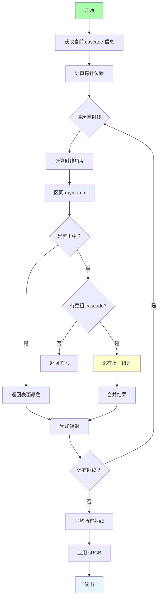
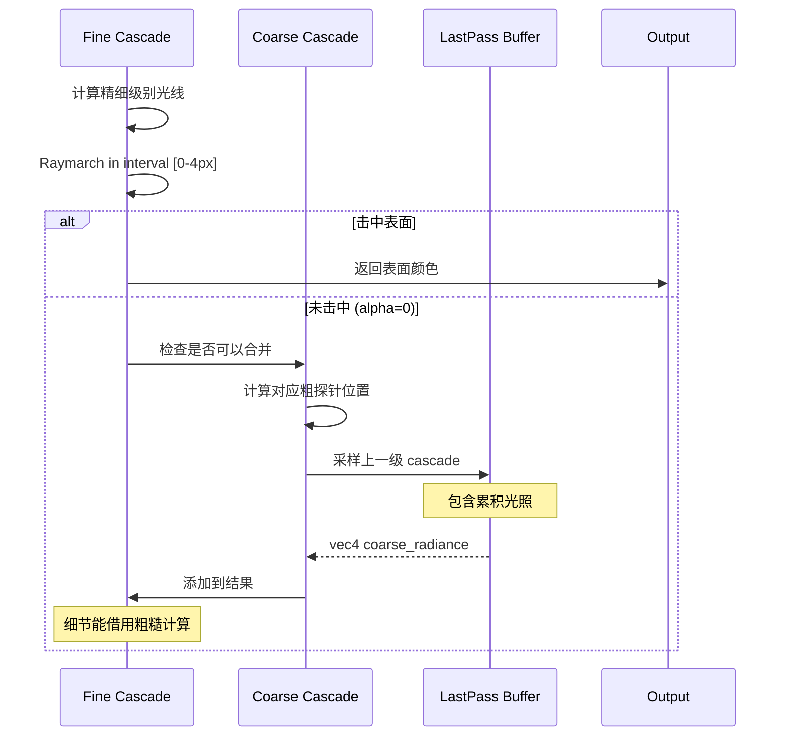

# Class 8: RC 级联实现与合并技术

**创建时间**: 2026-03-22  
**难度**: ⭐⭐⭐⭐⭐  
**预计时间**: 5-6 小时  

---

## 🎯 学习目标

完成本课程后，你将能够：

- ✅ 实现完整的 Radiance Cascades 系统
- ✅ 掌握级联合并（Merging）技术
- ✅ 理解从粗到细的照明计算策略
- ✅ 调试和优化 RC 性能

---

## 📖 完整实现框架

### rc.frag 整体架构



[WIP_NEED_PIC: RC 实现的流程图]

### 核心数据结构

```glsl
// 探针信息结构体
struct Probe {
  float spacing;           // 探针间距
  vec2 size;               // 探针屏幕尺寸
  vec2 position;           // 探针内位置
  float rayCount;          // 射线数量
  float intervalStart;     // 区间开始
  float intervalEnd;       // 区间结束
};

// Uniform 参数
uniform int uCascadeIndex;      // 当前 cascade 级别 (0, 1, 2...)
uniform int uCascadeAmount;     // 总 cascade 数
uniform int uBaseRayCount;      // 基础射线数 (如 4)
uniform float uBaseInterval;    // 基础间隔 (如 1.0)
uniform sampler2D uDistanceField;
uniform sampler2D uSceneColor;
uniform sampler2D uLastFrame;
uniform sampler2D uCoarserCascade;  // 上一级 cascade 结果
```

---

## 💻 Shader 代码实现

### rc.frag 完整代码

```glsl
#version 330 core

out vec4 fragColor;

uniform int uCascadeIndex;
uniform int uCascadeAmount;
uniform int uBaseRayCount;
uniform float uBaseInterval;
uniform float minRes;

uniform sampler2D uDistanceField;
uniform sampler2D uSceneColor;
uniform sampler2D uLastFrame;
uniform sampler2D uCoarserCascade;  // 更粗糙的 cascade

const int MAX_RAY_STEPS = 256;
const float EPS = 0.001;

// 探针信息结构体
struct Probe {
  float spacing;
  vec2 size;
  vec2 position;
  float rayCount;
  float intervalStart;
  float intervalEnd;
};

// 计算探针信息
Probe getProbeInfo(int index) {
  Probe p;
  
  // 计算该级别的探针密度
  float probeAmount = pow(uBaseRayCount, index);
  p.spacing = sqrt(probeAmount);
  p.size = 1.0 / vec2(p.spacing);
  
  // 计算探针在屏幕上的位置
  vec2 fragCoord = gl_FragCoord.xy;
  vec2 texSize = textureSize(uDistanceField, 0);
  p.position = mod(fragCoord, p.size * texSize) / texSize * p.spacing;
  
  // 计算射线数量和区间
  p.rayCount = pow(uBaseRayCount, index + 1);
  
  float a = uBaseInterval;
  if (index == 0) {
    p.intervalStart = 0.0;
  } else {
    p.intervalStart = a * pow(uBaseRayCount, index) / minRes;
  }
  p.intervalEnd = a * pow(uBaseRayCount, index + 1) / minRes;
  
  return p;
}

// Raymarching 函数（区间版本）
vec4 raymarchInterval(vec2 uv, vec2 dir, float startDist, float endDist) {
  vec2 currentUv = uv;
  float traveledDist = startDist;
  
  for (int i = 0; i < MAX_RAY_STEPS; i++) {
    if (traveledDist >= endDist) break;
    
    float dist = texture(uDistanceField, currentUv).r;
    
    if (dist < EPS) {
      // 击中表面
      vec3 sceneColor = texture(uSceneColor, currentUv).rgb;
      vec3 lastFrame = texture(uLastFrame, uv).rgb;
      
      // 混合当前帧和历史帧
      float mixFactor = 0.7;
      vec3 accumulated = mix(sceneColor, lastFrame, mixFactor);
      
      return vec4(accumulated, 1.0);
    }
    
    currentUv += dir * dist;
    traveledDist += dist;
    
    // 边界检查
    if (currentUv.x < 0.0 || currentUv.x > 1.0 || 
        currentUv.y < 0.0 || currentUv.y > 1.0) {
      break;
    }
  }
  
  return vec4(0.0, 0.0, 0.0, 0.0);  // 未击中
}

// 采样更粗糙的 cascade
vec4 sampleCoarserCascade(vec2 uv, vec2 coarsePos) {
  // 这里需要从纹理中采样对应探针位置
  // 简化版本：直接返回中心采样
  return texture(uCoarserCascade, coarsePos);
}

void main() {
  vec2 uv = gl_FragCoord.xy / textureSize(uDistanceField, 0);
  
  // 获取当前 cascade 的探针信息
  Probe p = getProbeInfo(uCascadeIndex);
  
  vec4 radiance = vec4(0.0);
  
  // 对每个基射线进行 raymarch
  for (float i = 0.0; i < uBaseRayCount; i++) {
    // 计算射线角度
    float angle = 2.0 * 3.14159 * i / uBaseRayCount;
    vec2 dir = vec2(cos(angle), sin(angle));
    
    // 在指定区间内 raymarch
    vec4 deltaRadiance = raymarchInterval(
      p.position, 
      dir, 
      p.intervalStart, 
      p.intervalEnd
    );
    
    // 合并技术：如果未击中且有更粗糙的 cascade
    if (deltaRadiance.a == 0.0 && uCascadeIndex < uCascadeAmount - 1) {
      // 从更粗糙的 cascade 借用
      vec2 coarsePos = calculateCoarseProbePosition(uv);
      vec4 coarseRadiance = sampleCoarserCascade(uv, coarsePos);
      
      // 添加到结果
      deltaRadiance.rgb += coarseRadiance.rgb;
      deltaRadiance.a = 1.0;
    }
    
    radiance += deltaRadiance;
  }
  
  // 平均所有射线的贡献
  radiance /= uBaseRayCount;
  
  // 应用 sRGB 转换
  if (uSrgb == 1) {
    radiance.rgb = pow(radiance.rgb, vec3(1.0 / 2.2));
  }
  
  fragColor = radiance;
}
```

---

## 🔬 合并技术详解

### 为什么需要合并？

```
问题：每个 cascade 只负责特定区间
- Cascade 0: 0-4px
- Cascade 1: 4-16px
- Cascade 2: 16-64px

如果 cascade 0 的光线在 0-4px 内未击中任何物体
→ 需要 cascade 1 来补充 4-16px 的光照信息
```

[WIP_NEED_PIC: 级联合并的序列图]

### 合并流程



### 实现细节

```glsl
// 判断是否需要合并
if (deltaRadiance.a == 0.0 && uCascadeIndex < uCascadeAmount - 1) {
  // 计算对应的粗糙探针位置
  float coarseSpacing = p.spacing * uBaseRayCount;
  vec2 coarseUV = floor(uv * coarseSpacing) / coarseSpacing + 
                  0.5 / coarseSpacing;
  
  // 采样上一级 cascade
  vec4 coarseRadiance = texture(uCoarserCascade, coarseUV);
  
  // 合并
  deltaRadiance.rgb = coarseRadiance.rgb;
  deltaRadiance.a = 1.0;
}
```

---

## 🎨 调试技巧

### 技巧 1: 可视化单个 cascade

```glsl
uniform int uDisplayCascade;  // 要显示的 cascade 索引

void main() {
  // ...
  
  // 只显示指定 cascade
  if (uDisplayCascade != -1 && uDisplayCascade != uCascadeIndex) {
    discard;  // 丢弃其他 cascade 的像素
  }
  
  // ...
}
```

**效果**：
- 设置 `uDisplayCascade=0` → 只看到红色区域（cascade 0）
- 设置 `uDisplayCascade=1` → 只看到绿色区域
- 等等

[WIP_NEED_PIC: 各级联单独显示的对比图]

### 技巧 2: 禁用合并查看原始结果

```glsl
uniform bool uDisableMerging;

// 在合并逻辑前添加检查
if (uDisableMerging) {
  // 跳过合并逻辑
} else {
  // 正常合并
}
```

**用途**：验证每级 cascade 的独立贡献

### 技巧 3: 伪彩色显示

```glsl
vec3 cascadeColors[5] = vec3[](
  vec3(1, 0, 0),  // Cascade 0: 红色
  vec3(0, 1, 0),  // Cascade 1: 绿色
  vec3(0, 0, 1),  // Cascade 2: 蓝色
  vec3(1, 1, 0),  // Cascade 3: 黄色
  vec3(1, 0, 1)   // Cascade 4: 品红
);

// 根据 cascade 索引着色
fragColor.rgb *= cascadeColors[uCascadeIndex];
```

### 技巧 4: ImGui 实时参数调整

```cpp
// C++ 端的调试面板
if (ImGui::CollapsingHeader("RC Debug")) {
  ImGui::SliderInt("Cascade Amount", &cascadeAmount, 1, 5);
  ImGui::SliderInt("Base Ray Count", &baseRayCount, 2, 6);
  ImGui::SliderFloat("Base Interval", &baseInterval, 0.5, 4.0);
  ImGui::Checkbox("Disable Merging", &disableMerging);
  ImGui::SliderInt("Display Cascade", &displayCascade, -1, 4);
  
  ImGui::Text("FPS: %.1f", GetFPS());
}
```

---

## ⚡ 性能优化

### 优化 1: 减少纹理采样

```glsl
// 优化前：每次 raymarch 都采样距离场
for (int i = 0; i < MAX_STEPS; i++) {
  float dist = texture(uDistanceField, currentUv).r;
  // ...
}

// 优化后：缓存最近的采样结果
float lastDist = texture(uDistanceField, currentUv).r;
for (int i = 0; i < MAX_STEPS; i++) {
  if (i % 2 == 0) {  // 隔步采样
    lastDist = texture(uDistanceField, currentUv).r;
  }
  // 使用 lastDist
}
```

**收益**：减少 50% 纹理采样

### 优化 2: 提前终止

```glsl
// 检测是否已经收集了足够的光照
if (radianceContribution < threshold) {
  break;  // 提前退出
}
```

### 优化 3: 动态分辨率

```cpp
// 对远距离 cascade 使用更低分辨率
if (cascadeIndex > 1) {
  renderWidth /= 2;
  renderHeight /= 2;
}
```

---

## 🐛 常见问题与解决

### 问题 1: Cascade 边界闪烁

**症状**：在不同 cascade 交界处出现闪烁的线条

**原因**：
- 相邻 cascade 的时间累积不同步
- 合并时的数值不稳定

**解决**：
```glsl
// 添加平滑过渡
float blendFactor = smoothstep(intervalStart, 
                               intervalStart + overlap, 
                               traveledDist);
radiance = mix(fineRadiance, coarseRadiance, blendFactor);
```

### 问题 2: 远处全黑

**原因**：最后一级 cascade 未正确处理

**排查**：
1. 确认最后一级有正确的 intervalEnd
2. 检查是否有足够多的 raymarch 步数
3. 验证场景颜色纹理是否正确绑定

### 问题 3: 性能远低于预期

**排查清单**：
- [ ] 确认 probe 数量计算正确
- [ ] 检查 raymarch 步数上限
- [ ] 验证纹理绑定是否重复
- [ ] 使用 GPU  profiler 分析热点

---

## 🧠 知识检查

### 小测验

1. **合并技术的主要作用是？**
   - A) 提高画质
   - B) 填补未击中区域的空白 ✓
   - C) 减少内存
   - D) 加速收敛

2. **什么时候需要从更粗糙的 cascade 借用？**
   - A) 总是
   - B) 从未
   - C) 当当前 cascade 未击中时 ✓
   - D) 当画面太暗时

3. **如何可视化特定的 cascade？**
   - A) 修改 shader 代码
   - B) 使用 discard 关键字 ✓
   - C) 更换纹理
   - D) 重新编译

---

## 🔗 与其他课程的联系

### 前置知识
- Class 7: RC 理论基础（cascade 设计原理）
- Class 6: GI 中的 raymarching 算法

### 后续应用
- Class 9: 用户交互绘制
- Class 11: 完整管线整合

---

## 📚 扩展阅读

- [GPU 性能分析工具](https://developer.nvidia.com/nsight-graphics)
- [实时级联阴影映射](https://developer.nvidia.com/gpugems/gpugems/part-i-rendering/chapter-4-practical-shadow-mapping)
- [自适应光线追踪](https://www.scratchapixel.com/lessons/3d-basic-rendering/introduction-to-lighting/global-illumination-path-tracing)

---

## ✅ 总结

本节课你学到了：

✅ 完整的 RC 实现框架  
✅ 级联合并技术的原理和实现  
✅ 多种实用的调试技巧  
✅ 性能优化的高级方法  

**下一步**：Class 9 将添加用户交互绘制功能！

---

*提示：RC 实现较复杂，建议先用 1-2 级 cascade 测试，成功后再扩展到更多级！* 🎯
