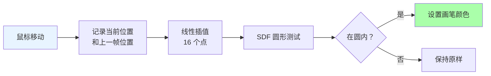

# Class 9: 用户交互绘制——draw.frag

**创建时间**: 2026-03-22  
**难度**: ⭐⭐☆  
**预计时间**: 3-4 小时  

---

## 🎯 学习目标

完成本课程后，你将能够：

- ✅ 实现交互式画笔绘制功能
- ✅ 掌握线条平滑技术（线性插值）
- ✅ 实现彩虹动画效果
- ✅ 理解 macOS 平台的特殊处理

---

## 📖 核心概念

### 交互绘制的挑战

```
问题：鼠标移动速度 > 采样频率时，会出现断点

理想情况：●────●────●────●
实际情况：●    ●    ●    ●  （点之间不连续）
```

[WIP_NEED_PIC: 快速移动鼠标时线条断点的示意图]

**解决方案**：在相邻采样点之间进行插值

---

## 💻 画笔渲染原理

### 整体流程



### 线性插值（Lerp）

```glsl
// 数学公式
P(t) = P0 + t * (P1 - P0)
其中 t ∈ [0, 1]

// GLSL 实现
vec2 lerp(vec2 start, vec2 end, float t) {
  return mix(start, end, t);
}
```

[WIP_NEED_PIC: 线性插值的几何示意图]

---

## 💻 Shader 实现

### draw.frag 完整代码

```glsl
#version 330 core

out vec4 fragColor;

uniform sampler2D uCanvas;      // 当前画布状态
uniform vec2 uMousePos;         // 当前鼠标位置
uniform vec2 uLastMousePos;     // 上一帧鼠标位置
uniform vec4 uBrushColor;       // 画笔颜色
uniform float uBrushSize;       // 画笔大小（归一化）
uniform int uMouseDown;         // 鼠标是否按下 (0/1)
uniform int uRainbow;           // 彩虹模式开关
uniform float uTime;            // 时间（秒）

#define LERP_AMOUNT 16.0

// HSV 转 RGB 函数
vec3 hsv2rgb(vec3 c) {
  vec4 K = vec4(1.0, 2.0 / 3.0, 1.0 / 3.0, 3.0);
  vec3 p = abs(fract(c.xxx + K.xyz) * 6.0 - K.www);
  return c.z * mix(K.xxx, clamp(p - K.xxx, 0.0, 1.0), c.y);
}

void main() {
  vec2 uv = gl_FragCoord.xy / textureSize(uCanvas, 0);
  
  // 如果鼠标未按下，直接返回原画布内容
  if (uMouseDown == 0) {
    fragColor = texture(uCanvas, uv);
    return;
  }
  
  bool insideBrush = false;
  
  // 在当前位置和上一帧位置之间插值
  for (float i = 0.0; i < LERP_AMOUNT; i++) {
    // 计算插值点
    vec2 interpPos = mix(uLastMousePos, uMousePos, i / LERP_AMOUNT);
    
    // SDF 圆形测试
    float dist = distance(gl_FragCoord.xy, interpPos * textureSize(uCanvas, 0));
    float brushRadius = uBrushSize * textureSize(uCanvas, 0).x;
    
    if (dist < brushRadius) {
      insideBrush = true;
    }
  }
  
  // 如果在画笔范围内
  if (insideBrush) {
    if (uRainbow == 1) {
      // 彩虹模式：HSV 空间中的动画
      float hue = fract(uTime / 4.0);  // 4 秒一个循环
      vec3 rainbowColor = hsv2rgb(vec3(hue, 1.0, 1.0));
      fragColor = vec4(rainbowColor, 1.0);
    } else {
      // 普通模式：使用指定画笔颜色
      fragColor = uBrushColor;
    }
  } else {
    // 不在画笔范围内，保留原内容
    fragColor = texture(uCanvas, uv);
  }
}
```

---

## 🔬 关键技术解析

### 1. 为什么需要 16 次插值？

```glsl
#define LERP_AMOUNT 16.0

for (float i = 0.0; i < LERP_AMOUNT; i++) {
  // ...
}
```

**分析**：

```
假设：
- 屏幕宽度：512 像素
- 画笔大小：0.05 (25.6 像素半径)
- 鼠标移动速度：100 像素/帧

情况 1: LERP_AMOUNT = 4
- 插值间隔：100/4 = 25 像素
- 可能出现间隙！

情况 2: LERP_AMOUNT = 16
- 插值间隔：100/16 = 6.25 像素
- 完全覆盖 ✓

经验法则：插值点数应保证间隔 < 画笔半径
```

[WIP_NEED_PIC: 不同插值数量的线条质量对比]

### 2. SDF 圆形测试

```glsl
float dist = distance(point, center);
if (dist < radius) {
  // 在圆内
}
```

**原理**：计算像素到圆心的欧几里得距离

**优化版本**（避免开方）：
```glsl
float distSq = lengthSquared(point - center);
if (distSq < radius * radius) {
  // 在圆内
}
```

### 3. 彩虹动画实现

```glsl
// HSV 空间中的简单动画
float hue = fract(uTime / 4.0);  // 4 秒一个循环
vec3 rainbowColor = hsv2rgb(vec3(hue, 1.0, 1.0));
```

**色相环**：

```
0.0 → 红色
0.33 → 绿色
0.66 → 蓝色
1.0 → 回到红色
```

[WIP_NEED_PIC: HSV 色相环的示意图]

### 4. HSV↔RGB 转换

```glsl
vec3 hsv2rgb(vec3 c) {
  vec4 K = vec4(1.0, 2.0 / 3.0, 1.0 / 3.0, 3.0);
  vec3 p = abs(fract(c.xxx + K.xyz) * 6.0 - K.www);
  return c.z * mix(K.xxx, clamp(p - K.xxx, 0.0, 1.0), c.y);
}
```

**参数说明**：
- H (Hue): 色相，0-1 循环
- S (Saturation): 饱和度，0=灰色，1=纯色
- V (Value): 明度，0=黑色，1=最亮

---

## 🍎 macOS 平台特殊处理

### 问题背景

```
Windows/Linux: OpenGL 默认保留 framebuffer 内容
macOS: 需要显式绑定并采样原纹理
```

### draw_macos.frag 实现

```glsl
#version 330 core

out vec4 fragColor;

uniform sampler2D uCanvas;      // 必须额外绑定
uniform vec2 uMousePos;
uniform vec2 uLastMousePos;
uniform vec4 uBrushColor;
uniform float uBrushSize;
uniform int uMouseDown;
uniform int uRainbow;
uniform float uTime;

#define LERP_AMOUNT 16.0

void main() {
  vec2 uv = gl_FragCoord.xy / textureSize(uCanvas, 0);
  
  // macOS 特殊处理：必须先采样原画布
  vec4 originalColor = texture(uCanvas, uv);
  
  if (uMouseDown == 0) {
    // 鼠标未按下：保留原样
    fragColor = originalColor;
    return;
  }
  
  bool insideBrush = false;
  
  // 插值测试
  for (float i = 0.0; i < LERP_AMOUNT; i++) {
    vec2 interpPos = mix(uLastMousePos, uMousePos, i / LERP_AMOUNT);
    float dist = distance(gl_FragCoord.xy, interpPos * textureSize(uCanvas, 0));
    float brushRadius = uBrushSize * textureSize(uCanvas, 0).x;
    
    if (dist < brushRadius) {
      insideBrush = true;
    }
  }
  
  if (insideBrush) {
    if (uRainbow == 1) {
      float hue = fract(uTime / 4.0);
      vec3 rainbowColor = hsv2rgb(vec3(hue, 1.0, 1.0));
      fragColor = vec4(rainbowColor, 1.0);
    } else {
      fragColor = uBrushColor;
    }
  } else {
    // 即使不在画笔内，也要返回原颜色
    fragColor = originalColor;
  }
}
```

**关键差异**：
- 必须显式 `texture(uCanvas, uv)` 采样
- 所有分支都要设置 `fragColor`

---

## 🎨 动手实验

### 实验 1: 调整插值数量

```glsl
// 修改定义
#define LERP_AMOUNT 4.0   // 观察断点
#define LERP_AMOUNT 64.0  // 过度平滑，性能浪费
```

**观察**：线条连续性的变化

### 实验 2: 可变画笔大小

```cpp
// C++ 端添加 ImGui 控制
ImGui::SliderFloat("Brush Size", &brushSize, 0.01, 0.2);
```

**效果**：实时调整画笔粗细

[WIP_NEED_PIC: 不同画笔大小的绘制效果对比]

### 实验 3: 自定义彩虹速度

```glsl
// 修改循环周期
float hue = fract(uTime / 2.0);  // 2 秒一圈（更快）
float hue = fract(uTime / 10.0); // 10 秒一圈（更慢）
```

### 实验 4: 压力敏感（如果有压感笔）

```glsl
uniform float uPressure;  // 压力值 0.0-1.0

void main() {
  // ...
  float brushRadius = uBrushSize * uPressure * textureSize(uCanvas, 0).x;
  // ...
}
```

---

## 🐛 常见问题与调试

### 问题 1: 线条有锯齿

**原因**：插值点不足或画笔太小

**解决**：
- 增加 `LERP_AMOUNT`
- 增大画笔尺寸
- 使用更高的渲染分辨率

### 问题 2: 快速移动仍有断点

**排查**：
1. 检查鼠标位置更新频率
2. 确认插值计算正确
3. 考虑使用二次插值（贝塞尔曲线）

### 问题 3: macOS 上绘制失效

**常见错误**：
- 忘记绑定 `uCanvas` 纹理
- 在未点击时也修改了画布
- UV 坐标计算错误

**调试步骤**：
```glsl
// 临时输出调试颜色
fragColor = vec4(1, 0, 0, 1);  // 应该全红
```

### 问题 4: 彩虹颜色不连续

**原因**：`fract()` 在 0→1 跳变时产生突变

**解决**：使用正弦波平滑过渡
```glsl
float hue = sin(uTime * 0.5) * 0.5 + 0.5;  // 平滑振荡
```

---

## ⚡ 性能优化

### 优化 1: 提前退出循环

```glsl
bool insideBrush = false;
for (float i = 0.0; i < LERP_AMOUNT; i++) {
  // ... 测试
  
  if (insideBrush && !uRainbow) {
    break;  // 已确定颜色且不需要彩虹，提前退出
  }
}
```

### 优化 2: 降低插值精度

```glsl
// 远距离时使用较少插值
float distToLastPos = distance(uMousePos, uLastMousePos);
float lerpAmount = mix(4.0, 16.0, distToLastPos);
```

### 优化 3: 固定画笔分辨率

```cpp
// 使用离屏 buffer 绘制，然后合成
RenderTexture2D brushBuffer = LoadRenderTexture(512, 512);
```

---

## 🧠 知识检查

### 小测验

1. **为什么要在线条绘制中使用插值？**
   - A) 让颜色更平滑
   - B) 填补快速移动时的空隙 ✓
   - C) 提高性能
   - D) 增加特效

2. **`fract(uTime / 4.0)` 的作用是？**
   - A) 获取整数部分
   - B) 获取小数部分，实现循环 ✓
   - C) 放大时间
   - D) 缩小时间

3. **macOS 版本的主要区别是？**
   - A) 颜色不同
   - B) 需要显式采样原纹理 ✓
   - C) 插值更多
   - D) 画笔更大

---

## 🔗 与其他课程的联系

### 前置知识
- Class 2: 场景预处理中的纹理采样
- Class 3: 种子编码中的 UV 坐标处理

### 后续应用
- Class 10: 调试可视化
- Class 11: 完整交互系统整合

---

## 📚 扩展阅读

- [GLSL 混合模式详解](https://www.shadertoy.com/view/XtGGRt)
- [SDF 图形学教程](https://iquilezles.org/articles/distfunctions/)
- [HSV 颜色空间原理](https://en.wikipedia.org/wiki/HSL_and_HSV)

---

## ✅ 总结

本节课你学到了：

✅ 交互式画笔的实现原理  
✅ 线性插值平滑线条的技术  
✅ HSV 颜色空间和彩虹动画  
✅ macOS 平台的特殊处理  

**下一步**：Class 10 将介绍调试和后处理技巧！

---

*提示：尝试用这个绘制工具创作一幅数字艺术作品吧！实践是最好的老师！* 🎨
