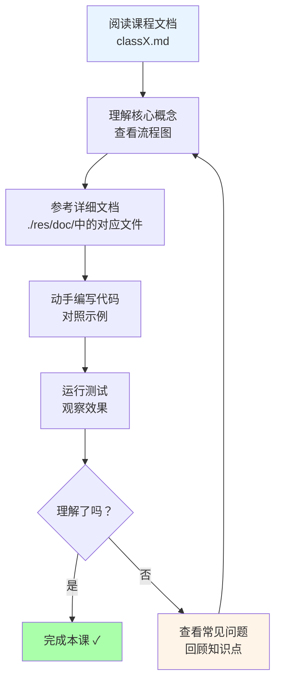
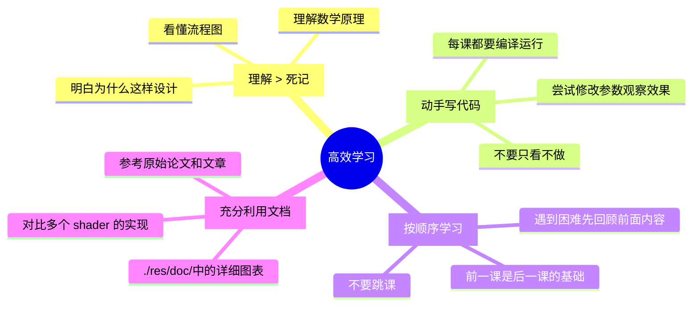

# Radiance Cascades 着色器课程

**创建时间**: 2026-03-22  
**适用对象**: 图形编程初学者、对实时渲染感兴趣的学生  
**前置知识**: 基础 C++、线性代数基础  
**开发环境**: Raylib + GLSL  

---

## 📚 课程概述

本课程将带你深入了解 **2D Radiance Cascades** 光照技术的核心——着色器实现。通过 11 个课时的学习，你将掌握：

- ✅ GLSL 着色器编程基础
- ✅ 距离场生成算法（JFA）
- ✅ 光线追踪与步进原理
- ✅ Radiance Cascades 层级优化技术
- ✅ 实时全局光照实现方法

### 课程结构

```
┌─────────────────────────────────────────────────────────────┐
│                    完整课程体系                              │
├─────────────────────────────────────────────────────────────┤
│                                                             │
│  基础篇 (Class 1-3)                                         │
│  ┌───────────┬───────────┬───────────┐                     │
│  │  Class 1  │  Class 2  │  Class 3  │                     │
│  │ GLSL 入门  │ 顶点着色器 │ 场景准备  │                     │
│  └───────────┴───────────┴───────────┘                     │
│           │                                                 │
│           ▼                                                 │
│  核心篇 (Class 4-6)                                         │
│  ┌───────────┬───────────┬───────────┐                     │
│  │  Class 4  │  Class 5  │  Class 6  │                     │
│  │  JFA 种子  │   JFA     │ 距离场    │                     │
│  │   编码    │  传播算法  │   提取    │                     │
│  └───────────┴───────────┴───────────┘                     │
│           │                                                 │
│           ▼                                                 │
│  进阶篇 (Class 7-9)                                         │
│  ┌───────────┬───────────┬───────────┬───────────┐        │
│  │  Class 7  │  Class 8  │  Class 9  │  Class 10 │        │
│  │ 传统 GI   │    RC     │  RC 级联   │  用户交互  │        │
│  │  光线投射  │  基础理论  │  合并技术  │  画笔绘制  │        │
│  └───────────┴───────────┴───────────┴───────────┘        │
│           │                                                 │
│           ▼                                                 │
│  实战篇 (Class 11)                                          │
│  ┌───────────────────────────────────────────┐             │
│  │              Class 11                      │             │
│  │         完整管线整合与调试技巧             │             │
│  └───────────────────────────────────────────┘             │
│                                                             │
└─────────────────────────────────────────────────────────────┘
```

### 每课学习流程



---

## 📖 课程目录

### 基础篇

#### Class 1: GLSL 着色器编程入门
- **目标**: 理解 GPU 编程模型，编写第一个着色器
- **核心内容**: 
  - GPU vs CPU 架构差异
  - GLSL 语法基础
  - fragment shader 工作原理
  - `default.vert` 顶点变换
- **参考文档**: `./res/doc/default_vert.md`
- **预计时间**: 2-3 小时

#### Class 2: 场景预处理——prepscene.frag
- **目标**: 学习如何准备渲染场景
- **核心内容**:
  - 纹理采样与混合
  - SDF（有符号距离场）圆形函数
  - HSV↔RGB 颜色空间转换
  - 动态元素（轨道球、鼠标光效）
- **参考文档**: `./res/doc/prepscene_frag.md`
- **预计时间**: 3-4 小时

#### Class 3: 距离场种子编码——prepjfa.frag
- **目标**: 理解距离场生成的前置步骤
- **核心内容**:
  - UV 坐标编码到 RG 通道
  - 种子点标记策略
  - Alpha 通道作为有效性标志
- **参考文档**: `./res/doc/prepjfa_frag.md`
- **预计时间**: 2-3 小时

---

### 核心篇

#### Class 4: Jump-Flood Algorithm 原理与实现
- **目标**: 掌握 JFA 算法的核心思想
- **核心内容**:
  - 8 邻域采样模式
  - 跳跃式传播策略
  - O(log n) 复杂度分析
  - 多 pass 执行流程
- **参考文档**: `./res/doc/jfa_frag.md`
- **预计时间**: 4-5 小时

#### Class 5: 距离场提取与应用
- **目标**: 从 JFA 结果中提取可用距离场
- **核心内容**:
  - 通道分离技术
  - 灰度距离场可视化
  - 为光线步进做准备
- **参考文档**: `./res/doc/distfield_frag.md`
- **预计时间**: 2-3 小时

#### Class 6: 传统全局光照——gi.frag
- **目标**: 实现基于光线投射的全局光照
- **核心内容**:
  - 360°均匀光线投射
  - 光线步进（Raymarching）算法
  - 时间累积与衰减
  - 噪声抗锯齿技术
- **参考文档**: `./res/doc/gi_frag.md`
- **预计时间**: 5-6 小时

---

### 进阶篇

#### Class 7: Radiance Cascades 理论基础
- **目标**: 理解层级优化的核心思想
- **核心内容**:
  - 为什么需要 Cascades?
  - 探针网格层级结构
  - 区间光线步进
  - 性能优势分析
- **参考文档**: `./res/doc/rc_frag.md`
- **预计时间**: 4-5 小时

#### Class 8: RC 级联实现与合并技术
- **目标**: 亲手实现 Radiance Cascades
- **核心内容**:
  - 多级 cascade 计算
  - 级联合并（Merging）策略
  - 从粗到细的照明计算
  - 参数调优技巧
- **参考文档**: `./res/doc/rc_frag.md`
- **预计时间**: 5-6 小时

#### Class 9: 用户交互绘制——draw.frag
- **目标**: 实现交互式绘制功能
- **核心内容**:
  - 线性插值平滑线条
  - 彩虹动画效果
  - macOS 平台适配
- **参考文档**: `./res/doc/draw_shaders.md`
- **预计时间**: 3-4 小时

---

### 实战篇

#### Class 10: 输出与调试
- **目标**: 掌握最终合成与调试技巧
- **核心内容**:
  - `final.frag` 简单传递
  - `broken.frag` 棋盘格调试
  - 常见问题排查
- **参考文档**: `./res/doc/final_frag.md`, `./res/doc/broken_frag.md`
- **预计时间**: 2-3 小时

#### Class 11: 完整管线整合
- **目标**: 将所有shader串联成完整系统
- **核心内容**:
  - 帧渲染流程
  - 资源管理策略
  - 性能优化技巧
  - 扩展方向探讨
- **参考文档**: 所有 `./res/doc/*` 文件
- **预计时间**: 4-5 小时

---

## 🎯 学习建议

### 有效学习方法



### 常见问题解答

**Q1: 我没有图形学基础，能学会吗？**  
A: 可以！课程从最基础的 GLSL 语法开始，只要你有基本的编程知识和线性代数基础（向量、矩阵），就能跟上。遇到不懂的数学概念可以先了解其几何意义。

**Q2: 需要什么样的硬件配置？**  
A: 任何支持 OpenGL 3.3+ 的显卡都可以。现代集成显卡（Intel HD Graphics 4000+）都能流畅运行。

**Q3: 为什么要学习这个特定的算法？**  
A: Radiance Cascades 是一个很好的教学案例：
- 涵盖了现代实时渲染的核心技术
- 展示了如何用算法优化提升性能
- 代码量适中，适合学习
- 效果直观，容易获得成就感

**Q4: 学完这个课程能达到什么水平？**  
A: 你将能够：
- 独立编写 GLSL 着色器
- 理解大多数实时渲染论文的实现细节
- 为自己的项目添加自定义光照效果
- 为进一步学习更高级的渲染技术打下基础

---

## 📝 课前准备

### 1. 环境搭建检查清单

```bash
# 1. 确认已安装 Git
git --version

# 2. 克隆项目并初始化子模块
git clone <your-repo-url>
cd radiance-cascades-demo
git submodule update --init

# 3. 构建项目
./build.sh

# 4. 运行测试
./build/radiance_cascades
```

### 2. 必备工具

- **文本编辑器**: VS Code / CLion / 任何你喜欢的编辑器
- **GPU 调试工具**: RenderDoc（可选，用于深入调试）
- **笔记本**: 记录关键概念和公式

### 3. 参考资料准备

保存以下链接，学习时随时查阅：

- [GLSL 快速参考](https://www.khronos.org/opengl/wiki/Core_Language_(GLSL))
- [Raylib 文档](https://www.raylib.com/)
- [Radiance Cascades 原论文](https://github.com/Raikiri/RadianceCascadesPaper)
- [GM Shaders 教程](https://gmshaders.com)

---

## 🚀 开始学习

准备好了吗？让我们从 **Class 1: GLSL 着色器编程入门** 开始！

**下一步**: 打开 [`class1_GLSL_basics.md`](./class1_GLSL_basics.md) 开始第一课的学习。

---

*记住：每个优秀的图形程序员都是从第一个"Hello Triangle"开始的。不要怕犯错，错误是最好的老师！* 💪
