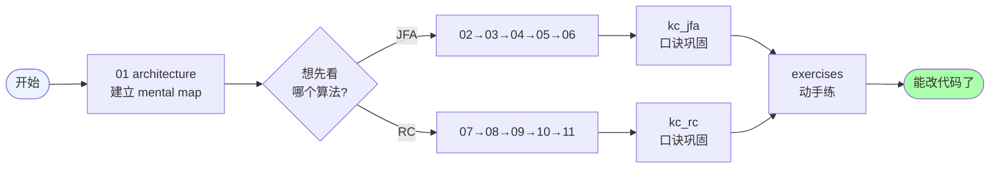

# Class 3: JFA & RC 算法深度拆解 (Deep Dive)

**创建时间**: 2026-06-06  
**目标读者**: 已经读过 `res/class1` 或 `res/class2`、想从"会用"跨到"能改"的开发者  
**关注重点**: **Jump Flood Algorithm** 与 **Radiance Cascades** 两条主线的逐行拆解  
**总课时**: 8 课 + 2 个 Key Concept  
**预计总学习时间**: 6-8 小时（动手实验另计）

---

## 📚 本课程与 class1 / class2 的关系

`res/class1/` 与 `res/class2/` 是按 **着色器文件** 切分的横向课程（一节课讲一个 `.frag`）。
本课程 `res/class3/` 改为按 **算法** 切分，纵向打通「CPU 编排 → Shader 实现 → 内存布局」三件套：

```
class1/class2 (横向 / per-shader)        class3 (纵向 / per-algorithm)
├── class3 prepjfa.frag                  ├── 02~06 JFA 全链路
├── class4 jfa.frag                      │     prepjfa → jfa → distfield → CPU ping-pong
├── class5 distfield.frag                │
├── class7 RC theory                     ├── 07~11 RC 全链路
├── class8 RC implementation             │     probe → interval → merge → CPU cascade loop
└── ...                                  │
                                         └── 12 Pipeline 整合视图
```

如果你只对其中一个算法感兴趣，可以直接跳到对应章节，不必从 `02` 顺序读起。

---

## 🗂️ 课程目录

### 入门视图

| 课号 | 文件 | 主题 | 你将回答的问题 |
|------|------|------|----------------|
| 00 | [`00_README.md`](./00_README.md) | 本索引 | 这一摞文档怎么读？ |
| 01 | [`01_architecture.md`](./01_architecture.md) | 整条管线的 mental map | 一个像素从鼠标画下到屏幕发光，经历了哪几个 buffer？ |
| 12 | [`12_pipeline.md`](./12_pipeline.md) | C++ 端调用图 | `demo::render()` 每帧依次跑哪些 pass？ |

### JFA 篇

| 课号 | 文件 | 主题 | 关键 shader / cpp |
|------|------|------|-------------------|
| 02 | [`02_jfa_overview.md`](./02_jfa_overview.md) | JFA 心智模型 | O(log n) 跳跃传播 |
| 03 | [`03_jfa_prepjfa.md`](./03_jfa_prepjfa.md) | 种子编码 | `prepjfa.frag` |
| 04 | [`04_jfa_propagation.md`](./04_jfa_propagation.md) | 跳跃传播核心 | `jfa.frag` |
| 05 | [`05_jfa_distfield.md`](./05_jfa_distfield.md) | 距离场提取 | `distfield.frag` |
| 06 | [`06_jfa_cpu.md`](./06_jfa_cpu.md) | C++ 端 ping-pong | `demo.cpp::render()` 中的 JFA 循环 |

### RC 篇

| 课号 | 文件 | 主题 | 关键 shader / cpp |
|------|------|------|-------------------|
| 07 | [`07_rc_overview.md`](./07_rc_overview.md) | RC 心智模型 | 探针层级 + 区间光线步进 |
| 08 | [`08_rc_probe_structure.md`](./08_rc_probe_structure.md) | 探针结构 & `get_probe_info` | `rc.frag` 顶部 |
| 09 | [`09_rc_radiance_interval.md`](./09_rc_radiance_interval.md) | 区间 raymarching | `radiance_interval()` |
| 10 | [`10_rc_merging.md`](./10_rc_merging.md) | 级联合并 | `rc.frag` `if (... && uDisableMerging != 1.0)` 分支 |
| 11 | [`11_rc_cpu.md`](./11_rc_cpu.md) | C++ 端 cascade 循环 | 直光 + 间接两轮 `for` |

### 速记 & 练习

| 课号 | 文件 | 主题 |
|------|------|------|
| KC1 | [`kc_jfa.md`](./kc_jfa.md) | JFA 诗 + 中文口诀 + 速查表 |
| KC2 | [`kc_rc.md`](./kc_rc.md) | RC 诗 + 中文口诀 + 速查表 |
| EX | [`exercises.md`](./exercises.md) | 8 道动手题（含答案提示） |

---

## 🎯 读完本课程你应该能

- [ ] 在不查文档的情况下，默写 `prepjfa → jfa → distfield` 的输入/输出通道含义
- [ ] 解释为什么 JFA 的 `jfaSteps=512` 实际只需要 ~9 个 pass 就能完成 1024×1024 的图
- [ ] 手算 `uBaseRayCount=4, uCascadeIndex=2` 时的 `probeAmount / spacing / size / intervalStart / intervalEnd`
- [ ] 解释「cascade merging」如何让粗糙级探针的远距离光照"渗"进精细级像素
- [ ] 在 `demo.cpp` 中插入一个 `ShowTexture()` 调试调用，把 JFA 中间结果画到屏幕一角
- [ ] 读懂 `rc.frag` 末尾的 `uCascadeIndex < uCascadeDisplayIndex` 调试分支

---

## 📐 阅读建议



**最短路径（2 小时）**：01 → 02 → 07 → kc_jfa → kc_rc → 12

**完整路径（8 小时）**：按目录顺序 01 ~ 12 + KC1 + KC2 + EX

---

## 🔗 与代码的对应关系

每节文档的右上角会标注 **"读前先打开"** 的文件，例如：

> 📁 `res/shaders/jfa.frag` · `src/demo.cpp` lines 170-208

请在 IDE 里把这些文件并列打开，左边看代码，右边看文档，效率最高。

---

## ⚠️ 代码版本说明

本文档基于 2026-06-06 仓库快照：
- `src/demo.cpp` 中 `bRenderDoc = true;`（`bRenderDoc` 标志已修复；详见 `res/doc/AGENTS.md`）
- `jfaSteps = 512;` 是默认值（实际 pass 数 = `ceil(log2(jfaSteps*2))`）
- `cascadeAmount = 5;` 是默认级联数
- `rcRayCount = 4;` 是每个探针每 pass 的光线数

如果你改了这些默认值，文档里的具体数字会变，但**算法结构**不变。

---

*下一个：打开 [`01_architecture.md`](./01_architecture.md) 建立整条管线的 mental map。*
