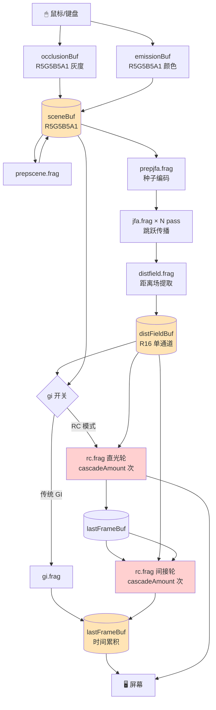
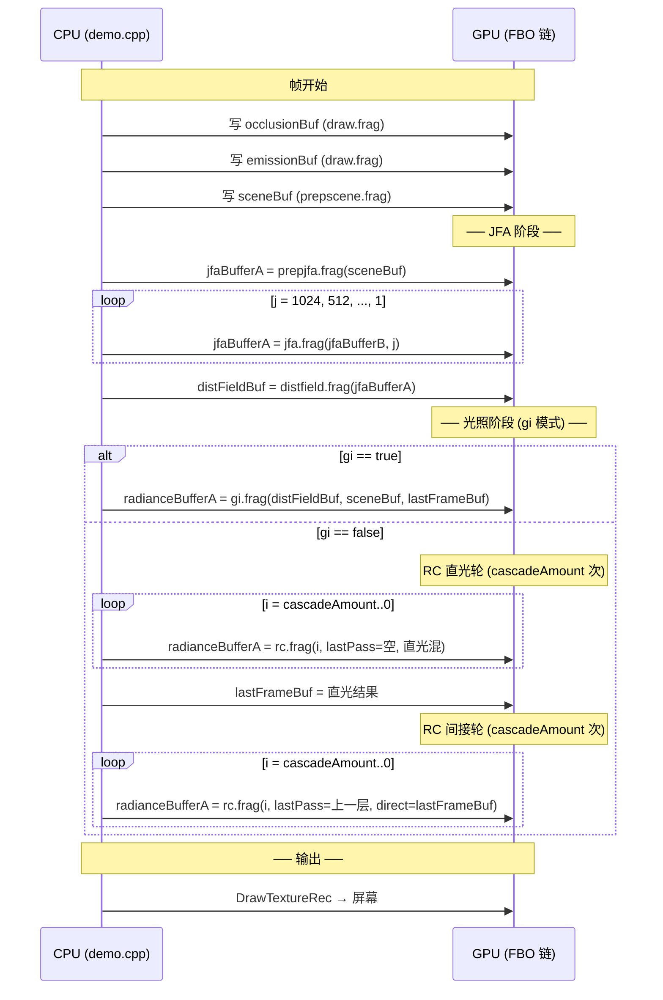

# 01 · Architecture — 整条管线的 Mental Map

> 📁 对应代码：`src/demo.cpp` (`render()` 全函数) · `src/demo.h` (所有 `RenderTexture2D*` 成员)

> 🎯 **Goal**: 5 分钟内在脑子里画出"一个像素从鼠标按下到屏幕发光"经过的全部 buffer 和 shader。

---

## 1. 一张图看完全局



> 🟧 橙色填充 = "**数据型 buffer**"（被多个 pass 读，但本身只被 1 个 pass 写）  
> 🟥 红色填充 = "**乒乓型 buffer**"（每 pass 都换写入目标，靠 swap 实现递归）

---

## 2. Buffer 速查表

来自 `src/demo.h` 全部 `RenderTexture2D*` 成员 + `setBuffers()` 中的位深声明：

| Buffer 名 | 位深 | 谁写 | 谁读 | 生命周期 |
|-----------|------|------|------|----------|
| `occlusionBuf` | `GRAY_ALPHA` (8+8) | `draw.frag` | `prepscene.frag` | 持续，鼠标输入时变 |
| `emissionBuf`  | `R5G5B5A1`     | `draw.frag` | `prepscene.frag` | 持续 |
| `sceneBuf`     | `R5G5B5A1`     | `prepscene.frag` | `prepjfa.frag`, `rc.frag` | 每帧重写 |
| `jfaBufferA/B/C` | `R32G32B32A32` | `prepjfa.frag` + `jfa.frag` (ping-pong) | `distfield.frag` | 每帧重写 |
| `distFieldBuf` | `R16` (单通道!) | `distfield.frag` | `rc.frag`, `gi.frag` | 每帧重写 |
| `radianceBufferA/B/C` | 默认 8-bit | `rc.frag` (ping-pong) | `rc.frag` (下一次 cascade), `drawTexture` | 每帧重写 |
| `lastFrameBuf` | 默认 8-bit | 任意 (RC 写直光、GI 写最终) | 任意 (RC 间接读、GI 时间累积) | **跨帧持续** |

> ⚠️ 三个细节：
> 1. **JFA buffer 必须 `R32G32B32A32`**：默认 8-bit 通道只能编码 0~255 范围的 UV，分辨率超过 256×256 就会溢出。
> 2. **distFieldBuf 是 `R16` 单通道**：丢弃了 UV 信息，只保留距离，因为下游只需要距离。
> 3. **lastFrameBuf 是 8-bit sRGB**：和屏幕输出对齐，下游的"间接光照"读取它时再 sRGB→linear。

---

## 3. Ping-Pong 模式（递归 shader 的标准技巧）

`demo.cpp` 的 JFA 循环：

```cpp
for (int j = jfaSteps*2; j >= 1; j /= 2) {       // j = 1024, 512, 256, ..., 1
  jfaBufferC = jfaBufferA;                       // ┐
  jfaBufferA = jfaBufferB;                       // ├ 三个变量轮转，写入"轮空"那个
  jfaBufferB = jfaBufferC;                       // ┘

  BeginTextureMode(jfaBufferA);                  // 永远写入 jfaBufferA
    BeginShaderMode(jfaShader);
      SetShaderValueTexture(jfaShader, ..., jfaBufferB.texture); // 从 jfaBufferB 读
      SetShaderValue(jfaShader, ..., &j);                          // 本 pass 跳跃距离
    EndShaderMode();
  EndTextureMode();
}
```

> 🎓 **概念**：GPU 不允许一个 shader 同时读写同一张纹理。三个变量轮转后，"**读 B、写 A**" 在每轮都成立。RC 的 `for (i = cascadeAmount; i >= 0; i--)` 循环是完全相同的模式。

为什么用三个变量而不是两个？当**分辨率正好为 1×1** 时，两个 buffer 的 swap 会变成"读自己写自己"。用第三个变量 `C` 暂存可以避免别名 bug（虽然本项目里两个其实也行，但作者写得稳健）。

---

## 4. 整帧时间线（render 函数的"故事线"）



> 🧠 关键观察：
> - **直光轮**的 `uLastPass` 是空的（实际上传入的是 `radianceBufferC` 的初始内容）—— 直光轮就是 cascade 间的合并，间接轮才是"再加一个反射"。
> - **间接轮**的 `uDirectLighting = lastFrameBuf`，**`uLastPass = 上一级 cascade 结果`**——这两者是不同的纹理，要分清！

---

## 5. 一图理解 RC 的"两次循环"

```
RC mode:                    GI mode:
┌──────────────────┐        ┌──────────────────┐
│ Direct pass      │        │ Single pass      │
│ (rc.frag × 5)    │        │ (gi.frag × 1)    │
│ uDirectLighting: │        │ uLastFrame:      │
│   scene color    │        │   last frame     │
│ uLastPass:       │        │ (time accum)     │
│   coarser cascade│        │                  │
└────────┬─────────┘        └────────┬─────────┘
         ▼                           ▼
       lastFrameBuf              lastFrameBuf
         ▲                           │
         │                           │
┌────────┴─────────┐                 │
│ Indirect pass    │                 │
│ (rc.frag × 5)    │                 │
│ uDirectLighting: │                 │
│   lastFrameBuf ←─┼──── 读自己的产物
│ uLastPass:       │
│   coarser cascade│
└──────────────────┘
```

---

## 6. 你应该已经能回答的问题

- [ ] 屏幕上一个像素，从你按下鼠标到它在屏幕上**变亮**，**至少**经历哪 4 个 GPU pass？
- [ ] 为什么 `jfaBufferA/B` 必须是 `R32G32B32A32` 而 `occlusionBuf` 可以是 `GRAY_ALPHA`？
- [ ] RC 模式下，CPU 端 `for` 循环的循环体里有 `jfaBufferC = jfaBufferA; jfaBufferA = jfaBufferB; jfaBufferB = jfaBufferC;` 这种写法吗？（提示：搜索 `radianceBuffer`）

<details>
<summary>点击查看答案提示</summary>

1. `draw.frag` → `prepscene.frag` → `prepjfa+jfa×N+distfield`（算一整组） → `rc.frag` 直光轮 + 间接轮（或 `gi.frag`）
2. JFA 缓冲存的是 UV 坐标 (0~1) 编码到 8-bit 后精度 = 1/255，**屏幕宽 > 255 像素就会失真**；occlusionBuf 只存"是不是障碍"二元信号，1 bit 都够。
3. **有**。在 `demo.cpp` 第 257~259 行（直光轮）和 292~294 行（间接轮），是 ping-pong 的标准实现。

</details>

---

*下一节：[02_jfa_overview.md](./02_jfa_overview.md) 进入 JFA 心智模型。*
