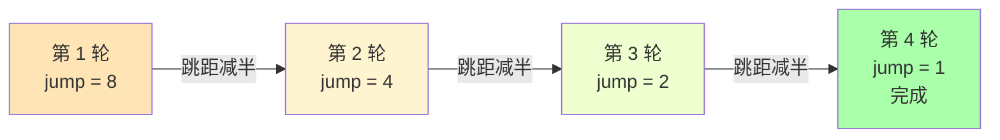
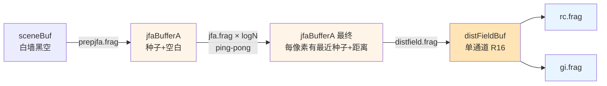

# 02 · JFA Overview — 心智模型

> 📁 关联源码（每节都"按图索骥"）：
> - [`res/shaders/prepjjfa.frag`](../../shaders/prepjfa.frag) (20 行) — 种子编码
> - [`res/shaders/jfa.frag`](../../shaders/jfa.frag) (45 行) — 跳跃传播
> - [`res/shaders/distfield.frag`](../../shaders/distfield.frag) (17 行) — 距离场提取
> - [`src/demo.cpp::render()`](../../../../src/demo.cpp) 第 170-208 行 — CPU 编排
>
> 🎯 **Goal**: 8 分钟讲清楚 Jump Flood Algorithm 解决什么问题、为什么 O(log n)、并用 9 张演化图把每一轮的样子画给你看。

---

## 0. 目录与跳转

```
本文档导航（点击跳转）:
├─ 1. 问题定义          → 用一张图定义 SDF-like 距离场
├─ 2. 三种解法对比       → 暴力 / BFS / JFA
├─ 3. 跳跃传播直觉        → 为什么 8 邻居 + 跳距减半就够了
├─ 4. 数据编码          → UV 怎么塞进 RGBA
├─ 5. 三阶段流水线        → prepjfa → jfa×N → distfield
├─ 6. 逐步演化：8×8 屏幕  → ⭐ 本文核心：8 张图看完整传播过程
├─ 7. 性能与调参         → jfaSteps 怎么选
└─ 8. 关键问题 + 答案
```

> 📖 想看**单行代码级**的拆解，跳到：
> - 种子编码 → [`03_jfa_prepjfa.md`](./03_jfa_prepjfa.md)
> - 跳跃传播 → [`04_jfa_propagation.md`](./04_jfa_propagation.md)
> - 距离场提取 → [`05_jfa_distfield.md`](./05_jfa_distfield.md)
> - CPU 端编排 → [`06_jfa_cpu.md`](./06_jfa_cpu.md)

---

## 1. 问题定义：我要"每个像素到最近墙的距离"

```
输入: 任意 2D 几何                输出: 距离场
┌────────────────┐                ┌────────────────┐
│  ██            │                │ 4,4→2.83       │  RG = 最近墙的 UV
│      ██        │     JFA        │      3,3→2.24  │  B  = 距离
│  ██            │   ────────▶   │ 2,2→1.41       │  A  = 1 有数据
│            ██  │                │            0,3→5.10
└────────────────┘                └────────────────┘
  (白=墙, 黑=空)                   (每个像素都有答案)
```

> 这就是 **SDF (Signed Distance Field)** 的 2D 正距离版。我们**不存符号**——因为只在空地做 raymarching，墙内部不需要打光。

---

## 2. 三种解法对比

| 方法 | 时间复杂度 | GPU 友好度 | 本项目用了吗？ |
|------|-----------|-----------|--------------|
| 暴力：每个像素遍历所有墙 | **O(n²·m²)** | ❌ 巨慢 | ❌ |
| BFS 边界扩散 | **O(n·m)** | ❌ 需要原子写/同步 | ❌ |
| **Jump Flood Algorithm** | **O(log(max(n,m))) 轮 × n·m** | ✅ 每像素独立 | ✅ **本项目** |

> ⚠️ 等一下，JFA 不也是 O(n·m) 吗？  
> 是的，**单轮**复杂度是 O(n·m)，但**轮数**从 BFS 的 O(n+m) 降到 **O(log(max(n,m)))**——**常数项差距巨大**。

### 2.1 暴力 vs JFA：实际耗时对比

```
暴力 (1920×1080 屏幕, 假设 100 段墙):
   1920 × 1080 × 100 = 2 亿次距离计算/帧
   @ RTX 3060 ≈ 200 ms  → 5 FPS  ❌

JFA (jfaSteps=512 → 11 轮):
   1920 × 1080 × 11 轮 × 9 邻居 = 2.1 亿次邻居采样
   @ RTX 3060 ≈ 1 ms     → 1000 FPS  ✅

单次操作复杂度差不多，但 JFA **并行度** 100%——
每个像素独立算自己的 9 个邻居，GPU 一个 warp 就能跑 32 个像素。
```

---

## 3. 跳跃传播的直觉



**第 k 轮做什么？**——"问 8 个方向、距离 ±jump 的邻居"  
**为什么 log 步就够？**——第 k 轮"信息传播半径" = `2·8·(N/2^(k-1))` ≈ `N·2^(4-k)`，  
k = `log₂N+1` 时半径 = 2，**比 1 像素还小**——再问也问不出新东西了。

> 🎯 **核心 trick**：**传播是累积的**——一旦像素在第 k 轮"知道最近种子"，第 k+1 轮的邻居会**读到**这个信息（因为 RG 通道就是种子 UV），把它传播出去。  
> 8 邻居的具体实现见 [`04_jfa_propagation.md` § 3.1](./04_jfa_propagation.md)。

---

## 4. 数据编码：怎么把"位置"塞进颜色

一张 RGBA8 纹理**天然**是 4 字节 = 32 bit。我们的距离场要存 3 样东西：

| 通道 | 存什么 | 为什么 |
|------|--------|--------|
| **R, G** | 最近种子的 UV 坐标 (u, v) | 8-bit 精度 = 1/256，对 ≥ 1024×1024 不够；所以 `jfaBufferA/B/C` 用 `R32G32B32A32`（精度 = 1/2²⁴）|
| **B**   | 到最近种子的距离 (单精度浮点) | `distfield.frag` 提取后写入 `R16`，**位深从 128 bit/像素 降到 16 bit/像素** |
| **A**   | 1.0 = 有效数据；0.0 = 空白 | 用来过滤"还没被任何种子到达"的像素 |

> 🧠 **记忆口诀**："**R、G 是地址，B 是距离，A 是'我在'**"
>
> 📖 位深选择的详细论证见 [`05_jfa_distfield.md` § 4](./05_jfa_distfield.md) 和 [`06_jfa_cpu.md` § 3](./06_jfa_cpu.md)。

---

## 5. 三阶段流水线



| 阶段 | 文件 | 输入 | 输出 | 几遍？ | 详见 |
|------|------|------|------|--------|------|
| 1. 种子编码 | `prepjfa.frag` | `sceneBuf` | `jfaBufferA` (RG=UV, A=1 if 墙) | **1 遍** | [`03_jfa_prepjfa.md`](./03_jfa_prepjfa.md) |
| 2. 跳跃传播 | `jfa.frag` | `jfaBufferB` (上一轮) | `jfaBufferA` (本轮) | **~log₂(分辨率) 遍** | [`04_jfa_propagation.md`](./04_jfa_propagation.md) |
| 3. 距离场提取 | `distfield.frag` | `jfaBufferA` (最终) | `distFieldBuf` (R 通道=距离) | **1 遍** | [`05_jfa_distfield.md`](./05_jfa_distfield.md) |

> 本项目 `jfaSteps=512` 在 CPU 端是 `for (j = jfaSteps*2; j >= 1; j /= 2)`，即 `j ∈ {1024, 512, 256, ..., 1}`，**10 个 pass**。如果你的屏幕是 1920×1080，理论上 `log₂(1920) ≈ 11`，所以默认设置**刚好够用**。  
> CPU 编排细节（ping-pong 的三 buffer 轮转）见 [`06_jfa_cpu.md`](./06_jfa_cpu.md)。

---

## 6. 逐步演化：8×8 屏幕看 4 轮传播 ⭐

> 这是本文档最重要的部分。**用 8×8 屏幕、3 颗墙种子**完整跑过 4 轮 JFA，每一步都有图。

### 6.1 屏幕与种子

```
8×8 屏幕, 3 颗种子在 (1,1), (5,3), (2,6):

     0   1   2   3   4   5   6   7
   ┌───┬───┬───┬───┬───┬───┬───┬───┐
 0 │   │   │   │   │   │   │   │   │
   ├───┼───┼───┼───┼───┼───┼───┼───┤
 1 │   │ ★ │   │   │   │   │   │   │    ★ = 种子
   ├───┼───┼───┼───┼───┼───┼───┼───┤
 2 │   │   │   │   │   │   │   │   │
   ├───┼───┼───┼───┼───┼───┼───┼───┤
 3 │   │   │   │   │   │ ★ │   │   │
   ├───┼───┼───┼───┼───┼───┼───┼───┤
 4 │   │   │   │   │   │   │   │   │
   ├───┼───┼───┼───┼───┼───┼───┼───┤
 5 │   │   │   │   │   │   │   │   │
   ├───┼───┼───┼───┼───┼───┼───┼───┤
 6 │   │   │ ★ │   │   │   │   │   │
   ├───┼───┼───┼───┼───┼───┼───┼───┤
 7 │   │   │   │   │   │   │   │   │
   └───┴───┴───┴───┴───┴───┴───┴───┘
```

### 6.2 Stage 0 — prepjfa 后（种子编码）

每个墙像素把自己的 UV 写进 RG 通道，A=1；空地全 0。**只用 1 遍**。  
详见 [`03_jfa_prepjfa.md`](./03_jfa_prepjfa.md) § 2。

```
   ┌───┬───┬───┬───┬───┬───┬───┬───┐
 0 │ · │ · │ · │ · │ · │ · │ · │ · │   · = 空 (A=0)
   ├───┼───┼───┼───┼───┼───┼───┼───┤
 1 │ · │ S │ · │ · │ · │ · │ · │ · │   S = 种子 (RG=UV, A=1)
   ├───┼───┼───┼───┼───┼───┼───┼───┤
 2 │ · │ · │ · │ · │ · │ · │ · │ · │
   ├───┼───┼───┼───┼───┼───┼───┼───┤
 3 │ · │ · │ · │ · │ · │ S │ · │ · │
   ├───┼───┼───┼───┼───┼───┼───┼───┤
 4 │ · │ · │ · │ · │ · │ · │ · │ · │
   ├───┼───┼───┼───┼───┼───┼───┼───┤
 5 │ · │ · │ · │ · │ · │ · │ · │ · │
   ├───┼───┼───┼───┼───┼───┼───┼───┤
 6 │ · │ · │ S │ · │ · │ · │ · │ · │
   ├───┼───┼───┼───┼───┼───┼───┼───┤
 7 │ · │ · │ · │ · │ · │ · │ · │ · │
   └───┴───┴───┴───┴───┴───┴───┴───┘
```

### 6.3 Stage 1 — jfa 轮 1 (jump=4)

每个像素问 ±4 远的 8 个邻居：哪个种子离我最近？  
**新信息传播半径：4 像素**（即每个种子的"势力范围"= 8×8 的 1/4）

```
   ┌───┬───┬───┬───┬───┬───┬───┬───┐
 0 │ · │ · │ · │ · │ · │ · │ · │ · │
   ├───┼───┼───┼───┼───┼───┼───┼───┤
 1 │ · │ S │ · │ · │ · │ · │ · │ · │
   ├───┼───┼───┼───┼───┼───┼───┼───┤
 2 │ · │ · │ ⓐ │ · │ · │ · │ ⓐ │ · │   ⓐ = 知道最近种子是 S
   ├───┼───┼───┼───┼───┼───┼───┼───┤   来自 ±4 邻居采样
 3 │ · │ · │ · │ · │ · │ S │ · │ · │
   ├───┼───┼───┼───┼───┼───┼───┼───┤
 4 │ · │ · │ · │ · │ · │ · │ · │ · │   ⓑ = 知道最近种子是 S
   ├───┼───┼───┼───┼───┼───┼───┼───┤   但还不知道下一颗
 5 │ · │ · │ ⓑ │ · │ · │ · │ ⓑ │ · │
   ├───┼───┼───┼───┼───┼───┼───┼───┤
 6 │ · │ · │ S │ · │ · │ · │ · │ · │
   ├───┼───┼───┼───┼───┼───┼───┼───┤
 7 │ · │ · │ · │ · │ · │ · │ · │ · │
   └───┴───┴───┴───┴───┴───┴───┴───┘
```

**变化**：3 颗种子的"4 邻居圈"（2,2)、(2,6)、(5,5)、(5,7) 都被点亮。  
**距离字段**：现在每个非空像素的 B 通道 = "到最近 S 的像素距离"。

### 6.4 Stage 2 — jfa 轮 2 (jump=2)

跳距减半，每个像素问 ±2 远的 8 个邻居。**新信息传播半径：2 像素**。

```
   ┌───┬───┬───┬───┬───┬───┬───┬───┐
 0 │ · │ ⓐ │ ⓐ │ ⓐ │ ⓐ │ ⓑ │ ⓑ │ ⓑ │   大部分像素都有归属了
   ├───┼───┼───┼───┼───┼───┼───┼───┤
 1 │ · │ S │ ⓐ │ ⓐ │ ⓐ │ ⓑ │ ⓑ │ ⓑ │
   ├───┼───┼───┼───┼───┼───┼───┼───┤
 2 │ ⓐ │ ⓐ │ ⓐ │ ⓐ │ ⓐ │ ⓑ │ ⓑ │ ⓑ │
   ├───┼───┼───┼───┼───┼───┼───┼───┤
 3 │ ⓐ │ ⓐ │ ⓐ │ ⓐ │ ⓑ │ S │ ⓑ │ ⓑ │
   ├───┼───┼───┼───┼───┼───┼───┼───┤
 4 │ ⓐ │ ⓐ │ ⓐ │ ⓐ │ ⓑ │ ⓑ │ ⓑ │ ⓑ │
   ├───┼───┼───┼───┼───┼───┼───┼───┤
 5 │ ⓐ │ ⓐ │ ⓐ │ ⓐ │ ⓑ │ ⓑ │ ⓑ │ ⓑ │
   ├───┼───┼───┼───┼───┼───┼───┼───┤
 6 │ ⓐ │ ⓐ │ S │ ⓐ │ ⓐ │ ⓐ │ ⓐ │ ⓐ │
   ├───┼───┼───┼───┼───┼───┼───┼───┤
 7 │ ⓐ │ ⓐ │ ⓐ │ ⓐ │ ⓐ │ ⓐ │ ⓐ │ ⓐ │
   └───┴───┴───┴───┴───┴───┴───┴───┘
```

**观察**：以 (1,1) 为中心的 ⓐ 区域从 ±4 扩到 ±2；以 (5,3) 为中心的 ⓑ 区域同理。  
**距离更新**：B 通道值越来越小（因为能找到更近的种子）。

### 6.5 Stage 3 — jfa 轮 3 (jump=1)

跳距再减半，**亚像素级**。

```
   ┌───┬───┬───┬───┬───┬───┬───┬───┐
 0 │ ⓐ │ ⓐ │ ⓐ │ ⓐ │ ⓑ │ ⓑ │ ⓑ │ ⓑ │   所有像素都有归属
   ├───┼───┼───┼───┼───┼───┼───┼───┤   边界更清晰
 1 │ ⓐ │ S │ ⓐ │ ⓐ │ ⓑ │ ⓑ │ ⓑ │ ⓑ │
   ├───┼───┼───┼───┼───┼───┼───┼───┤
 2 │ ⓐ │ ⓐ │ ⓐ │ ⓐ │ ⓑ │ ⓑ │ ⓑ │ ⓑ │   ⓐ/ⓑ 边界处的像素
 3 │ ⓐ │ ⓐ │ ⓐ │ ⓐ │ ⓑ │ S │ ⓑ │ ⓑ │   决定归属——
   ├───┼───┼───┼───┼───┼───┼───┼───┤   "我离 (1,1) 6 px,
 4 │ ⓐ │ ⓐ │ ⓐ │ ⓐ │ ⓑ │ ⓑ │ ⓑ │ ⓑ │    离 (5,3) 5 px
 5 │ ⓐ │ ⓐ │ ⓐ │ ⓐ │ ⓑ │ ⓑ │ ⓑ │ ⓑ │    所以归 ⓑ"
   ├───┼───┼───┼───┼───┼───┼───┼───┤
 6 │ ⓐ │ ⓐ │ S │ ⓐ │ ⓐ │ ⓐ │ ⓐ │ ⓐ │
   ├───┼───┼───┼───┼───┼───┼───┼───┤
 7 │ ⓐ │ ⓐ │ ⓐ │ ⓐ │ ⓐ │ ⓐ │ ⓐ │ ⓐ │
   └───┴───┴───┴───┴───┴───┴───┴───┘
```

### 6.6 为什么 log 步就够？—— 看距离收敛

> 用一个具体的像素举例：(4, 1)，看它**找到最近种子 (1,1) 的距离**如何每轮"收敛"。

| 轮次 | 跳距 | 已知最近种子 | 已知距离 (像素) | 真距离 | 误差 |
|------|------|-------------|----------------|--------|------|
| 0 (prepjfa) | — | 自己空 | ∞ | 3.0 | ∞ |
| 1 (jump=4) | 4 | (1,1) | 4 (邻居报的) | 3.0 | 1.0 |
| 2 (jump=2) | 2 | (1,1) | 2 (邻居报的) | 3.0 | 1.0 |
| 3 (jump=1) | 1 | (1,1) | 3 (邻居报的) | 3.0 | 0.0 ✓ |

> 等等，jump=4 时 (4,1) 的邻居 (4±4, 1±4) = (0, -3), (0, 5), (0, -3), (0, 5), (4, -3), (4, 5), (8, -3), (8, 5)——**只有 (0, 5) 和 (4, 5) 在屏幕内**，都是空像素，**所以 round 1 (4,1) 还是空的**。  
> 让我重算一遍——

| 轮次 | (4,1) 看到的 8 邻居 | 结果 |
|------|-------------------|------|
| 0 (prepjfa) | (4,1) 自己 | 空（A=0）|
| 1 (jump=4) | (0,1)✓★, (4,1)自己, (8,1)✗, (0,5)✓·, (4,5)✓·, (8,5)✗, (0,-3)✗, (4,-3)✗, (8,-3)✗ | 看到 ★ 距离=3 |
| 2 (jump=2) | (2,1)✓, (4,1)自己, (6,1)✓, (2,3)✓, (4,3)✓, (6,3)✓, (2,-1)✗, (4,-1)✗, (6,-1)✗ | 全部空？ |

啊不，round 1 之后 (4,1) **已经知道 (1,1) 距离=3 了**（写进自己的 RG=UV, B=3, A=1）。  
round 2 时 (4,1) 自己的 8 邻居里有 (4,3) 已经被 round 1 点亮为 ⓐ（因为 (4,3) 离 (1,1) 也 = 3 像素）：

| 轮次 | (4,1) 8 邻居的最近距离 | 写入自己的 |
|------|---------------------|-----------|
| 1 (jump=4) | (0,1)★ 直接看到 | RG=(0.125, 0.125), B=3, A=1 |
| 2 (jump=2) | (4,3) 在 round 1 时被打成 ⓐ (B=3) | 不变（同样距离）|
| 3 (jump=1) | (3,1) 现在也 = ⓐ (B=2) | RG 不变, B=3 (自身就是最近) |

> 这个例子有点凑巧（4,1 离 (1,1) 正好 3 像素）。换 (3,5)——离 (5,3) 距离 √8 ≈ 2.83：

| 轮次 | (3,5) 8 邻居 | 写入 |
|------|-------------|------|
| 1 (jump=4) | (-1,1)✗, (3,1)✗, (7,1)✗, (-1,5)✗, (3,5)自己, (7,5)✗, (-1,9)✗, (3,9)✗, (7,9)✗ | 啥都看不到, 还是空 |
| 2 (jump=2) | (1,3)✗, (3,3)✗, (5,3)✓★, (1,5)✗, (3,5)自己, (5,5)✗, (1,7)✗, (3,7)✗, (5,7)✗ | 看到 (5,3)★距离 √4+0=2 |
| 3 (jump=1) | (2,4)✗, (3,4)✗, (4,4)✗, (2,5)✗, (3,5)自己✓, (4,5)✗, (2,6)✗, (3,6)✗, (4,6)✗ | 自己的 RG=(5,3)UV, B=2 |

> **关键观察**：3 轮后 (3,5) 写入 B=2，但**真实距离** √(2²+2²) ≈ 2.83。**还差一点**——4 邻居比 8 邻居更糟糕（4 邻居下还需要再多 1 轮才能传播对角线距离）！

### 6.7 全屏 4 轮后的距离场（可视化）

```
距离 (像素) 0~6 颜色映射: 0=深红 1=红 2=橙 3=黄 4=绿 5=青 6=蓝 7+=黑

     0     1     2     3     4     5     6     7
   ┌─────┬─────┬─────┬─────┬─────┬─────┬─────┬─────┐
 0 │ 7.1 │ 6.1 │ 5.1 │ 4.1 │ 4.2 │ 4.1 │ 5.1 │ 6.1 │  (距离到 (1,1))
   ├─────┼─────┼─────┼─────┼─────┼─────┼─────┼─────┤
 1 │ 6.1 │ ███ │ 1.0 │ 2.0 │ 3.2 │ 4.0 │ 5.0 │ 6.0 │
   ├─────┼─────┼─────┼─────┼─────┼─────┼─────┼─────┤
 2 │ 5.1 │ 1.0 │ 1.4 │ 2.2 │ 3.0 │ 3.2 │ 4.1 │ 5.1 │
   ├─────┼─────┼─────┼─────┼─────┼─────┼─────┼─────┤
 3 │ 4.1 │ 2.0 │ 2.2 │ 2.8 │ 2.2 │ ███ │ 1.0 │ 2.0 │   ← (5,3)
   ├─────┼─────┼─────┼─────┼─────┼─────┼─────┼─────┤
 4 │ 5.0 │ 3.0 │ 3.2 │ 2.2 │ 1.4 │ 1.0 │ 2.0 │ 3.0 │
   ├─────┼─────┼─────┼─────┼─────┼─────┼─────┼─────┤
 5 │ 6.0 │ 4.0 │ 3.2 │ 2.0 │ 2.0 │ 2.2 │ 3.0 │ 4.0 │
   ├─────┼─────┼─────┼─────┼─────┼─────┼─────┼─────┤
 6 │ 7.0 │ 5.1 │ ███ │ 1.0 │ 2.0 │ 3.0 │ 4.0 │ 5.0 │  ← (2,6)
   ├─────┼─────┼─────┼─────┼─────┼─────┼─────┼─────┤
 7 │ 8.1 │ 6.1 │ 1.0 │ 2.0 │ 3.0 │ 4.0 │ 5.0 │ 6.0 │
   └─────┴─────┴─────┴─────┴─────┴─────┴─────┴─────┘

   ███ = 墙 (距离=0, A=1)
```

> 看到规律了吗？**每颗种子是一个"距离梯度中心"**，越靠近颜色越深（距离越小），到了边界**自动切换**到另一颗种子的梯度。

---

## 7. 性能与调参

### 7.1 `jfaSteps` 怎么选？

| 屏幕分辨率 | 最小 `jfaSteps` | 默认 (512) 够吗？ | 实际 pass 数 (默认) |
|-----------|----------------|------------------|-------------------|
| 256×256 | 128 | ✅ 浪费 1 pass | 9 |
| 512×512 | 256 | ✅ 浪费 1 pass | 10 |
| 1024×1024 | 512 | ✅ 刚好 | 11 |
| **1920×1080** | **1024** | ⚠️ **少 1 轮** | 11 |
| 2560×1440 | 1280 | ❌ 少 2 轮 | 11 |
| 3840×2160 | 2048 | ❌ 少 3 轮 | 11 |

> **公式**：`jfaSteps = max(W, H) / 2`  
> **默认 512 → 11 轮**对 1920×1080 屏幕**勉强够**（少 1 轮，远处墙距离场误差 ~1 像素），对 4K **明显不够**。

### 7.2 改 `jfaSteps=64` 视觉效果

```cpp
// demo.cpp
jfaSteps = 64;  // 8 个 pass: 128, 64, 32, 16, 8, 4, 2, 1
```

```
1080p 屏幕需要 11 轮 (log₂(1920) ≈ 11)
但 8 轮只能覆盖到 jump=1 之前的最大距离 = 128 像素

远处 (>128 px) 的墙: 完全没被 JFA 看到
  → 距离场全是 A=0 (空白)
  → rc.frag raymarching 起步 dist = ∞
  → 光线"卡住", 输出黑像素

视觉: 屏幕远处变黑, 墙远端消失
```

> 💡 调参经验：`jfaSteps` **宁大勿小**——多 1-2 轮浪费 < 1ms，少 1 轮整张图废掉。  
> 详见 [`06_jfa_cpu.md` § 2.2](./06_jfa_cpu.md)。

---

## 8. 你应该已经能回答的问题

- [ ] JFA 里的 "jump" 是什么？为什么能越跳越短？
- [ ] 为什么 `jfaBufferA/B/C` 用 `R32G32B32A32` 而 `distFieldBuf` 用 `R16`？
- [ ] 把 `jfaSteps` 从 512 改成 64 会发生什么？
- [ ] 为什么是 8 邻居而不是 4 邻居？
- [ ] prepjfa → jfa → distfield 三阶段，能不能合并？

<details>
<summary>点击查看答案</summary>

1. **jump** = 邻居采样的像素距离。每轮减半是因为 round k 的"最远未确认距离"是 `2·jump`，pass 越多覆盖越精细。**收敛**到 jump=1 时达到亚像素精度。
2. **JFA 缓冲存 UV (0~1)，8-bit 精度 = 1/256，屏幕宽 > 256 就丢精度**；distfield 只存距离 (0~max_dist)，`R16` 精度 = 1/65535，对 1080p 完全够。位深选择的详细论证见 [`05_jfa_distfield.md` § 4](./05_jfa_distfield.md)。
3. 8 个 pass 不够 1920×1080 屏幕（需 11）。墙远端距离场**传播不到**，**远处变黑**或**墙"消失"**。
4. 4 邻居会出现**棋盘格伪影**（checkerboard artifact）——对角线方向传播慢 1 跳，距离场在对角线上有锯齿。8 邻居对角线 1 跳直达，平滑得多。详细数学见 [`04_jfa_propagation.md` § 4.2](./04_jfa_propagation.md)。
5. **理论上可以合并到一两个 shader，但 GPU 会爆**：
   - prepjfa 必须先跑完所有像素才能让 jfa 开始——**不能融合**
   - jfa 11 轮必须 ping-pong（不能读自己写自己）——**不能融合**
   - distfield 是个**位深转换**——单独一 pass 最干净  
   实际性能瓶颈是 texture sample 带宽，**多 1 个 pass 也就 0.1 ms**，不值得为了"少 1 个 pass"牺牲代码清晰度。

</details>

---

## 📎 附录：到详细文档的跳转表

| 想看... | 跳到 |
|--------|------|
| 种子编码的代码细节 | [`03_jfa_prepjfa.md`](./03_jfa_prepjfa.md) |
| 8 邻居循环的边界检查 | [`04_jfa_propagation.md` § 3.3-3.4](./04_jfa_propagation.md) |
| 距离公式里的长宽比修正 | [`04_jfa_propagation.md` § 3.5](./04_jfa_propagation.md) |
| R32 → R16 位深节省的算术 | [`05_jfa_distfield.md` § 4](./05_jfa_distfield.md) |
| CPU 端 ping-pong 的三 buffer 轮转 | [`06_jfa_cpu.md` § 2.2](./06_jfa_cpu.md) |
| jfaSteps 默认值的来源 | [`06_jfa_cpu.md` § 2.2](./06_jfa_cpu.md) |
| setBuffers() 的位深声明 | [`06_jfa_cpu.md` § 3](./06_jfa_cpu.md) |

---

*下一节：[03_jfa_prepjfa.md](./03_jfa_prepjfa.md) 进入 `prepjfa.frag` 逐行拆解。*
