# 06 · JFA · C++ 端编排

> 📁 源码：`src/demo.cpp::render()` 第 170-208 行（38 行）  
> 🎯 **Goal**: 看懂 JFA 的 CPU 调度：`jfaSteps` 怎么决定 pass 数、为什么三个 buffer 轮转、`setBuffers` 里位深怎么选。

---

## 1. 完整源码（带行号）

```cpp
170    // -------------------------------- jump flooding algorithm / distance field generation
171  
172    // first render pass for JFA
173    // create UV mask w/ prep shader
174    BeginTextureMode(jfaBufferA);
175      ClearBackground(BLANK);
176      BeginShaderMode(prepJfaShader);
177        SetShaderValueTexture(prepJfaShader, GetShaderLocation(prepJfaShader, "uSceneMap"), sceneBuf.texture);
178        DrawRectangle(0, 0, GetScreenWidth(), GetScreenHeight(), WHITE);
179      EndShaderMode();
180    EndTextureMode();
181  
182    // ping-pong buffering
183    // alternate between two buffers so that we can implement a recursive shader
184    // see https://mini.gmshaders.com/p/gm-shaders-mini-recursive-shaders-1308459
185    for (int j = jfaSteps*2; j >= 1; j /= 2) {
186      jfaBufferC = jfaBufferA;
187      jfaBufferA = jfaBufferB;
188      jfaBufferB = jfaBufferC;
189  
190      BeginTextureMode(jfaBufferA);
191        ClearBackground(BLANK);
192        BeginShaderMode(jfaShader);
193          SetShaderValueTexture(jfaShader, GetShaderLocation(jfaShader, "uCanvas"), jfaBufferB.texture);
194          SetShaderValue(jfaShader, GetShaderLocation(jfaShader, "uJumpSize"), &j, SHADER_UNIFORM_INT);
195          DrawRectangle(0, 0, GetScreenWidth(), GetScreenHeight(), WHITE);
196        EndShaderMode();
197      EndTextureMode();
198    }
199  
200    // write distance field to another buffer
201    // reduces strain as the cpu gets to send less data to the gpu for lighting shaders
202    BeginTextureMode(distFieldBuf);
203      ClearBackground(BLANK);
204      BeginShaderMode(distFieldShader);
205        SetShaderValueTexture(distFieldShader, GetShaderLocation(distFieldShader, "uJFA"), jfaBufferA.texture);
206        DrawRectangle(0, 0, GetScreenWidth(), GetScreenHeight(), WHITE);
207      EndShaderMode();
208    EndTextureMode();
```

---

## 2. 三段拆解

### 2.1 第一段：种子编码（第 174-180 行）

```cpp
BeginTextureMode(jfaBufferA);          // 目标：jfaBufferA
  ClearBackground(BLANK);              // 清空（A=0）
  BeginShaderMode(prepJfaShader);
    SetShaderValueTexture(..., "uSceneMap", sceneBuf.texture);
    DrawRectangle(..., WHITE);          // 全屏 quad 触发 fragment shader
  EndShaderMode();
EndTextureMode();
```

`prepjfa.frag` 跑一遍：把"白墙" → "种子 (UV, 0, 1)"，空地 → "(0, 0, 0, 0)"。

> 💡 `DrawRectangle(..., WHITE)` 的白只是触发"每个像素都跑一次 shader"，shader 内部会采样 `uSceneMap` 自己决定怎么写。

### 2.2 第二段：JFA 跳跃传播（第 185-198 行）

```cpp
for (int j = jfaSteps*2; j >= 1; j /= 2) {
  jfaBufferC = jfaBufferA;
  jfaBufferA = jfaBufferB;
  jfaBufferB = jfaBufferC;
  
  BeginTextureMode(jfaBufferA);   // 写 A
    BeginShaderMode(jfaShader);
      SetShaderValueTexture(..., "uCanvas", jfaBufferB.texture);  // 读 B
      SetShaderValue(..., "uJumpSize", &j, SHADER_UNIFORM_INT);
    EndShaderMode();
  EndTextureMode();
}
```

#### `jfaSteps` 怎么决定 pass 数？

```cpp
int j = jfaSteps * 2;   // 1024 (默认 jfaSteps=512)
while (j >= 1) {
  // pass
  j /= 2;
}
```

循环序列：`1024, 512, 256, 128, 64, 32, 16, 8, 4, 2, 1` → **11 个 pass**。

> ❓ `jfaSteps` 这个名字有误导性。**不是"跳的总步数"，而是"初始跳距的 1/2"**。  
> 实际公式：初始 `jump = 2 × jfaSteps`。  
> 默认 `jfaSteps=512` → 初始 jump = 1024 → 直到 jump=1 共 `log₂(1024)+1 = 11` 个 pass。

#### 1920×1080 屏幕要多少 pass？

```
log₂(1920) ≈ 10.9
log₂(1080) ≈ 10.1
取大值 = 11
```

→ **jfaSteps=512（初始 1024）刚好够**，11 个 pass 不多不少。

#### 改成 jfaSteps=64 呢？

```
初始 jump = 128
序列：128, 64, 32, 16, 8, 4, 2, 1
     = 8 个 pass
```

**8 个 pass 不够** 1920×1080 屏幕（需要 11），远处墙的距离场会"传播不到"——视觉上**远处变黑**或**光线穿过墙**。

> 💡 **调参建议**：`jfaSteps` 至少设为 `max(W, H) / 2`。

#### 为什么用 3 个 buffer 而不是 2 个？

| Pass | jfaBufferA 写入 | jfaBufferB 读 | 等价 2-buffer swap | 3-buffer swap |
|------|----------------|---------------|---------------------|----------------|
| 1 | 来自 prepjfa | prepjfa 内容 | 写自己读自己 ❌ | B=prepjfa, A=B ✅ |
| 2 | 上一 pass | 上一 pass | 写 A 读 B | B=pass1, A=B ✅ |
| ... | ... | ... | ... | ... |

**理论上 2 个 buffer 也能跑**（在 j%2==0 读一个、写另一个，j%2==1 反过来），但 3 buffer 的 swap 写法**不需要 if-else**，GPU 端代码更简洁。

> 🧠 **真实坑**：当 `jfaSteps*2` 超过屏幕分辨率时，第 1 个 pass 的 jump 比屏幕还大，**邻居采样全在屏幕外**，什么都不会变。这是 `jfaSteps` 选 512（而不是 64）的另一个理由——**多出来的几个 pass 浪费不多，但保险**。

### 2.3 第三段：距离场提取（第 202-208 行）

```cpp
BeginTextureMode(distFieldBuf);
  BeginShaderMode(distFieldShader);
    SetShaderValueTexture(..., "uJFA", jfaBufferA.texture);
  EndShaderMode();
EndTextureMode();
```

`distfield.frag` 跑 1 遍，把 `jfaBufferA` 的 B 通道搬到 `distFieldBuf`（位深 `R16`）。

---

## 3. setBuffers() 中的位深

`demo.cpp::setBuffers()` 第 781-799 行：

```cpp
jfaBufferA      = LoadRenderTexture(GetScreenWidth(), GetScreenHeight());
jfaBufferB      = LoadRenderTexture(GetScreenWidth(), GetScreenHeight());
jfaBufferC      = jfaBufferA;
...
changeBitDepth(jfaBufferA,   PIXELFORMAT_UNCOMPRESSED_R32G32B32A32);
changeBitDepth(jfaBufferB,   PIXELFORMAT_UNCOMPRESSED_R32G32B32A32);
changeBitDepth(jfaBufferC,   PIXELFORMAT_UNCOMPRESSED_R32G32B32A32);
changeBitDepth(distFieldBuf, PIXELFORMAT_UNCOMPRESSED_R16);
```

#### 为什么 UV 编码必须 32-bit？

UV ∈ [0, 1]，8-bit 精度 = 1/256 ≈ 0.004。  
**1920×1080 屏幕**：1920 像素 / 256 精度 = **每 UV 单位 = 7.5 像素**。  
这意味着当 `jfa.frag` 跳距 = 1 像素时，**UV 误差就达 1/256 UV ≈ 7.5 像素**——JFA 找的"最近种子"误差 7.5 像素！  

32-bit 浮点精度 = 1/2²⁴ ≈ 6e-8，**误差远小于 1 像素**。

#### 注释里说的"changeBitDepth"实际做了什么？

```cpp
auto changeBitDepth = [](RenderTexture2D &buffer, PixelFormat pixformat) {
  rlEnableFramebuffer(buffer.id);
    rlUnloadTexture(buffer.texture.id);
    buffer.texture.id = rlLoadTexture(NULL, GetScreenWidth(), GetScreenHeight(), pixformat, 1);
    buffer.texture.width = GetScreenWidth();
    buffer.texture.height = GetScreenHeight();
    buffer.texture.format = pixformat;
    buffer.texture.mipmaps = 1;
    rlFramebufferAttach(buffer.id, buffer.texture.id, RL_ATTACHMENT_COLOR_CHANNEL0, RL_ATTACHMENT_TEXTURE2D, 0);
  rlDisableFramebuffer();
};
```

**核心思路**：
1. 启用 FBO
2. 卸载默认的 8-bit 纹理
3. 加载一个**指定位深**的新纹理
4. 把新纹理 attach 到 FBO 的颜色通道 0

> ⚠️ **Raylib 的 `LoadRenderTexture` 默认 8-bit**，需要手动用 `rlLoadTexture` 改格式。这是 Raylib 4.x 时代的 workaround，5.x 之后应该用 `LoadRenderTexture` 的新参数。

---

## 4. 完整时序图

```mermaid
gantt
    title 一帧内 JFA 部分的 GPU 时间线
    dateFormat  X
    axisFormat  %s
    
    section Scene
    prepjfa  :a1, 0, 1
    
    section JFA
    jfa(1024) :a2, after a1, 1
    jfa(512)  :a3, after a2, 1
    jfa(256)  :a4, after a3, 1
    jfa(128)  :a5, after a4, 1
    jfa(64)   :a6, after a5, 1
    jfa(32)   :a7, after a6, 1
    jfa(16)   :a8, after a7, 1
    jfa(8)    :a9, after a8, 1
    jfa(4)    :a10, after a9, 1
    jfa(2)    :a11, after a10, 1
    jfa(1)    :a12, after a11, 1
    
    section Dist
    distfield :a13, after a12, 1
```



> 实测：1080p 屏幕上，JFA 11 个 pass + prepjfa + distfield 共 13 个 pass，总耗时 ~1ms（RTX 3060）。

---

## 5. 关键问题

- [ ] 如果把 `jfaSteps` 改成 32，会发生什么？
- [ ] 为什么 JFA 部分 GPU 跑完后，CPU 端**不需要**做 `glMemoryBarrier` 或类似同步？
- [ ] 改成 GPU Compute Shader 实现 JFA 会更快吗？

<details>
<summary>答案</summary>

1. 初始 jump = 64，序列 `64, 32, 16, 8, 4, 2, 1` = 7 个 pass。**1920×1080 屏幕需要 11**，远处墙距离场误差可达 100+ 像素。视觉上"墙边远处发黑"或"半透墙"。
2. **因为 `BeginTextureMode` / `EndTextureMode` 已经隐式做了 FBO 同步**（glFlush + FBO barrier）。Raylib 把这些细节封装掉了，不需要手动写 GL 命令。
3. 不会明显更快。JFA **不需要** shared memory 或 atomic，fragment shader 已经是 GPU 上跑这种"每像素独立"任务的最佳工具。Compute shader 的优势是 (a) 写 RWTexture（避免 ping-pong）、(b) shared memory tile 优化，**但 JFA 9 邻居采样都是直接邻居，没有 tile 复用空间**。

</details>

---

*下一节：[07_rc_overview.md](./07_rc_overview.md) 进入 RC 算法心智模型。*
