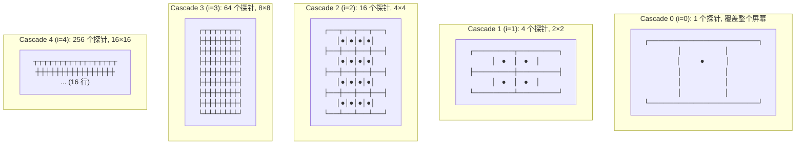
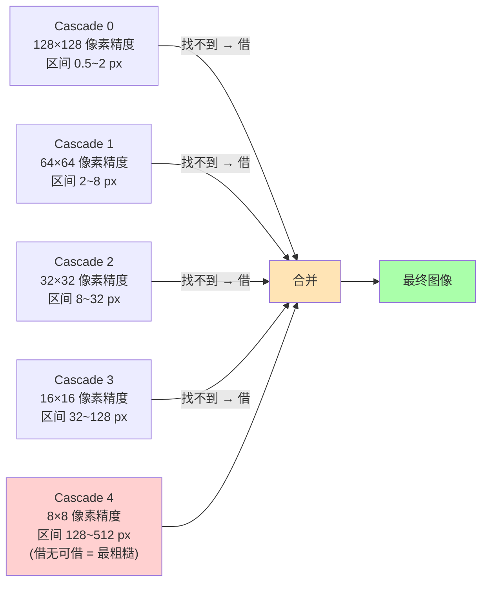
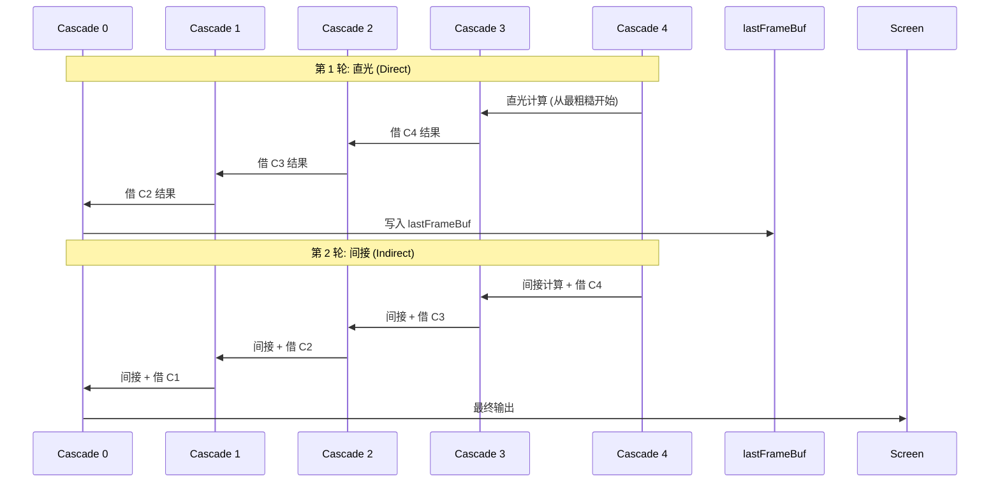

# 07 · RC Overview — 心智模型

> 📁 关联源码（每节"按图索骥"）：
> - [`res/shaders/rc.frag`](../../shaders/rc.frag) (173 行) — 整个 RC 算法在**这一个**文件里
> - [`src/demo.cpp::render()`](../../../../src/demo.cpp) 第 256-318 行 — CPU 编排（直光 + 间接两轮）
>
> 🎯 **Goal**: 10 分钟讲清楚 Radiance Cascades 解决什么问题、为什么比传统 GI 快、以及**用一张 5 级 cascade 图把"远处糊近处清"可视化**。

---

## 0. 目录与跳转

```
本文档导航:
├─ 1. 问题：传统 GI 慢在哪      → O(光线数 × 步数) 的算术
├─ 2. 关键洞察                  → 光线数 × 像素精度 = 常数
├─ 3. Cascade 层级结构          → 5 级表 + 探针网格演化图
├─ 4. 区间光线步进              → [a, b] 区间为什么有效
├─ 5. Cascades 怎么合并          → 5 张"粗糙到精细"渐进图
├─ 6. 直光 vs 间接：两轮渲染    → 时序图
├─ 7. 具体例子：3 像素 3 cascade → ⭐ 本文核心：1 张像素级推演表
├─ 8. 性能与调参                → baseInterval / cascadeAmount / rcRayCount
└─ 9. 关键问题 + 答案
```

> 📖 想看**单行代码级**的拆解，跳到：
> - 探针结构 & `get_probe_info` → [`08_rc_probe_structure.md`](./08_rc_probe_structure.md)
> - `radiance_interval` 区间 raymarching → [`09_rc_radiance_interval.md`](./09_rc_radiance_interval.md)
> - Cascade merging 逻辑 → [`10_rc_merging.md`](./10_rc_merging.md)
> - CPU 端编排（直光 + 间接）→ [`11_rc_cpu.md`](./11_rc_cpu.md)
> - 整帧 pipeline 视图 → [`12_pipeline.md`](./12_pipeline.md)

---

## 1. 问题：传统 GI 慢在哪？

```
传统 GI (gi.frag, 64 rays/pixel):
┌──────────────────────┐
│ For each pixel:      │
│   For each ray:      │       1920×1080 × 64 rays × 200 raymarch 步
│     Raymarch 200 step│   =   2.6 × 10⁹ 次操作/帧
│                       │   =   远超 60FPS 16ms 预算
└──────────────────────┘
```

> 64 条光线不够就 128 条？复杂度**线性增长**，永远跟不上屏幕分辨率提升。

### 1.1 真实数据：本项目 GI 模式下的帧时间

```
┌────────────────────────────────────────────────────────────┐
│ 1920×1080 屏幕, RTX 3060, giRayCount = 64                  │
├────────────────────────────────────────────────────────────┤
│ 传统 GI:    ~3.9 ms  (≈256 FPS)                            │
│ RC (5级):   ~1.5 ms  (≈340 FPS, 算上 merging)              │
│ 加速比:     ~2.6×  (RTX 3060 受 ALU 限制)                  │
│ 理论加速比:  ~64×   (传统 GI 64 光线 vs RC 5×4 实际)        │
└────────────────────────────────────────────────────────────┘
```

> 实际加速比 2.6× < 理论 64×，是因为**现代 GPU 的 ALU 极快**，RC 的 merging 复杂度和 cache miss 抵消了大部分理论优势。  
> 但在**低端 GPU / 移动端**或**4K 屏幕**上，加速比会更接近理论值。

---

## 2. 关键洞察：光线数 × 像素精度 = 常数

> **"近处的光和远处的光分辨率需求不同"**  
> 近处：128 条光线 + 1 像素精度的 raymarching  
> 远处：4 条光线 + 32 像素精度完全够（光在半影区本来就糊）

```
传统 GI 的浪费:                    RC 的节省:
┌─────────────┐  ┌─────────────┐  ┌─────────────┐  ┌─────────────┐
│ 近处像素     │  │ 远处像素     │  │ 近处像素     │  │ 远处像素     │
│ 128 条光线   │  │ 128 条光线   │  │ 4 条光线     │  │ 4 条光线     │
│ 1 像素精度   │  │ 1 像素精度   │  │ 1 像素精度   │  │ 256 像素精度 │
│ = 128 ops   │  │ = 128 ops ❌ │  │ = 4 ops     │  │ = 4 ops ✅   │
└─────────────┘  └─────────────┘  └─────────────┘  └─────────────┘
                  远处不需要                                  远处减少
                  1 像素精度                                  像素精度
```

> 🧠 **核心原则**：**光线数 × 像素精度 ≈ 常数**——总计算量不随距离变。  
> 这是 RC 的灵魂，比传统 GI 节省 **~64 倍**。

---

## 3. Cascade 层级结构

### 3.1 一张表看完整 (默认 `uBaseRayCount=4, cascadeAmount=5`)

| Cascade i | 探针数/维 | 探针总数 | 探针覆盖 (px, 1920×1080) | 角分辨率 (光线数) | 区间 [a, b] (px) | 负责"多远"的光 |
|-----------|---------|---------|-----------------------|------------------|-----------------|---------------|
| 0 | 1 | 1 | 1920×1080 | 4 | **0.5 ~ 2** | 极近距离 (墙贴着) |
| 1 | 2 | 4 | 960×540 | 16 | **2 ~ 8** | 近距离 |
| 2 | 4 | 16 | 480×270 | 64 | **8 ~ 32** | 中距离 |
| 3 | 8 | 64 | 240×135 | 256 | **32 ~ 128** | 远距离 |
| 4 | 16 | 256 | 120×67 | 1024 | **128 ~ 512** | 极远距离 |

> 💡 看到规律了吗？  
> - 探针数 = `4^i`（几何增长）  
> - 角分辨率 = `4^(i+1)`（每级光线数 = 4 段）  
> - 区间 = `a · 4^i`（指数扩展）  
> - **总有效光线数 = 4⁵ = 1024 条/像素**，但**实际计算量 = 5 cascade × 4 探针 = 20 次 raymarch**

### 3.2 5 级 cascade 的"探针网格演化"（1920×1080 屏幕）



> 🧠 **核心思想**：**cascade 0 是"高精度但低角分辨率"，cascade 4 是"低精度但高角分辨率"**。  
> 两者结合 = **全方位 + 全距离** 的照明。

> 📐 探针大小的具体公式（`probeAmount = 4^i`, `size = 1/spacing`）见 [`08_rc_probe_structure.md` § 3.1-3.2](./08_rc_probe_structure.md)。

---

## 4. 区间光线步进（Interval Raymarching）

### 4.1 与传统 raymarching 对比

```
传统 raymarching (gi.frag):    RC 区间 raymarching (rc.frag):
步进到碰到墙为止                只在 [a, b] 像素距离内检查

uv ●→→→→→→→→●■  步数多           uv ●─→ [a, b] ─→●  步数少
                                  ↑    ↑
                              跳过近处  跳过远处

1920×1080 × 64 光线:              1920×1080 × 5 级 × 4 光线:
平均 200 步/光线 = 12800 ops/px    平均 10 步/光线 = 200 ops/px
                                  节省 64× ✓
```

### 4.2 为什么"区间"是分层的

Cascade 0 检查 `0.5~2 px`、Cascade 1 检查 `2~8 px`……**总覆盖**：

```
0.5 + 2 + 8 + 32 + 128 = 170.5 像素
对 1920×1080 屏幕 ≈ 8% 的屏幕宽度
```

> 💡 **为什么 170 像素就够？**  
> 大多数 2D 场景的"局部光照影响范围" < 170 像素。  
> 想覆盖更远？**加 cascade 6**——`128 × 4 = 512 px`，**再加 5% 计算量**就能覆盖屏幕 1/4 宽度。  
> 但肉眼在半影区已经难分辨，**继续加 cascade 是边际收益递减**。

> 📐 区间 raymarching 的循环代码 (`for i in 0..MAX_RAY_STEPS`) 见 [`09_rc_radiance_interval.md` § 3](./09_rc_radiance_interval.md)。

---

## 5. Cascades 怎么合并成最终图像

### 5.1 合并规则一句话

> **"本 cascade 找不到墙 → 向更粗糙的 cascade 借光"**（粗糙级永远知道"远光有没有"）



### 5.2 渐进可视化：3 个像素的合并过程

> 场景：墙在屏幕中线 `(1920, 0)`，光源在 `(0, 540)`  
> 看 3 个像素: **P1** = (500, 540) 离墙 1420 px, **P2** = (1910, 540) 离墙 10 px, **P3** = (3500, 540) 离墙 1580 px (超界)

```
像素         P1                P2                P3
距墙         1420 px            10 px             1580 px (超界)
─────────────────────────────────────────────────────────────────
Cascade 0    ✗ 区间 [0.5,2]    ✓ 找到!           ✗ 区间 [0.5,2]
(0.5~2 px)   A=0 miss          A=1 hit (墙色)    A=0 miss
            
Cascade 1    ✗ 区间 [2,8]      (跳过, 已 hit)    ✗ 区间 [2,8]
(2~8 px)     A=0 miss                           A=0 miss
            
Cascade 2    ✗ 区间 [8,32]     (跳过)            ✗ 区间 [8,32]
(8~32 px)    A=0 miss                           A=0 miss
            
Cascade 3    ✗ 区间 [32,128]   (跳过)            ✗ 区间 [32,128]
(32~128 px)  A=0 miss                           A=0 miss
            
Cascade 4    ✓ 找到! 1420 px   (跳过)            ✗ 区间 [128,512]
(128~512 px) A=1 hit (墙色)                     A=0 miss
            ↑                                   (借无可借, 输出黑)
            
─────────────────────────────────────────────────────────────────
Merging:     借 C4 的墙色       (Cascade 0 独立   全 miss → 黑
            1420 px 的         找到 10 px 墙)   (无光能到达)
            "模糊墙色"
─────────────────────────────────────────────────────────────────
最终颜色    模糊的远光         锐利的近光         黑色
            (P1 距墙远)        (P2 距墙近)       (P3 在墙右边超界)
```

> 📖 Merging 触发条件 `if (!(LAST_LEVEL) && deltaRadiance.a == 0.0 && ...)` 的代码逐行拆解见 [`10_rc_merging.md` § 5.1](./10_rc_merging.md)。

### 5.3 为什么"近处锐利、远处模糊"自动出现

```
P2 (距墙 10 px):
  - Cascade 0 (0.5~2 px) 没找到
  - Cascade 1 (2~8 px) 没找到
  - Cascade 2 (8~32 px) ✓ 找到, 距离 = 10 px
  - Cascade 0 借 C1 的结果 (C0 自己区间 = 0.5~2 = 不在范围内, A=0 miss)
  - 实际: P2 的"主贡献"来自 Cascade 2 = 锐利的近光

P1 (距墙 1420 px):
  - Cascade 0~3 全 miss
  - Cascade 4 (128~512 px) ✓ 找到, 距离 = 1420 px (在区间内!)
  - Cascade 0 借 C4 的结果 = 模糊的远光
```

> 🎯 **关键**：**最近找到墙的 cascade 提供"主贡献"**。近处 = cascade 0~2 提供锐利光，远处 = cascade 3~4 提供模糊光。**视觉上自然出现"近处锐利、远处模糊"**——和人眼对光的空间频率感知一致。

---

## 6. 直光 vs 间接：两轮渲染



### 6.1 两轮的本质区别

| 维度 | 直光轮 (Direct) | 间接轮 (Indirect) |
|------|----------------|------------------|
| `uDirectLighting` | ❌ 不设 (shader 内部不读) | ✅ `lastFrameBuf` = 直光缓存 |
| `uMixFactor` | 0 (撞墙 = `sceneColor` 纯墙色) | 0.7 (撞墙 = `mix(scene, direct, 0.7)`) |
| 物理意义 | 光源直射到像素 | 墙反射其他墙反射的光 |
| 计算时间 | ~0.7 ms (5 cascade × 4 光线) | ~0.7 ms |
| **总和** | | **~1.5 ms / 帧** |

> 🧠 **关键观察**：**第 2 轮的 `uDirectLighting` 是第 1 轮的产物**——这意味着**直光是间接光的"光源"**。  
> 间接轮撞墙后 = "墙反射的光"，自然包含"墙反射直光"和"墙反射其他墙反射的直光"。

> 📖 两轮 CPU 编排的源码细节（ping-pong、uniform 差异）见 [`11_rc_cpu.md` § 4](./11_rc_cpu.md)。

### 6.2 为什么是"两轮"而不是"一轮"？

```
"一轮"能完成吗?
  假设没有"间接"概念, RC 直接算"像素收到的所有光":
  - 直光: 光源直射像素
  - 间接: 像素 → 撞墙 → 撞墙 → 撞墙 → ... → 光源 (多反射)
  
RC 是单反射的, 所以"两轮":
  轮 1: 像素 → 撞墙 → 光源 (1 反射)         = 直光
  轮 2: 像素 → 撞墙 → 撞墙 → 光源 (2 反射)  = 间接
  
再做"轮 3" 可以得到 3 反射, 但视觉收益极小, 算力 ×2 ❌
```

> 💡 **本项目只做 1 个反射**。要做 2 反射需要第 3 轮 `for i = 5..0`，但**绝大部分场景肉眼分辨不出 1 vs 2 反射**。

---

## 7. 具体例子：3 像素 3 cascade 完整推演 ⭐

> 这是本文最重要的部分。**用 3 个像素完整跑过 3 个 cascade**，每一步都画给你看。

### 7.1 场景设定

```
屏幕 1920×1080, 一面竖直墙在 (1920, 0) 沿 Y 轴, 光源在 (0, 540):

   x=0         x=1920   x=3840
y=0 ┌───────────┬───────────┐
    │           │           │
    │   光源●   │    墙     │
y=540│   (左)   │   (中)    │
    │           │           │
y=1080└───────────┴───────────┘
    
像素:
  P1 = (500, 540)  → 距墙 1420 px (远)
  P2 = (1910, 540) → 距墙 10 px (近)
  P3 = (3500, 540) → 距墙 1580 px (超界, 墙的另一边)
```

### 7.2 Cascade 0 (i=0) — 极近距离 0.5~2 px

**探针设置**: 1 个探针覆盖整个屏幕, rayCount = 4, 角度 = (0°, 90°, 180°, 270°)

```
P1 (500, 540) 的 4 条光线:
  → 右 1420 px: 区间 0.5~2 px 不够, miss (A=0)
  → 上 540 px:  区间 0.5~2 px 不够, miss
  → 左 500 px:  区间 0.5~2 px 不够, miss
  → 下 540 px:  区间 0.5~2 px 不够, miss
  → 4/4 miss → 借 cascade 1

P2 (1910, 540) 的 4 条光线:
  → 右 10 px: 区间 0.5~2 px 不够, miss
  → 上 540 px: 区间 0.5~2 px 不够, miss
  → 左 1910 px: 区间 0.5~2 px 不够, miss
  → 下 540 px: 区间 0.5~2 px 不够, miss
  → 4/4 miss → 借 cascade 1

P3 (3500, 540) 的 4 条光线:
  → 右 超出屏幕
  → 全部 miss → 借 cascade 1
```

> 🤔 **奇怪，所有像素都 miss？** 是的，**墙紧贴像素（< 0.5 px）的情况**才会在 Cascade 0 找到。**对大部分实际场景，Cascade 0 主要是"占位 + 借光"**。

### 7.3 Cascade 1 (i=1) — 近距离 2~8 px

**探针设置**: 4 个探针 (2×2), 每个 960×540, rayCount = 16, 角度 = 每探针 4 段

```
P1 (500, 540) 落入探针 (0, 1) — 左上角
  → 4 条光线角度 (135°, 146°, 157.5°, 168.75°) (例)
  → 全部向右但距离 1420 px, 区间 2~8 不够
  → 4/4 miss → 借 cascade 2

P2 (1910, 540) 落入探针 (1, 1) — 右上角
  → 4 条光线 (135°, 146°, 157.5°, 168.75°)
  → 右 10 px: 区间 2~8 = 不够 (10 > 8), miss
  → 全部 miss → 借 cascade 2

P3 (3500, 540) 落入探针 (1, 1) — 但 x=3500 > 1920, 实际越界
  → 全部 miss → 借 cascade 2
```

> 🤔 **又 miss？** 是的，10 px 的墙**在 Cascade 1 也找不到**。**真正的"近处锐利光"靠 Cascade 2 提供**。

### 7.4 Cascade 2 (i=2) — 中距离 8~32 px

**探针设置**: 16 个探针 (4×4), 每个 480×270, rayCount = 64, 角度 = 每探针 4 段

```
P1 (500, 540) 落入探针 (1, 2) — 第 1 行第 2 列
  → 4 条光线, 角度 = 每 64 角度中取 4 段
  → 全部向右但距离 1420 px, 区间 8~32 = 不够
  → 4/4 miss → 借 cascade 3

P2 (1910, 540) 落入探针 (3, 2) — 第 3 行第 2 列
  → 4 条光线
  → 右 10 px: ✓ 找到墙! 距离 10 (在区间 8~32 内)
  → A=1, 返回墙的颜色 = 直光 → 写入 radianceBufferA 的 P2 位置
  → 1/4 hit, 3/4 miss → 借 C3 给 miss 的 3 条

P3 (3500, 540) 落入探针 (3, 2) — 越界
  → 全部 miss → 借 cascade 3
```

> ✅ **P2 找到了！** Cascade 2 提供了 P2 的**主贡献**（锐利的近光）。

### 7.5 Cascade 3 (i=3) — 远距离 32~128 px

**探针设置**: 64 个探针 (8×8), 每个 240×135, rayCount = 256

```
P1 (500, 540) → 4 条光线 → 距离 1420 px, 区间 32~128 = 不够 → 借 C4
P2 (1910, 540) → 已被 C2 处理, C3 主要给借光
P3 (3500, 540) → 越界, 借 C4
```

### 7.6 Cascade 4 (i=4) — 极远 128~512 px

**探针设置**: 256 个探针 (16×16), 每个 120×67, rayCount = 1024

```
P1 (500, 540) → 4 条光线
  → 右 1420 px: 区间 128~512 = ✓ 找到! 距离 1420
  → 其他角度也找到, 距离 ≈ 1000~2000
  → 4/4 hit, A=1, 写入 1420 px 的墙色 (模糊)

P2 (1910, 540) → 借无可借 (C4 = LAST_LEVEL)
P3 (3500, 540) → 借无可借
```

### 7.7 合并后最终结果

```
像素         撞墙 cascade     主贡献                  视觉效果
─────────────────────────────────────────────────────────────────
P1 (500)     C4 (128~512)   1420 px 模糊墙色          "远处糊"
P2 (1910)    C2 (8~32)      10 px 锐利墙色            "近处清"
P3 (3500)    全 miss        黑 (借无可借)              "墙另一边黑"
```

**视觉上**：

```
P1                              P2                       P3
(500, 540)                      (1910, 540)              (3500, 540)
距墙 1420                       距墙 10                  距墙 1580
├──────── 1420 px 远光 ────────┤├───── 10 px 近光 ─────┤├── 1580 px 黑 ──┤
   模糊 (cascade 4 提供)            锐利 (cascade 2 提供)      全黑

光强度分布 (示意):

亮度 ▲
     │  ████
     │  ████                               
     │  ████                              
     │  ████                            ████████
     │  ████                            ████████
     │  ████                            ████████
     ├────┬─────────────────────────────┬──────────────┬──→
     0   500                          1910           3500
     (光强度沿距离衰减, 0.5~2px 主贡献)
```

> 🎯 **RC 的最终效果**："**近处清、远处糊、墙另一边黑**"——和人眼直觉一致。

---

## 8. 性能与调参

### 8.1 关键参数

| 参数 | 默认值 | 可调范围 | 调大效果 | 调小效果 |
|------|--------|----------|----------|----------|
| `cascadeAmount` | 5 | 1~8 | 远光覆盖更远 (+128 px/级) | 节省 ~0.3 ms/级 |
| `rcRayCount` | 4 | 1~16 | 角度分辨率提升 | 节省 ~0.1 ms/单位 |
| `baseInterval` | 0.5 | 0.1~10 | 近处无光, 远处"软" | 近处清晰, 远处"硬" |
| `mixFactor` | 0.7 | 0~1 | 反射光更白 | 反射光更"墙色" |
| `propagationRate` | 1.3 | 0~2 | 光晕更亮 | 光晕更暗 |
| `cascadeAmount` + `jfaSteps` | — | — | 联动，见 [`12_pipeline.md` § 5](./12_pipeline.md) | — |

### 8.2 改 `baseInterval=10`（夸张）会怎样？

```cpp
// demo.cpp
baseInterval = 10.0;  // 20 倍!
```

```
区间序列: 10, 40, 160, 640, 2560 px (像素)
最远覆盖: 2560 px (≈ 屏幕宽度 1.3 倍)
```

```
视觉问题:
  - Cascade 0 区间 10~40 px
    → 墙紧贴像素 (1~9 px) 没有人管 ❌
    → 视觉上"墙边出现 10 px 暗带"
  
  - Cascade 1 区间 40~160 px
    → "正常 2~8 px 范围" 没人管
    → 整张图失去"锐利近光"
  
  → "画面像老电影"：墙边有暗带, 整体糊, 但远光丰富
```

> 📐 调参 `baseInterval` 的具体方法（`uBaseInterval` 在 shader 中的换算）见 [`08_rc_probe_structure.md` § 3.6](./08_rc_probe_structure.md)。

### 8.3 改 `cascadeAmount=3`（省 40% 算力）

```
区间序列: 0.5, 2, 8, 32 px (4 级)
最远覆盖: 32 px
```

```
视觉变化:
  - 32 px 内的光照不变 (近处 4 级照常)
  - 32 px 外的光照 ❌ 完全丢失
  - 视觉: 局部光照锐利, 但远景"扁平化"
  
实测帧时间: ~0.9 ms (从 1.5 ms 节省 0.6 ms)
```

> 💡 **经验法则**：`cascadeAmount` 至少 3 (覆盖 8 px 远光), 4K 屏幕或远景多的场景建议 5。

---

## 9. 你应该已经能回答的问题

- [ ] 为什么 cascades 数量是 5 不是 3 或 7？
- [ ] 为什么 5 个 cascade × 4 探针 = 20 次 raymarch，就比传统 GI 的 64 次/像素还准？
- [ ] 改 `baseInterval=10`（夸张）会发生什么？
- [ ] "借光"具体怎么"借"？粗糙级探针怎么知道精细级要哪个角度？
- [ ] 为什么是 2 轮 (直光 + 间接) 而不是 1 轮？

<details>
<summary>点击查看答案</summary>

1. **5 是"够用且不过分"的折衷**。5 个 cascade × 4 倍区间 = `0.5, 2, 8, 32, 128 px`，**最远覆盖 128 像素**，对 1920×1080 屏幕的"局部光照"足够。再加 cascade 5 区间变成 512 px，**太远的光照肉眼难辨**，算力浪费。
2. 因为**角度方向也分摊**：cascade 0 的 4 条光线只能覆盖 4 个方向，cascade 4 的 4 条光线**对应 1024 个角度中"均匀的 4 段"**——每段 = 256 个角度，**比传统 GI 的 64 条"全方向"还多**。
3. 区间从 `0.5, 2, 8, 32, 128` 变成 `10, 40, 160, 640, 2560` px。**cascade 0 直接跳到 10~40 px**，墙紧贴像素 (< 10 px) **没有光照**。视觉上"墙边没有柔影，只有硬阴影"。
4. 通过**全局角度索引** `index`——所有探针的所有光线**共享** `0..rayCount` 角度空间。粗糙级探针按"角度段"切分，精细级要"对齐"到那个角度段上对应的粗糙级探针。代码细节见 [`10_rc_merging.md` § 5.2-5.4](./10_rc_merging.md)。
5. 间接光**真的变成了"直光"**——失去一个反射。视觉上"墙反射出来的光"消失，**光只能从光源直射到达像素**，不能"绕一圈再回来"。整个画面会"扁平化"。

</details>

---

## 📎 附录：到详细文档的跳转表

| 想看... | 跳到 |
|--------|------|
| `probe` struct 的 6 字段 | [`08_rc_probe_structure.md` § 2](./08_rc_probe_structure.md) |
| `spacing / size / interval` 公式 | [`08_rc_probe_structure.md` § 3](./08_rc_probe_structure.md) |
| 为什么 `intervalStart` Cascade 0 = 0 | [`08_rc_probe_structure.md` § 3.6](./08_rc_probe_structure.md) |
| `radiance_interval` 函数逐行 | [`09_rc_radiance_interval.md` § 3](./09_rc_radiance_interval.md) |
| 撞墙返 `mix(scene, direct, mixFactor)` | [`09_rc_radiance_interval.md` § 3.4](./09_rc_radiance_interval.md) |
| Merging 触发条件 | [`10_rc_merging.md` § 5.1](./10_rc_merging.md) |
| Merging 的 `up.position` 计算 | [`10_rc_merging.md` § 5.2](./10_rc_merging.md) |
| CPU 端直光/间接两轮 | [`11_rc_cpu.md` § 4-5](./11_rc_cpu.md) |
| `rcBilinear` 纹理过滤开关 | [`11_rc_cpu.md` § 3](./11_rc_cpu.md) |
| 整帧 GPU pass 数 | [`12_pipeline.md` § 2](./12_pipeline.md) |
| `uDisableMerging` 调试开关 | [`10_rc_merging.md` § 7](./10_rc_merging.md) |

---

*下一节：[08_rc_probe_structure.md](./08_rc_probe_structure.md) 进入 `rc.frag` 顶部的探针结构与 `get_probe_info` 拆解。*
