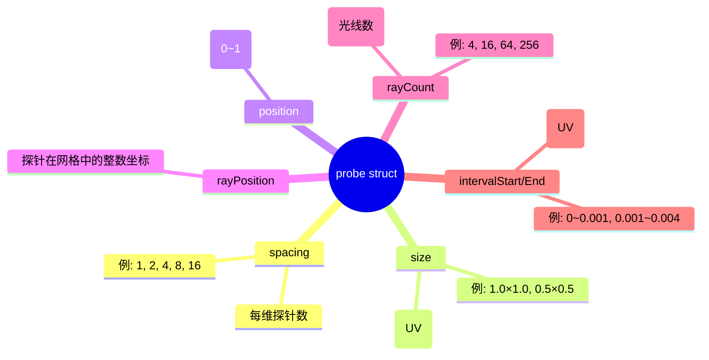

# 08 · RC · 探针结构与 get_probe_info

> 📁 源码：`res/shaders/rc.frag` 第 29-70 行（42 行）  
> 🎯 **Goal**: 拆解 `probe` struct 的 6 个字段和 `get_probe_info()` 怎么计算它们——这是 RC 算法所有数字的来源。

---

## 1. 完整源码（带行号）

```glsl
29  struct probe {
30    float spacing;       // probe amount per dimension e.g. 1, 2, 4, 16
31    vec2 size;           // screen size of probe in screen-space coordinates e.g. 1.0x1.0, 0.5x0.5, etc.
32    vec2 position;       // relative coordinates within encapsulating probe
33    // vec2 center;         // centre of current probe
34    vec2 rayPosition;
35    float intervalStart;
36    float intervalEnd;
37    float rayCount;
38  };
39  
40  probe get_probe_info(int index) {
41    probe p;
42    vec2 fragCoord = gl_FragCoord.xy/uResolution;
43  
44    // amount of probes in our current cascade
45    // [1, 4, 16, 256, ...]
46    float probeAmount = pow(uBaseRayCount, index);
47    p.spacing = sqrt(probeAmount); // probe amount per dimension
48  
49    // screen size of a probe in our current cascade
50    // [resolution/1, resolution/2, resolution/4,  resolution/16, ...]
51    // [1.0x1.0,      0.5x0.05,     0.25x0.25,     0.0625x0.0625, ...]
52    p.size = 1.0/vec2(p.spacing);
53  
54    // current position within a probe in our current cascade
55    p.position = mod(fragCoord, p.size) * p.spacing;
56  
57    // centre of current probe
58    // p.center = (p.position + vec2(0.5/uResolution)) * p.spacing / uResolution;
59  
60    p.rayCount = pow(uBaseRayCount, index+1); // angular resolution
61  
62    // calculate which group of rays we're calculating this pass
63    p.rayPosition = floor(fragCoord / p.size);
64  
65    float a = uBaseInterval; // px
66    p.intervalStart = (FIRST_LEVEL) ? 0.0 : a * pow(uBaseRayCount, index) / min(uResolution.x, uResolution.y);
67    p.intervalEnd = a * pow(uBaseRayCount, index+1) / min(uResolution.x, uResolution.y);
68  
69    return p;
70  }
```

---

## 2. 探针结构 6 字段



---

## 3. 逐字段拆解

### 3.1 `spacing`（每维探针数）

```glsl
float probeAmount = pow(uBaseRayCount, index);
p.spacing = sqrt(probeAmount);
```

| Cascade i | probeAmount = 4^i | spacing = √probeAmount |
|-----------|-------------------|------------------------|
| 0 | 1 | 1 |
| 1 | 4 | 2 |
| 2 | 16 | 4 |
| 3 | 64 | 8 |
| 4 | 256 | 16 |

> `spacing` 是**"屏幕被切成几行几列"**。spacing=4 → 4×4 = 16 个探针。

> 💡 为什么是 4^i 而非 2^i？  
> 因为 4 = 2²，每维减半 = 探针数 × 4。这是"每 cascade 探针数 ×4"的几何增长。

### 3.2 `size`（单个探针在屏幕上的 UV 尺寸）

```glsl
p.size = 1.0 / vec2(p.spacing);
```

| spacing | size (UV) | 像素尺寸 (1920×1080 屏幕) |
|---------|-----------|---------------------------|
| 1 | 1.0×1.0 | 1920×1080（整个屏幕一个探针）|
| 2 | 0.5×0.5 | 960×540 |
| 4 | 0.25×0.25 | 480×270 |
| 8 | 0.125×0.125 | 240×135 |
| 16 | 0.0625×0.0625 | 120×67 |

> 🧠 **本质**：spacing=2 表示把屏幕均匀切成 2×2=4 块，每块 0.5×0.5 UV。

### 3.3 `position`（像素在探针内的位置）

```glsl
p.position = mod(fragCoord, p.size) * p.spacing;
```

`mod(fragCoord, p.size)` = fragCoord 对 p.size 取模 = **像素在当前探针块内的相对位置 (0~size)**。  
`* p.spacing` = 归一化到 [0, 1]（方便后续用作 `texture(uLastPass, ...)` 的 UV）。

> 💡 **例子**：1920×1080 屏幕，Cascade 2 (size=0.25)，像素 (960, 540)：  
> `mod((0.5, 0.5), (0.25, 0.25)) = (0.0, 0.0)` → 这正好是探针的左上角。  
> `* 4 = (0, 0)` → 在探针坐标系里也是 (0, 0)。

### 3.4 `rayPosition`（探针的整数网格坐标）

```glsl
p.rayPosition = floor(fragCoord / p.size);
```

`fragCoord / p.size` = "在第几个探针块里" (浮点)，`floor` = 整数坐标。

> 例子：1920×1080，Cascade 2 (size=0.25)，像素 (1440, 810)：  
> `fragCoord = (0.75, 0.75)`  
> `fragCoord / size = (3, 3)`  
> `rayPosition = (3, 3)` → **第 3 行第 3 列的探针**

### 3.5 `rayCount`（角分辨率）

```glsl
p.rayCount = pow(uBaseRayCount, index+1);
```

| Cascade i | rayCount = 4^(i+1) |
|-----------|---------------------|
| 0 | 4 |
| 1 | 16 |
| 2 | 64 |
| 3 | 256 |
| 4 | 1024 |

> 💡 这是**"全屏幕旋转一圈 4 段，i+1 级 cascade 占 4^i 段，每段 4 条光线 = 4^(i+1) 角度分辨率"**。
> 例子：Cascade 2 的 64 条光线，对应 64 个角度中的 1 段（1024 总角度）。

### 3.6 `intervalStart` / `intervalEnd`（光线步进距离）

```glsl
float a = uBaseInterval;  // px, 默认 0.5
p.intervalStart = (FIRST_LEVEL) ? 0.0 : a * pow(uBaseRayCount, index) / min(uResolution.x, uResolution.y);
p.intervalEnd   = a * pow(uBaseRayCount, index+1) / min(uResolution.x, uResolution.y);
```

`a * pow(uBaseRayCount, i)` = 像素距离（默认 0.5, 2, 8, 32, 128 px）  
`/ min(uResolution.x, uResolution.y)` = **转 UV**（用屏幕短边归一化）

| Cascade i | intervalStart (UV, 1920×1080) | intervalEnd (UV) | 像素 |
|-----------|------------------------------|------------------|------|
| 0 | 0.0 | 0.5·4 / 1080 = 0.00185 | 0.5 ~ 2 |
| 1 | 0.00185 | 0.5·16 / 1080 = 0.00741 | 2 ~ 8 |
| 2 | 0.00741 | 0.5·64 / 1080 = 0.0296 | 8 ~ 32 |
| 3 | 0.0296 | 0.5·256 / 1080 = 0.1185 | 32 ~ 128 |
| 4 | 0.1185 | 0.5·1024 / 1080 = 0.474 | 128 ~ 512 |

> 🧠 **两个细节**：
> 1. **`intervalStart = 0`** 仅对 Cascade 0，**从 0 开始**（让 Cascade 0 看到所有近距离）。其他 cascade 从上一 cascade 的 `intervalEnd` 开始（无缝衔接）。
> 2. **`min(x, y)`** 用屏幕短边归一化，**保证非正方形屏幕不会把距离场扭曲**。如果用 `max`，宽屏的水平距离会被低估。

---

## 4. 整体可视化：Cascade 2 在 1920×1080 屏幕上的探针网格

```
1920×1080 屏幕, Cascade 2 (spacing=4):

(0,0)─────(0.25,0)─────(0.5,0)─────(0.75,0)─────(1,0)
  │           │           │           │           │
  │  探针(0,0) │  探针(1,0) │  探针(2,0) │  探针(3,0) │
  │           │           │           │           │
(0,0.25)───(0.25,0.25)──(0.5,0.25)──(0.75,0.25)──(1,0.25)
  │           │           │           │           │
  │  探针(0,1) │  探针(1,1) │  探针(2,1) │  探针(3,1) │
  │           │           │           │           │
(0,0.5)────(0.25,0.5)────(0.5,0.5)────(0.75,0.5)──(1,0.5)
  ...
  ↓
  4×4 = 16 个探针
  每个探针负责 480×270 像素
  每个探针用 64 条光线，光线步进 8~32 像素
```

像素 (1440, 810) 的 `probe` 值：

```cpp
p.spacing    = 4;
p.size       = (0.25, 0.25);
p.position   = (0, 0);  // 在探针内左上角
p.rayPosition= (3, 3);  // 第 3 行第 3 列
p.rayCount   = 64;
p.intervalStart = 0.00741;  // 8 px
p.intervalEnd   = 0.0296;   // 32 px
```

---

## 5. 实际手算 4 个 cascade 的所有数字

设 `uBaseRayCount=4`, `uBaseInterval=0.5`, `uResolution=1920×1080`:

```
i=0: spacing=1   size=1.0  rayCount=4    [0.0   , 0.00185]   (0~2 px)
i=1: spacing=2   size=0.5  rayCount=16   [0.00185, 0.00741]   (2~8 px)
i=2: spacing=4   size=0.25 rayCount=64   [0.00741, 0.0296]    (8~32 px)
i=3: spacing=8   size=0.125 rayCount=256 [0.0296 , 0.118]     (32~128 px)
i=4: spacing=16  size=0.0625 rayCount=1024 [0.118, 0.474]      (128~512 px)
```

> 注意 `rayCount` 是**所有探针共享的总角度池**（4^(i+1) = 角度总数 / 探针数）。

---

## 6. CPU 端如何传 `uCascadeIndex`

```cpp
// demo.cpp::render() 第 256-281 行 (直光轮)
for (int i = cascadeAmount; i >= 0; i--) {        // i = 5, 4, 3, 2, 1, 0
  ...
  SetShaderValue(rcShader, ..., "uCascadeIndex", &i, SHADER_UNIFORM_INT);
  ...
}
```

**为什么从 `cascadeAmount`（默认 5）到 0**？

```mermaid
flowchart LR
    i=5[计算 Cascade 5<br/>最粗糙] --> i=4[计算 Cascade 4<br/>合并 Cascade 5]
    i=4 --> i=3[合并 Cascade 4]
    i=3 --> i=2
    i=2 --> i=1
    i=1 --> i=0[合并 Cascade 1<br/>最精细]
    
    style i=5 fill:#ffe4b5
    style i=0 fill:#aaffaa
```

> 🎯 **从粗到细** 是因为**精细级要"借"粗糙级的结果**作为 `uLastPass`（详见 [10_rc_merging.md](./10_rc_merging.md)）。如果先算精细级，粗糙级还没数据可借。

---

## 7. 关键问题

- [ ] `pow(uBaseRayCount, index)` 用 `pow` 浪费不浪费？为什么不直接 `index * index` 或循环乘？
- [ ] `p.position` 计算里 `mod` + `*p.spacing` 能不能合并成 `fract`？
- [ ] `intervalStart = 0` 仅对 `FIRST_LEVEL`——`FIRST_LEVEL` 怎么定义？

<details>
<summary>答案</summary>

1. `pow(4, 3)` 在 GLSL 编译时可能被优化为 `64`（常量折叠），运行时只算 5 次（cascade 数量），可以忽略。实际上传进去的 `index` 范围 0~5，`pow(4, 0..5)` 都是常量计算。
2. `fract(fragCoord / p.size)` = `mod(fragCoord, p.size) / p.size`，再 `* p.spacing` = 归一化。可以写成 `fract(fragCoord * p.spacing) * p.spacing`，但语义不如 `mod` 直观。
3. 见 `rc.frag` 第 5 行：`#define FIRST_LEVEL uCascadeIndex == 0`。**`uCascadeIndex == 0` 是 cascade 0**（不是最粗糙级，而是**最精细级**！）。这是反直觉的命名：**`index` 越大 = 越粗糙**。

</details>

---

*下一节：[09_rc_radiance_interval.md](./09_rc_radiance_interval.md) 拆解 `radiance_interval`——RC 的 raymarching 内核。*
