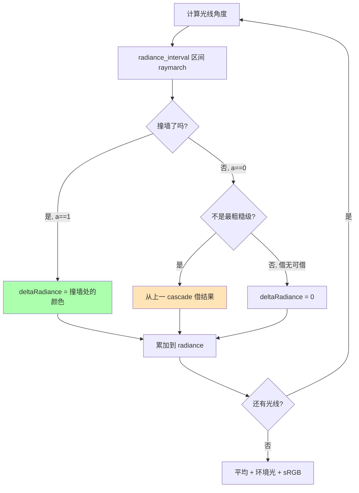

# 10 · RC · Cascade Merging — 借光逻辑

> 📁 源码：`res/shaders/rc.frag` 第 151-163 行（13 行）  
> 🎯 **Goal**: 解释 RC 怎么把"粗糙级"的光照"喂"给"精细级"，以及 `uDisableMerging` 调试开关怎么用。

---

## 1. 完整源码（带行号）

```glsl
130  void main() {
131    vec4 radiance = vec4(0.0);
132  
133    probe p  = get_probe_info(uCascadeIndex);
134    probe up = get_probe_info(uCascadeIndex+1);
135  
136    float baseIndex = float(uBaseRayCount) * (p.rayPosition.x + (p.spacing * p.rayPosition.y));
137  
138    for (float i = 0.0; i < uBaseRayCount; i++) {
139      float index = baseIndex + i;
140      float angle = (index / p.rayCount) * TWO_PI;
141  
142      vec4 deltaRadiance = vec4(0.0);
143  
144      deltaRadiance += radiance_interval(
145        p.position,
146        vec2(cos(angle) * min(uResolution.x, uResolution.y) / max(uResolution.x, uResolution.y), sin(angle)),
147        p.intervalStart,
148        p.intervalEnd
149      );
150  
151      // merging
152      if (!(LAST_LEVEL) && deltaRadiance.a == 0.0 && uDisableMerging != 1.0) {
153        up.position = vec2(
154          mod(index, up.spacing), floor(index / up.spacing)
155        ) * up.size;
156  
157        #define PIXEL vec2(1.0)/uResolution
158        vec2 offset = p.position / up.spacing;
159        offset = clamp(offset, PIXEL, up.size - PIXEL);
160        vec2 uv = up.position + offset;
161  
162        deltaRadiance += texture(uLastPass, uv);
163      }
164      radiance += deltaRadiance;
165    }
166    radiance /= uBaseRayCount;
167    radiance += vec4(uAmbientColor*uAmbient*0.005, 1.0);
168  
169    if (uCascadeIndex < uCascadeDisplayIndex) radiance = vec4(vec3(texture(uLastPass, gl_FragCoord.xy/uResolution)), 1.0);
170  
171    fragColor = vec4((FIRST_LEVEL && uSrgb == 1) ? lin_to_srgb(radiance.rgb) : radiance.rgb, 1.0);
172  }
```

---

## 2. 主循环的"4 件事"

每条光线做 4 件事：



---

## 3. 角度计算（第 136-140 行）

```glsl
float baseIndex = float(uBaseRayCount) * (p.rayPosition.x + (p.spacing * p.rayPosition.y));
for (float i = 0.0; i < uBaseRayCount; i++) {
  float index = baseIndex + i;
  float angle = (index / p.rayCount) * TWO_PI;
  ...
}
```

| 变量 | 含义 | 公式 |
|------|------|------|
| `p.rayPosition` | 当前探针在网格中的整数坐标 | `floor(fragCoord / p.size)` |
| `p.spacing * p.rayPosition.y` | 探针的行索引（按行展开）| Y 维索引 × 行宽 |
| `+ p.rayPosition.x` | 加上列索引 | |
| `* uBaseRayCount` | **每探针 4 条光线占 4 个角度** | |
| `baseIndex + i` | 4 条光线中第 i 条的**全局角度索引** | |

**例子**：4×4 探针网格 (Cascade 2)，`baseRayCount=4`：

```
探针 (1, 2) 占用角度索引: 4 * (2*4 + 1) + 0..3 = 36, 37, 38, 39
对应 4 个角度 = (36/64, 37/64, 38/64, 39/64) * 2π
             = (0.5625, 0.5781, 0.5938, 0.6094) * 2π
             ≈ (202.5°, 208.1°, 213.8°, 219.4°)
```

> 🧠 **关键**：每个探针负责的角度段**不重叠**。`rayCount = 4^(i+1)` 是**所有探针共享的总角度池**，每个探针从中分到 `baseRayCount` 段。

---

## 4. 光线方向（第 146 行）

```glsl
vec2(cos(angle) * min(uResolution.x, uResolution.y) / max(uResolution.x, uResolution.y), sin(angle))
```

| 分量 | 计算 | 含义 |
|------|------|------|
| `cos(angle)` | 水平分量（无长宽比） | UV 单位方向 |
| `* min(W,H) / max(W,H)` | 长宽比修正 | 让 `dir` 在水平方向"压缩"或"拉伸"，**保证光线在屏幕上等速** |
| `sin(angle)` | 垂直分量 | UV 单位方向（垂直方向已经 = 1）|

> 为什么是 `min/max`？  
> 因为**UV 是按 [0,1] 归一化的**——`cos(0°)=1` 在 X 方向意味着"水平 1 UV 步进"，但水平 1 UV = `W` 像素。  
> 如果屏幕是 1920×1080，让光线在 0° 方向走 1 UV = 1920 像素（太快），需要除以 `max(W,H)=1920`（**实际是乘 `min/max = 1080/1920 = 0.5625`**）让 X 方向"走 1 UV = 1080 像素"，和 Y 方向"1 UV = 1080 像素"对齐。

---

## 5. Merging 逻辑（第 152-163 行）

### 5.1 触发条件

```glsl
if (!(LAST_LEVEL) && deltaRadiance.a == 0.0 && uDisableMerging != 1.0) {
```

| 条件 | 含义 |
|------|------|
| `!(LAST_LEVEL)` | 当前不是最粗糙级——粗糙级没东西可借 |
| `deltaRadiance.a == 0.0` | 本 cascade 在 `[a, b]` 区间**没找到墙** |
| `uDisableMerging != 1.0` | 调试开关没关——默认开启 |

### 5.2 计算借的位置（第 153-155 行）

```glsl
up.position = vec2(
  mod(index, up.spacing), floor(index / up.spacing)
) * up.size;
```

`up` = 上一级（更粗糙）cascade 的探针。  
`mod(index, up.spacing)` = 在上一级探针网格里的**列索引**  
`floor(index / up.spacing)` = **行索引**  
`* up.size` = 探针的 UV 起点（左上角）

> 💡 **关键细节**：`index` 是全局角度索引（不是当前探针的局部索引）。**粗糙级的探针按"角度段"切分**，精细级要"对齐"到那个角度段上对应的粗糙级探针。

### 5.3 像素偏移（第 158-160 行）

```glsl
vec2 offset = p.position / up.spacing;
offset = clamp(offset, PIXEL, up.size - PIXEL);
vec2 uv = up.position + offset;
```

`p.position` = 当前像素在精细探针内的位置（0~1）。  
`/ up.spacing` = **转换到粗糙探针的局部坐标系**（4×4 精细探针映射到 2×2 粗糙探针，`p.position / 2`）。  
`clamp` 到 `[1 像素, up.size - 1 像素]` = **避免采样到纹理边界**（GPU 边界 clamp 的小坑）。  
`+ up.position` = 偏移到粗糙探针的实际 UV。

> 🎯 **目的**：让**同一物理位置**的像素，**精细级和粗糙级采样同一纹理坐标**。这样合并时不会出现"错位"。

### 5.4 真正的"借"（第 162 行）

```glsl
deltaRadiance += texture(uLastPass, uv);
```

`uLastPass` 是**上一 cascade 的输出**（已渲染好的辐射率纹理）。  
`uv` = 上面计算的"对应位置"。  
结果 = **直接把粗糙级的辐射率叠加到本级的 delta**。

---

## 6. 完整例子：像素 (1440, 810) 在 Cascade 1

```
1. baseIndex = 4 * (1 + 2*2) = 20  (探针 (1, 2) 在 Cascade 1)
2. 4 条光线: index = 20, 21, 22, 23
3. 角度: 20/16, 21/16, 22/16, 23/16 * 2π  (因为 rayCount=16)
4. 对每条光线: radiance_interval(uv, dir, 2, 8)
   - 如果撞墙 (a=1): 用墙颜色
   - 如果没撞墙 (a=0): 借 Cascade 2 (up)
     - up.position = (mod(20,4), floor(20/4)) * 0.25 = (0, 5) * 0.25 = (0, 1.25)
     - 等等, up.spacing=4 不对...

等等, up = get_probe_info(uCascadeIndex+1)。
当前 uCascadeIndex = 1, up = 2。
Cascade 2: spacing = 4, size = 0.25, rayCount = 64.
mod(20, 4) = 0, floor(20/4) = 5.
5 * 0.25 = 1.25 — 但 1.25 > 1.0 UV 范围! 
```

> ⚠️ **bug 还是设计？** 让我重新算...

```glsl
float baseIndex = float(uBaseRayCount) * (p.rayPosition.x + (p.spacing * p.rayPosition.y));
```

Cascade 1: p.spacing=2, p.rayPosition 是 floor(fragCoord / 0.5)。

像素 (1440, 810) → fragCoord = (0.75, 0.75)  
rayPosition = floor((1.5, 1.5)) = (1, 1)  
baseIndex = 4 * (1 + 2*1) = 12

```
4 条光线: index = 12, 13, 14, 15
Cascade 1 rayCount = 16
角度: 12/16, 13/16, 14/16, 15/16 * 2π = (3/4, 13/16, 7/8, 15/16) * 2π
     = (135°, 146°, 157.5°, 168.75°)

up (Cascade 2): spacing=4, size=0.25
index=12: mod(12, 4) = 0, floor(12/4) = 3
up.position = (0, 3) * 0.25 = (0, 0.75)  ✓ 合法
```

> 哦, **baseIndex 用了 `p.spacing * p.rayPosition.y` 不是 `p.rayPosition.x` 优先**——这是为了"按行展开"的索引。

---

## 7. 调试：`uDisableMerging` 和 `uCascadeDisplayIndex`

```glsl
if (uCascadeIndex < uCascadeDisplayIndex) 
  radiance = vec4(vec3(texture(uLastPass, gl_FragCoord.xy/uResolution)), 1.0);
```

| `uCascadeDisplayIndex` 值 | 效果 |
|---------------------------|------|
| 0 | 正常显示最终合并结果（默认） |
| 1 | 显示 Cascade 1 的结果，**不与 Cascade 0 合并** |
| 2 | 显示 Cascade 2 的结果，**只与 3, 4 合并，不与 0, 1 合并** |
| ... | ... |

> 配合 `uDisableMerging = 1` 强制"不合并"，可以**单独看每个 cascade 的样子**——是理解 RC 算法的关键调试工具。

---

## 8. Merging 之外的两个细节

### 8.1 平均（第 166 行）

```glsl
radiance /= uBaseRayCount;
```

4 条光线 → 除以 4 取平均 = **积分**（蒙特卡洛积分的简化版）。

### 8.2 环境光（第 167 行）

```glsl
radiance += vec4(uAmbientColor*uAmbient*0.005, 1.0);
```

`uAmbientColor` 是用户选的环境颜色，`uAmbient` 是开关。`0.005` 是经验系数（让环境光不淹没主光照）。

### 8.3 sRGB 转换（第 171 行）

```glsl
fragColor = vec4((FIRST_LEVEL && uSrgb == 1) ? lin_to_srgb(radiance.rgb) : radiance.rgb, 1.0);
```

**只在最精细级 (Cascade 0)** 做 sRGB 转换。其他级保持线性（线性空间下合并数学正确）。

---

## 9. 关键问题

- [ ] `up.position` 计算里的 `mod(index, up.spacing)` 为什么用 `index` 而不是 `baseIndex`？
- [ ] `uDisableMerging = 1` 时会有什么视觉问题？
- [ ] `uCascadeIndex < uCascadeDisplayIndex` 和 `uDisableMerging` 的区别？

<details>
<summary>答案</summary>

1. 因为 `index` 是**全局角度索引**（从 0 到 `rayCount`），所有探针的所有光线**共享**这个空间。粗糙级探针按"角度"切分（不是按"空间"切分），所以用全局 `index` 才能算到"对应"探针。
2. 远距离光照丢失。例如一个像素离光源 200 像素：Cascade 0~2 都没找到墙（区间 [0, 32]），正常情况下从 Cascade 3, 4 借光。关掉 merging 后，**所有 cascade 都拿不到远光**，像素变黑。
3. **完全不同**：
   - `uDisableMerging` 关闭整个 merging 分支（**让精细级找不到远光**）
   - `uCascadeDisplayIndex = N` 只让 `i < N` 的 cascade **显示**粗糙级结果（**正常 merging，但显示早期结果**），用来调试**某级是否算对了**

</details>

---

*下一节：[11_rc_cpu.md](./11_rc_cpu.md) 跳到 C++ 端，看两轮 `for` 怎么编排直光轮和间接轮。*
