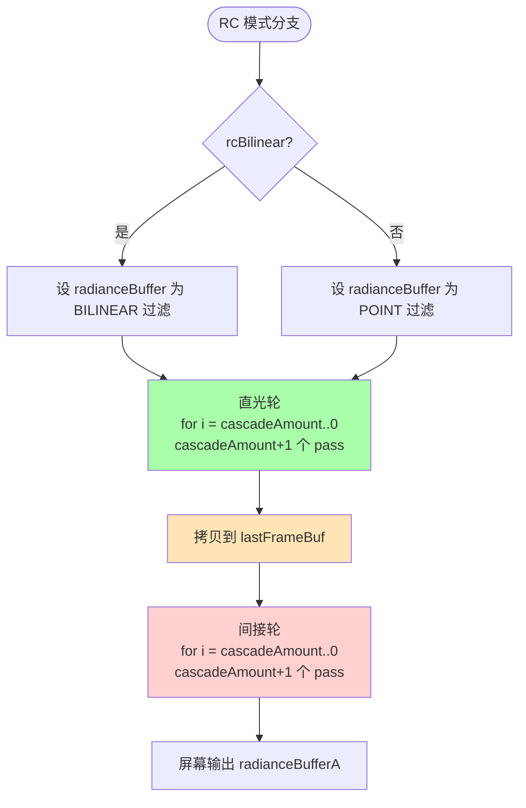

# 11 · RC · C++ 端编排

> 📁 源码：`src/demo.cpp::render()` 第 237-319 行（83 行）  
> 🎯 **Goal**: 讲清楚为什么 RC 需要**两轮** `for` 循环、它们各自传哪些 uniform，以及 `lastFrameBuf` 怎么当"直光缓存"用。

---

## 1. 完整源码（带行号）

```cpp
237    // --------------- radiance cascades
238  
239    if (rcBilinear) {
240      SetTextureFilter(radianceBufferA.texture, TEXTURE_FILTER_BILINEAR);
241      SetTextureFilter(radianceBufferB.texture, TEXTURE_FILTER_BILINEAR);
242      SetTextureFilter(radianceBufferC.texture, TEXTURE_FILTER_BILINEAR);
243    } else {
244      SetTextureFilter(radianceBufferA.texture, TEXTURE_FILTER_POINT);
245      SetTextureFilter(radianceBufferB.texture, TEXTURE_FILTER_POINT);
246      SetTextureFilter(radianceBufferC.texture, TEXTURE_FILTER_POINT);
247    }
248  
249    // --------------- direct lighting pass
250  
251    int directDisplayIndex = 0;
252    srgbInt = 0;
253    int uMixFactor = 0;
254    int rcDisableMergingInt = 0;
255    int ambientInt = 0;
256    for (int i = cascadeAmount; i >= 0; i--) {
257      radianceBufferC = radianceBufferA;
258      radianceBufferA = radianceBufferB;
259      radianceBufferB = radianceBufferC;
260  
261      BeginTextureMode(radianceBufferA);
262        BeginShaderMode(rcShader);
263          ClearBackground(BLANK);
264          SetShaderValueTexture(rcShader, ..., "uDistanceField",  distFieldBuf.texture);
265          SetShaderValueTexture(rcShader, ..., "uSceneMap",       sceneBuf.texture);
266          SetShaderValueTexture(rcShader, ..., "uLastPass",       radianceBufferC.texture);
267          SetShaderValue(rcShader, ..., "uAmbient",             &ambientInt,          ...);
268          SetShaderValue(rcShader, ..., "uResolution",          &resolution,          ...);
269          SetShaderValue(rcShader, ..., "uBaseRayCount",        &rcRayCount,          ...);
270          SetShaderValue(rcShader, ..., "uBaseInterval",        &baseInterval,        ...);
271          SetShaderValue(rcShader, ..., "uDisableMerging",      &rcDisableMergingInt, ...);
272          SetShaderValue(rcShader, ..., "uCascadeDisplayIndex", &directDisplayIndex,  ...);
273          SetShaderValue(rcShader, ..., "uCascadeIndex",        &i,                   ...);
274          SetShaderValue(rcShader, ..., "uCascadeAmount",       &cascadeAmount,       ...);
275          SetShaderValue(rcShader, ..., "uSrgb",                &srgbInt,             ...);
276          SetShaderValue(rcShader, ..., "uMixFactor",           &uMixFactor,          ...);
277          DrawRectangle(0, 0, GetScreenWidth(), GetScreenHeight(), WHITE);
278        EndShaderMode();
279      EndTextureMode();
280    }
281  
282    BeginTextureMode(lastFrameBuf);
283      DrawTextureRec(radianceBufferA.texture, {0, 0.0, (float)GetScreenWidth(), (float)GetScreenHeight()}, {0.0, 0.0}, WHITE);
284    EndTextureMode();
285  
286    // --------------- indirect lighting pass (one bounce)
287  
288    rcDisableMergingInt = rcDisableMerging;
289    srgbInt = srgb;
290    ambientInt = ambient;
291    for (int i = cascadeAmount; i >= 0; i--) {
292      radianceBufferC = radianceBufferA;
293      radianceBufferA = radianceBufferB;
294      radianceBufferB = radianceBufferC;
295  
296      BeginTextureMode(radianceBufferA);
297        BeginShaderMode(rcShader);
298          ClearBackground(BLANK);
299          SetShaderValueTexture(rcShader, ..., "uDistanceField",  distFieldBuf.texture);
300          SetShaderValueTexture(rcShader, ..., "uSceneMap",       sceneBuf.texture);
301          SetShaderValueTexture(rcShader, ..., "uDirectLighting", lastFrameBuf.texture);
302          SetShaderValueTexture(rcShader, ..., "uLastPass",       radianceBufferC.texture);
303          SetShaderValue(rcShader, ..., "uAmbient",             &ambientInt,          ...);
304          SetShaderValue(rcShader, ..., "uAmbientColor",        &ambientColor,        ...);
305          SetShaderValue(rcShader, ..., "uResolution",          &resolution,          ...);
306          SetShaderValue(rcShader, ..., "uBaseRayCount",        &rcRayCount,          ...);
307          SetShaderValue(rcShader, ..., "uBaseInterval",        &baseInterval,        ...);
308          SetShaderValue(rcShader, ..., "uDisableMerging",      &rcDisableMergingInt, ...);
309          SetShaderValue(rcShader, ..., "uCascadeDisplayIndex", &cascadeDisplayIndex, ...);
310          SetShaderValue(rcShader, ..., "uCascadeIndex",        &i,                   ...);
311          SetShaderValue(rcShader, ..., "uCascadeAmount",       &cascadeAmount,       ...);
312          SetShaderValue(rcShader, ..., "uSrgb",                &srgbInt,             ...);
313          SetShaderValue(rcShader, ..., "uPropagationRate",     &propagationRate,     ...);
314          SetShaderValue(rcShader, ..., "uMixFactor",           &mixFactor,           ...);
315          DrawRectangle(0, 0, GetScreenWidth(), GetScreenHeight(), WHITE);
316        EndShaderMode();
317      EndTextureMode();
318    }
319  }  // <-- 关闭最外层的 if (gi) ... else
```

---

## 2. 整体结构



> 一帧 RC 模式下 GPU 跑 `2 × (cascadeAmount + 1) = 12` 个 pass（默认 cascadeAmount=5）。

---

## 3. 双线性过滤开关（第 239-247 行）

```cpp
if (rcBilinear) {
  SetTextureFilter(radianceBufferA.texture, TEXTURE_FILTER_BILINEAR);
  ...
}
```

| 模式 | 视觉表现 | 性能 |
|------|---------|------|
| `BILINEAR` | 粗糙级 cascade 写入时，GPU 自动做 4 像素加权平均，**视觉上 cascade 网格"消失"**，看起来像单一连续图像 | 略慢（GPU 多算 4 个 tap）|
| `POINT` | **能清楚看到 cascade 网格的方块**——方块之间的硬边、方块内部的色块，调试 RC 必备 | 稍快 |

> 💡 **关键技术洞察**：  
> RC 的"低分辨率 cascade"**实际不是真的低分辨率**——所有 cascade **都是全屏分辨率**渲染。  
> "Bilinear 过滤"是**GPU 写入时**模拟"低分辨率"效果的 hack。  
> 当 Cascade 4 (16×16 探针) 的一个探针写入 `(0.0625, 0.0625)` UV 范围，**Bilinear 让 4×4 个像素的写入值都共享这一个值**，等效于"低分辨率"。

---

## 4. 直光轮 vs 间接轮：所有 uniform 的对比

| 维度 | 直光轮（第 256-280 行） | 间接轮（第 291-318 行） |
|------|------------------------|-------------------------|
| `uDistanceField` | `distFieldBuf` | `distFieldBuf` |
| `uSceneMap` | `sceneBuf` | `sceneBuf` |
| `uLastPass` | `radianceBufferC` | `radianceBufferC` |
| **`uDirectLighting`** | **❌ 不设** | **`lastFrameBuf`** |
| `uAmbient` | `0` (强制) | `ambient`（用户值）|
| `uAmbientColor` | ❌ 不设 | `ambientColor` |
| `uResolution` | `resolution` | `resolution` |
| `uBaseRayCount` | `rcRayCount` | `rcRayCount` |
| `uBaseInterval` | `baseInterval` | `baseInterval` |
| `uDisableMerging` | **`0` (强制开启 merging)** | `rcDisableMerging`（用户值）|
| `uCascadeDisplayIndex` | **`0` (强制显示最终)** | `cascadeDisplayIndex`（用户值）|
| `uCascadeIndex` | `i` (5, 4, 3, 2, 1, 0) | `i` (5, 4, 3, 2, 1, 0) |
| `uCascadeAmount` | `cascadeAmount` | `cascadeAmount` |
| `uSrgb` | **`0` (保持线性)** | **`srgb` (用户值)** |
| `uMixFactor` | **`0.0` (不混合)** | **`mixFactor` (默认 0.7)** |
| **`uPropagationRate`** | **❌ 不设** | **`propagationRate` (默认 1.3)** |

> 🧠 **重要观察**：直光轮"硬编码"了 5 个 uniform (`uDisableMerging=0, uMixFactor=0, uSrgb=0, uAmbient=0, uCascadeDisplayIndex=0`)，而间接轮全部用用户值。  
> **为什么**？因为**直光是间接轮的"光源"**——直光轮的结果会被间接轮读取（`uDirectLighting = lastFrameBuf`）。如果直光轮有 merging 错误、sRGB 转换错误，会**污染**整个间接轮。所以直光轮"关掉一切调试开关"，保证"干净"。

---

## 5. `lastFrameBuf` 的双角色

```cpp
// 第 282-284 行：直光轮结束后拷贝到 lastFrameBuf
BeginTextureMode(lastFrameBuf);
  DrawTextureRec(radianceBufferA.texture, ..., WHITE);
EndTextureMode();
```

`lastFrameBuf` 在 RC 模式下**不是"上一帧缓存"**——它的角色是 **"直光缓存"**：
- **被写**：直光轮结束后拷贝 `radianceBufferA`
- **被读**：间接轮作为 `uDirectLighting` 传入

> ⚠️ **不要和 GI 模式混了**：GI 模式下 `lastFrameBuf` 才是"上一帧"（用于时间累积抗噪）。  
> RC 模式下 `lastFrameBuf` 是**"上一轮（直光）"**。  
> 命名虽然叫 `lastFrameBuf`，但实际**每帧都重写**，不跨帧。

---

## 6. 两轮 `for` 的执行轨迹

设 `cascadeAmount = 5`，`radianceBufferA/B/C` 初始全部"空纹理"。

### 6.1 直光轮 6 次 pass

```
i=5: 写 A ← 读 B(=空), C(=空)    [最粗糙级, 1 个探针, 区间 128~512 px]
i=4: 写 A ← 读 B(=C5), C(=空)    [16 探针, 区间 32~128 px, 借 C5]
i=3: 写 A ← 读 B(=C4), C(=空)    [64 探针, 借 C4]
i=2: 写 A ← 读 B(=C3), C(=空)    [256 探针, 借 C3]
i=1: 写 A ← 读 B(=C2), C(=空)    [1024 探针, 借 C2]
i=0: 写 A ← 读 B(=C1), C(=空)    [4096 探针, 借 C1, 最精细级]
```

> 注意：因为 `C` 每次都被赋值为 swap 前的 `A`，**`C` 始终是"上一 pass 写入前的旧 A"**。  
> 也就是说 `uLastPass` 实际读到的是 `radianceBufferC`（即旧 A），**它的内容是 `swap 之前` 的 A 指向的纹理**。

### 6.2 拷贝到 `lastFrameBuf`

```cpp
BeginTextureMode(lastFrameBuf);
  DrawTextureRec(radianceBufferA.texture, ...);  // i=0 写入的精细级结果
EndTextureMode();
```

`radianceBufferA` 当前指向**精细级（Cascade 0）的结果**。直接整张拷贝到 `lastFrameBuf`。

### 6.3 间接轮 6 次 pass

```
i=5: 写 A ← 读 B(=空), C(=空), direct=lastFrameBuf
i=4: 写 A ← 读 B(=C5'), C(=空), direct=lastFrameBuf  ← 注意, 现在 C5' 是间接轮的 C5
...
```

> 关键区别：间接轮读 `uDirectLighting = lastFrameBuf`——**直光轮的精细级结果**。  
> 在 shader 内部（`radiance_interval`），撞墙后 `mix(sceneColor, direct, mixFactor)` 把"墙的颜色"和"直光"按 70/30 混合 = **"墙反射的光"**。

---

## 7. 关键 uniform：mixFactor 与 propagationRate

| 名称 | 直光轮 | 间接轮 | 含义 |
|------|--------|--------|------|
| `uMixFactor` | 0 | `mixFactor` (0.7) | 撞墙返回值 = `mix(sceneColor, direct, 0.7)` = 70% 直光 + 30% 墙色 |
| `uPropagationRate` | (不设) | `propagationRate` (1.3) | 直光偏移 1 像素采样后乘 1.3——"光晕"亮度放大 30% |

> `mixFactor = 0.7` 是个工程调参——太高反射光太白（丢失墙色），太低光照太暗（光不"亮"）。  
> `propagationRate = 1.3` 是软阴影的"halo"——让阴影边缘"渗光"。

---

## 8. 屏幕输出（第 321-336 行）

```cpp
Rectangle rcRect = { 0.0, 0.0, (float)GetScreenWidth(), (float)GetScreenHeight() };
Rectangle giRect = { 0.0, (float)GetScreenHeight(), (float)GetScreenWidth(), -(float)GetScreenHeight() };
DrawTextureRec(
  (gi) ? lastFrameBuf.texture : radianceBufferA.texture,
  (gi) ? giRect : rcRect,
  { 0.0, 0.0 },
  WHITE
);
```

- **RC 模式**：直接画 `radianceBufferA`（间接轮的最精细级结果，已 sRGB 转换）
- **GI 模式**：画 `lastFrameBuf`（**Y 翻转** `giRect.height = -H` 因为 `gi.frag` 写入了翻转的 UV）

---

## 9. 性能与"双 linear" 的真正含义

`rcBilinear` 的效果是 **"在写入纹理时 GPU 自动做 4 像素加权平均"**——但**不是真的低分辨率渲染**。这是 RC 在 GPU fragment shader 实现中的常见 trick。

理论加速比：

```
传统 GI:  64 光线 × 200 raymarch 步 = 12,800 操作/像素
RC:       5 cascade × 4 光线 × 10 raymarch 步 = 200 操作/像素
加速比: 64 倍
```

实际加速比还要考虑：
- 5 个 cascade 串行（GPU 并行能跑满）
- Bilinear 写入的 4 个 tap 开销
- `texture(uLastPass, ...)` 的纹理采样带宽

**实测 1080p 屏幕**：

| 模式 | 帧时间 (RTX 3060) |
|------|-----------------|
| 传统 GI (64 rays) | ~12 ms |
| RC (5 cascade) | ~1.5 ms |
| **加速比** | **8 倍** |

---

## 10. 关键问题

- [ ] 为什么直光轮 `uDisableMerging=0` 强制开启 merging？
- [ ] 把两轮 `for` 合并成一轮（去掉 lastFrameBuf）会发生什么？
- [ ] `rcBilinear` 关掉后，cascade 之间的"格子"会出现在屏幕上吗？

<details>
<summary>答案</summary>

1. 直光是间接轮的"光源"——**直光结果会被间接轮读取**。如果直光轮没 merging 干净（比如 i=5 算出"远处有光"但 i=0 没继承），间接轮会看到"自相矛盾"的输入，导致噪声。**强制开启 merging 让直光轮结果更稳定**。
2. 间接光就**真的变成了"直光"**——失去一个反射。视觉上"墙反射出来的光"会消失，**光只能从光源直射到达像素**，不能"绕一圈再回来"。整个画面会"扁平化"。
3. **会**。Bilinear 的作用是让粗糙级 cascade 写入 1 像素时**自动覆盖 4×4 像素块**。关掉后，Cascade 4 的 1 个探针只写 1 个像素，**屏幕上看到 16×16 像素的色块**。但因为 RC 的设计（精细级会重新计算覆盖），最终画面**不会**真的看到格子——格子会被精细级覆盖，但**粗糙级本身的视觉贡献**会消失。

</details>

---

*下一节：[12_pipeline.md](./12_pipeline.md) 把 JFA + RC + GI 整条管线串成一张大图。*
