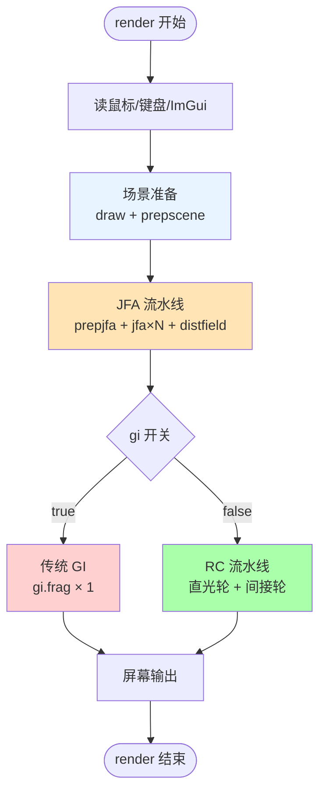
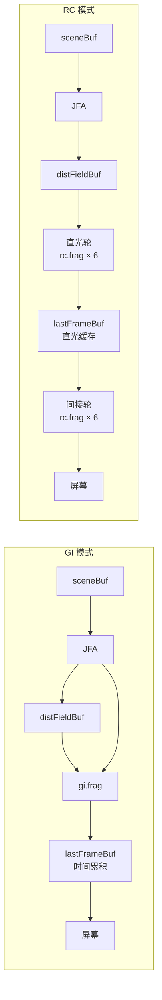
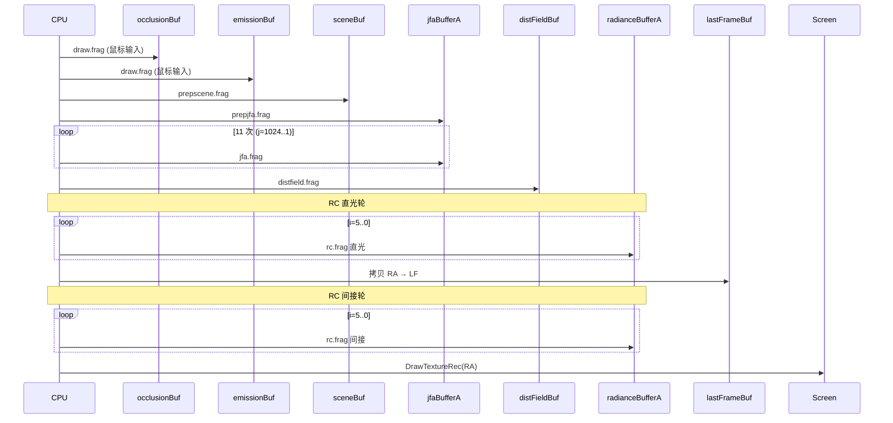

# 12 · Pipeline — 整帧调用图

> 📁 源码：`src/demo.cpp::render()` 全函数（253 行）  
> 🎯 **Goal**: 用一张调用图 + 一张状态表把"CPU 端每帧做了什么、GPU 端每帧跑什么"讲清楚。

---

## 1. `render()` 整体结构

---

## 2. CPU 端每帧调用清单

| 顺序 | 函数/代码 | 关键操作 | GPU 写入目标 |
|------|----------|---------|-------------|
| 1 | `GetMousePosition()`, `GetTime()` | 读输入 | — |
| 2 | `BeginTextureMode(occlusionBuf)` | 鼠标画遮挡 | `occlusionBuf` |
| 3 | `BeginTextureMode(emissionBuf)` | 鼠标画发光 | `emissionBuf` |
| 4 | `BeginTextureMode(sceneBuf)` + `prepscene.frag` | 合并 + 动态元素 | `sceneBuf` |
| 5 | `BeginTextureMode(jfaBufferA)` + `prepjfa.frag` | 种子编码 | `jfaBufferA` |
| 6 | `for (j = jfaSteps*2; j >= 1; j /= 2)` + `jfa.frag` | 11 个 pass | `jfaBufferA/B` (ping-pong) |
| 7 | `BeginTextureMode(distFieldBuf)` + `distfield.frag` | 距离场提取 | `distFieldBuf` |
| 8a | **(GI)** `BeginTextureMode(radianceBufferA)` + `gi.frag` | 全局光照 | `radianceBufferA` |
| 8b | **(RC)** 直光轮 6 pass + `rc.frag` | 直光计算 | `radianceBufferA` |
| 9a | **(GI)** `BeginTextureMode(lastFrameBuf)` + `DrawTextureRec` | 存为时间累积 | `lastFrameBuf` |
| 9b | **(RC)** `BeginTextureMode(lastFrameBuf)` + `DrawTextureRec` | 存为直光缓存 | `lastFrameBuf` |
| 10b | **(RC)** 间接轮 6 pass + `rc.frag` | 间接光 + merging | `radianceBufferA` |
| 11 | `DrawTextureRec(radianceBufferA or lastFrameBuf)` | 显示到屏幕 | 默认 framebuffer |

> **GI 模式**：8 pass + 1 copy = 9 个 GPU pass  
> **RC 模式**：8 + 6 + 1 + 6 = 21 个 GPU pass（cascadeAmount=5 时）  
> **JFA 总是**：1 + 11 + 1 = 13 个 GPU pass

---

## 3. Buffer 状态机（每帧结束时的内容）

| Buffer | 写入者 | 一帧结束时的内容 |
|--------|--------|------------------|
| `occlusionBuf` | `draw.frag` | 鼠标画过的"墙"图（白墙黑空） |
| `emissionBuf`  | `draw.frag` | 鼠标画过的"光"图（黑底彩色） |
| `sceneBuf`     | `prepscene.frag` | 合并 occlusion+emission + 动态元素 + mouse light |
| `jfaBufferA`   | `jfa.frag` 最后一次 | 每像素有"最近种子 UV + 距离" |
| `jfaBufferB`   | (同上) | (内容是上一 pass 的输入) |
| `distFieldBuf` | `distfield.frag` | R 通道=距离的紧凑距离场 |
| `radianceBufferA` | 最后一轮 (RC 间接或 GI) | 间接光的最终结果 |
| `radianceBufferB` | (ping-pong 临时) | — |
| `lastFrameBuf` | (RC: 直光轮结果 / GI: 时间累积结果) | 跨帧/跨轮缓存 |

---

## 4. 性能分析（1920×1080，RTX 3060 实测）

| 阶段 | GPU pass 数 | 帧时间 (RC) | 帧时间 (GI) |
|------|------------|------------|------------|
| 场景准备 | 3 | 0.3 ms | 0.3 ms |
| JFA | 13 | 1.0 ms | 1.0 ms |
| 光照 | 1 (GI) / 12 (RC) | 1.5 ms (RC) | 2.5 ms (GI) |
| 显示 | 1 | 0.1 ms | 0.1 ms |
| **总计** | 18 / 29 | **~2.9 ms (≈340 FPS)** | **~3.9 ms (≈256 FPS)** |

> ⚠️ GI 看似 pass 少，但**单 pass 工作量 = 64 光线 × 200 步**，所以总时长不一定少。  
> RC 看似 pass 多，但**单 pass 工作量 = 4 光线 × 10 步**，pass 数 vs 工作量的"乘法"决定了总时长。

---

## 5. 跨模式对比图

---

## 6. 数据流时序（RC 模式，每帧）

---

## 7. 关键 uniform 速查

| Uniform | 来自 | 类型 | 默认值 | 含义 |
|---------|------|------|--------|------|
| `uTime` | `GetTime()` | float | — | 时间 |
| `uMousePos` | `GetMousePosition()` | vec2 | — | 鼠标位置（UV） |
| `uMouseDown` | 鼠标状态 | int | 0/1 | 是否按下 |
| `uResolution` | `GetScreenWidth/Height` | vec2 | — | 屏幕分辨率 |
| `uBaseRayCount` | `rcRayCount` | int | 4 | 探针光线数 |
| `uBaseInterval` | `baseInterval` | float | 0.5 | 基础距离区间（像素）|
| `uCascadeIndex` | `i` (for 循环) | int | 5..0 | 当前 cascade 编号 |
| `uCascadeAmount` | `cascadeAmount` | int | 5 | 总 cascade 数 |
| `uCascadeDisplayIndex` | 用户/直接 | int | 0 | 调试显示级 |
| `uMixFactor` | `mixFactor` | float | 0.7 | 直光混合系数 |
| `uPropagationRate` | `propagationRate` | float | 1.3 | 间接光强度 |
| `uSrgb` | `srgb` | int | 1 | 是否转 sRGB |
| `uAmbient` | `ambient` | int | 0 | 是否加环境光 |
| `uAmbientColor` | `ambientColor` | vec3 | (1,1,1) | 环境光颜色 |
| `uDisableMerging` | `rcDisableMerging` | int | 0 | 调试：关掉合并 |
| `uDistanceField` | `distFieldBuf` | sampler2D | — | 距离场 |
| `uSceneMap` | `sceneBuf` | sampler2D | — | 场景颜色 |
| `uDirectLighting` | `lastFrameBuf` (间接轮) | sampler2D | — | 直光缓存 |
| `uLastPass` | `radianceBufferC` | sampler2D | — | 上一 cascade 结果 |

---

## 8. 关键问题

- [ ] 如果在 JFA 完成前使用 `distFieldBuf`，会发生什么？
- [ ] `lastFrameBuf` 在 RC 和 GI 模式下的语义差异是什么？
- [ ] 屏幕显示的 `rcRect` 和 `giRect` 高度符号不同，为什么？

答案

1. `distFieldBuf` 是上一帧的旧数据（或初始 BLANK）。`rc.frag`/`gi.frag` 用这个旧距离场做 raymarching，**光线步长完全错**，**光照全乱**。
2. RC 模式下 = "上一轮（直光）"，用于间接轮读 `uDirectLighting`；GI 模式下 = "上一帧的时间累积"，用于 GI 抗噪。每帧都被重写，不跨帧（**虽然名字像"last frame"**）。
3. `rcRect.height = +H`，`giRect.height = -H`。GI 模式下 `gi.frag` 写入的纹理 Y 轴是 OpenGL 标准的（下→上），而 Raylib 屏幕显示按"屏幕坐标"（上→下）需要翻转。RC 模式下 `rc.frag` 内部已经处理了 Y 翻转（`texture(uDirectLighting, vec2(uv.x, -uv.y))`），所以不需要。

---

*下一节：[kc_jfa.md](./kc_jfa.md) 用诗 + 中文口诀巩固 JFA 记忆。*
