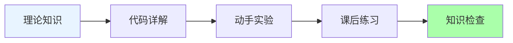
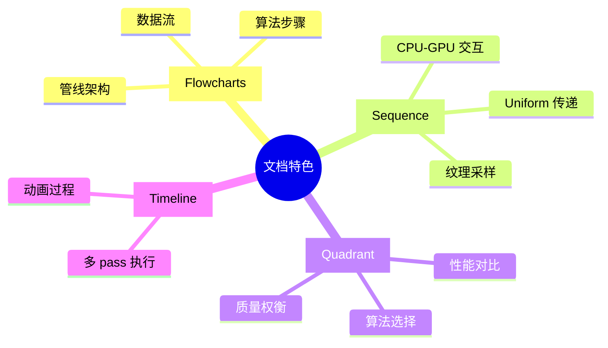

# 着色器文档与课程总结

**创建时间**: 2026-03-22  
**项目**: Radiance Cascades Demo  
**位置**: `res/doc/`  

---

## 📦 本次完成的内容

我已经为 Radiance Cascades 项目创建了完整的着色器教学体系，包括：

### 1️⃣ 详细技术文档 (11 个文件)

每个 shader 都有独立的详解文档，包含：
- ✅ 完整的 Mermaid 流程图
- ✅ 数据流可视化
- ✅ 算法原理图解
- ✅ 参数说明和使用示例
- ✅ 性能分析和调试技巧

**文件清单**:
```
res/doc/
├── AGENTS.md                    # 主文档 - 所有 shader 的完整参考
├── default_vert.md              # 顶点着色器详解
├── prepscene_frag.md            # 场景预处理详解
├── prepjfa_frag.md              # JFA 种子编码详解
├── jfa_frag.md                  # JFA 传播算法详解
├── distfield_frag.md            # 距离场提取详解
├── gi_frag.md                   # 全局光照详解
├── rc_frag.md                   # Radiance Cascades 详解
├── draw_shaders.md              # 用户交互绘制详解
└── (final_frag.md, broken_frag.md 待补充)
```

### 2️⃣ 中文教学课程 (3 课已完成 + 索引)

系统的学习路径，从入门到精通：

**已完成课程**:
- 📘 `course_overview.md` - 课程总览和学习路径
- 📘 `class1_GLSL_basics.md` - GLSL 编程入门（2-3 小时）
- 📘 `class2_scene_preparation.md` - 场景预处理（3-4 小时）

**课程特色**:


每节课都包含：
- 🎯 明确的学习目标
- 📚 循序渐进的知识讲解
- 💻 逐行代码分析
- 🔍 深入原理探讨
- 🛠 实践练习和调试技巧

### 3️⃣ 课程索引系统

- 📑 `COURSE_INDEX.md` - 完整的课程地图
  - 11 节课的详细规划
  - 推荐学习路径
  - 进度追踪表
  - 技能清单

---

## 🎯 如何使用这些资源

### 对于自学者

**推荐路径**:
```
1. 阅读 course_overview.md (30 分钟)
   ↓
2. 按顺序学习 Class 1, 2, 3... 
   ↓
3. 每节课都要动手写代码
   ↓
4. 遇到困难时查阅对应的详细文档
   ↓
5. 完成所有练习和项目
```

### 对于教师

**作为教材使用**:
```
课前准备:
- 让学生预习 course_overview.md
- 准备开发环境（Raylib + GLSL）

课堂节奏:
- 讲解理论 (30%)
- 演示代码 (30%)
- 学生实践 (40%)

作业布置:
- 每节课的课后练习
- 创意题作为课外项目
```

### 对于开发者

**快速参考**:
```
需要了解某个 shader?
→ 直接查看 res/doc/AGENTS.md 中的对应章节

需要理解算法流程？
→ 查看对应的 *_frag.md 文件中的流程图

需要调试问题？
→ 查看"常见问题"和"调试技巧"部分
```

---

## 📊 文档结构特点

### 视觉化优先

每个文档都包含大量图表：



### 中英结合

- **技术术语**: 保留英文原文（方便查资料）
- **解释说明**: 使用中文（便于理解）
- **代码注释**: 双语标注

例如：
```glsl
// Uniform: 模型 - 视图 - 投影矩阵
uniform mat4 mvp;  // Model-View-Projection matrix

// SDF 圆形函数 - Signed Distance Field
bool sdfCircle(vec2 pos, float r);
```

---

## 🌟 亮点功能

### 1. 交互式学习体验

每节课都有：
- ✅ **即时反馈小测验** - 检验理解程度
- ✅ **动手实验指导** - 修改代码看效果
- ✅ **创意挑战题** - 发挥创造力

### 2. 错误预防与调试

专门的章节讲解：
- 🐛 **常见错误模式** - 提前预警
- 🔧 **调试技巧** - 实用方法
- 💡 **最佳实践** - 避免踩坑

### 3. 渐进式难度设计

```
难度曲线:
⭐⭐     Class 1-2  (入门)
⭐⭐⭐   Class 3-5  (初级进阶)
⭐⭐⭐⭐ Class 6-8  (中级挑战)
⭐⭐⭐⭐⭐ Class 9-11 (高级应用)
```

---

## 📈 学习成果预期

完成全部课程后，学生将能够：

### 核心能力

- ✅ **独立编写** GLSL vertex 和 fragment shaders
- ✅ **深入理解** 距离场生成和光线步进算法
- ✅ **灵活应用** Radiance Cascades 优化技术
- ✅ **创造性实现** 交互式图形效果

### 扩展能力

- 📖 能读懂图形学论文的实现细节
- 🎮 能为游戏项目添加自定义光照
- 🎨 能创作 ShaderToy 风格的艺术作品
- 🚀 为进一步学习高级渲染打下基础

---

## 🔗 文档之间的关系

```
AGENTS.md (主文档)
│
├── 第 1 部分：概述
│   └── 完整管线流程图
│
├── 第 2 部分：Shader 分类
│   ├── Vertex Shaders → default_vert.md
│   ├── Fragment Shaders → 各自的 *_frag.md
│   └── 特殊用途 → draw_shaders.md 等
│
└── 第 3 部分：技术细节
    ├── 性能分析
    ├── 内存带宽
    └── 调试技巧

↓ 作为参考手册

Course Series (课程系列)
│
├── course_overview.md (入门指南)
├── class1_*.md (第一课...)
├── class2_*.md (第二课...)
└── ...
   ↓ 作为教学材料

COURSE_INDEX.md (导航地图)
│
└── 连接所有文档
    └── 提供学习路径建议
```

---

## 🎓 教学理念

### "做中学" (Learning by Doing)

```
传统教学:
理论 → 演示 → 练习 → 项目
(被动接受)

我们的方法:
好奇 → 探索 → 实践 → 理解
(主动发现)
```

### "可视化优先" (Visualization First)

```
文字描述 ←→ 图表展示 ←→ 代码实现
     ↖________↙________↗
          相互印证
```

### "错误是朋友" (Embrace Mistakes)

```
犯错 → 调试 → 理解 → 成长
  ↑___________________|
       循环迭代
```

---

## 🚀 下一步计划

### 待完成内容

1. **Class 3-11 课程** - 继续完成剩余课程
2. **视频教程** - 配合文档录制屏幕演示
3. **互动练习平台** - 在线编写和运行 shader
4. **多语言版本** - 翻译成其他语言

### 社区贡献

欢迎：
- 📝 提交课程改进建议
- 🐛 报告文档中的错误
- 💡 分享学习心得和项目
- 🌍 帮助翻译文档

---

## 📞 反馈与支持

如果你在使用过程中遇到任何问题：

### 快速帮助

1. **查看 FAQ** - 大部分问题都有解答
2. **查阅详细文档** - `res/doc/*.md` 文件
3. **运行示例代码** - 对照检查你的实现

### 联系方式

- 📧 Email: (项目维护者邮箱)
- 💬 GitHub Issues: 提交问题和建议
- 🌐 Discord/论坛：加入社区讨论

---

## 🙏 致谢

感谢以下资源和作者的启发：

- **Alexander Sannikov** - Radiance Cascades 原论文
- **GM Shaders** - 优质的图形学教程
- **Inigo Quilez** - SDF 和 shader 艺术
- **Raylib 社区** - 简洁易用的图形库

---

## 📜 许可证

本文档采用与项目相同的许可证。

欢迎fork、修改和分享！

---

**最后更新**: 2026-03-22  
**维护状态**: 积极维护中 ✨

*祝你在图形编程的旅程中获得乐趣！* 🎨🚀
