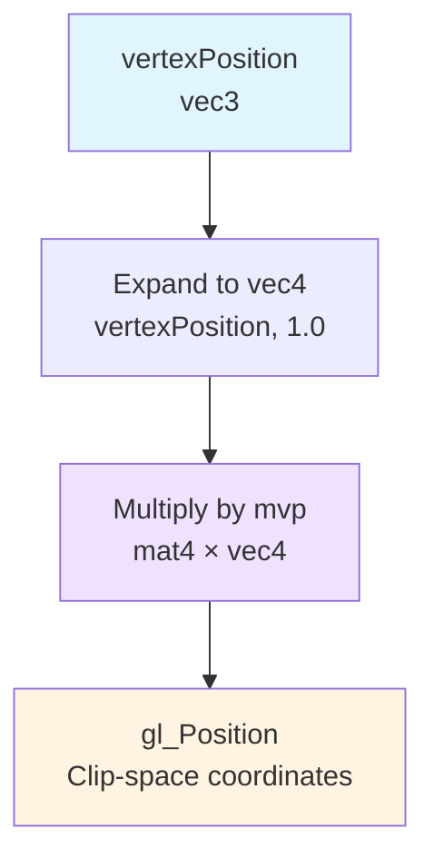
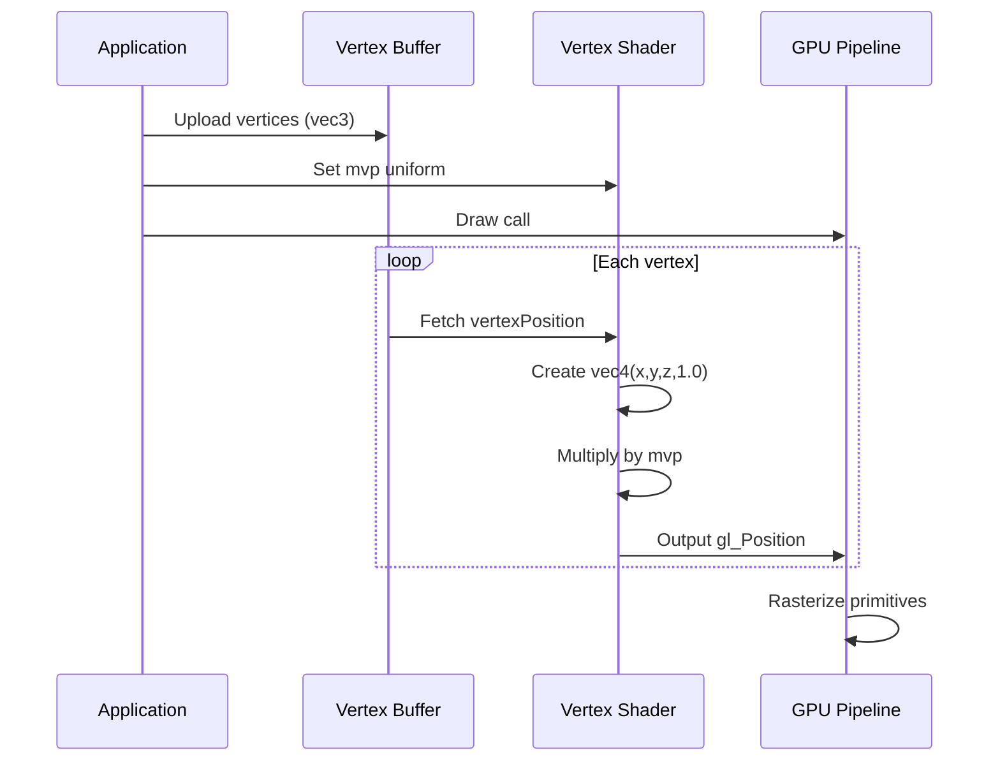
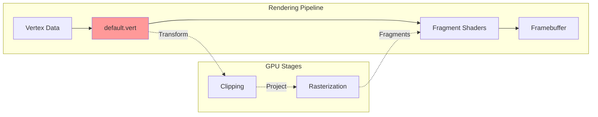

# default.vert - Vertex Shader Diagram

**Purpose**: Transform 3D vertex positions through model-view-projection matrix

## Flow Diagram



## Data Flow



## Architecture Context



## Key Parameters

| Parameter | Type | Purpose |
|-----------|------|---------|
| `vertexPosition` | `in vec3` | Input vertex position in object space |
| `mvp` | `uniform mat4` | Model-View-Projection transformation matrix |
| `gl_Position` | `out vec4` | Transformed position in clip space |

## Mathematical Operation

```
gl_Position = MVP × [x, y, z, 1]ᵀ

Where:
- MVP = Projection × View × Model
- Result is in homogeneous clip coordinates
- GPU performs perspective division automatically
```

## Usage in Pipeline

```cpp
// Set MVP matrix before drawing
SetShaderValue(shader, GetShaderLocation(shader, "mvp"), mvpMatrix, SHADER_UNIFORM_MAT4);

// Vertex attribute setup (Raylib handles this internally)
// Location 0: vertexPosition (vec3)
```

---

**File Location**: `res/shaders/default.vert`  
**GLSL Version**: 330 core  
**Used By**: All fragment shaders via Raylib's default vertex processing
