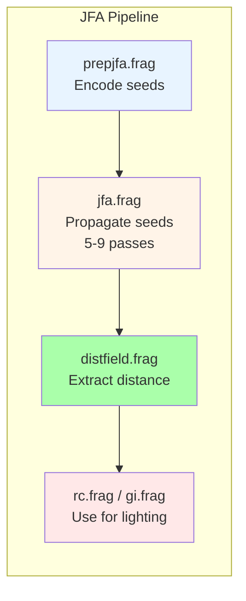
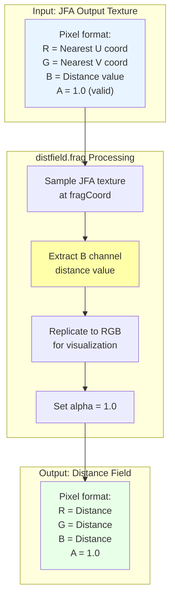
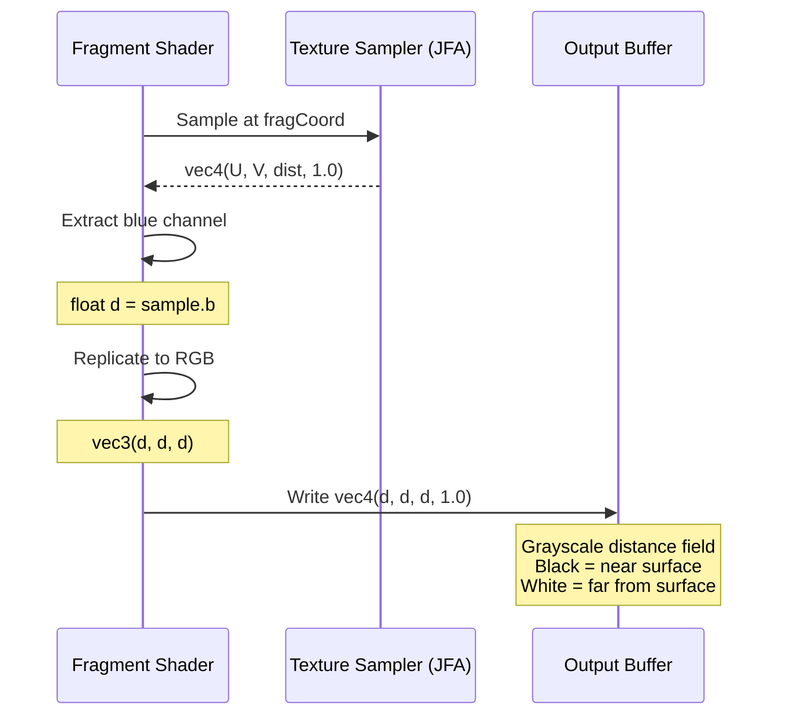
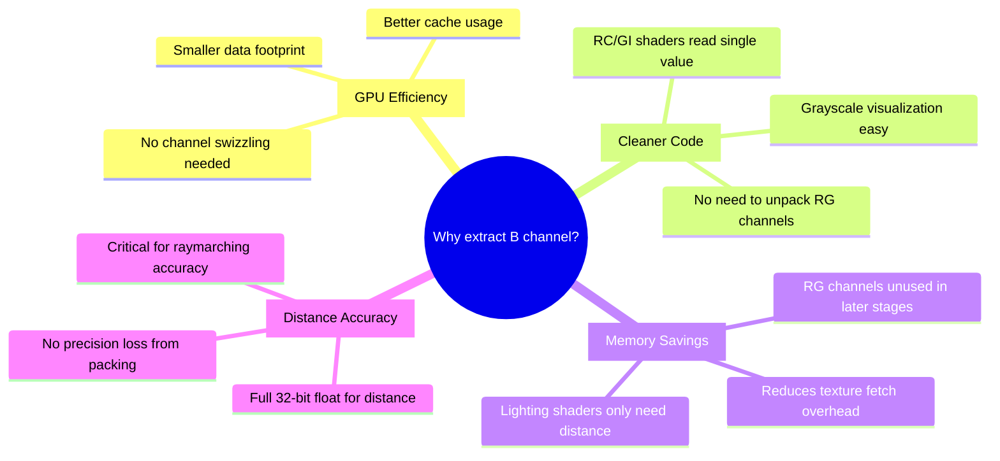
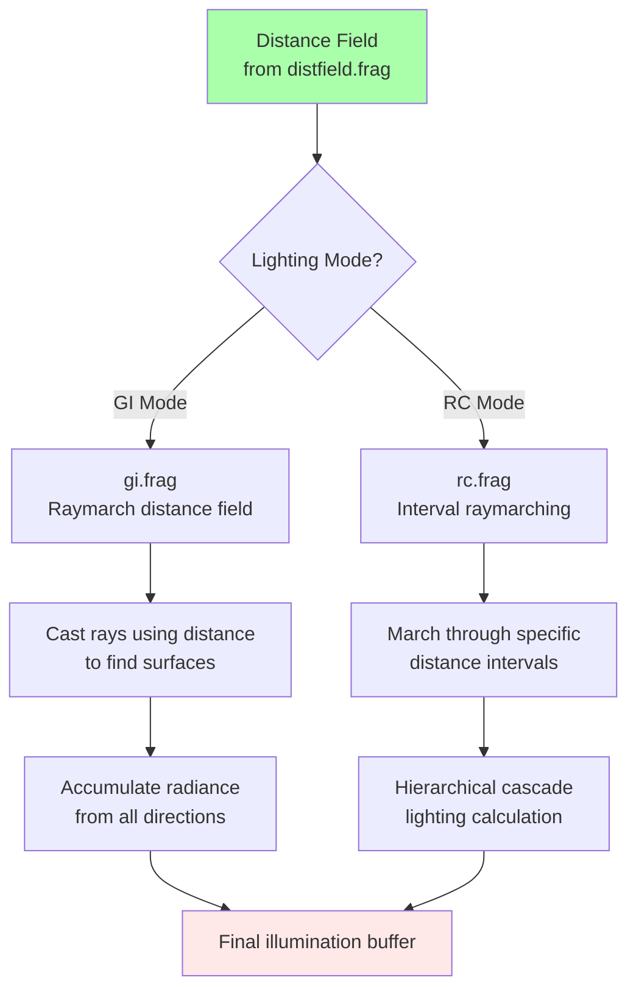

# distfield.frag - Distance Field Extraction Shader Diagram

**Purpose**: Extract distance channel from JFA output to create compact distance field texture

## Pipeline Position



## Data Flow Diagram



## Channel Extraction Process



## Visualization Example

```
JFA OUTPUT (before distfield.frag):
┌─────────────────────────────────────┐
│ R,G = UV coords (position data)     │
│ B     = Distance (what we need)     │
│ A     = Validity flag               │
│                                     │
│ Pixel values (RGBA):                │
│ [0.2, 0.3, 0.05, 1.0]  ← 5% dist   │
│ [0.5, 0.5, 0.15, 1.0]  ← 15% dist  │
│ [0.8, 0.7, 0.40, 1.0]  ← 40% dist  │
└─────────────────────────────────────┘

After distfield.frag extraction:
┌─────────────────────────────────────┐
│ All channels = Distance             │
│                                     │
│ Pixel values (RGBA):                │
│ [0.05, 0.05, 0.05, 1.0]  ← Dark    │
│ [0.15, 0.15, 0.15, 1.0]  ← Medium  │
│ [0.40, 0.40, 0.40, 1.0]  ← Bright  │
└─────────────────────────────────────┘

Visual representation:
┌─────────────────┐
│ ░░░▒▒▓▓▓█       │  ░ = very close (dark)
│ ░░▒▒▒▓▓▓█       │  ▒ = medium distance
│ ░░▒▒▓▓▓██       │  ▓ = far (bright)
│ ░░░▒▒▓▓▓█       │  █ = furthest
└─────────────────┘
```

## Why Extract Distance Only?



## Mathematical Operation

```
For each pixel at location (x, y):

Input from JFA:
  jfa[x, y] = (u_nearest, v_nearest, d, 1.0)

Where:
  u_nearest = U coordinate of nearest surface
  v_nearest = V coordinate of nearest surface
  d         = Euclidean distance to nearest surface

Operation:
  distance_field[x, y] = (d, d, d, 1.0)

Output:
  All RGB channels contain the same distance value
  Alpha set to 1.0 for validity
```

## Uniform Parameters

| Uniform | Type | Description |
|---------|------|-------------|
| `uJFA` | `sampler2D` | JFA output texture containing UV + distance data |

*(Note: `uResolution` is commented out in shader, uses textureSize instead)*

## Code Implementation

```glsl
void main() {
  // Calculate normalized fragment coordinate
  // Using textureSize for automatic resolution detection
  vec2 fragCoord = gl_FragCoord.xy / textureSize(uJFA, 0);
  
  // Sample the JFA texture
  vec4 jfaSample = texture(uJFA, fragCoord);
  
  // Extract distance from blue channel
  float distance = jfaSample.b;
  
  // Replicate to all RGB channels for grayscale output
  fragColor = vec4(vec3(distance), 1.0);
}
```

## Alternative Implementation (Commented Out)

```glsl
// Original version with explicit uniform:
uniform vec2 uResolution;

void main() {
  vec2 fragCoord = gl_FragCoord.xy / uResolution;
  fragColor = vec4(vec3(texture(uJFA, fragCoord).b), 1.0);
}

// Why changed?
// - textureSize() is more flexible
// - No need to manually set uResolution uniform
// - Automatically adapts to texture dimensions
```

## Distance Field Usage



## Raymarching Connection

```
Distance Field Value Usage:

In gi.frag or rc.frag:

  for (int i = 0; i < MAX_RAY_STEPS; i++) {
    // Read distance from field
    float dist = texture(uDistanceField, uv).r;
    
    // March ray forward by that distance
    uv += direction * dist;
    
    // Check if hit surface (distance < epsilon)
    if (dist < EPS) {
      // Surface intersection found!
      return surfaceColor;
    }
  }

The distance field tells the raymarcher:
"You can safely travel 'dist' units without hitting anything"
This makes raymarching efficient and accurate!
```

## Visual Quality Comparison

```
Without Distance Field Extraction:
┌─────────────────────────────────────┐
│ RC/GI shaders would need to:        │
│ 1. Sample JFA texture               │
│ 2. Swizzle .b channel               │
│ 3. Ignore RG data                   │
│                                     │
│ Extra instructions per pixel:       │
│ - More texture bandwidth            │
│ - More register pressure            │
│ - Slower performance                │
└─────────────────────────────────────┘

With Distance Field Extraction:
┌─────────────────────────────────────┐
│ RC/GI shaders simply:               │
│ 1. Sample distance field            │
│ 2. Use .r channel directly          │
│                                     │
│ Benefits:                           │
│ ✓ Single texture fetch              │
│ ✓ Clean code                        │
│ ✓ Faster execution                  │
│ ✓ Better GPU utilization            │
└─────────────────────────────────────┘
```

## Performance Impact

```mermaid
barChart-beta
    title "Texture Fetch Comparison"
    x-axis ["Without Extraction", "With Extraction"]
    y-axis "Relative Cost" 0 --> 100
    
    bar [100, 30]
    
    note1["Needs to sample JFA,<br/>swizzle channels"]
    note2["Direct sample,<br/>ready to use"]
    
    note1 -.-> "Without Extraction"
    note2 -.-> "With Extraction"
```

---

**File Location**: `res/shaders/distfield.frag`  
**GLSL Version**: 330 core  
**Execution**: Once per frame (after JFA completes)  
**Output**: Compact grayscale distance field for lighting shaders
