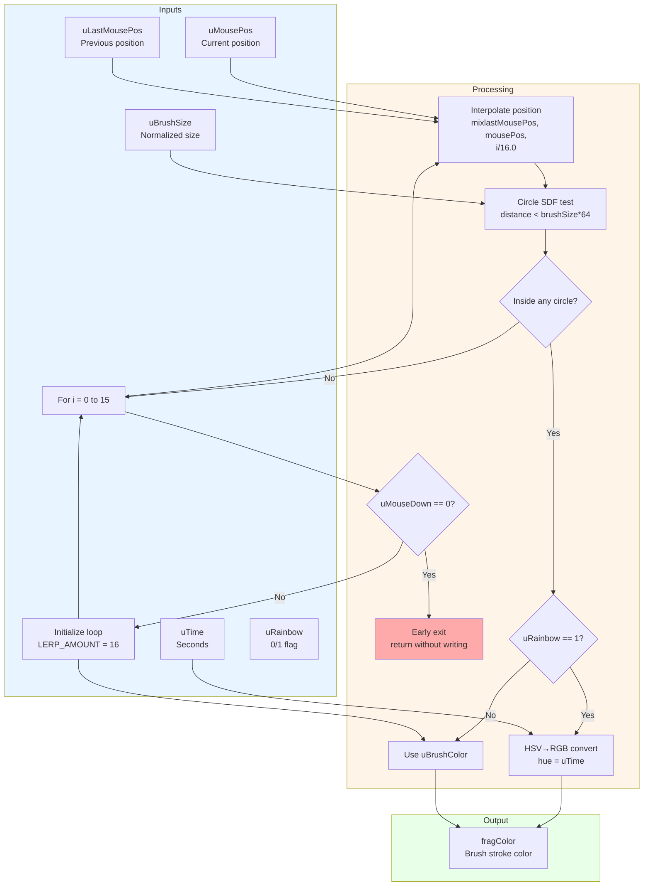
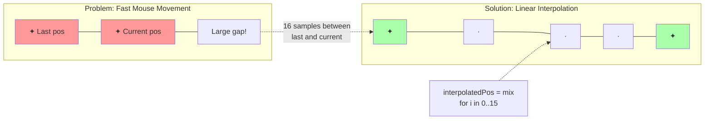
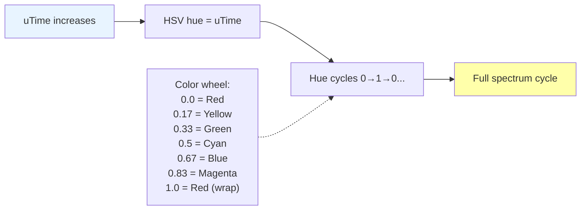
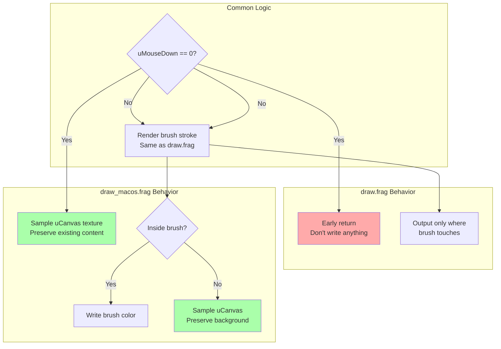

# User Input Shaders - draw.frag & draw_macos.frag

## Overview

Two variants of the drawing shader for user input handling:
- **draw.frag**: Windows/Linux version
- **draw_macos.frag**: macOS version with texture preservation

---

## draw.frag (Windows/Linux)

**Purpose**: Render user brush strokes when mouse is pressed

### Complete Flow Diagram



### Line Smoothing Technique



### Brush Rendering Example

```
Mouse movement from A to B:

A (lastMousePos) ●
                 │
                 │ (mouse moved here)
                 │
                 │
                 │
                 ● B (mousePos)

Without interpolation:
A ●           ● B  (gap in line)

With 16-sample interpolation:
A ●─·─·─·─·─·─·─● B  (smooth line)

Each · represents a sample point at:
  pos[i] = mix(A, B, i/16.0)
  for i = 0, 1, 2, ..., 15

SDF test checks if current pixel is inside
any of the 16 circles centered at pos[i]
```

### Rainbow Mode Animation



### Uniform Parameters

| Uniform | Type | Description | Range |
|---------|------|-------------|-------|
| `uMousePos` | `vec2` | Current mouse position in pixels | 0-resolution |
| `uLastMousePos` | `vec2` | Previous frame mouse position | 0-resolution |
| `uMouseDown` | `int` | Mouse button pressed flag | 0 or 1 |
| `uBrushSize` | `float` | Brush size (normalized) | 0.0-1.0 |
| `uBrushColor` | `vec4` | Brush color in RGBA | 0.0-1.0 |
| `uTime` | `float` | Time in seconds | 0-∞ |
| `uRainbow` | `int` | Rainbow animation mode | 0 or 1 |

### Code Implementation

```glsl
void main() {
  // Early exit if mouse not pressed
  if (uMouseDown == 0) return;
  
  bool sdf = false;
  
  // Sample 16 points between last and current position
  #define LERP_AMOUNT 16.0
  for (float i = 0; i < LERP_AMOUNT; i++) {
    vec2 interpPos = mix(uMousePos, uLastMousePos, i / LERP_AMOUNT);
    
    // Test if current fragment is inside brush circle
    if (sdfCircle(interpPos, uBrushSize * 64))
      sdf = true;
  }
  
  // Set color if inside brush stroke
  if (sdf) {
    if (uRainbow == 1)
      fragColor = hsv2rgb(vec3(uTime, 1.0, 1.0));
    else
      fragColor = uBrushColor;
  }
}

// Circle signed distance function
bool sdfCircle(vec2 pos, float r) {
  return distance(gl_FragCoord.xy, pos) < r;
}
```

---

## draw_macos.frag (macOS Variant)

**Purpose**: Same as draw.frag but preserves canvas texture on macOS

### Key Difference from draw.frag



### Additional Input

```glsl
// Extra uniform compared to draw.frag
uniform sampler2D uCanvas;  // Current canvas texture
```

### Why Different on macOS?

```
Issue on macOS:
- OpenGL context handling differs
- Early return causes transparency issues
- Need to explicitly preserve framebuffer content

Solution in draw_macos.frag:
- Always write to fragColor
- When not drawing: sample original canvas
- When drawing: write brush color or sample canvas

This ensures proper blending on macOS systems
```

### Code Comparison

```glsl
// draw.frag (Windows/Linux)
void main() {
  if (uMouseDown == 0) 
    return;  // Early exit
  
  // ... render brush ...
  
  if (sdf)
    fragColor = brushColor;
  // Implicit: no write outside brush
}

// draw_macos.frag (macOS)
void main() {
  vec2 uv = gl_FragCoord.xy / textureSize(uCanvas, 0);
  
  if (uMouseDown == 0) {
    fragColor = texture(uCanvas, uv);  // Preserve canvas
    return;
  }
  
  // ... render brush ...
  
  if (sdf)
    fragColor = brushColor;
  else
    fragColor = texture(uCanvas, uv);  // Also preserve
}
```

---

## Shared Components

### Signed Distance Function: Circle

```glsl
bool sdfCircle(vec2 pos, float r) {
  return distance(gl_FragCoord.xy, pos) < r;
}
```

**How it works:**
1. Calculate Euclidean distance from current pixel to circle center
2. Compare against radius
3. Return true if inside

**Visualization:**
```
Pixel at (x, y)
       │
       │ distance = length(x,y - pos)
       ▼
    ┌─────┐
    │  ·  │ ← Circle boundary at radius r
    │ /   │
───●─────●─── Center at pos
    │ \   │
    │     │   If distance < r: inside (true)
    └─────┘   Else: outside (false)
```

### HSV to RGB Conversion

```glsl
vec3 hsv2rgb(vec3 c) {
  vec4 K = vec4(1.0, 2.0 / 3.0, 1.0 / 3.0, 3.0);
  vec3 p = abs(fract(c.xxx + K.xyz) * 6.0 - K.www);
  return c.z * mix(K.xxx, clamp(p - K.xxx, 0.0, 1.0), c.y);
}
```

**Used in rainbow mode to animate through colors over time**

---

## Usage in Application

```cpp
// In demo.cpp::render()

// Upload uniforms
SetShaderValue(drawShader, GetShaderLocation(drawShader, "uMousePos"), 
               &mousePos, SHADER_UNIFORM_VEC2);
SetShaderValue(drawShader, GetShaderLocation(drawShader, "uLastMousePos"), 
               &lastMousePos, SHADER_UNIFORM_VEC2);
SetShaderValue(drawShader, GetShaderLocation(drawShader, "uMouseDown"), 
               &mouseDown, SHADER_UNIFORM_INT);
SetShaderValue(drawShader, GetShaderLocation(drawShader, "uBrushSize"), 
               &brushSize, SHADER_UNIFORM_FLOAT);
SetShaderValue(drawShader, GetShaderLocation(drawShader, "uBrushColor"), 
               &brushColor, SHADER_UNIFORM_VEC4);
SetShaderValue(drawShader, GetShaderLocation(drawShader, "uTime"), 
               &time, SHADER_UNIFORM_FLOAT);
SetShaderValue(drawShader, GetShaderLocation(drawShader, "uRainbow"), 
               &rainbowMode, SHADER_UNIFORM_INT);

// On macOS, also bind canvas texture
#ifdef __APPLE__
SetShaderValue(drawShader, GetShaderLocation(drawShader, "uCanvas"), 
               &canvasTexture, SHADER_UNIFORM_SAMPLER2D);
#endif
```

---

**File Locations**: 
- `res/shaders/draw.frag` (Windows/Linux)
- `res/shaders/draw_macos.frag` (macOS)

**GLSL Version**: 330 core  
**Execution**: Once per frame (during user input processing)  
**Output**: Brush stroke overlay on scene
