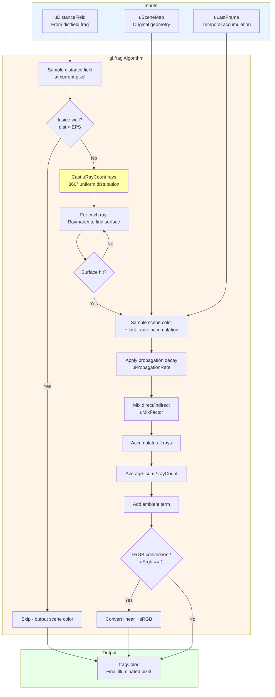
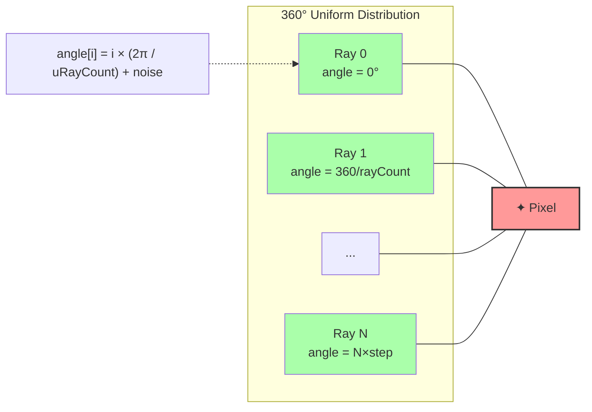
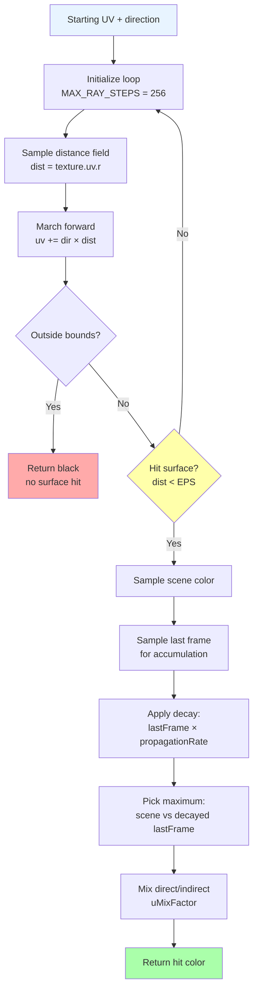
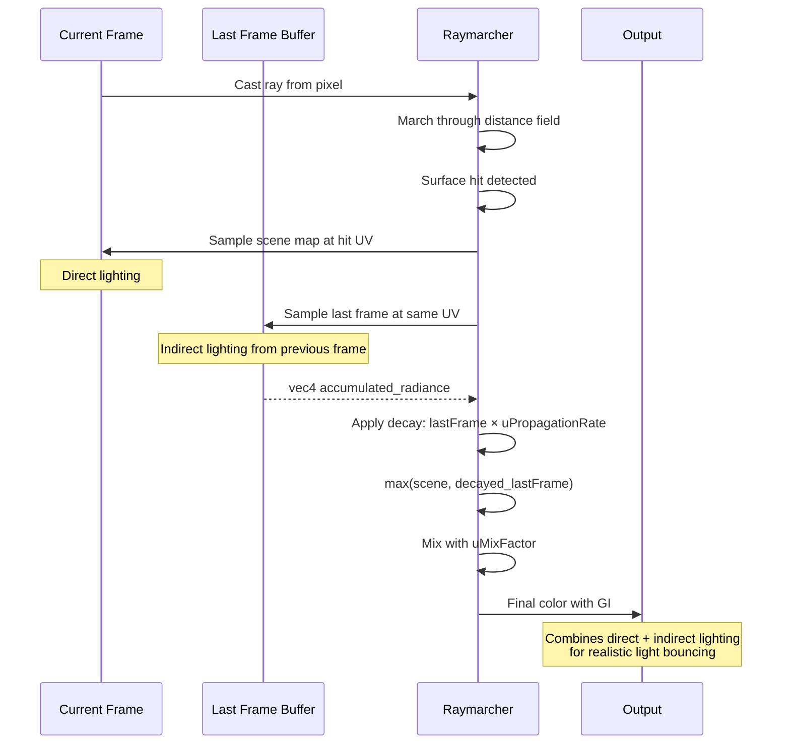
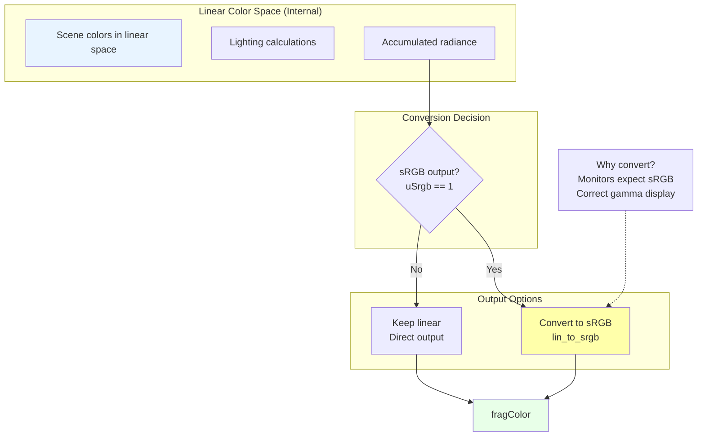

# gi.frag - Global Illumination Shader Diagram

**Purpose**: Traditional radiosity-based global illumination using uniform ray distribution

## Complete GI Pipeline



## Ray Casting Pattern



## Raymarching Algorithm Detail



## Temporal Accumulation



## Noise Application

```mermaid
flowchart LR
    A[Fragment UV]
    B[Generate pseudo-random<br/>noise = randUV × 2000]
    C{Noise enabled?<br/>uNoise == 1}
    D[Add noise to ray angle]
    E[Uniform angles<br/>no offset]
    
    A --> B
    B --> C
    C -->|Yes| D
    C -->|No| E
    
    D --> F[angle[i] = baseAngle + noise]
    E --> F
    
    F --> G[Cast rays with angular offset]
    
    G --> H[Reduces banding artifacts]
    G --> I[Breaks up regular patterns]
    
    style C fill:#ffffaa
    style H fill:#aaffaa
    style I fill:#aaffaa
```

## Color Space Conversion Flow



## HSV↔RGB Conversion Functions

```glsl
// These utilities are included but NOT used in gi.frag
// They ARE used in prepscene.frag and draw.frag

vec3 rgb2hsv(vec3 c) {
    vec4 K = vec4(0.0, -1.0 / 3.0, 2.0 / 3.0, -1.0);
    vec4 p = mix(vec4(c.bg, K.wz), vec4(c.gb, K.xy), 
                 step(c.b, c.g));
    vec4 q = mix(vec4(p.xyw, c.r), vec4(c.r, p.yzx), 
                 step(p.x, c.r));
    
    float d = q.x - min(q.w, q.y);
    float e = 1.0e-10;
    return vec3(abs(q.z + (q.w - q.y) / (6.0 * d + e)), 
                d / (q.x + e), q.x);
}

vec3 hsv2rgb(vec3 c) {
    vec4 K = vec4(1.0, 2.0 / 3.0, 1.0 / 3.0, 3.0);
    vec3 p = abs(fract(c.xxx + K.xyz) * 6.0 - K.www);
    return c.z * mix(K.xxx, clamp(p - K.xxx, 0.0, 1.0), c.y);
}
```

## Uniform Parameters

| Uniform | Type | Description | Typical Values |
|---------|------|-------------|----------------|
| `uDistanceField` | `sampler2D` | Distance field from distfield.frag | Texture |
| `uSceneMap` | `sampler2D` | Scene geometry colors | Texture |
| `uLastFrame` | `sampler2D` | Previous frame accumulation buffer | Texture |
| `uRayCount` | `int` | Number of rays to cast | 32-128 |
| `uSrgb` | `int` | Enable sRGB output conversion | 0 or 1 |
| `uNoise` | `int` | Add per-pixel angular noise | 0 or 1 |
| `uPropagationRate` | `float` | Light decay factor | 0.9-1.5 |
| `uMixFactor` | `float` | Direct/indirect light mix | 0.0-1.0 |
| `uAmbient` | `int` | Enable ambient term | 0 or 1 |
| `uAmbientColor` | `vec3` | Ambient light color | (1,1,1) |

## Performance Characteristics

```mermaid
quadrantChart
    title "GI Shader Performance Profile"
    x-axis "Low Quality" --> "High Quality"
    y-axis "Fast" --> "Slow"
    quadrant-1 "Sweet Spot ✓"
    quadrant-2 "Reference Quality"
    quadrant-3 "Too Slow"
    quadrant-4 "Real-time"
    
    "64 rays, no noise": [0.7, 0.3]
    "128 rays, noise": [0.9, 0.15]
    "32 rays": [0.5, 0.6]
    "256 rays": [0.95, 0.05]
    
    note1["Typical config:<br/>64 rays, MAX_STEPS=256<br/>~30-60 FPS on modern GPU"]
    note1 -.-> "64 rays, no noise"
```

## Mathematical Core

```glsl
// Ray casting loop
for (float i = 0.0; i < TWO_PI; i += TWO_PI / uRayCount) {
  // Add noise offset if enabled
  float angle = i + n;
  
  // Calculate ray direction
  vec2 dir = vec2(cos(angle) * aspect, sin(angle));
  
  // March along ray
  vec4 hitcol = raymarch(fragCoord, dir);
  
  // Accumulate radiance
  radiance += hitcol;
}

// Average all samples
radiance /= uRayCount;

// Add constant ambient term
radiance += vec4(uAmbientColor * uAmbient * 0.01, 1.0);
```

## Comparison with Radiance Cascades

```mermaid
flowchart TB
    subgraph "GI Approach (This Shader)"
        G1[Cast rays uniformly<br/>in all directions]
        G2[Single pass per pixel]
        G3[O(rayCount × steps)]
        G4[High quality but expensive]
    end
    
    subgraph "RC Approach (rc.frag)"
        R1[Hierarchical cascades<br/>coarse to fine]
        R2[Multiple passes<br/>cascade levels]
        R3[Ocascades × baseRays]
        R4[Similar quality, faster]
    end
    
    G1 --> G2 --> G3 --> G4
    R1 --> R2 --> R3 --> R4
    
    G4 --> C[Final Result]
    R4 --> C
    
    style G4 fill:#ffffaa
    style R4 fill:#aaffaa
```

---

**File Location**: `res/shaders/gi.frag`  
**GLSL Version**: 330 core  
**Execution**: Once per frame (alternative to rc.frag)  
**Performance**: O(rayCount × maxSteps) per pixel  
**Use Case**: Reference implementation, high-quality offline rendering
