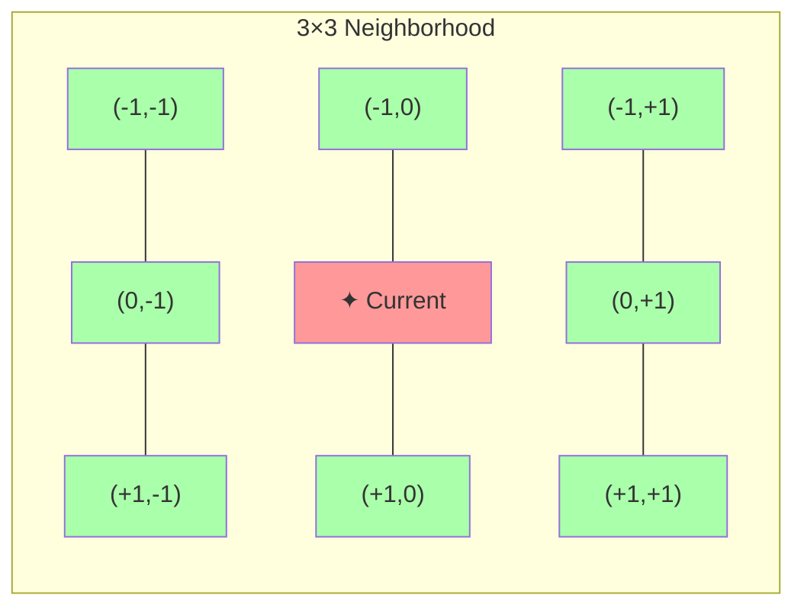
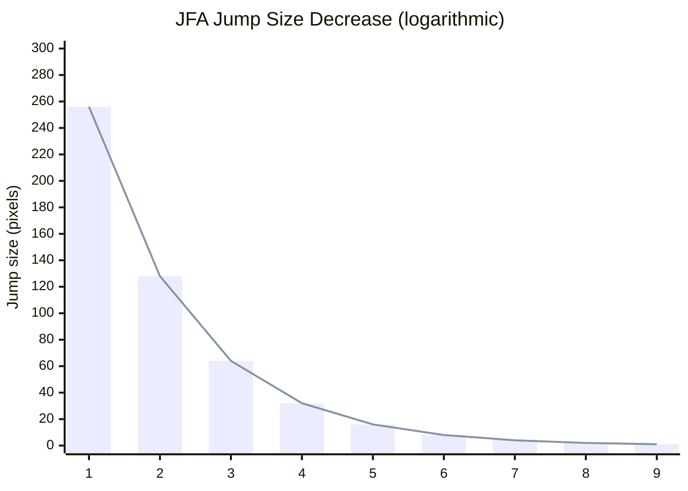
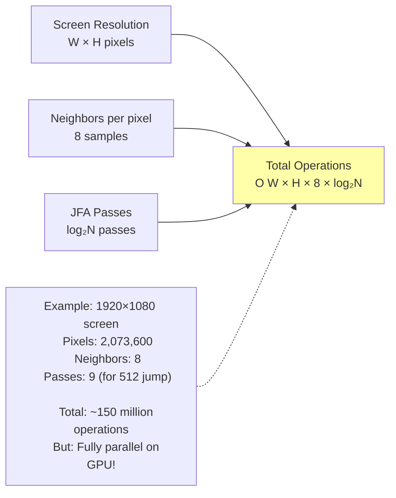
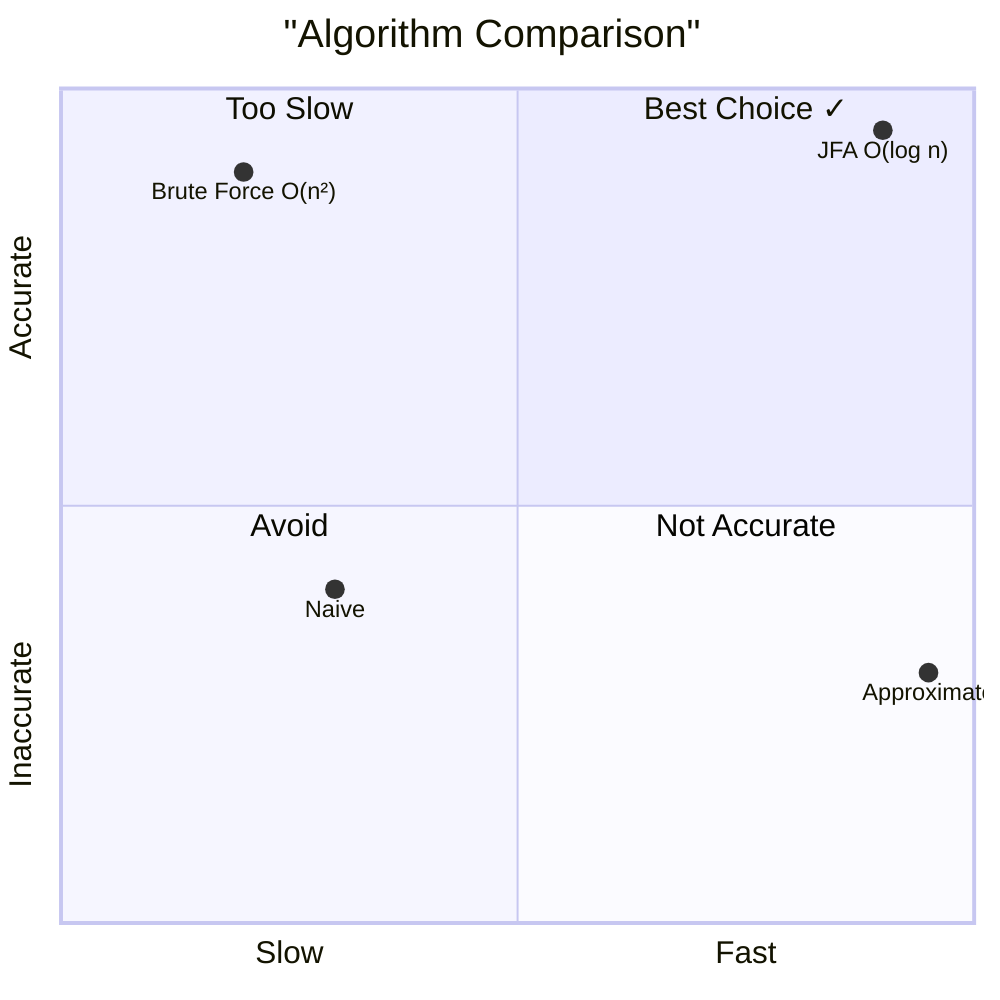
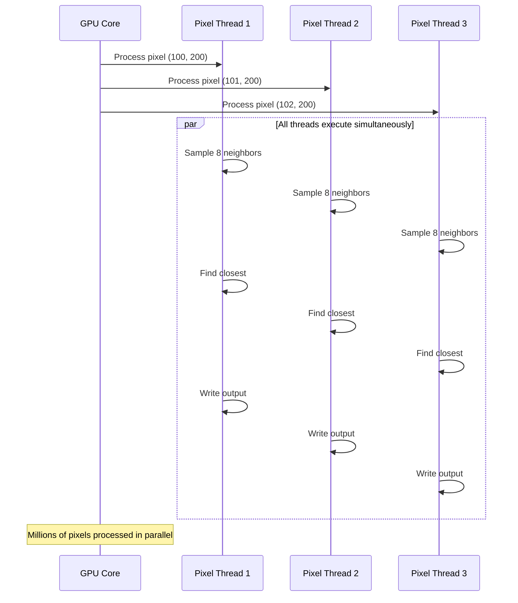

# jfa.frag - Jump-Flood Algorithm Shader Diagram

**Purpose**: Generate distance field by propagating seed points using the Jump-Flood Algorithm

## Complete JFA Pipeline Overview

```mermaid
flowchart TB
    subgraph "JFA Multi-Pass Process"
        P1["PASS 1<br/>jump = N/2 (256px)"]
        P2["PASS 2<br/>jump = N/4 (128px)"]
        P3["PASS 3<br/>jump = N/64 (64px)"]
        P4["PASS 4<br/>jump = N/32 (32px)"]
        P5["PASS 5<br/>jump = N/16 (16px)"]
        P6["PASS 6<br/>jump = N/8 (8px)"]
        P7["PASS 7<br/>jump = N/4 (4px)"]
        P8["PASS 8<br/>jump = N/2 (2px)"]
        P9["PASS 9<br/>jump = 1 (1px)<br/>Final refinement]
    end
    
    Input[Seed Texture<br/>from prepjfa.frag] --> P1
    P1 --> P2
    P2 --> P3
    P3 --> P4
    P4 --> P5
    P5 --> P6
    P6 --> P7
    P7 --> P8
    P8 --> P9
    P9 --> Output[Distance Field<br/>Every pixel knows<br/>nearest surface]
    
    style Input fill:#e8f4ff
    style Output fill:#e8ffe8
    style P1 fill:#fff4e8
    style P9 fill:#ffe8e8
```

## Single Pass Algorithm Flow

```mermaid
flowchart TD
    subgraph "Per-Pixel Processing"
        A[Get fragCoord<br/>normalized UV]
        B[Initialize<br/>closest = 1.0]
        C[Start neighbor loop<br/>Nx, Ny ∈ {-1, 0, 1}]
    end
    
    subgraph "Neighbor Sampling"
        D[Calculate neighbor UV<br/>fragCoord + offset × jumpSize]
        E{Within bounds?}
        F[Sample neighbor<br/>Get RG = UV, A = validity]
        G{Has seed data?<br/>alpha > 0}
        H[Calculate distance<br/>length(neighbor_UV - current_UV)]
        I{closer than<br/>current closest?}
        J[Update closest<br/>Store UV and distance]
    end
    
    subgraph "Output"
        K[Write result<br/>fragColor = nearest_UV, dist, 1.0]
    end
    
    A --> B
    B --> C
    C --> D
    D --> E
    E -->|No| C
    E -->|Yes| F
    F --> G
    G -->|No| C
    G -->|Yes| H
    H --> I
    I -->|No| C
    I -->|Yes| J
    J --> C
    C --> K
    
    style A fill:#e8f4ff
    style K fill:#e8ffe8
    style J fill:#ffffaa
```

## 8-Neighbor Sampling Pattern



## Jump Size Progression Visualization



## Distance Calculation Detail

```mermaid
flowchart TD
    A[Current pixel UV: c]
    B[Neighbor seed UV: s]
    C[Calculate delta: δ = s - c]
    D[Apply aspect ratio correction]
    E[δ.x *= resolution.x / resolution.y]
    F[Euclidean distance: d = length(δ)]
    
    A --> C
    B --> C
    C --> D
    D --> E
    E --> F
    
    formula["d = √((s.x-c.x)² × aspect + (s.y-c.y)²)"]
    formula -.-> F
    
    style F fill:#ffffaa
```

## Before/After Example

```
BEFORE JFA (Seed texture from prepjfa.frag):
┌─────────────────┐
│ ✦ ✦ ✦ · · · ✦ │  ✦ = seed with encoded UV
│ ✦ · · · · · ✦ │  · = empty (no data)
│ ✦ · · · · · ✦ │
│ ✦ · · · · · ✦ │
│ ✦ ✦ ✦ · · · ✦ │
└─────────────────┘

AFTER JFA PASS 1 (jump = large):
┌─────────────────┐
│ ✦ ✦ ✦ ✦ · ✦ ✦ │  Seeds propagate to neighbors
│ ✦ ✦ · ✦ · ✦ ✦ │  at jump distance
│ ✦ · ✦ · ✦ · ✦ │
│ ✦ ✦ · ✦ · ✦ ✦ │
│ ✦ ✦ ✦ ✦ · ✦ ✦ │
└─────────────────┘

AFTER JFA FINAL (jump = 1):
┌─────────────────┐
│ ✦ ✦ ✦ ✦ ✦ ✦ ✦ │  Every pixel filled with
│ ✦ ✦ ✦ ✦ ✦ ✦ ✦ │  nearest seed UV + distance
│ ✦ ✦ ✦ ✦ ✦ ✦ ✦ │
│ ✦ ✦ ✦ ✦ ✦ ✦ ✦ │
│ ✦ ✦ ✦ ✦ ✦ ✦ ✦ │
└─────────────────┘

Result: Complete Voronoi diagram of nearest surfaces
```

## Neighbor Loop Implementation

```glsl
float closest = 1.0;

// Loop through 3×3 neighborhood
for (int Nx = -1; Nx <= 1; Nx++) {
  for (int Ny = -1; Ny <= 1; Ny++) {
    
    // Calculate neighbor texture coordinate
    vec2 NTexCoord = fragCoord + 
                     (vec2(Nx, Ny) / resolution) * uJumpSize;
    
    // Skip if outside texture bounds
    if (NTexCoord != clamp(NTexCoord, 0.0, 1.0))
      continue;
    
    // Sample neighbor pixel
    vec4 Nsample = texture(uCanvas, NTexCoord);
    
    // Skip if no seed data
    if (Nsample.a == 0)
      continue;
    
    // Calculate distance to this seed
    float d = length((Nsample.rg - fragCoord) * 
                     vec2(resolution.x/resolution.y, 1.0));
    
    // Update if closer
    if (d < closest) {
      closest = d;
      fragColor = vec4(Nsample.rg, d, 1.0);
    }
  }
}
```

## Uniform Parameters

| Uniform | Type | Description | Typical Values |
|---------|------|-------------|----------------|
| `uCanvas` | `sampler2D` | Seed texture from previous pass | Texture |
| `uJumpSize` | `int` | Current jump offset | 256, 128, 64, ..., 1 |

## Computational Complexity



## Why JFA Over Brute Force?



## Data Format Evolution

```
Input (from prepjfa.frag):
┌──────────────────────┐
│ R: U coordinate      │
│ G: V coordinate      │
│ B: 0.0 (unused)      │
│ A: 1.0 (has data)    │
└──────────────────────┘

Output (to distfield.frag):
┌──────────────────────┐
│ R: Nearest U         │
│ G: Nearest V         │
│ B: Distance value    │◄── This is the distance field!
│ A: 1.0 (has data)    │
└──────────────────────┘
```

## Parallel Execution Model



---

**File Location**: `res/shaders/jfa.frag`  
**GLSL Version**: 330 core  
**Execution**: 5-9 passes per frame (depends on `jfaSteps`)  
**Output**: Complete distance field with nearest-seed information
