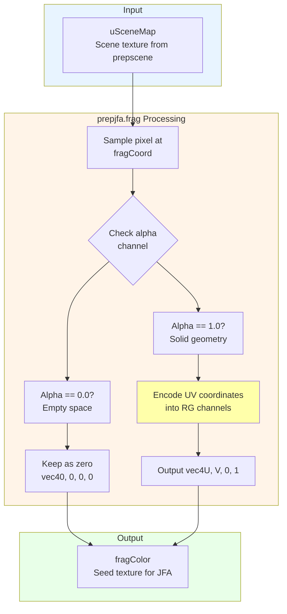
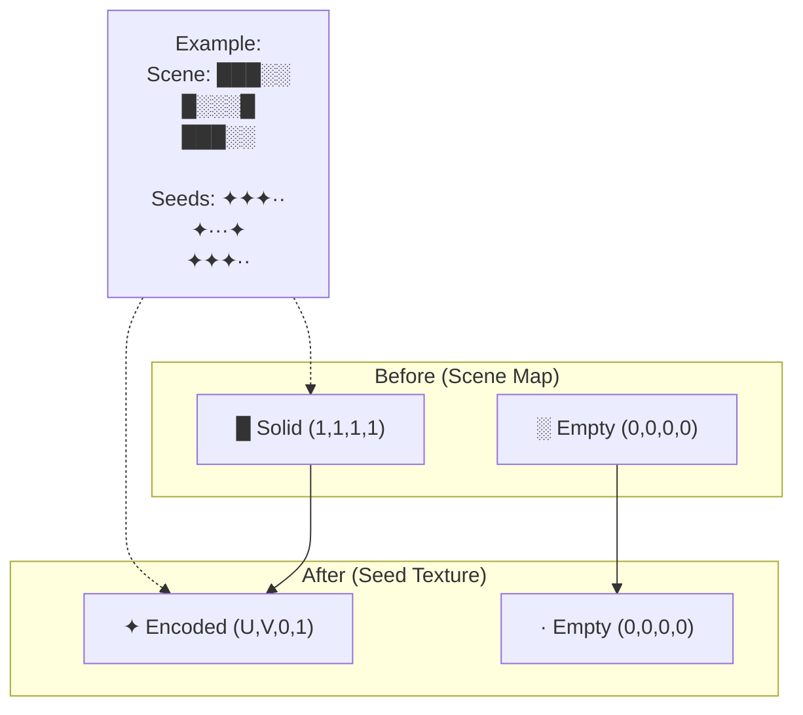
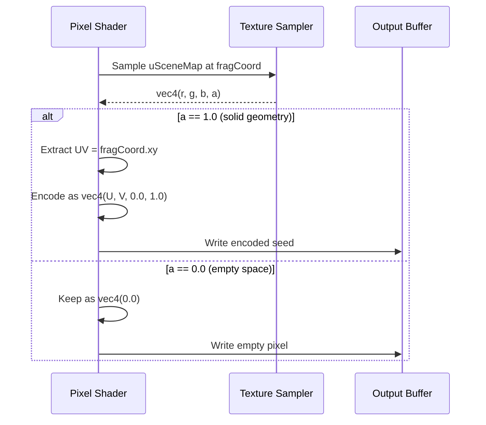
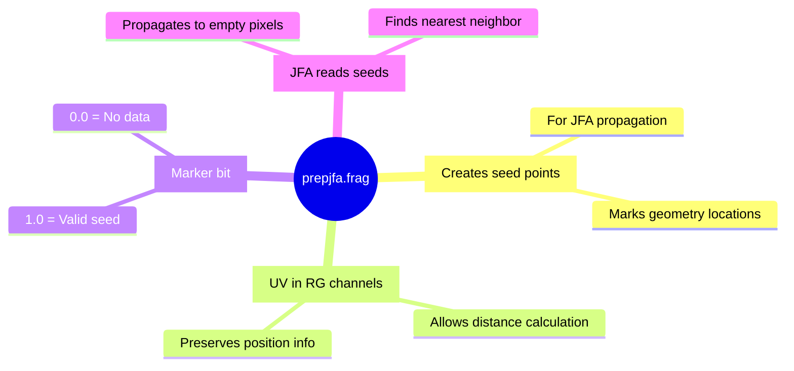

# prepjfa.frag - JFA Preparation Shader Diagram

**Purpose**: Encode texture coordinates into seed pixels for Jump-Flood Algorithm

## Complete Pipeline Diagram



## Encoding Scheme

```mermaid
flowchart LR
    subgraph "Input Pixel Types"
        A[Solid pixel<br/>alpha = 1.0]
        B[Empty pixel<br/>alpha = 0.0]
    end
    
    subgraph "Encoding Process"
        A --> C{Has geometry?}
        B --> C
        C -->|Yes| D[Extract UV coords<br/>fragCoord.xy]
        C -->|No| E[Keep empty]
        D --> F[Pack into RG<br/>R = U, G = V]
        F --> G[Set alpha = 1.0<br/>Valid seed marker]
        E --> H[All zeros<br/>No data]
    end
    
    subgraph "Output Format"
        G --> I[vec4U, V, 0.0, 1.0]]
        H --> J[vec40.0, 0.0, 0.0, 0.0]]
    end
    
    style A fill:#aaffaa
    style B fill:#ffaaaa
    style I fill:#aaffaa
    style J fill:#cccccc
```

## Before/After Visualization



## Coordinate Encoding Detail



## Mathematical Representation

```
For each pixel at location (x, y):

Input:  scene[x, y] = (r, g, b, α)

If α = 1.0 (solid object):
  Output: seed[x, y] = (u, v, 0.0, 1.0)
  Where:
    u = x / textureWidth
    v = y / textureHeight

If α = 0.0 (empty space):
  Output: seed[x, y] = (0.0, 0.0, 0.0, 0.0)
```

## Why This Matters for JFA



## Uniform Parameters

| Uniform | Type | Description |
|---------|------|-------------|
| `uSceneMap` | `sampler2D` | Input scene texture from prepscene.frag |

## Code Implementation

```glsl
void main() {
  // Calculate normalized texture coordinate
  vec2 fragCoord = gl_FragCoord.xy / textureSize(uSceneMap, 0);
  
  // Sample the scene map
  vec4 mask = texture(uSceneMap, fragCoord);
  
  // Encode UV coordinates if this is a solid pixel
  if (mask.a == 1.0) {
    // Store UV in RG channels, mark as valid with A=1.0
    mask = vec4(fragCoord, 0.0, 1.0);
  }
  // Else keep as vec4(0.0) for empty pixels
  
  fragColor = mask;
}
```

## Example Transformation

```
Input Scene (prepscene output):
┌─────────┐
│ ███░░░ │  █ = solid (α=1)
│ █░░░░█ │  ░ = empty (α=0)
│ ███░░░ │
└─────────┘

After prepjfa.frag:
┌─────────┐
│ ✦✦✦··· │  ✦ = encoded UV (α=1, RG=position)
│ ✦····✦ │  · = empty (all zeros)
│ ✦✦✦··· │
└─────────┘

Each ✦ contains its own (U, V) coordinates
These become JFA seed points for propagation
```

## Connection to JFA

```mermaid
flowchart LR
    A[prepjfa.frag<br/>Encodes seeds] --> B[jfa.frag<br/>Propagates seeds]
    B --> C[distfield.frag<br/>Extracts distances]
    
    subgraph "Data Flow"
        A -->|"vec4U,V,0,1]| B
        B -->|"vec4nearest_UV,dist,1|" C
    end
    
    style A fill:#aaffaa
    style B fill:#ffffaa
    style C fill:#ffaaaa
```

---

**File Location**: `res/shaders/prepjfa.frag`  
**GLSL Version**: 330 core  
**Execution**: Once per frame (before JFA passes)  
**Output**: Seed texture for JFA algorithm
