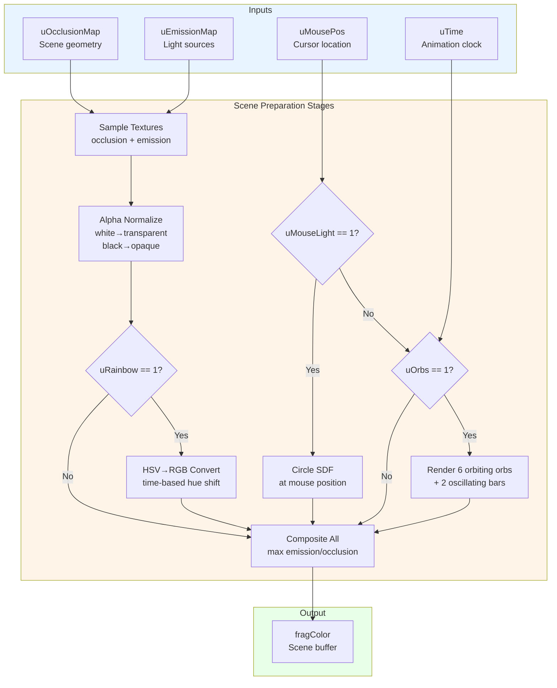
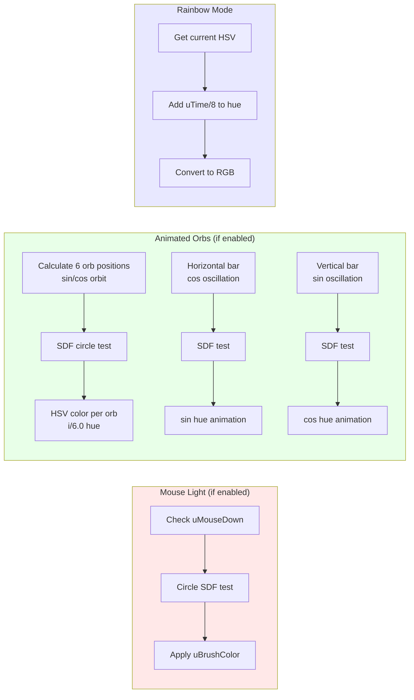
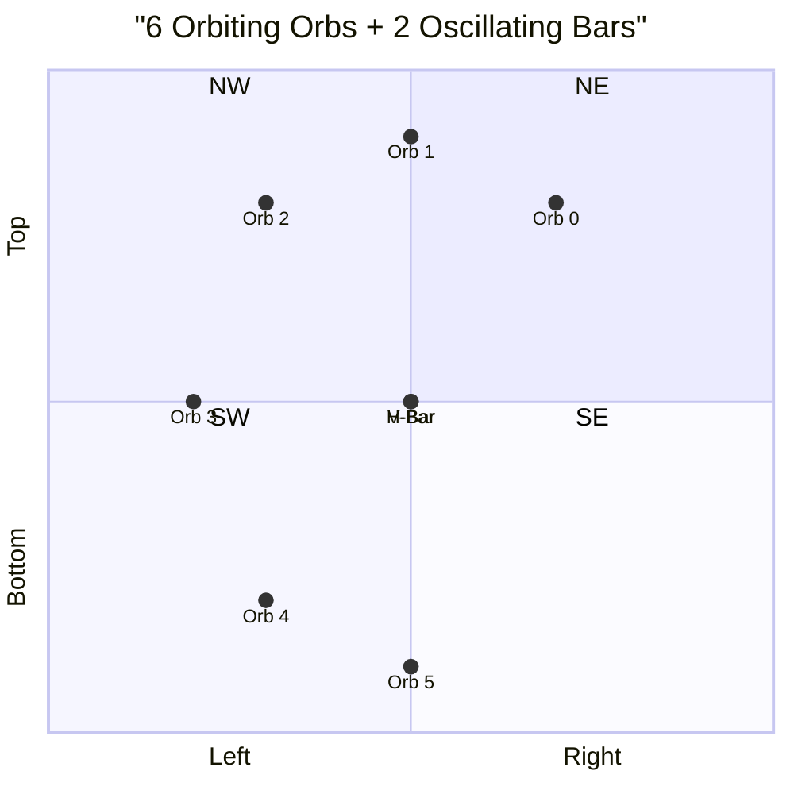
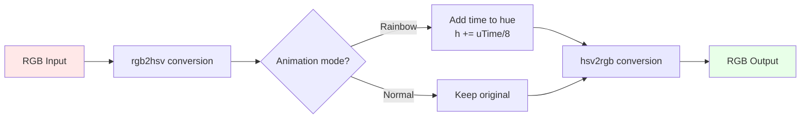
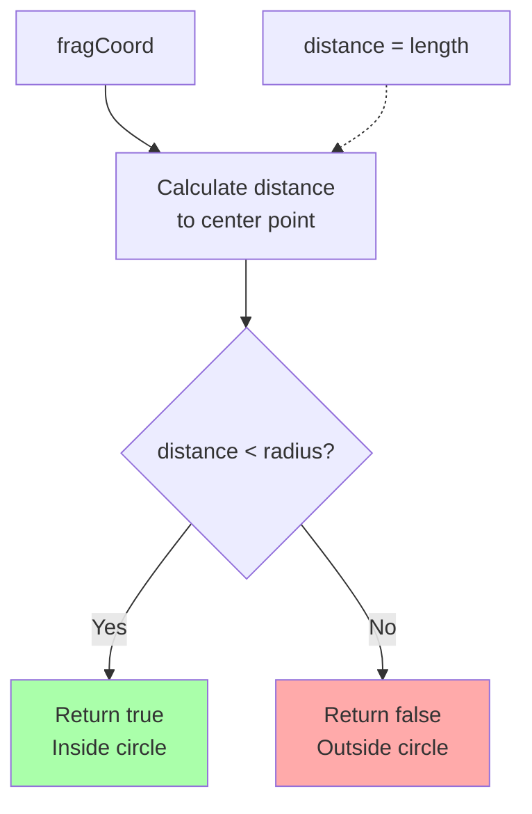

# prepscene.frag - Scene Preparation Shader Diagram

**Purpose**: Combine occlusion and emission maps with dynamic elements (orbs, mouse light, rainbow animation)

## Complete Pipeline Diagram



## Dynamic Elements Rendering



## Orb Movement Pattern



## Color Space Conversion Flow



## Signed Distance Field Circle Function



## Uniform Parameters

| Uniform | Type | Description | Range |
|---------|------|-------------|-------|
| `uOcclusionMap` | `sampler2D` | Scene geometry (white=solid) | Texture |
| `uEmissionMap` | `sampler2D` | Light sources (white=emissive) | Texture |
| `uMousePos` | `vec2` | Current mouse position | 0-resolution |
| `uTime` | `float` | Time in seconds | 0-∞ |
| `uOrbs` | `int` | Enable animated orbs | 0 or 1 |
| `uRainbow` | `int` | Enable rainbow animation | 0 or 1 |
| `uMouseLight` | `int` | Enable mouse light | 0 or 1 |
| `uBrushSize` | `float` | Brush size (normalized) | 0.0-1.0 |
| `uBrushColor` | `vec4` | Brush color (RGBA) | 0.0-1.0 |

## Code Structure

```glsl
void main() {
  // 1. Sample input textures
  vec4 o = texture(uOcclusionMap, fragCoord);
  vec4 e = texture(uEmissionMap, fragCoord);
  
  // 2. Normalize alpha channels
  if (o == vec4(1.0)) o = vec4(0.0);
  else o = vec4(0.0, 0.0, 0.0, 1.0);
  
  // 3. Apply rainbow animation
  if (uRainbow == 1 && e != vec4(0.0))
    e = hsv2rgb(vec3(hue + uTime/8, 1.0, 1.0));
  
  // 4. Composite emission over occlusion
  fragColor = max(e.a, o.a) == e.a ? e : o;
  
  // 5. Add mouse light
  if (uMouseLight == 1 && sdfCircle(uMousePos, uBrushSize*64))
    fragColor = uBrushColor;
  
  // 6. Add animated orbs
  if (uOrbs == 1) {
    // 6 orbiting colored spheres
    for (int i = 0; i < 6; i++) {
      p = (vec2(cos(uTime/ORB_SPEED+i), sin(uTime/ORB_SPEED+i)) 
           * resolution.y/2 + 1) / 2 + CENTRE;
      if (sdfCircle(p, resolution.x/80))
        fragColor = hsv2rgb(vec3(i/6.0, 1.0, 1.0));
    }
    // + 2 oscillating bars
  }
}
```

---

**File Location**: `res/shaders/prepscene.frag`  
**GLSL Version**: 330 core  
**Execution**: Once per frame  
**Output**: Scene buffer for JFA preprocessing
