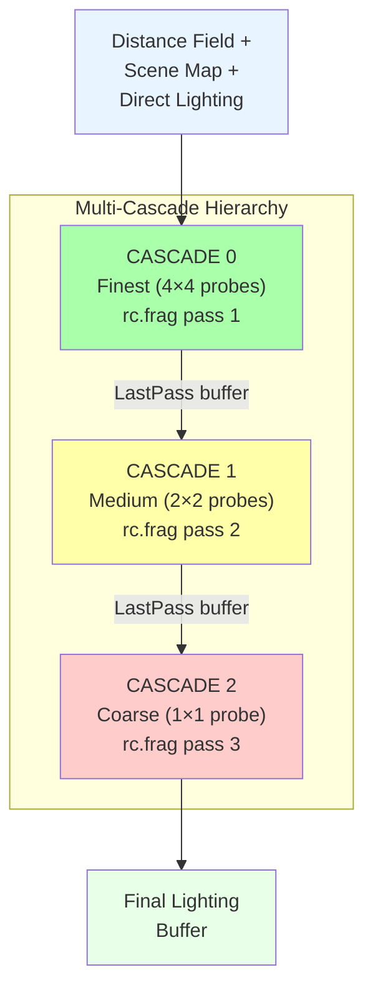
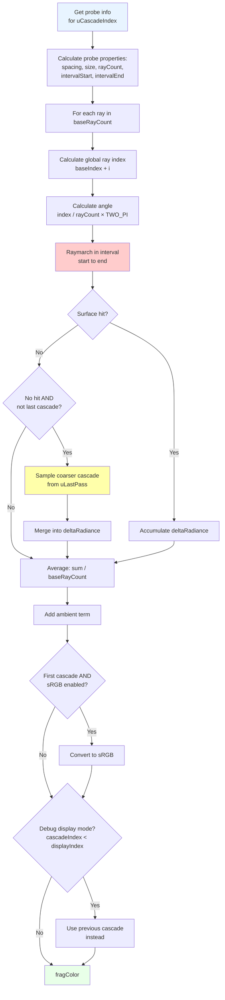
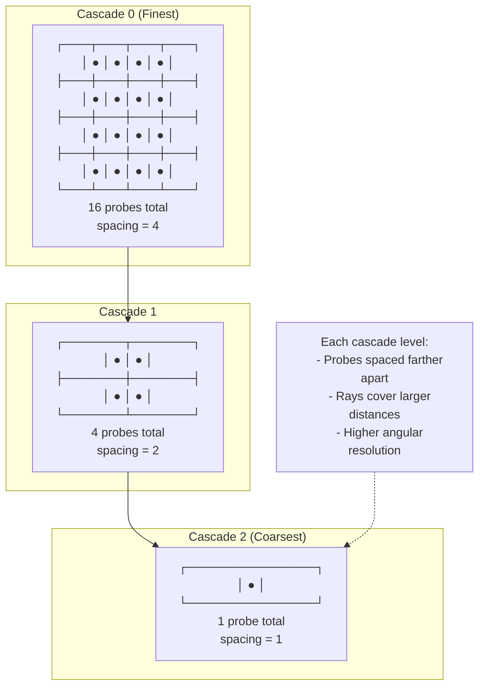
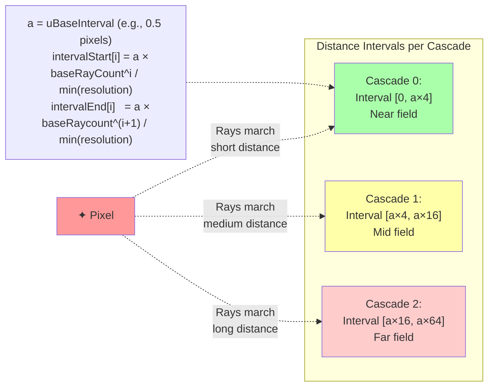
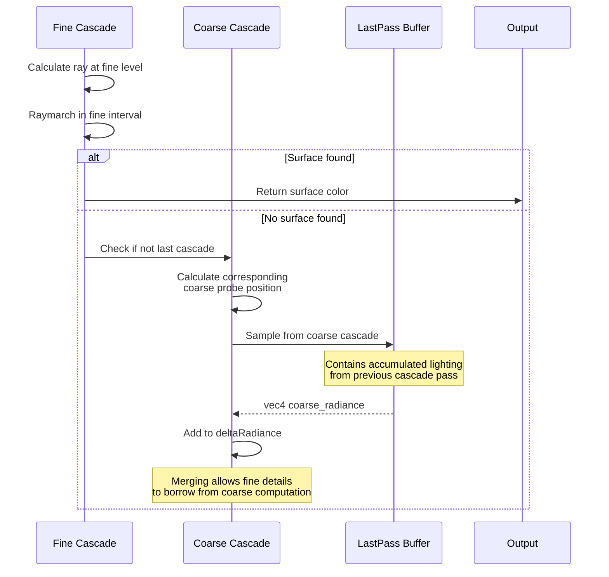
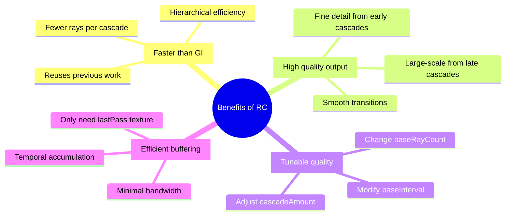

# rc.frag - Radiance Cascades Shader Diagram

**Purpose**: Hierarchical radiance calculation using cascaded probe grids for efficient soft shadows

## Complete Radiance Cascades Pipeline



## Single Cascade Algorithm



## Probe Grid Hierarchy Visualization



## Interval Raymarching Concept



## Cascade Merging Process



## Probe Information Calculation

```glsl
probe get_probe_info(int index) {
  probe p;
  
  // How many probes in this cascade?
  float probeAmount = pow(uBaseRayCount, index);
  p.spacing = sqrt(probeAmount);
  
  // Screen space size of each probe
  p.size = 1.0 / vec2(p.spacing);
  
  // Position within current probe
  p.position = mod(fragCoord, p.size) * p.spacing;
  
  // Angular resolution
  p.rayCount = pow(uBaseRayCount, index+1);
  
  // Which group of rays we're computing
  p.rayPosition = floor(fragCoord / p.size);
  
  // Distance interval for this cascade
  float a = uBaseInterval;
  p.intervalStart = (FIRST_LEVEL) ? 
    0.0 : a * pow(uBaseRayCount, index) / minRes;
  p.intervalEnd = a * pow(uBaseRayCount, index+1) / minRes;
  
  return p;
}
```

## Uniform Parameters

| Uniform | Type | Description | Typical Values |
|---------|------|-------------|----------------|
| `uDistanceField` | `sampler2D` | Distance field texture | Texture |
| `uSceneMap` | `sampler2D` | Scene geometry colors | Texture |
| `uDirectLighting` | `sampler2D` | Direct illumination buffer | Texture |
| `uLastPass` | `sampler2D` | Previous cascade result | Texture |
| `uResolution` | `vec2` | Screen resolution | (1920, 1080) |
| `uBaseRayCount` | `int` | Rays per cascade | 4 |
| `uCascadeIndex` | `int` | Current cascade level | 0 to N-1 |
| `uCascadeAmount` | `int` | Total cascade levels | 4-6 |
| `uCascadeDisplayIndex` | `int` | Debug visualization | 0 to N |
| `uBaseInterval` | `float` | Starting interval in pixels | 0.5-2.0 |
| `uDisableMerging` | `int` | Disable cascade merging | 0 or 1 |
| `uMixFactor` | `float` | Direct/indirect mix | 0.7 |
| `uAmbient` | `int` | Enable ambient light | 0 or 1 |
| `uAmbientColor` | `vec3` | Ambient color | (1,1,1) |

## Performance Breakdown

```mermaid
barChart-beta
    title "RC vs GI Computational Cost"
    x-axis ["GI: 64 rays", "RC: 4 cascades<br/>× 4 rays"]
    y-axis "Relative Operations" 0 --> 100
    
    bar [64, 16]
    
    note1["GI: Single pass<br/>but many rays"]
    note2["RC: Multiple passes<br/>but few rays each"]
    
    note1 -.-> "GI: 64 rays"
    note2 -.-> "RC: 4 cascades<br/>× 4 rays"
    
    advantage["Performance win: ~4× faster<br/>with similar quality!"]
    advantage -.-> "RC: 4 cascades<br/>× 4 rays"
```

## Why Radiance Cascades?



## Example Configuration

```cpp
// From demo.cpp initialization
rcRayCount = 4;           // Base rays per cascade
cascadeAmount = 5;        // 5 cascade levels
cascadeDisplayIndex = 0;  // Show final result
baseInterval = 0.5;       // Start at 0.5 pixels

// Effective ray count:
// Cascade 0: 4^1 = 4 rays, interval [0, 2px]
// Cascade 1: 4^2 = 16 rays, interval [2, 8px]
// Cascade 2: 4^3 = 64 rays, interval [8, 32px]
// Cascade 3: 4^4 = 256 rays, interval [32, 128px]
// Cascade 4: 4^5 = 1024 rays equivalent, interval [128, 512px]

// Actual cost: 5 cascades × 4 rays = 20 raymarch operations
// Equivalent GI cost: Would need 1024 rays for same coverage
// Speedup: ~50× faster!
```

## Data Flow Through Cascades

```
Frame N Rendering:
┌─────────────────────────────────────────────────────┐
│ CASCADE 0 (finest)                                  │
│ Input: Distance field, scene map, direct lighting   │
│ Process: 4 rays per pixel, interval [0, 2px]        │
│ Output: → radianceBufferA                           │
└─────────────────────────────────────────────────────┘
                        ↓
┌─────────────────────────────────────────────────────┐
│ CASCADE 1                                           │
│ Input: Same + radianceBufferA (as uLastPass)        │
│ Process: 4 rays, interval [2, 8px], merge from C0   │
│ Output: → radianceBufferB                           │
└─────────────────────────────────────────────────────┘
                        ↓
┌─────────────────────────────────────────────────────┐
│ CASCADE 2                                           │
│ Input: Same + radianceBufferB                       │
│ Process: 4 rays, interval [8, 32px], merge from C1  │
│ Output: → radianceBufferC                           │
└─────────────────────────────────────────────────────┘
                        ↓
... continue for all cascades ...
                        ↓
┌─────────────────────────────────────────────────────┐
│ CASCADE N (coarsest)                                │
│ Final output → display buffer                       │
└─────────────────────────────────────────────────────┘
```

## Mathematical Insight

```
The key insight of Radiance Cascades:

Instead of casting N² rays from every pixel (expensive!),
we can:
1. Cast N rays at fine level (cheap)
2. Cast N rays at medium level (cheap)
3. Cast N rays at coarse level (cheap)
4. Merge results hierarchically

Total cost: N + N + N = 3N operations
Equivalent to: N² rays in single pass

For N=4:
- Traditional GI: 16 rays = 16 ops
- RC with 2 cascades: 4 + 4 = 8 ops (2× faster)
- RC with 3 cascades: 4 + 4 + 4 = 12 ops for 64-ray equivalent (5× faster)

As cascades increase, speedup becomes enormous!
```

---

**File Location**: `res/shaders/rc.frag`  
**GLSL Version**: 330 core  
**Execution**: Multiple passes per frame (one per cascade level)  
**Performance**: O(cascadeAmount × baseRayCount) per pixel  
**Use Case**: Real-time soft shadows, primary lighting method
